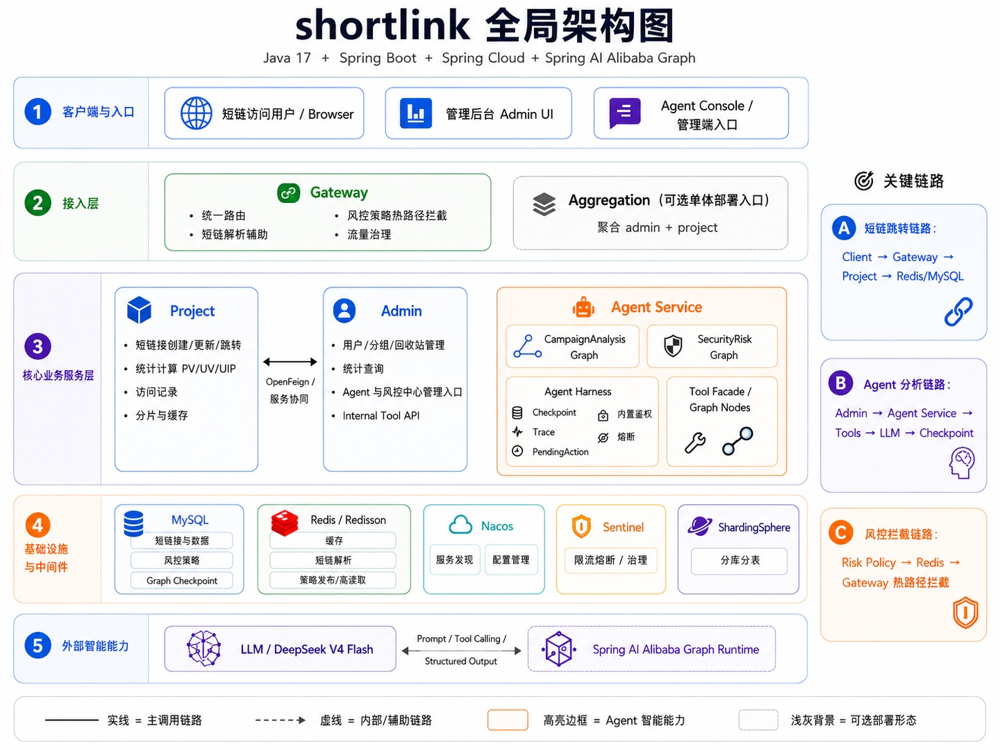
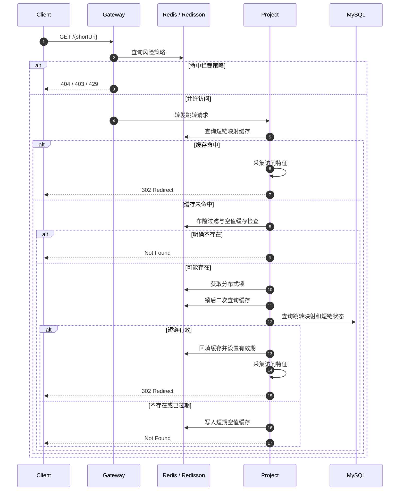
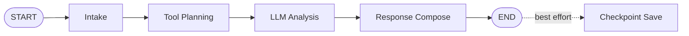
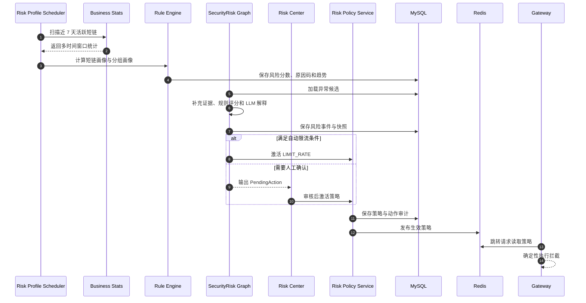

<div align="center">

# ShortLink

### 智能短链平台——基于 Spring AI Alibaba 的投放分析与安全风控 Agent

一个以短链接业务为事实底座、以 **Spring AI Alibaba StateGraph** 组织智能投放分析与安全风控工作流的 Java 微服务项目。

<p>
  
  
  
  
  
  
</p>

</div>

> ShortLink 不只是一个 URL 压缩服务。  
> 项目将短链创建与跳转、全维度访问统计、自然语言投放分析、风险画像、人工审核、策略发布和 Gateway 热路径拦截组织为一条完整工程链路。

---

## 项目定位

ShortLink 面向营销投放、内容分发、活动运营和链接治理场景，提供从“生成短链接”到“分析投放效果”，再到“识别异常流量并执行风险策略”的完整能力。

项目由三部分组成：

| 能力域 | 解决的问题 | 主要能力 |
|---|---|---|
| 短链业务底座 | 如何稳定创建、解析、跳转和管理短链接 | 创建、批量创建、更新、跳转、分组、回收站、缓存与分片 |
| 数据分析体系 | 如何衡量链接效果并解释访问来源 | PV、UV、UIP、时段、地域、设备、浏览器、网络与访问明细 |
| 智能分析与风控 | 如何将业务数据转化为洞察和受控策略 | Campaign Analysis Graph、Security Risk Graph、风险画像、审核与拦截 |

### 最准确的技术定位

本项目的 Agent 实现不是自由运行的 ReAct 循环，也不是将业务控制权直接交给大模型，而是：

```text
Java 业务事实
  + 受控 Tool Facade
  + Spring AI Alibaba StateGraph 显式节点编排
  + 确定性规则与指标计算
  + DeepSeek 解释与归纳
  + Checkpoint / Trace / PendingAction
  + Gateway 确定性策略执行
```

核心原则：

1. **业务事实由 Java 服务和数据库维护**，LLM 不直接拥有数据库访问权。
2. **Agent 只通过受控 Tool 查询业务数据**，每次查询重新校验用户与分组归属。
3. **指标和风险分数由确定性逻辑计算**，LLM 负责解释，不负责改写事实。
4. **短链跳转热路径不依赖 LLM**，即使模型不可用，核心短链服务仍可独立运行。
5. **高风险动作受确定性规则和人工审核约束**，禁止模型直接执行不可逆操作。

---

## 核心能力

### 短链接业务

- 单条短链接创建与批量创建
- Base62 短码生成与重复检测
- 短链接更新、有效期管理和分组迁移
- 短链接分页查询与分组内数量统计
- 短链接跳转与失效页处理
- 回收站移入、查询、恢复和移除
- 原始页面标题与站点图标提取

### 高并发与数据能力

- Redis 短链映射缓存
- Redisson 分布式锁和读写锁
- 布隆过滤器防缓存穿透
- 空值缓存防止无效请求反复回源
- 缓存 TTL 与短链有效期对齐
- Redisson 延迟队列承接统计补偿
- ShardingSphere-JDBC 数据分片
- Sentinel 限流与流量治理

### 统计分析

- PV、UV、UIP
- 日期、小时和星期分布
- 地域、省市和行政区统计
- 操作系统、浏览器、设备和网络统计
- Top IP 与访问明细
- 单条短链和分组级聚合统计
- 当日指标与历史累计指标

### Agent 与风控

- 基于 Spring AI Alibaba Graph 的投放分析工作流
- 基于 Spring AI Alibaba Graph 的安全风控工作流
- 受控 Tool Registry 与业务 Tool Facade
- Graph Checkpoint MySQL 持久化
- 节点级 Trace、耗时、数据来源和告警
- 风险画像批处理、分组画像和风险趋势
- 风险事件、快照、人工审核和动作审计
- Redis 风险策略发布
- Gateway 热路径限流、禁用、时间窗和 IP 拦截

---

## 全局架构



### 五层架构

| 层级 | 组成 | 职责 |
|---|---|---|
| 客户端与入口 | Browser、Admin UI、Agent Console | 承接公开短链访问、后台管理和自然语言分析请求 |
| 接入层 | Gateway、Aggregation | 统一路由、管理端鉴权、流量治理、风险拦截和可选聚合部署 |
| 核心业务服务层 | Project、Admin、Agent Service | 分别承载短链事实、管理边界和智能工作流 |
| 基础设施层 | MySQL、Redis、Redisson、Nacos、Sentinel、ShardingSphere | 持久化、缓存、锁、延迟队列、服务发现、限流和数据分片 |
| 外部智能能力 | DeepSeek、Spring AI Alibaba Graph Runtime | 模型调用、Graph 状态编排和结构化结果生成 |

---

## 模块职责

| 模块 | Maven Artifact | 核心职责 |
|---|---|---|
| `project` | `shortlink-project` | 短链创建、跳转、缓存、统计、访问记录、回收站和数据分片 |
| `admin` | `shortlink-admin` | 用户、分组、短链后台管理、统计查询、Agent 入口和 Risk Center |
| `gateway` | `shortlink-gateway` | 统一路由、Token 校验和风险策略热路径拦截 |
| `agent-service` | `shortlink-agent-service` | Agent Harness、两条 Graph、Tool、风险画像、策略与 Checkpoint |
| `aggregation` | `shortlink-aggregation` | 将 `admin` 与 `project` 聚合为可选单进程部署入口 |
| `scripts` | PowerShell | 本地 Agent E2E 和风险画像—策略拦截 E2E |
| `plan` | Markdown | 投放分析、安全风控和 Agent 平台增强设计文档 |

### 服务边界

#### Project

Project 是短链业务事实源，负责：

- 短链创建、更新、查询和跳转
- 跳转映射与业务有效期
- PV、UV、UIP 和访问明细
- Redis 缓存、布隆过滤器和并发锁
- MySQL 数据访问和 ShardingSphere 分片

#### Admin

Admin 是用户和管理边界，负责：

- 用户上下文和登录态传递
- 分组、短链和回收站后台入口
- 统计查询代理
- Agent 正式入口
- Risk Center 正式入口
- Agent Internal Tool API
- Tool 请求中的用户身份恢复和 `gid` 归属校验

#### Agent Service

Agent Service 是独立 Java 智能服务，负责：

- `campaign-analysis` 与 `security-risk` 类型路由
- Spring AI Alibaba StateGraph 编排
- Tool Registry 与 Tool Facade
- DeepSeek 调用
- 风险画像、风险事件和策略发布
- Graph Checkpoint、Trace、PendingAction 和告警

#### Gateway

Gateway 是统一接入与热路径执行层，负责：

- Admin API 路由与 Token 校验
- Project API 路由
- `/{shortUri}` 短链跳转路由
- Redis 风险策略查询
- 禁用、IP 阻断、时间窗和限流策略执行

---

## 业务功能详解

## 1. 短链接生命周期

### 短码生成

创建短链时，系统将原始 URL 与随机 UUID 组合，计算哈希后转换为 Base62 短码。

生成阶段通过布隆过滤器检查候选短链是否可能已存在；若连续多次发生冲突，则主动失败，避免无界重试。

### 创建与缓存预热

一次创建会同时完成：

1. 写入短链主体数据；
2. 写入完整短链到分组的跳转映射；
3. 将完整短链到原始 URL 的映射写入 Redis；
4. 将短链写入布隆过滤器；
5. 根据业务有效期设置缓存 TTL。

因此，新创建的短链在首次访问时即可直接命中缓存。

### 批量创建

批量创建复用单条创建能力，并对每个原始 URL 独立处理：

- 单条失败不会中断整批任务；
- 成功结果统一汇总；
- 失败项记录日志，便于排查与补偿。

### 更新与分组迁移

更新能力覆盖：

- 原始 URL
- 描述
- 永久有效或自定义有效期
- 所属分组
- 缓存失效与重建
- 历史统计归属迁移

当短链跨分组迁移时，系统通过 Redisson 读写锁协调跳转统计和归属变更，避免访问过程中产生跨分组数据错位。

### 回收站

回收站提供：

- 移入回收站
- 分页查询
- 恢复短链
- 移除短链

业务停用与直接删除被拆分，降低管理误操作风险。

---

## 2. 高并发跳转链路



### 缓存治理策略

| 机制 | 解决的问题 |
|---|---|
| Redis 映射缓存 | 避免每次跳转访问 MySQL |
| 布隆过滤器 | 快速拒绝明显不存在的短链 |
| 空值缓存 | 防止同一无效短链持续回源 |
| 分布式锁 | 防止缓存失效时并发击穿数据库 |
| 锁后二次检查 | 避免多个等待请求重复查询数据库 |
| 有效期 TTL | 防止业务已过期但缓存仍可访问 |
| 读写锁 | 协调分组迁移和访问统计 |
| 延迟队列 | 统计更新争锁失败时延迟处理 |

### 跳转与统计解耦

跳转是用户可感知的主链路，统计是内部附加链路。

当统计写入无法立即获得读锁时，系统将统计记录送入 Redisson 延迟队列，稍后重试，而不是持续阻塞用户重定向。

---

## 3. 访问统计体系

一次有效跳转会采集以下数据：

| 指标 | 实现方式 |
|---|---|
| PV | 每次有效访问累加 |
| UV | 浏览器 Cookie 标识 + Redis Set 去重 |
| UIP | 客户端真实 IP + Redis Set 去重 |
| 时间分布 | 日期、小时、星期聚合 |
| 地域 | 基于 IP 获取省、市和行政区 |
| 操作系统 | 从请求特征解析 OS |
| 浏览器 | 从请求特征解析 Browser |
| 设备 | 识别桌面端、移动端等设备 |
| 网络 | 识别访问网络类型 |
| 访问明细 | 记录访客标识、IP、地域和终端上下文 |

统计查询同时支持：

- 单条短链时间范围统计
- 单条短链访问记录
- 分组级聚合统计
- 分组访问记录
- 当日 PV、UV、UIP
- 累计 PV、UV、UIP

---

## Agent 架构

## 1. 统一 Agent Harness

Agent Harness 将不同业务工作流收敛到统一运行接口：

```text
POST /internal/short-link-agent/v1/chat
```

请求由 `agentType` 选择执行路径：

| `agentType` | 工作流 |
|---|---|
| 空值或 `campaign-analysis` | 投放分析 Graph |
| `security-risk` | 安全风控 Graph |

统一结果模型包含：

```json
{
  "sessionId": "session-id",
  "traceId": "trace-id",
  "answer": "自然语言结论",
  "cards": [],
  "pendingActions": [],
  "toolCalls": [],
  "dataSources": [],
  "traceEvents": [],
  "warnings": []
}
```

### Harness 能力

- 为每次 Run 生成独立 `traceId`
- 使用 `sessionId` 作为 Graph Thread ID
- 统一 Tool Registry
- 统一结构化响应
- 记录节点状态、耗时和数据来源
- 保存 Graph Checkpoint
- Tool、LLM 或 Checkpoint 异常时返回明确告警
- 内部接口 Token 校验
- 支持高风险动作进入 `pendingActions`

---

## 2. Campaign Analysis Graph

投放分析工作流面向运营和管理人员，将自然语言问题转换为受控业务查询，再生成结构化投放洞察。



### 节点职责

| 节点 | 职责 |
|---|---|
| `intake` | 注入 Graph 名称、版本、Session 和基础上下文 |
| `tool_planning` | 从问题中提取 `gid`、短链、时间范围、分页和排序参数 |
| `llm_analysis` | 将 Tool 事实与派生洞察交给 DeepSeek 解释 |
| `response_compose` | 组装答案、卡片、Tool 调用、数据来源和告警 |
| `checkpoint_save` | 将执行状态和结果保存到 MySQL |

### 受控只读 Tool

| Tool | 业务作用 |
|---|---|
| `list_groups` | 查询当前用户可见分组 |
| `page_short_links` | 查询指定分组内的短链分页 |
| `get_short_link_stats` | 查询指定短链的统计数据 |
| `get_group_stats` | 查询分组级聚合统计 |
| `get_group_access_records` | 查询分组访问记录 |

### Tool 调用边界

Agent Service 不直接读取业务数据库，而是：

```text
Agent Graph
  -> Java Tool
  -> ShortLinkBusinessGateway
  -> Admin Internal Tool API
  -> Project 业务服务
```

Admin Internal Tool API 会：

1. 校验内部调用 Token；
2. 从可信请求头恢复当前用户上下文；
3. 重新校验目标 `gid` 是否属于当前用户；
4. 调用既有业务服务；
5. 将结构化结果返回 Agent。

### 事实与解释分离

投放分析不是“把原始数据扔给模型自由计算”。

系统先基于 Tool 结果生成结构化卡片和派生洞察，再向 LLM 提交经过裁剪的事实上下文。Prompt 明确限制模型：

- 不重新计算或覆盖卡片指标；
- 不修改阈值、证据和原因码；
- 只解释可能原因、风险等级和建议；
- 对异常流量不输出确定性安全结论；
- 建议保持只读或低风险。

---

## 3. Security Risk Graph

安全风控工作流将风险画像、确定性规则、LLM 解释、事件持久化和策略执行串联为一条可审计链路。


### 节点职责

| 节点 | 职责 |
|---|---|
| `profile_candidate_load` | 从短链画像和分组画像加载异常候选 |
| `risk_tool_planning` | 查询补充统计和访问证据 |
| `risk_scoring` | 执行确定性风险规则和证据分类 |
| `llm_explanation` | 对已确定的风险证据进行脱敏解释 |
| `risk_event_persist` | 保存风险事件和快照 |
| `risk_auto_action` | 在严格条件下自动激活限流策略 |
| `response_compose` | 生成风险卡片、待确认动作和数据来源 |

### 风险画像信号

风险画像从多个时间窗口和访问维度构造指标：

| 风险信号 | 含义 |
|---|---|
| 流量突增 | 最近 2 小时 PV 相对 24 小时小时均值的增长 |
| IP / Visitor 集中 | 头部 IP 或访客占比过高 |
| 峰值小时爆发 | 流量过度集中在单个小时 |
| 高频重复访问 | PV 与 UV 关系异常、重复访问比例过高 |
| 设备集中 | 访问集中于单一设备类型 |
| 地域集中 | 访问集中于单一地域 |
| 浏览器集中 | 访问集中于单一浏览器 |

检测器默认参考阈值：

| 信号 | Warning | Strong |
|---|---:|---:|
| 2h 流量相对 24h 小时均值 | 2.0 倍 | 6.0 倍 |
| IP / Visitor 集中度 | 0.45 | 0.75 |
| 峰值小时占比 | 0.40 | 0.70 |
| 重复访问比例 | 0.30 | 0.75 |
| 设备 / 地域 / 浏览器集中度 | 0.50 | 0.75 |

风险分数和原因码由 Java 规则计算，LLM 不参与评分。

### 敏感信息治理

进入 LLM、响应和 Checkpoint 前，安全风控链路会统一处理：

- 原始用户标识移除
- Token、密码、Secret 和 API Key 掩码
- JDBC 地址掩码
- IPv4 地址脱敏为前两段
- 嵌套 Map 和 List 递归清洗

---

## 风险画像与策略闭环



### 风险画像批处理

默认配置下：

- 每 2 小时执行一轮画像；
- 扫描近 7 天有访问的短链；
- 生成短链画像；
- 聚合同一批次的分组画像；
- 保存风险趋势和异常候选；
- 风险分析任务采用租约、重试和失败隔离配置。

### 自动动作边界

自动执行仅开放 `LIMIT_RATE`，并且需要同时满足：

- 自动限流开关开启；
- 风险等级为 `HIGH`；
- 风险分数不低于默认阈值 `80`；
- 至少命中两个强风险原因；
- 当前目标不存在要求人工处理的策略建议。

默认限流参数：

```text
60 requests / 60 seconds
```

以下动作必须经过人工确认：

- `DISABLE_SHORT_LINK`
- `BLOCK_IP`
- `LIMIT_TIME_WINDOW`

### 风险策略类型

| 策略 | Gateway 行为 | HTTP 状态 |
|---|---|---:|
| `DISABLE_SHORT_LINK` | 将目标短链视为不可用 | 404 |
| `BLOCK_IP` | 拒绝命中的 IP 哈希 | 403 |
| `LIMIT_TIME_WINDOW` | 仅允许配置时间窗内访问 | 403 |
| `LIMIT_RATE` | 按短链与 IP 哈希执行窗口计数 | 429 |

### 策略一致性

Risk Policy Service 按以下顺序激活策略：

1. 将策略持久化为生效状态；
2. 发布到 Redis；
3. 保存动作审计。

若 Redis 发布失败，服务会将策略标记为失效并记录审计，避免数据库显示“已生效”，但 Gateway 实际没有执行。

---

## Risk Center

管理端 Risk Center 提供：

- 分组风险总览
- 分组内异常短链列表
- 单条短链风险详情
- 风险事件分页
- 风险快照
- 人工审核
- 策略停用
- 策略与动作审计

主要接口：

| Method | Path | 说明 |
|---|---|---|
| `GET` | `/api/short-link/admin/v1/risk/groups/{gid}/overview` | 查询分组风险总览 |
| `GET` | `/api/short-link/admin/v1/risk/groups/{gid}/short-links` | 查询分组短链风险卡片 |
| `GET` | `/api/short-link/admin/v1/risk/short-links` | 查询单条短链风险详情 |
| `GET` | `/api/short-link/admin/v1/risk/events` | 查询风险事件 |
| `POST` | `/api/short-link/admin/v1/risk/reviews` | 提交人工审核 |
| `POST` | `/api/short-link/admin/v1/risk/policies/{policyId}/disable` | 停用风险策略 |

---

## 三条关键链路

### A. 短链跳转链路

```text
Client
  -> Gateway
  -> Redis 风险策略
  -> Project
  -> Redis 短链映射
  -> MySQL 回源
  -> 访问统计
  -> 302 Redirect
```

### B. Agent 分析链路

```text
Admin UI / Agent Console
  -> Admin 正式入口
  -> Agent Service
  -> Agent Harness
  -> Spring AI Alibaba Graph
  -> Tool Registry
  -> Admin Internal Tool API
  -> Project 业务事实
  -> DeepSeek 解释
  -> MySQL Checkpoint
```

### C. 风控拦截链路

```text
Risk Profile / SecurityRisk Graph
  -> Risk Policy Service
  -> MySQL 策略与审计
  -> Redis 策略发布
  -> Gateway 热路径读取
  -> 确定性拦截
```

---

## 架构设计亮点

### 1. 传统业务与 Agent 能力解耦

短链创建、跳转、统计和后台管理不依赖 LLM。Agent Service 可以独立部署、扩缩容或降级，不会成为公开跳转链路的单点依赖。

### 2. 两条显式 Graph，而不是自由循环

投放分析和安全风控使用独立 StateGraph：

- 节点职责清晰；
- 状态流转可测试；
- Tool 调用可记录；
- 每个节点可追踪耗时；
- 执行结果可保存 Checkpoint；
- 异常可返回告警和降级结果。

### 3. 规则计算与 LLM 解释分层

风险分数、指标卡、阈值和原因码由 Java 确定性逻辑计算。LLM 只负责解释和归纳，避免模型重新计算导致指标漂移。

### 4. Agent 不直连数据库

Agent 通过 Admin Internal Tool API 获取业务事实，并复用现有用户上下文和分组归属校验，避免绕过权限体系。

### 5. 风险判断与热路径执行分离

复杂画像和解释在后台链路完成，Gateway 只读取 Redis 并执行常数级判断，保证风险治理不会显著放大短链跳转延迟。

### 6. 多层缓存防护

Redis、布隆过滤器、空值缓存、分布式锁和锁后二次检查共同保护 MySQL，应对缓存穿透和击穿。

### 7. 统计更新不阻塞主跳转

短链跳转优先完成。统计写入遇到锁竞争时进入延迟队列，降低内部一致性竞争对用户体验的影响。

### 8. 风险动作可审计、可撤销

策略、风险事件、人工审核和动作审计均持久化；Gateway 执行的是可查询、可停用的正式策略，而不是模型输出的一次性文本。

### 9. 敏感数据统一脱敏

安全风控链路在 LLM、响应和 Checkpoint 三个出口使用同一清洗逻辑，减少某个出口遗漏造成的数据泄露风险。

### 10. 微服务与聚合部署并存

生产环境可将 Admin、Project、Gateway 和 Agent Service 独立部署；本地和演示环境可通过 Aggregation 聚合 Admin 与 Project，降低启动复杂度。

---

## 技术栈

| 分类 | 技术 | 版本 / 说明 |
|---|---|---|
| Java Runtime | Java | 17 |
| Web Framework | Spring Boot | 3.0.7 |
| Microservices | Spring Cloud | 2022.0.3 |
| Alibaba Stack | Spring Cloud Alibaba | 2022.0.0.0 |
| Agent Graph | Spring AI Alibaba | 1.1.2.3 |
| LLM | DeepSeek | 默认 `deepseek-v4-flash`，可配置 |
| Gateway | Spring Cloud Gateway | Reactive Gateway |
| Service Discovery | Nacos | 2.x |
| Flow Control | Sentinel | 限流与流量治理 |
| RPC | OpenFeign / HTTP | Admin、Project 和 Agent Service 协作 |
| ORM | MyBatis-Plus | 3.5.3.1 |
| Database | MySQL | 8+ |
| Data Sharding | ShardingSphere-JDBC | 5.3.2 |
| Cache / Lock | Redis + Redisson | Redisson 3.21.3 |
| JSON | Fastjson2 / Jackson | 业务与 Agent 数据处理 |
| Test | JUnit / Spring Boot Test / H2 | 单元、Repository、Graph 和接入测试 |

---

## 核心接口

### Project API

| Method | Path | 说明 |
|---|---|---|
| `GET` | `/{short-uri}` | 短链跳转 |
| `POST` | `/api/short-link/v1/create` | 创建短链接 |
| `POST` | `/api/short-link/v1/create/batch` | 批量创建短链接 |
| `POST` | `/api/short-link/v1/update` | 更新短链接 |
| `GET` | `/api/short-link/v1/page` | 分页查询短链接 |
| `GET` | `/api/short-link/v1/count` | 查询分组内短链数量 |
| `GET` | `/api/short-link/v1/stats` | 查询单条短链统计 |
| `GET` | `/api/short-link/v1/access-record` | 查询单条短链访问记录 |
| `GET` | `/api/short-link/v1/stats/group` | 查询分组统计 |
| `GET` | `/api/short-link/v1/stats/access-record/group` | 查询分组访问记录 |
| `POST` | `/api/short-link/v1/recycle-bin/save` | 移入回收站 |
| `GET` | `/api/short-link/v1/recycle-bin/page` | 查询回收站 |
| `POST` | `/api/short-link/v1/recycle-bin/recover` | 恢复短链 |
| `POST` | `/api/short-link/v1/recycle-bin/remove` | 移除短链 |

### Agent API

| Method | Path | 说明 |
|---|---|---|
| `POST` | `/api/short-link/admin/v1/agent/chat` | Admin 正式 Agent 入口 |
| `GET` | `/api/short-link/admin/v1/agent/health` | Agent 健康检查 |
| `POST` | `/internal/short-link-agent/v1/chat` | Agent Service 内部运行入口 |
| `GET` | `/internal/short-link-agent/v1/health` | Agent Service 内部健康检查 |

### Internal Tool API

| Method | Path | 说明 |
|---|---|---|
| `GET` | `/internal/short-link-admin/v1/agent-tools/groups` | 查询当前用户分组 |
| `GET` | `/internal/short-link-admin/v1/agent-tools/short-links/page` | 查询分组短链 |
| `GET` | `/internal/short-link-admin/v1/agent-tools/short-link/stats` | 查询单链统计 |
| `GET` | `/internal/short-link-admin/v1/agent-tools/group/stats` | 查询分组统计 |
| `GET` | `/internal/short-link-admin/v1/agent-tools/group/access-records` | 查询分组访问记录 |
| `GET` | `/internal/short-link-admin/v1/agent-tools/risk/active-short-links` | 查询风险画像候选 |
| `GET` | `/internal/short-link-admin/v1/agent-tools/risk/short-link-window-stats` | 查询风险时间窗统计 |

> Internal API 不应通过公网 Gateway 直接暴露。

---

## 部署方式

### 微服务模式

```text
Client / Admin UI / Agent Console
                 |
                 v
             Gateway :8000
            /             \
           v               v
     Project :8001      Admin :8002
                            |
                            v
                      Agent Service :8010
                            |
              MySQL / Redis / DeepSeek
```

默认端口：

| 服务 | 端口 |
|---|---:|
| Gateway | 8000 |
| Project | 8001 |
| Admin | 8002 |
| Agent Service | 8010 |
| Redis | 6379 |

### 聚合模式

`aggregation` 依赖 `admin` 与 `project`，用于将两者运行在同一 Spring Boot 进程中。

适用场景：

- 本地开发
- 演示环境
- 资源受限环境
- 希望减少服务数量但保留代码模块边界的部署方式

---

## 快速开始

### 环境要求

- JDK 17+
- Maven 3.8+
- MySQL 8+
- Redis 7+
- Nacos 2.x（完整微服务模式）
- PowerShell 7+（运行仓库 E2E 脚本）
- Docker（可选，用于脚本临时启动 Redis）

### 1. 获取代码

```bash
git clone https://github.com/Jupiter363/shortlink.git
cd shortlink
```

### 2. 构建

构建全部模块：

```bash
mvn clean package -DskipTests
```

运行全部测试：

```bash
mvn test
```

按模块构建：

```bash
mvn -pl project -DskipTests package
mvn -pl admin -DskipTests package
mvn -pl gateway -DskipTests package
mvn -pl agent-service -DskipTests package
mvn -pl aggregation -DskipTests package
```

### 3. 配置环境

运行时至少需要配置：

- MySQL 数据源
- Redis 地址
- Nacos 地址与命名空间
- 短链默认域名
- 地域统计第三方 Key
- DeepSeek API Key
- Agent 内部调用 Token
- Agent Service 数据源
- Gateway 风险哈希盐

本地 Agent E2E 所需环境变量：

```powershell
$env:DEEPSEEK_API_KEY = "..."
$env:AGENT_INTERNAL_TOKEN = "..."
$env:AGENT_DATASOURCE_URL = "jdbc:mysql://127.0.0.1:3306/short_link"
$env:AGENT_DATASOURCE_USERNAME = "..."
$env:AGENT_DATASOURCE_PASSWORD = "..."
```

### 4. 本地 Agent E2E

仓库提供：

```text
scripts/local-agent-e2e.ps1
```

脚本会：

1. 可选启动 Redis Docker 容器；
2. 构建 Project、Admin 和 Agent Service；
3. 启动三个服务；
4. 等待端口就绪；
5. 可选执行真实 DeepSeek Agent Smoke Test；
6. 将日志写入 `target/e2e-logs`。

执行：

```powershell
.\scripts\local-agent-e2e.ps1 -StartRedis -RunSmoke -KeepRunning `
  -Username "demo" `
  -UserId "1" `
  -RealName "Demo User" `
  -Gid "default"
```

> 该脚本用于 Agent 联调，默认启动 Project、Admin 和 Agent Service，不负责启动完整 Gateway/Nacos 微服务环境。

### 5. 风险画像与策略拦截 E2E

```powershell
.\scripts\risk-profile-policy-e2e.ps1
```

该脚本用于验证：

- 风险画像生成
- 风险策略落库
- Redis 策略发布
- Gateway 策略读取与拦截

---

## 配置与安全

### 密钥管理

以下内容不得提交到仓库：

- MySQL / Redis / Nacos 凭据
- `DEEPSEEK_API_KEY`
- `AGENT_INTERNAL_TOKEN`
- Agent 数据源配置
- 风险哈希盐
- 生产环境配置文件

推荐通过以下方式注入：

- Nacos 配置中心
- 环境变量
- Kubernetes Secret
- 云厂商 KMS / Secret Manager

### 内部接口安全

Agent Service 和 Admin Internal Tool API 均使用：

```text
X-Agent-Internal-Token
```

同时传递可信用户上下文：

```text
X-Agent-Username
X-Agent-UserId
X-Agent-RealName
```

Admin 会重新构建 `UserContext`，并对 Tool 请求中的 `gid` 再次执行归属校验。

### Gateway 可信代理

只有在反向代理链受控时才应启用可信代理 IP 解析。否则伪造的转发 Header 可能影响 UIP、IP 限流和 IP 阻断判断。

### LLM 故障边界

模型未配置或调用失败时：

- Agent 返回明确告警或降级结果；
- 不伪造业务数据；
- 不影响短链创建和跳转；
- 不影响 Gateway 已发布风险策略的执行。

---

## 目录结构

```text
shortlink/
├── admin/                    # 管理后台、用户/分组、Agent 入口、Risk Center
├── project/                  # 短链业务、跳转、缓存、统计、回收站、分片
├── gateway/                  # 统一路由、Token 校验、风险热路径拦截
├── agent-service/            # Spring AI Alibaba Graph、Tool、画像、策略、Checkpoint
├── aggregation/              # admin + project 可选聚合部署
├── scripts/
│   ├── local-agent-e2e.ps1
│   └── risk-profile-policy-e2e.ps1
├── plan/
│   ├── 智能投放与分析Agent/
│   ├── 安全风控Agent/
│   └── Agent平台增强/
├── docs/
│   └── images/
│       └── shortlink-global-architecture.jpeg
├── pom.xml
└── README.md
```

---

## 当前实现边界

- Campaign Analysis Graph 当前以只读投放分析为主，不直接执行短链写操作。
- Security Risk Graph 的自动动作仅开放满足确定性条件的 `LIMIT_RATE`。
- 禁用短链、IP 阻断和时间窗限制必须经过人工确认。
- 原始 IP、用户标识、凭据和数据库地址不得进入 LLM、响应或 Checkpoint。
- Agent Internal API 和 Admin Internal Tool API 不应通过公网直接暴露。
- Gateway 在短链跳转热路径只读 Redis，不调用 LLM、MySQL 或 Agent Service。

---

## 进一步阅读

- [智能投放与分析 Agent 文档索引](plan/智能投放与分析Agent/00_计划文档索引.md)
- [安全风控 Agent 文档索引](plan/安全风控Agent/00_计划文档索引.md)
- [Agent 平台增强文档索引](plan/Agent平台增强/00_计划文档索引.md)
- [本地 Agent E2E 脚本](scripts/local-agent-e2e.ps1)
- [风险画像与策略拦截 E2E 脚本](scripts/risk-profile-policy-e2e.ps1)

---

## License

当前仓库未声明开源许可证。除非仓库后续补充 `LICENSE`，否则代码的使用、分发和衍生应以仓库所有者授权为准。
