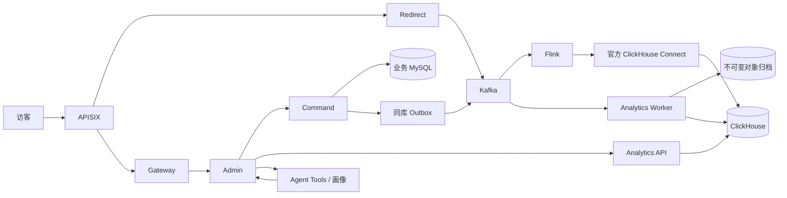

# ShortLink

Java 17 短链接平台。当前分支按 [生产级重构 v0.7](doc/plan/生产级重构增强/01-开发阶段与任务拆分.md) 拆分业务写入、跳转、统计和 Agent，开发完成后使用新 schema 首次部署。

[文档总目录](doc/README.md) · [开发计划](doc/plan/README.md) · [压测报告与归档](doc/压测报告/README.md)



| 模块 | 职责 |
| --- | --- |
| `shortlink-command` | 分组、创建、生命周期、批量任务、元数据、策略事实、授权和 Outbox |
| `shortlink-redirect` | 独立跳转、缓存、策略执行、有界异步事件生产 |
| `gateway` | 管理入口的响应式 Session 校验、可信身份和请求预算 |
| `admin` | 账号、管理 API、后台与 Agent 的共享统计适配 |
| `event-contract` | 原始接收记录、事件和 sourceCut 的公共契约 |
| `id-generator` | 固定来源的 Leaf Segment 思路适配、连续区间预留、固定短码映射 |
| `risk-core` | 各调用方共享的确定性策略语义 |
| `analytics-flink` | 真正的 Kafka/Flink/RocksDB 作业、明细与在线聚合双分支 |
| `analytics-worker` | 原始接收归档、补算、覆盖证明、不可变发布和恢复世代 |
| `shortlink-analytics-api` | 当前授权、统计快照、持久化查询任务及结果分页 |
| `agent-service` | 工具、投放分析、风险画像、人工审核与受控自动动作 |

旧 `project`、`aggregation` 模块已退出构建，其 Redis Stream 统计、哈希碰撞建链和旧部署入口已移除。忽略的本地开发配置保留在原目录，构建明确排除这些配置；正式制品使用受版本管理的 production properties 和环境变量。

主要约束：

- 业务表采用一个物理 MySQL 库上的 16 分表，路由、全局身份、策略、任务和 Outbox 在同库事务中仲裁。
- 发号器有独立连接池和提交事务。短码为 52 位编号经固定 Feistel 映射后的 9 位 Base62；永久固定密钥和版本，数据库登记指纹，配置不一致拒绝启动。不是每次生成后通过哈希碰撞重试。
- 跳转请求不等待统计数据库或 Agent。事件排队、在途字节和回源并发均有上限；数据损失或观测缺口通过统计质量公开表达。
- Kafka/Flink 的事务输出、Connect 的至少一次投递、ClickHouse 查询去重各有独立边界，不宣称跨系统“恰好一次”。
- Tool 和普通后台都经 Analytics 查询；Agent 无逐点击消费者，也不直接写 Redirect 的 Redis 策略键。
- 统计结果保留时间范围、快照、sourceCut、近似算法及质量。未采集的地域/网络维度明确缺失；历史累计未证明完整覆盖时为未知。

[运行配置与首次部署](deploy/README.md) · [统计运行与恢复](doc/analytics/runtime.md) · [查询任务](doc/analytics/query-jobs.md) · [Leaf 来源](id-generator/UPSTREAM.md) · [本轮实施与验收](doc/plan/生产级重构增强/04-实施验收记录.md)

## 开发与验收

Java 17、Maven 3.9.4；编译统一 UTF-8。业务 Java 服务可直接运行 JAR。Docker 仅是 `deploy/test/` 提供的一种隔离中间件方式，并非业务服务的运行要求。

```powershell
$env:JAVA_HOME='D:/develop/javaJDK/17'
$env:Path="$env:JAVA_HOME/bin;$env:Path"
$env:JAVA_TOOL_OPTIONS='-Dfile.encoding=UTF-8'
mvn clean test
mvn package -DskipTests
```

集成测试须显式提供隔离 MySQL、Redis、Kafka、ClickHouse、MinIO；具体变量和命令见测试与部署说明。Flink 的 RocksDB 集成测试在 Linux 上执行。默认单测与 `integration` profile 都排除 `e2e`、`performance` 标签；不得用全选 `-Dtest=*` 改变验收范围。

已完成单元与组件集成验收，并开展短链接创建、跳转及网关的有限后端 E2E 和压测；范围与保留失败分别见 [E2E 记录](doc/plan/生产级重构增强/05-创建跳转E2E验收.md)及[网关批发送复测](doc/压测报告/过程报告/13-网关有界批发送优化与复测.md)。报告 13 中的八 worker 配置在 5000/s 目标的 90.024 秒正式窗口取得约 4982.32 正确请求/s、P99 67ms，但全场景仍有 1228 次丢迭代，容量档保持 FAIL，未执行该档长确认。Agent 和完整统计消费链路不在这轮压测范围内。

集群十万跳转 QPS 仍是容量规划假设，尚未验证。首次正式部署前还需要持续容量、真实生产拓扑及故障耐久性验收，以及域名证书和生产权限配置。
