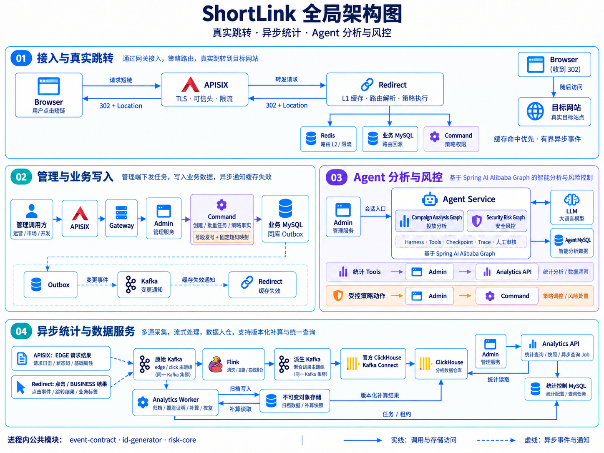
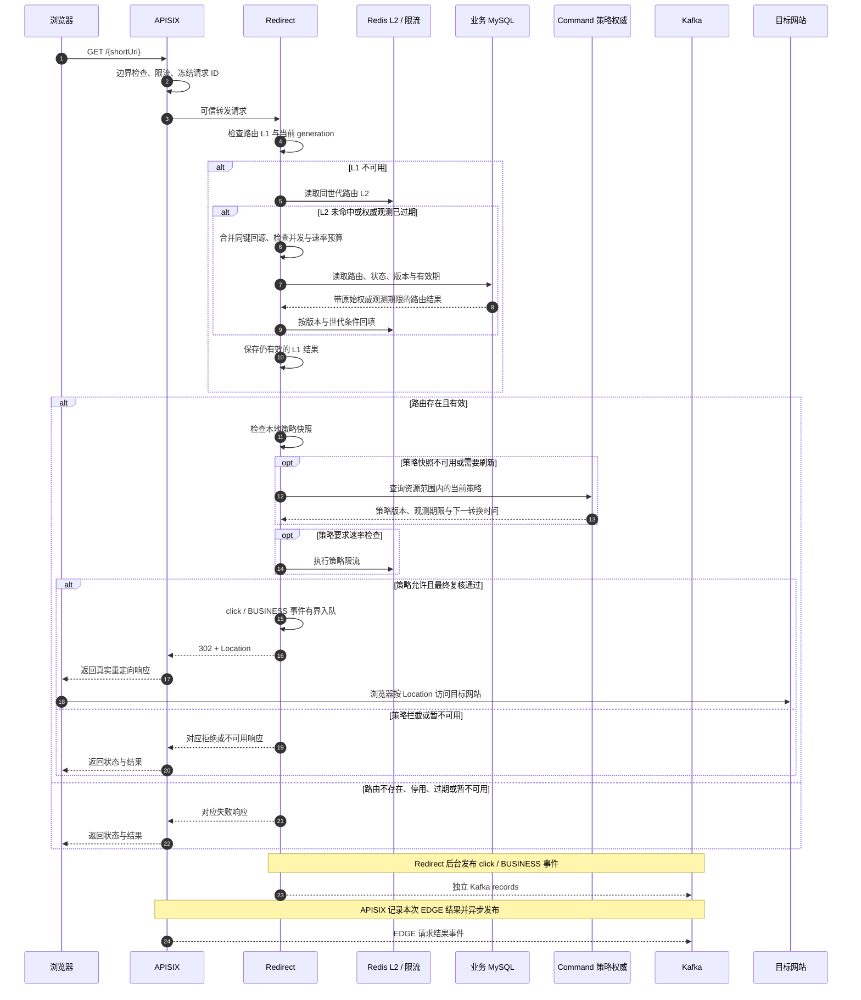
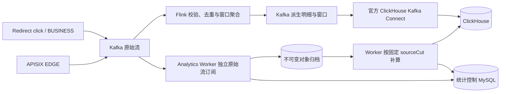
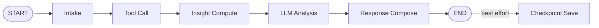
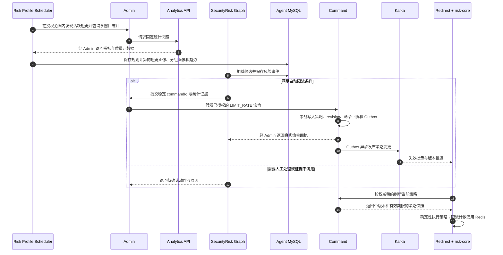

<div align="center">

# ShortLink

### 智能短链平台——基于 Spring AI Alibaba 的投放分析与安全风控 Agent

一个以短链接业务为事实底座、以 **Kafka / Flink** 承接异步统计、以 **Spring AI Alibaba StateGraph** 组织智能投放分析与安全风控工作流的 Java 微服务项目。

<p>
  
  
  
  
  
  
  
  
  
</p>

</div>

> 项目将短链创建与真实 302 跳转、异步访问统计、自然语言投放分析、风险画像、人工审核和确定性策略执行组织为一条完整工程链路。

[文档总目录](doc/README.md) · [开发计划](doc/plan/README.md) · [部署说明](deploy/README.md) · [压测报告](doc/压测报告/README.md)

---

## 项目定位

ShortLink 面向营销投放、内容分发、活动运营和链接治理场景，提供从“生成短链接”到“分析投放效果”，再到“识别异常流量并执行风险策略”的业务能力。

项目由三部分组成：

| 能力域 | 解决的问题 | 主要能力 |
| --- | --- | --- |
| 短链业务底座 | 如何稳定创建、解析、跳转和管理短链接 | 号段发号、批量任务、生命周期、分组、回收站、缓存与分表 |
| 数据分析体系 | 如何衡量链接效果并说明数据质量 | PV、UV、UIP、时段与终端分布、访问明细、快照、异步查询与归档补算 |
| 智能分析与风控 | 如何将业务数据转化为洞察和受控策略 | Campaign Analysis Graph、Security Risk Graph、风险画像、审核与拦截 |

当前版本已将写入、跳转、统计和 Agent 拆开，面向新 schema 首次部署。地域、网络等未采集维度会明确标记缺失；吞吐与部署容量以具备对应配置和验收范围的压测记录为依据。

### 技术定位

Agent 使用显式工作流，把业务事实、规则判断和模型解释分别交给对应组件：

```text
Command 业务事实 + Analytics 统计证据
  + Admin 当前授权与受控 Tool Facade
  + Spring AI Alibaba StateGraph 显式节点编排
  + 确定性规则与指标计算
  + LLM 解释与归纳
  + Checkpoint / Trace / PendingAction
  + Command 策略仲裁与 Redirect 确定性执行
```

核心原则：

1. **业务事实由 Java 服务和数据库维护**，LLM 不直接访问业务数据库。
2. **Agent 通过受控 Tool 查询业务数据**，每次调用重新核验当前身份与目标归属。
3. **指标和风险分数由确定性逻辑计算**，LLM 负责解释，不能改写数值、质量或证据。
4. **短链跳转热路径不依赖 LLM 或统计查询**，模型不可用时仍按路由、策略及资源预算处理请求。
5. **风险动作受权限、证据和人工审核约束**，正式策略由 Command 仲裁；Agent 不直接改写跳转缓存。

---

## 核心能力

### 短链接业务

- 单条短链接创建、同步小批量创建、持久化大批量任务与对象导入
- Leaf Segment 协议的受控源码适配、连续号段预留与固定 9 位 Base62 短码
- 创建幂等、任务重试、逐行结果与取消仲裁
- 短链接更新、有效期管理、分组迁移与当前归属校验
- 短链接分页查询、分组内数量统计与带快照的统计适配
- 真实 302 跳转、GET / HEAD 边界及失效处理
- 回收站移入、查询、恢复和移除
- 有限预算的页面标题、图标抓取与元数据任务

### 高并发与数据能力

- APISIX 公开入口：Host / 路径边界、可信头重写、请求速率及连接并发限制
- Java Gateway 管理入口：响应式 Session 校验、当前身份与请求预算
- Redirect 本地 L1、Redis L2、负缓存、缓存世代与权威刷新期限
- 回源并发限制、集群回源预算及请求超时
- 业务事实与同库 Outbox 事务提交，Kafka 变更通知驱动缓存失效
- 网关与 Redirect 独立的有界异步事件生产，发送攒批、ACK 与拒绝/失败计数
- 单物理业务 MySQL 上的 16 分表，身份、路由、策略和任务在同库协调
- Kafka / Flink / ClickHouse 在线统计与 Worker 归档补算分工

### 统计分析

- PV，以及带近似算法说明的 UV / UIP
- 日期、小时、星期分布与浏览器、操作系统、设备维度
- 哈希化的高频 IP / 访客及访问明细
- 单条短链与分组级查询，统一时间范围、快照与分页
- 数据覆盖、采集质量、版本、水位、缺失维度和恢复世代说明
- 持久化查询 Job、分页、导出与取消，适用于超出同步范围的统计任务
- 不可变原始归档、覆盖证明、历史窗口补算与版本化结果发布

地域、网络和历史新访客分类当前明确缺失。历史累计也需要有对应的覆盖证明，不能把未知数据解释为零。

### Agent 与风控

- 基于 Spring AI Alibaba Graph 的投放分析与安全风控工作流
- 受控 Tool Registry、业务 Tool Facade 与共享 Analytics 查询接口
- Graph Checkpoint MySQL 持久化、会话执行协调与恢复
- 节点级 Trace、耗时、数据来源和告警
- 风险画像批处理、分组画像、趋势、事件和快照
- 同步统计与异步查询 Job tools，保留原始质量信息
- 人工审核、受控自动动作、Command 策略结果查询与动作审计
- Redirect 执行禁用、IP 阻断、时间窗和限流策略

---

## 全局架构



图按链路分区，同名组件表示同一服务。归档与补算的实际方向分别是 `Kafka → Analytics Worker → 对象存储`、`对象存储 → Analytics Worker → ClickHouse`；图中底部补算连线应按这两个方向理解，对象存储不直接写 ClickHouse。

### 分层架构

| 层级 | 组成 | 职责 |
| --- | --- | --- |
| 客户端与入口 | Browser、管理调用方、Agent 调用方 | 短链访问、业务管理与自然语言分析入口 |
| 接入与跳转层 | APISIX、Java Gateway、Redirect | 公网边界、管理会话验证、缓存解析、策略执行与 302 响应 |
| 业务与智能服务层 | Command、Admin、Agent Service | 业务事实、账号与授权、管理适配、Graph、画像与审核 |
| 统计服务层 | Flink、Analytics Worker、Analytics API、官方 Kafka Connect | 在线聚合、归档补算、质量与恢复、查询快照和持久任务 |
| 数据与外部能力 | 业务/统计控制/Agent MySQL、Redis、Kafka、ClickHouse、对象存储、LLM | 独立数据职责、事件传输、查询存储与模型推理 |

Spring AI Alibaba Graph 运行在 Agent Service 内部。MySQL 的业务、统计控制、Agent schema 承担不同职责；统计任务租约和归档进度不写入业务库。

---

## 模块职责

| 模块 | Maven Artifact | 核心职责 |
| --- | --- | --- |
| `shortlink-command` | `shortlink-command` | 分组、创建、生命周期、批量任务、元数据、策略事实、授权与 Outbox |
| `shortlink-redirect` | `shortlink-redirect` | 独立跳转、缓存、策略执行与有界异步事件生产 |
| `admin` | `shortlink-admin` | 账号、管理 API、共享统计适配、Agent / Risk Center 入口 |
| `gateway` | `shortlink-gateway` | 管理入口的响应式 Session 校验、可信身份与请求预算 |
| `agent-service` | `shortlink-agent-service` | Harness、两条 Graph、Tools、画像、审核与 Checkpoint |
| `event-contract` | `event-contract` | 原始接收记录、事件、结果与 sourceCut 公共契约 |
| `id-generator` | `id-generator` | 受控 Leaf Segment 适配、连续区间预留与固定短码映射 |
| `risk-core` | `risk-core` | 共享的确定性策略语义、身份摘要与条件匹配 |
| `analytics-flink` | `analytics-flink` | Kafka / Flink / RocksDB 作业、明细及在线聚合分支 |
| `analytics-worker` | `analytics-worker` | 原始接收归档、补算、覆盖证明、不可变发布与恢复世代 |
| `shortlink-analytics-api` | `shortlink-analytics-api` | 当前授权、统计快照、持久化查询 Job 及结果分页 |
| `deploy` | 部署资源 | SQL、APISIX 插件与配置、Kafka、ClickHouse、监控及隔离测试拓扑 |
| `scripts` | Python / PowerShell / JavaScript | 组件集成、有限 E2E、压测编排、诊断与证据核对 |
| `doc` | 项目文档 | 项目计划、统计说明、验收记录、压测归档与图片 |

旧 `project`、`aggregation` 已退出 Maven 构建。旧目录中可能保留本机被忽略的配置或构建产物，它们不是当前部署入口。当前构建包含 11 个 Java 模块，公共库随所属服务打包使用。

### 服务边界

#### Command 与 Redirect

Command 负责写入与事实仲裁：

- 分组、短链身份、生命周期、当前归属与策略事实
- 创建幂等、批量任务、导入与元数据抓取
- 独立事务的号段分配和同库业务事务
- 授权查询、风险动作仲裁、Outbox 事件发布

Redirect 负责公开跳转：

- Host、方法和短码格式校验
- 本地 L1、Redis L2、负缓存与缓存世代
- 路由回源和 Command 策略权威刷新
- 有效期、策略规则、限流与 302 响应
- click / BUSINESS 事件的有界异步生产

#### Admin

Admin 是用户和管理边界，负责：

- 账号、当前会话身份和用户上下文
- 分组、短链、回收站与批量任务的管理入口
- 复用 Analytics API 的统计查询、分页与查询 Job 适配
- Agent、Risk Center 和 Internal Tool API
- Tool 调用时恢复可信主体，重新核验当前授权与目标范围

#### Agent Service

Agent Service 是独立 Java 智能服务，负责：

- `campaign-analysis` 与 `security-risk` 类型路由
- Spring AI Alibaba StateGraph、Tool Registry 与 Tool Facade
- 模型解释、风险画像、事件、审核、Checkpoint 与 Trace
- 经 Admin 读取业务和统计事实、提交受控策略命令

Agent 持久化自己的画像、运行状态和审计，不直接查询业务表或 ClickHouse，也没有逐点击 Kafka 消费者。

#### APISIX 与 Java Gateway

APISIX 是公网接入层，公开短链流量直接转发到 Redirect，管理流量转发到 Java Gateway。入口重写可信代理信息，执行请求/连接限流，并独立生产 EDGE 请求结果事件。

Java Gateway 负责管理会话校验与 Admin 路由。跳转策略由 Redirect 执行；规则真值和更新由 Command 负责。

#### Analytics

- **Flink** 从原始 Kafka 读取，完成校验、去重和在线聚合，输出派生 Kafka。
- **官方 ClickHouse Kafka Connect** 消费派生主题，写入 ClickHouse 落地表。
- **Analytics Worker** 独立消费原始事件，负责不可变归档、覆盖证明、补算发布与恢复。
- **Analytics API** 面向授权调用方提供统计快照和持久化查询 Job，并在每次读结果时复核当前权限。

---

## 业务功能详解

## 1. 短链接生命周期

### 短码生成

创建请求经 APISIX、管理 Gateway 和 Admin 进入 Command，由 `id-generator` 分配全局编号，再编码为短码。

发号器基于固定来源的 Leaf Segment 思路作受控适配，维护当前号段与下一号段；MySQL 负责区间分配，进程内从已领取的区间取号。

- 单条创建和批量创建共用发号入口，批量可一次预留多个连续区间。
- 预取线程、等待时间和区间预留数量都有边界，耗尽或取号失败会明确返回错误。
- 号段使用独立连接池与事务；业务回滚或进程退出可能留下空号，已领取编号不回收复用。
- 52 位编号经固定的八轮 Feistel 数值置换，编码为 **9 位 Base62** 短码。
- 编码密钥、版本和字符表在同一短码命名空间内保持固定，启动时校验数据库登记的配置身份。

短码分配不依赖对原始 URL 反复计算哈希并碰撞重试。数值置换用于弱化连续编号特征，不承担访问授权或加密安全边界。

### 创建与缓存预热

一次同步创建在业务 MySQL 的同一事务内完成：

1. 复核当前账号、租户和分组权限，检查创建配额；
2. 写入短链主体及全局路由记录，保存原始 URL、状态和有效期；
3. 写入路由变化、元数据任务等 Outbox 意图；
4. 保存本次请求的幂等结果；
5. 事务提交后，由 Outbox 发布器异步投递 Kafka。

创建成功以已提交业务事实为准。标题、图标等元数据由后续有界任务抓取，不占用短链创建事务等待外站响应。

缓存由 Redirect 按需建立：首次访问若没有可用缓存，会在预算内读取路由权威，再回填 Redis L2 与本地 L1。因此，创建成功不承诺首次访问已经命中 Redis。

幂等请求使用 `requestId`，兼容入口也可接收 `Idempotency-Key`。同一租户的相同请求标识与相同内容返回已提交结果；换用不同内容会产生冲突，避免超时重试重复建链。

### 批量创建

批量入口根据规模返回同步结果或持久任务，当前边界如下：

| 规模 | 处理方式 |
| --- | --- |
| 1 条；批量入口 2～500 条 | 共用同步创建事务，预留编号后批量落库 |
| 501～50000 条 | 内联提交持久批量任务，返回 `jobId` 和状态 |
| 超过 50000 条 | 使用带版本与校验和的不可变对象导入；默认最多 64 MiB、一百万行 |

同步批次在提交前完成校验，不把事务失败包装成部分成功。异步任务保存校验结果、行状态和进度，按有限大小的分块提交。

- 任务领取使用租约与递增 fence，旧 Worker 不能在失去租约后提交新结果。
- 取消操作和分块提交在数据库中仲裁；已提交的短链保留，未完成部分按任务状态停止或继续。
- 重试复用已持久化的任务、行和编号身份；失败原因与结果可查询，不仅存在于日志中。
- Kafka 调度通知由 Outbox 发布，数据库中的任务状态用于恢复；通知本身不代表任务完成。

### 更新与分组迁移

更新能力继续覆盖：

- 原始 URL、描述与永久有效或指定有效期；
- 所属分组以及分组引用数量；
- 路由版本、归属版本和缓存失效通知；
- 目标 URL 变化后的标题、图标重新抓取。

Command 在同库事务中锁定相关分组和路由，并检查调用方提供的版本。过期版本产生冲突，避免并发更新覆盖新的事实。

跨分组迁移保留 `linkId` 和短码，更新当前归属与版本。统计保留事件身份和来源记录，查询按当前授权解析链接范围；不会通过搬动历史计数表来完成迁移。

### 回收站

回收站保留分页查询、停用、恢复与移除能力：

| 操作 | 路由状态与结果 |
| --- | --- |
| 移入回收站 | `ACTIVE → DISABLED`，停止有效跳转 |
| 恢复短链 | `DISABLED → ACTIVE`，仍需满足当前权限和有效期 |
| 永久移除 | 从回收站进入 `DELETED`，保留永久路由墓碑，短码不复用 |

每次生命周期变更推进版本并写入 Outbox。Redirect 通过失效通知和权威观测期限收敛缓存，不把缓存存在当作短链仍然有效的依据。

---

## 2. 高并发跳转链路

公开短链由 APISIX 直接转发到独立 Redirect；管理 Java Gateway 负责后台入口，不承担这条跳转路径。

APISIX 检查请求路径、方法、Host 和入口预算，重建可信转发信息与请求 ID。Redirect 继续校验代理来源、路由状态、有效期和风险策略。

下面展示正常 GET 的主要过程；缓存和策略分支都有独立失败处理，无法确认权威或资源预算耗尽时不会伪造成功跳转。



这里的 302 是浏览器重定向。Redirect 不替浏览器访问目标网站，也不等待统计消费者完成聚合后才返回。

### 缓存治理策略

| 机制 | 当前作用 |
| --- | --- |
| 本地 Caffeine L1 | 热路由可在进程内读取，减少 Redis 访问 |
| Redis 路由 L2 | 跨请求复用带版本、世代和权威期限的路由结果 |
| 权威负结果缓存 | 对 MySQL 已确认不存在的路由作短期复用，不能由布隆过滤结果代替权威结论 |
| 同键回源合并 | 同进程共享同键正在进行的读取，后来的订阅者仍复核结果期限 |
| 有界回源 | 并发上限、集群速率预算和超时限制数据库及策略服务的压力 |
| 业务有效期 | 每次使用路由都检查 ACTIVE 状态和 expireAt |
| 版本下限与 generation | 拒绝旧版本回填，隔离 Redis 重建后的旧缓存世代 |
| Kafka 变更订阅 | 每个 Redirect 实例接收路由/策略失效提示，加快缓存收敛 |

路由权威来自业务 MySQL，策略权威来自 Command HTTP 接口；Redis 保存路由缓存及限流状态，不是策略事实库。

当前路由与策略的权威观测租期配置为最多 1 秒，Redirect 请求预算默认 500 毫秒。缓存命中或共享回源结果不会延长原观测期限；接近期限时需刷新，发送响应前还会复核。

generation 由业务库中的持久世代与 Redis 标记协调。Redis 标记缺失时推进世代，旧 L1/L2 结果不能以新世代继续使用。

失效通知只用于加快收敛。即使通知延迟，读取仍受版本和租期约束；这不是“消息到达后才检查有效性”，也不代表跨服务瞬时强一致。

### 跳转与统计解耦

跳转负责路由与策略决策，统计链路负责后续归档、聚合和查询。两者通过有界事件队列与 Kafka 解耦。

- Redirect 分别发布点击事件和 BUSINESS 请求结果；APISIX 独立发布 EDGE 请求结果。
- 一个正常且成功采集的 GET 通常对应一条 click、一个 BUSINESS 结果、一个 EDGE 结果；HEAD、入口拒绝和异常请求不能套用固定三条的计数。
- Kafka 发送及 ACK 等待在后台执行；排队、在途与重试共同占用条数和字节预算。
- 网关支持有限 sender 并行与批量发送，每条事件仍保持独立身份；短暂攒批不改变 ACK 和终态判定。
- 拒绝入队、重试耗尽或观测缺失会进入事件质量指标，302 成功不能证明统计已完整交付。

事件重试保持原 ID 与内容。内存队列不保证进程崩溃后的重放，ACK 不确定也可能产生重复；后续统计按事件与接收记录身份处理这些边界。

---

## 3. 访问统计体系

统计链路同时接收点击流与请求结果流，区分访问行为、业务判定和网关入口结果。

| 指标 | 当前实现与解释 |
| --- | --- |
| PV | 对有效点击的逻辑事件身份去重后计数，保留对应窗口的覆盖状态 |
| UV | Cookie 访客标识经固定密钥生成 hash，使用 `uniqCombined64` 作近似去重 |
| UIP | 从可信入口解析客户端 IP 并生成 hash，使用 `uniqCombined64` 作近似去重 |
| 时间分布 | 按上海时区提供日期、小时、星期等统计 |
| 操作系统 / 浏览器 / 设备 | 从已采集请求特征解析并聚合 |
| 地域与网络 | 当前缺失项明确标记，不把缺数据解释为零访问 |
| 高频访客 / IP | 输出 hash 与近似计数，并保留算法及误差信息 |
| 访问明细 | 保留链接、事件时间、终端特征及 hash 身份等受控字段 |
| 请求结果 | 区分 BUSINESS 与 EDGE 的来源、阶段和状态，避免把两者重复算作 PV |

### 在线聚合与归档补算



Flink 从两条原始 Topic 读取，输出派生明细、窗口及旁路记录。官方 Connect 消费相应派生 Topic，写入 ClickHouse 落地表及查询表；Flink 不直接调用 Connect 发送结果。

Worker 独立消费原始流，先上传不可变归档，再更新控制库进度，最后提交 Kafka offset。补算固定来源范围、build 与恢复世代，向 ClickHouse 写入新结果版本，不把历史事件回灌实时原始流。

统计控制 MySQL 保存归档进度、覆盖、构建发布、查询快照与任务；它和业务 MySQL 的职责分开。Flink checkpoint、Kafka 事务输出、Connect 至少一次投递和查询去重各有边界，不能概括成全链路 exactly-once。

### 统计查询与结果质量

统计查询继续支持单链和分组统计、访问明细，以及今日和指定日期范围的指标。Admin 与 Agent Tool 共用 **Admin → Analytics API → ClickHouse** 查询入口，Agent 不消费逐点击消息。

- 同步查询最多覆盖 7 天、500 条链接与 10000 条明细；分页复用同一持久快照并重新检查当前授权。
- 较长范围通过 Analytics API 的持久查询 Job 处理，最多 180 天，并受任务、结果行数、字节和执行时间预算约束。
- 今日和累计指标保留各自统计范围；未证明生命周期覆盖或超过同步预算的累计查询，不能用局部结果冒充历史总量。
- `StatsEnvelope` 同时返回结果、有效时间边界、快照、sourceCut、恢复世代、算法、完整性、时效与 collectionQuality。
- 实时结果保持 provisional；规范结果通过固定来源范围和不可变发布证明建立，Kafka lag=0 本身不代表完整。
- 生产者失败或拒绝反映为质量降级，缺少或过期的观测保持 UNKNOWN；未采集地域、网络等维度通过 missingMetrics 明示。

统计不可用会返回相应错误或质量状态；只有具备对应覆盖语义的零值才表示该范围内没有业务事件。展示 PV/UV/UIP 时应同时尊重统计范围、近似算法与质量信息。

---

## Agent 架构

## 1. 统一 Agent Harness

Agent Harness 将不同业务工作流收敛到统一运行接口：

```text
POST /internal/short-link-agent/v1/chat
```

管理端通过 `POST /api/short-link/admin/v1/agent/chat` 转发请求。Admin 从登录态提供可信主体，Agent 校验内部 Token，并使用可信请求头中的用户、租户标识和 `authVersion`；问题文本和 Tool 参数不能替换这些身份信息。

请求由 `agentType` 选择执行路径：

| `agentType` | 工作流 |
|---|---|
| 空值或 `campaign-analysis` | 投放分析 Graph |
| `security-risk` | 安全风控 Graph |
| 其他值 | 返回不支持该类型的结构化告警 |

统一结果模型包含：

```json
{
  "sessionId": "session-id",
  "traceId": "trace-id",
  "answer": "自然语言结论",
  "cards": [],
  "pendingActions": [],
  "toolCalls": [],
  "dataSources": [],
  "traceEvents": [],
  "warnings": []
}
```

### Harness 能力

- 为每次 Run 生成独立 `traceId`，保留业务 `sessionId`。
- 使用统一 Tool Registry，复用 Spring AI 生成的受控 Tool 回调。
- 统一结构化响应，记录节点状态、耗时、Tool 调用和数据来源。
- 通过有限 Graph 节点组织执行，配置明确的递归预算。
- 对同一 Graph thread key 的本进程执行进行串行协调。
- 使用 MySQL 保存原生 Graph Checkpoint，并单独保存执行结束快照。
- Tool、LLM 或执行失败时返回结构化结果与告警。
- 校验内部接口 Token，将可信主体传递到后续业务授权链。
- 支持高风险建议进入 `pendingActions`，保留人工审核入口。

### Checkpoint 与会话边界

Checkpoint 分为两层，承担不同职责：

| 层次 | 用途 | 当前行为 |
|---|---|---|
| 原生 Graph Checkpoint | 保存 Graph 执行状态 | 编译 Graph 时注册 `MysqlSaver`，使用派生的 thread key |
| 结束快照 `checkpoint_save` | 保存结果、节点轨迹和业务审计信息 | 在 Graph 返回后执行；开关控制保存，失败追加告警 |

原生 thread key 包含 Graph 名称、版本和会话材料。当前 Campaign 使用请求的 `sessionId`；Security 使用包含用户、租户、`authVersion` 和 `sessionId` 的主体范围会话材料。两条链路的结束快照均使用主体范围会话材料。

因此，`sessionId` 不是权限凭证。业务读取与动作提交仍需逐次授权；原生 Graph Checkpoint 也不能与经过裁剪、脱敏的结束快照视为同一份数据。

Campaign 原生 thread key 当前尚未纳入主体范围，其跨主体 Checkpoint 隔离仍需独立验证。本次更新只核对源码调用链，没有运行跨主体状态复现，不能把业务 Tool 的逐次授权等同于原生 Checkpoint 隔离验收。

图中的 `checkpoint_save` 表示结束后的保存步骤，不是额外注册的业务 Graph 节点。其失败不会抹掉已经生成的结果；原生 Saver 导致的 Graph 执行异常则进入执行失败处理。

---

## 2. Campaign Analysis Graph

投放分析工作流面向运营和管理人员，将自然语言问题转换为受控业务查询，再生成结构化投放洞察。



### 节点职责

| 节点或步骤 | 职责 |
|---|---|
| `intake` | 注入 Graph 名称、版本、Session 和可信主体上下文 |
| `tool_call` | 提取分组、短链、日期、分页等参数，规划并执行受控 Tool |
| `insight_compute` | 基于结构化 Tool 事实计算派生洞察和卡片 |
| `llm_analysis` | 使用配置的模型解释事实与洞察，不重新发起隐式 Tool 循环 |
| `response_compose` | 组装答案、卡片、Tool 调用、数据来源和告警 |
| `checkpoint_save` | 在 Graph 结束后保存业务执行快照 |

### 受控查询 Tool

默认生产注册包含以下八个 Tool。查询 Job 的提交会创建查询任务记录，但不会创建、修改或停用短链及风险策略。

| Tool | 业务作用 |
|---|---|
| `list_groups` | 查询当前用户可见分组 |
| `page_short_links` | 查询指定分组内的短链分页 |
| `get_short_link_stats` | 查询指定短链的统计快照 |
| `get_group_stats` | 查询分组级聚合统计快照 |
| `get_group_access_records` | 查询分组访问记录，后续页沿用快照和游标 |
| `submit_statistics_query_job` | 提交超出同步范围的统计或访问记录查询，返回 `jobId` 与任务状态 |
| `get_statistics_query_job` | 查询已有 Job 状态 |
| `get_statistics_query_job_page` | 读取已成功 Job 的指定结果页 |

### Tool 调用边界

Agent 的统计 Tool 和风险画像采集复用重构后的统计查询链路：

```text
Agent Graph / Risk Profile Scheduler
  -> Java Tool / RiskStatsSourceGateway
  -> Admin Internal Tool API
  -> Analytics API
  -> 已发布的统计数据与固定快照
```

普通 Tool 的 HTTP 访问由 `ShortLinkBusinessGateway` 承接；Admin 负责业务门面与授权上下文。分组目录、短链元数据与统计结果使用各自对应的权威服务。

Admin Internal Tool API 会：

1. 校验内部调用 Token，并恢复可信用户上下文；
2. 校验目标分组与资源范围，解析稳定的租户及 `linkId`；
3. 将主体、`authVersion` 与已授权资源传给 Analytics API；
4. 保留统计结果的快照、版本、可用性和质量信息；
5. 将结构化结果返回 Agent，失败或超预算时明确返回错误。

Agent 不直接查询 ClickHouse，也不另外维护一套点击计数。它可以持久化自己的 Graph 状态、风险画像、事件和审核记录，这与短链和统计数据的权威归属是不同职责。

### 异步统计与查询 Job 复用

点击统计由事件链路异步处理：跳转与边缘事件进入 Kafka，统计处理与发布完成后，由 Analytics API 提供查询。一次 Tool 调用不会等待对应点击完成 Kafka 消费，也不能把尚未发布的数据当作已完成统计。

大范围查询复用 Analytics API 已有的 Query Job 能力：

1. 同步查询限制时间跨度、资源数量和结果页大小；超过同步日期跨度时，两个 Graph 的规划器可以改用查询 Job。
2. 提交携带稳定 `requestId`。在同一租户与主体内，以同一标识重试相同查询时复用已有 Job；改换查询内容会得到冲突。
3. 返回的 `QUEUED`、`RUNNING` 表示仍在处理，Agent 对外明确说明等待状态。
4. 后续请求带回原 `jobId` 查询状态，`SUCCEEDED` 后再按 `pageIndex` 读取结果页。
5. 每次状态查询和结果读取重新核验主体、资源权限与结果有效性。

每个 Job Tool 只发起一次有界请求，不在一次对话中循环等待任务结束。`FAILED`、`CANCELLED` 或尚未就绪的任务不能伪装成统计卡片。

当前同步查询跨度最多 7 天，Job 历史区间最多 180 天；Job 同样受资源范围、并发、保存期限和结果预算约束，并非所有 `TOO_LARGE` 都能通过提交 Job 自动解决。

### 事实与解释分离

系统先基于 Tool 结果生成结构化卡片和派生洞察，再向 LLM 提交经过裁剪的事实上下文。Prompt 明确限制模型：

- 不重新计算或覆盖卡片指标；
- 不修改规则阈值、证据和原因码；
- 解释可能原因、风险含义和建议；
- 对异常流量不输出确定性安全结论；
- 建议保持只读或低风险。

统计结果还携带 `snapshotId`、`recoveryEpoch`、有效截止时间、数据版本，以及 `availability`、`freshness`、`completeness`、`provisional`、`approximation`、`collectionQuality` 等信息。

这些字段共同说明“查到了什么、覆盖到什么时候、是否完整、哪些值是近似值”。它们与数值一起保留，不能仅凭 HTTP 成功或非空数组宣称数据完整、实时或精确。

---

## 3. Security Risk Graph

安全风控工作流将风险画像、确定性规则、LLM 解释、事件持久化和动作提交串联为一条可审计链路。


### 节点职责

| 节点或步骤 | 职责 |
|---|---|
| `intake` | 建立 Session、可信主体与分析上下文 |
| `profile_candidate_load` | 从短链画像和分组画像加载已授权候选 |
| `risk_tool_planning` | 通过共享 Tool 查询补充统计；支持已有查询 Job 的状态和结果页读取 |
| `risk_scoring` | 执行确定性风险规则和证据分类 |
| `llm_explanation` | 对已确定的风险证据进行脱敏解释 |
| `risk_event_persist` | 保存风险事件和快照 |
| `risk_auto_action` | 满足证据与授权条件时提交自动限流命令，保留真实回执 |
| `response_compose` | 生成风险卡片、待确认动作和数据来源 |
| `checkpoint_save` | 在 Graph 结束后保存业务执行快照 |

风险事件代表一次分析记录；自动动作是否提交成功、当前策略是否仍然生效，需要分别查看命令回执和 Command 权威状态。

### 风险画像信号

风险画像从多个时间窗口和访问维度构造指标：

| 风险信号 | 含义与当前数据边界 |
|---|---|
| 流量突增 | 最近 2 小时 PV 相对 24 小时平均每 2 小时 PV 的增长 |
| IP / Visitor 集中 | 头部 IP 或访客占比；当前头部统计属于近似结果 |
| 峰值小时爆发 | 流量过度集中在单个小时 |
| 高频重复访问 | PV、UV 和重复访问比例；依赖的 UV 当前为近似结果 |
| 设备集中 | 访问集中于单一设备类型，取决于已采集的解析维度 |
| 地域集中 | 保留规则与字段；当前统计链路未采集该维度，不能据此给出已验证结论 |
| 浏览器集中 | 访问集中于单一浏览器，取决于已采集的解析维度 |

当前 Java 检测器采用以下参考阈值；这是画像评分规则，不等同于自动执行策略的准入条件：

| 信号 | Warning | Strong |
|---|---:|---:|
| 2h PV 相对 24h 平均每 2 小时 PV | 2.0 倍 | 6.0 倍 |
| IP / Visitor 集中度 | 0.45 | 0.75 |
| 峰值小时占比 | 0.40 | 0.70 |
| 重复访问比例 | 0.30 | 0.75 |
| 设备 / 地域 / 浏览器集中度 | 0.50 | 0.75 |

风险分数和原因码由 Java 规则计算，LLM 不参与评分。阈值与权重的实际行为以检测器代码为准，自动动作还需要进一步核验证据。

### 统计证据与缺失维度

- 当前 PV、时段计数及已采集设备、浏览器等计数标注为精确事件去重结果。
- UV、UIP 和重复访问比例标注为 `APPROXIMATE`，头部 IP / Visitor 统计同样标注为近似值。
- 国家、地域分布、网络类型及新老访客分类在 `missingMetrics` 中显式列出，不能将缺失解读为零访问或没有风险。
- 2h、24h、7d 窗口需要共享固定的快照与数据截止点，不能拼接不同批次的数据计算增长。
- 展示与分析可以保留近似指标，但自动动作只接受所用指标满足精度要求的原因码。

因此，当前 `IP_CONCENTRATION` 和 `HIGH_REPEAT_VISIT` 不能仅凭近似头部占比或 UV 作为自动限流的合格强原因；具备精确 PV 和峰值时段证据的原因仍需通过其他自动动作条件。

### 敏感信息治理

安全风控链路在解释上下文、响应和结束快照中使用结构化清洗：

- 移除匹配的用户、访客等身份字段；
- 对 Token、密码、Secret 和 API Key 等匹配字段进行掩码；
- 对匹配的 JDBC 地址进行掩码；
- 对匹配的 IPv4 文本保留前两段并掩码后两段；
- 递归处理嵌套 Map 和 List。

风险持久化入口还会检查部分禁止的原始标识与 IP 文本。上述处理是字段和格式规则，不是任意文本的完整匿名化保证；原生 Graph Checkpoint 保存执行状态，也应按受保护的内部数据管理。

---

## 风险画像与策略闭环



### 风险画像批处理

画像调度通过配置控制执行周期；当前默认定时表达式为每 2 小时执行，应用就绪时也会触发当前窗口处理。

- 按配置的活跃扫描区间发现候选，默认面向近 7 天活跃短链；
- 先经 Admin 解析授权范围，再查询固定的数据发布截止点；
- 查询 2h、24h、7d 多窗口统计并校验完整性与一致性；
- 生成短链画像，聚合同一批次的分组画像；
- 保存风险趋势、异常候选及统计证据来源；
- 通过批次租约、失败记录和有界恢复处理重试，丢失租约后停止相关写入。

候选分页和数据发现均有预算。权限变化、快照不一致或发现超预算会明确失败，不能静默截断后把部分候选宣称为完整批次。

### 自动动作边界

自动执行仅开放 `LIMIT_RATE`，并且需要同时满足：

- 自动限流开关开启，风险等级为 `HIGH`，分数达到配置的最低要求；
- 至少两个强风险原因通过其实际使用指标的精度检查，并满足样本量要求；
- 当前目标不存在要求人工处理的动作建议；
- 统计证据可用、完整、新鲜，采集质量为 `NORMAL`，规则版本与资源身份匹配；
- 快照及执行证据未过期，当前策略权威状态仍在有效期内；
- 携带稳定 `commandId`、目标 `linkId` 与预期 `policyRevision`，由 Command 再次授权和提交。

限流配额与窗口长度使用运行配置，不由 LLM 生成。命令重试复用标识，并查询已有回执；提交冲突、证据过期和结果待确认都不能显示成已生效。

以下动作不会由该自动节点直接执行，只能作为需要人工处理的建议：

- `DISABLE_SHORT_LINK`
- `BLOCK_IP`
- `LIMIT_TIME_WINDOW`

`pendingActions` 代表待处理建议。现有 Risk Center 审核接口记录人工判断，不会因“确认风险”或“误报”自动激活、撤销这些策略。

### 风险策略类型

业务风险策略由 Redirect 使用 `risk-core` 确定性执行，边缘网关的接入限流是另一层保护。

| 策略 | Redirect 行为 | 拒绝时 HTTP 状态 |
|---|---|---:|
| `DISABLE_SHORT_LINK` | 拒绝被业务策略禁用的短链 | 403 |
| `BLOCK_IP` | 拒绝命中的 IP 哈希 | 403 |
| `LIMIT_TIME_WINDOW` | 拒绝允许时间窗之外的访问 | 403 |
| `LIMIT_RATE` | 按租户与短链共享的 UTC 固定窗口计数，超额拒绝 | 429 |

短链资源不存在或资源本身不可用仍可能返回 404。策略权威未知、证明过期或必要限流存储不可用时返回 503，不能把“读取失败”解释成“没有策略”。

### 策略一致性

策略的权威事实和命令回执位于 Command，Agent 的画像、事件及 Redis 均不充当策略权威。

1. Command 在事务内校验权限、资源、预期版本、动作参数和自动动作证据。
2. 同一事务写入策略、资源 `policyRevision`、持久化命令回执和业务 Outbox。
3. Outbox 异步发布 Kafka 变更事件，Redirect 用它推进版本下限并失效缓存。
4. Redirect 缓存只在权威快照的租约内有效，变更提示不替代权威读取；缓存命中不能滑动延长证明。
5. Redis 承担分布式限流计数等运行状态；策略更新不会通过随意更换计数键清空已消费配额。

调用方超时并不能证明事务失败。应保留原 `commandId` 查询回执，再读取当前权威策略；历史 `COMMITTED` 回执也不代表策略在未来始终有效。

---

## Risk Center

管理端 Risk Center 提供：

- 分组风险总览和异常短链列表；
- 单条短链风险详情、事件分页与分析快照；
- 人工审核记录；
- 当前策略及其权威状态查询；
- 策略停用与命令结果确认；
- 风险事件、审核记录和策略命令回执的追溯。

风险画像是统计分析结果，当前策略卡片来自 Command 的权威读取。读取失败或证明失效时保留 `UNKNOWN`，不从历史画像或少量候选卡片推断整个分组的当前禁用状态。

### 主要接口

| Method | Path | 说明 |
|---|---|---|
| `GET` | `/api/short-link/admin/v1/risk/groups/{gid}/overview` | 查询分组风险总览 |
| `GET` | `/api/short-link/admin/v1/risk/groups/{gid}/short-links` | 查询分组短链风险卡片 |
| `GET` | `/api/short-link/admin/v1/risk/short-links` | 按分组、域名与短码查询风险详情 |
| `GET` | `/api/short-link/admin/v1/risk/events` | 查询风险事件分页 |
| `POST` | `/api/short-link/admin/v1/risk/reviews` | 提交人工审核记录 |
| `GET` | `/api/short-link/admin/v1/risk/current-policies` | 按 `linkId` 查询当前策略，支持游标 |
| `POST` | `/api/short-link/admin/v1/risk/policies/{policyId}/disable` | 携带 `commandId`、`linkId` 显式撤销策略 |
| `GET` | `/api/short-link/admin/v1/risk/commands/{commandId}` | 查询策略命令的持久化回执 |

人工审核 `WATCH`、`FALSE_POSITIVE`、`CONFIRM_RISK` 记录用户判断。显式撤销策略走 Admin → Command，并重新校验当前权限，不依赖历史统计是否仍然新鲜。

撤销请求在超时或服务端错误后可能返回 `PENDING_CONFIRMATION`；前端应保留原命令标识继续确认，不能直接标记成功或换一个标识重复提交。

---

## 三条关键链路

### A. 短链跳转与统计链路

```text
Browser → APISIX → Redirect
                     ├─ L1 / Redis L2 路由缓存；必要时 MySQL 回源
                     ├─ 本地策略缓存；必要时 Command 权威刷新
                     └─ 有效期与策略判定 → 302 + Location → Browser → 目标网站

APISIX EDGE 请求结果 ─────┐
Redirect click / BUSINESS ┼→ 原始 Kafka → Flink → 派生 Kafka → Connect → ClickHouse
                         └→ Analytics Worker → 不可变原始归档
                                              └→ Worker 补算 → ClickHouse 版本化结果
```

同步响应不等待 ClickHouse、Agent 或统计查询。302 校验与 Kafka 交付核对是不同验收项，HTTP 成功不能代替事件质量证明。

### B. Agent 分析链路

```text
管理调用方 → APISIX → Java Gateway → Admin → Agent Service
                                                └→ Harness / StateGraph
                                                   → Tools → Admin Internal Tool API
                                                             ├→ Command 业务事实与授权
                                                             └→ Analytics API 统计 / 查询 Job
                                                   → 确定性卡片与规则
                                                   → LLM 解释
                                                   → 响应 / Trace / Checkpoint
```

统计 Tools 和普通后台共用 Analytics 查询，保留相同的范围、快照、近似算法、缺失维度与质量说明。长任务按 Job 查询状态和读取结果，不在 Agent 内另建一套统计消费者。

### C. 风控策略闭环

```text
Risk Profile / Security Risk Graph
  → 确定性证据与动作边界
  → 人工审核 / 合格的受控自动动作
  → Admin 当前主体校验
  → Command 策略仲裁
  → 业务 MySQL：策略事实 + 同库 Outbox
  → Kafka 变更通知
  → Redirect 缓存失效 + 有限期限的权威刷新
  → 确定性策略执行
```

变更消息用于提示失效。业务数据库和 Command 保持权威，消息延迟不能无限延长缓存证明；撤销同样经过当前授权与正式命令处理。

---

## 架构设计亮点

### 1. 传统业务与 Agent 能力解耦

短链创建、跳转和统计处理不依赖 LLM。Agent Service 可以单独部署、扩缩容或降级；访问统计先进入共用数据链路，之后再由后台和 Tools 查询。

### 2. 两条显式 Graph

投放分析和安全风控使用独立 StateGraph：

- 节点职责与状态流转可核对；
- Tool 调用、数据来源与告警可追踪；
- 运行结果通过 Checkpoint 保存；
- 失败会进入有界重试、降级或明确错误状态。

### 3. 规则计算与 LLM 解释分层

风险分数、指标卡、阈值和原因码由 Java 逻辑计算。统计质量与证据一同进入判断，模型只解释既有事实；缺失、近似或未覆盖的数据不能被模型补写成确定性结论。

### 4. 受控 Tool 与统一授权

Agent 通过 Admin Internal Tool API 获取业务事实，复用当前用户身份与目标范围校验。同步统计、异步任务、分页、导出和风险命令各自保留授权边界，内部 Token 不能替代业务授权。

### 5. 风险判断与跳转执行分离

复杂画像和模型解释在后台运行，Command 负责策略真值，Redirect 使用共享 `risk-core` 规则执行。策略缓存有刷新期限，并与本次请求处理预算共同约束放行。

### 6. 多层缓存与有界回源

路由 L1 / Redis L2、负缓存、缓存世代和回源并发限制共同保护业务库。失效消息加快收敛，有限权威期限限制旧数据继续生效的时间；本地命中可以减少 Redis 请求，但不能取消有效期和策略校验。

### 7. 异步统计与质量可见

网关和 Redirect 分别生产事件，队列条数、字节、在途和重试都有预算。采集拒绝、交付失败和观测缺口保留为质量信息；原始归档与 sourceCut 为补算和覆盖核对提供依据。

### 8. 风险动作可审计、可撤销

风险事件、人工审核、Command 命令和动作审计有独立记录。正式策略包含版本与当前授权，重复命令、结果不确定和撤销都通过事实源处理。

### 9. 敏感数据统一处理

风控链路在模型、响应和 Checkpoint 出口清洗敏感字段。分析事件使用固定版本的身份摘要；更换相关密钥或恢复存储时必须核对数据身份与历史覆盖，不能通过临时随机密钥改变统计口径。

### 10. 写入、跳转和统计独立运行

服务按职责使用不同连接池、线程和预算；发号器作为 Command 的进程内库使用，Flink 则是独立流作业。业务 MySQL、统计控制库、Agent 库、ClickHouse 与对象存储分别维护对应事实，部署与扩容按实际瓶颈判断。

---

## 技术栈

| 分类 | 技术 | 版本 / 当前用途 |
|---|---|---|
| Java Runtime | Java | 17，统一 UTF-8 编译 |
| Web Framework | Spring Boot | 3.0.7；Redirect 与 Gateway 使用响应式 Web 栈 |
| Microservices | Spring Cloud | 2022.0.3，Gateway / OpenFeign 与受控内部 HTTP |
| Agent Graph | Spring AI Alibaba / Spring AI | 1.1.2.3 / 1.1.2；显式 Graph、ChatModel、Tool |
| LLM | DeepSeek 适配 | 生产通过 `LLM_BASE_URL`、`LLM_MODEL`、`LLM_API_KEY` 显式配置 |
| Public Gateway | Apache APISIX | 3.11.0；TLS、可信入口、漏桶限流、并发限制、边缘事件 |
| Management Gateway | Spring Cloud Gateway | 会话校验、可信身份、请求体与在途请求预算 |
| ID Allocation | Leaf Segment 来源适配 | 固定上游版本、双号段预取、连续区间预留、固定短码映射 |
| Database | MySQL | 8.x；业务、统计控制、Agent 分库，业务库内 16 分表 |
| Persistence | JDBC / MyBatis-Plus / ShardingSphere-JDBC | 按模块使用；MyBatis-Plus 3.5.3.1、ShardingSphere 5.3.2 |
| Cache | Caffeine / Redis / Redisson | Redirect L1/L2、缓存世代与受控回源；Redisson 3.21.3 |
| Event Bus | Apache Kafka | 3.9.0；业务变更、点击与请求结果事件 |
| Streaming | Apache Flink / RocksDB | Flink 1.20.3，Kafka connector 3.4.0-1.20 |
| Analytics | ClickHouse / Kafka Connect | 官方 ClickHouse Kafka Connect 1.4.0，明细与聚合查询 |
| Object Storage | S3 兼容存储 / MinIO | 不可变导入、原始接收归档、覆盖证明与恢复数据 |
| Observability | Actuator / Micrometer / Prometheus | 队列、事件质量、任务、连接池和运行资源指标 |
| Test | JUnit / Spring Boot Test / H2 / 隔离中间件 | 单元、组件集成、独立 E2E 与性能脚本 |

版本以各模块 POM 与部署清单为准。当前服务通过配置中的稳定内网 DNS / LB 地址协作，Nacos 默认关闭；入口流控由 APISIX 与 Java Gateway 的显式预算承担。

---

## 核心接口

### 短链与管理 API

公开跳转使用短链域名；管理 API 使用管理域名，经 APISIX → Gateway → Admin 校验会话后进入对应服务。

| Method | Path | 说明 |
|---|---|---|
| `GET` / `HEAD` | `/{shortUri}` | Redirect 校验状态与策略后返回 302；HEAD 不记点击 |
| `POST` | `/api/short-link/admin/v1/create` | 创建短链；由 Command 执行发号、幂等事务与 Outbox |
| `POST` | `/api/short-link/admin/v1/create/batch` | 2～500 行同步创建，501～50000 行返回持久任务 |
| `POST` | `/api/short-link/admin/v1/batches/imports` | 提交固定对象版本的批量导入 |
| `GET` | `/api/short-link/admin/v1/batches/{job}` | 查询批量任务状态 |
| `GET` | `/api/short-link/admin/v1/batches/{job}/rows` | 分页读取批量结果 |
| `POST` | `/api/short-link/admin/v1/batches/{job}/cancel` | 取消批量任务 |
| `POST` | `/api/short-link/admin/v1/update` | 按 `expectedVersion` 更新短链 |
| `GET` | `/api/short-link/admin/v1/page` | 短链列表与共享统计快照 |
| `GET` / `POST` / `PUT` / `DELETE` | `/api/short-link/admin/v1/group` | 分组查询、创建、更新与删除 |
| `GET` | `/api/short-link/admin/v1/stats` | 单链统计 |
| `GET` | `/api/short-link/admin/v1/stats/group` | 分组统计 |
| `GET` | `/api/short-link/admin/v1/stats/access-record` | 单链明细；后续页携带固定快照与游标 |
| `GET` | `/api/short-link/admin/v1/stats/access-record/group` | 分组明细；沿用相同快照 |
| `POST` | `/api/short-link/admin/v1/recycle-bin/save` | 移入回收站 |
| `GET` | `/api/short-link/admin/v1/recycle-bin/page` | 查询回收站 |
| `POST` | `/api/short-link/admin/v1/recycle-bin/recover` | 恢复短链 |
| `POST` | `/api/short-link/admin/v1/recycle-bin/remove` | 删除回收站内短链 |

Command 保留 `/api/short-link/v1/create` 等内部兼容地址，由 Admin 携带内部身份调用；不能把这些地址当作匿名公网接口。批量请求还受请求体字节预算约束，超过内联预算时使用对象导入。

### Agent 与 Risk Center API

| Method | Path | 说明 |
|---|---|---|
| `POST` | `/api/short-link/admin/v1/agent/chat` | 正式 Agent 对话入口 |
| `GET` | `/api/short-link/admin/v1/agent/health` | 经管理边界读取 Agent 健康状态 |
| `GET` | `/api/short-link/admin/v1/risk/groups/{gid}/overview` | 分组风险概览 |
| `GET` | `/api/short-link/admin/v1/risk/events` | 风险事件与处置记录 |
| `POST` | `/api/short-link/admin/v1/risk/reviews` | 人工审核 |
| `POST` | `/api/short-link/admin/v1/risk/policies/{policyId}/disable` | 撤销策略 |
| `GET` | `/api/short-link/admin/v1/risk/commands/{commandId}` | 查询策略命令状态 |
| `POST` | `/internal/short-link-agent/v1/chat` | Agent Service 内部运行入口 |
| `GET` | `/internal/short-link-agent/v1/health` | Agent Service 内部健康入口 |

### Internal Tool 与统计 API

下表保留 Tool 主要能力入口；它们仅供受信服务调用。Agent 的统计 Tool 经 Admin 复用 Analytics API，异步查询任务由 Analytics 执行。

| Method | Path | 说明 |
|---|---|---|
| `GET` | `/internal/short-link-admin/v1/agent-tools/groups` | 当前用户分组 |
| `GET` | `/internal/short-link-admin/v1/agent-tools/short-links/page` | 当前授权下的短链列表 |
| `GET` | `/internal/short-link-admin/v1/agent-tools/short-link/stats` | 单链统计 |
| `GET` | `/internal/short-link-admin/v1/agent-tools/group/stats` | 分组统计 |
| `GET` | `/internal/short-link-admin/v1/agent-tools/group/access-records` | 分组访问明细 |
| `POST` | `/internal/short-link-admin/v1/agent-tools/risk/active-link-query` | 使用固定统计边界分页发现画像候选 |
| `GET` | `/internal/short-link-admin/v1/agent-tools/risk/short-link-windows` | 共用统计截止点的命名时间窗 |
| `POST` | `/internal/short-link-admin/v1/agent-tools/statistics/jobs` | 提交长时间范围统计查询 |
| `GET` | `/internal/short-link-admin/v1/agent-tools/statistics/jobs/{jobId}` | 查询任务状态 |
| `GET` | `/internal/short-link-admin/v1/agent-tools/statistics/jobs/{jobId}/page` | 读取已发布结果页 |
| `POST` | `/internal/analytics/v1/query` | 统一同步查询与快照协议 |
| `POST` | `/internal/analytics/v1/jobs` | Analytics 持久化查询任务 |
| `POST` | `/internal/analytics/v1/jobs/{id}/status` | 当前授权下的任务状态 |
| `POST` | `/internal/analytics/v1/jobs/{id}/page` | 当前授权下的结果分页 |
| `POST` | `/internal/analytics/v1/jobs/{id}/cancel` | 取消查询任务 |
| `POST` | `/internal/analytics/v1/jobs/{id}/export` | 导出已持久化的结果页 |

同步统计最多覆盖 7 天、500 条链接与 10000 条明细；超过预算需显式提交查询 Job。Job 最多覆盖 180 天，沿用当前授权、恢复世代与固定数据版本；详细参数、资源限制和状态见[查询任务协议](doc/analytics/query-jobs.md)。

---

## 部署方式

### 独立服务部署

```text
短链访客 ─→ APISIX ─→ Redirect ─→ L1 / Redis / 受限业务库读取
管理用户 ─→ APISIX ─→ Gateway ─→ Admin ─→ Command / Analytics API / Agent

Command ─→ MySQL + Outbox ─→ Kafka
APISIX / Redirect ─→ Kafka ─→ Flink / Analytics Worker
Flink ─→ 派生 Kafka ─→ ClickHouse Connect ─→ ClickHouse
Analytics Worker ─→ 不可变对象归档 / ClickHouse 补算与规范结果发布
Analytics API ─→ ClickHouse + 统计控制库
Agent Tools ─→ Admin ─→ Analytics API / Command
```

| 进程 | 业务端口 | 管理端口 |
|---|---:|---:|
| Gateway | 8000 | 8100 |
| Command | 8001 | 8101 |
| Admin | 8002 | 8102 |
| Redirect | 8003 | 8103 |
| Analytics API | 8004 | 8104 |
| Agent Service | 8010 | 8110 |
| Analytics Worker | 8012 | 8112 |

Flink 作为独立作业提交。Java 服务可以直接运行 JAR，并由系统服务管理进程；容器化是部署选项。`deploy/test/` 的 Docker Compose 为隔离验收提供中间件，其测试口令、单副本与小容量配置不作为生产配置。

只有 APISIX 面向公网。Java 服务和依赖位于受控服务网络，管理端口绑定 `127.0.0.1`。APISIX 正式配置使用 traditional + etcd，TLS 和管理面导入分别见 [TLS](deploy/apisix/TLS.md)、[etcd 部署](deploy/apisix/ETCD.md)。

### 首次部署与服务边界

当前版本采用新 schema 首次部署方案，旧 `project`、`aggregation` 已退出 Maven 构建。分离 Command、Redirect 和统计进程，便于分别配置连接池、线程、消息与查询预算；当前没有聚合启动入口。

完整初始化顺序见[运行配置与首次部署](deploy/README.md)：建立业务、统计控制和 Agent 空库，安装对应 SQL、Kafka Topic、ClickHouse 表与连接器，准备不可变对象存储，完成统计恢复协议后再开放依赖这些证据的能力。业务分表位于同一个物理 MySQL 库；分表不等于跨库事务。

---

## 快速开始

### 环境要求

- JDK 17、Maven 3.9.4；构建与运行采用 UTF-8。
- 完整业务环境需要 MySQL 8.x、Redis、Kafka、APISIX；统计需要 Flink、ClickHouse / Connect 与 S3 兼容对象存储。
- Agent 需要独立数据库、内部服务身份和实际可用的模型配置。
- PowerShell 用于仓库的 Windows 集成入口；Flink RocksDB 集成和当前完整创建 / 跳转监督脚本在 Linux 测试环境执行。

### 1. 获取代码

```bash
git clone https://github.com/Jupiter363/shortlink.git
cd shortlink
```

### 2. 构建与默认测试

```powershell
$env:JAVA_HOME = 'D:/develop/javaJDK/17'  # 改为本机 JDK 17 路径
$env:Path = "$env:JAVA_HOME/bin;$env:Path"
$env:JAVA_TOOL_OPTIONS = '-Dfile.encoding=UTF-8'
mvn clean test
mvn package -DskipTests
```

按模块连同依赖一起构建，例如：

```bash
mvn -pl :shortlink-command,:shortlink-redirect -am package -DskipTests
mvn -pl :shortlink-agent-service -am test
```

默认 `mvn test` 排除 `*IT`、`*IntegrationTest`、E2E 名称与 `e2e,performance` 标签。需要隔离中间件的集成验收显式使用 `-Pintegration verify`，不能以 `-Dtest=*` 绕过范围控制。

### 3. 配置与启动

正式配置以各模块 `src/main/resources/application-production.properties` 为准，凭据由环境注入。以下为主要配置组，完整必填项见[部署说明](deploy/README.md)：

| 配置组 | 主要环境变量 |
|---|---|
| 业务数据 | `BUSINESS_DB_URL`、`BUSINESS_DB_USERNAME`、`BUSINESS_DB_PASSWORD`、`BUSINESS_DB_CATALOG` |
| 域名与短码 | `SHORTLINK_DEFAULT_DOMAIN`、`SHORTLINK_ALLOWED_DOMAINS`、`SHORTCODE_FIXED_KEY_HEX` |
| 服务身份与账号 | `INTERNAL_TOKEN`、`AGENT_INTERNAL_TOKEN`、`ACCOUNT_PII_KEY` |
| Redis / Kafka | `REDIS_HOST`、`REDIS_PORT`、`REDIS_PASSWORD`、`KAFKA_BOOTSTRAP_SERVERS`、`KAFKA_SECURITY_PROPERTIES` |
| Redirect 边界 | `REDIRECT_DB_USERNAME`、`REDIRECT_DB_PASSWORD`、`REDIRECT_INSTANCE_ID`、`APISIX_CIDRS` |
| 统计 | `ANALYTICS_CONTROL_DB_*`、`ANALYTICS_HASH_KEY`、`REDIRECT_QUALITY_URLS`、`CLICKHOUSE_*` |
| 对象存储 | `OBJECT_ENDPOINT`、各服务独立的 `IMPORT_*` / `ARCHIVE_*` 配置 |
| Agent | `AGENT_DB_*`、`AGENT_SYSTEM_USERNAME`、`LLM_BASE_URL`、`LLM_MODEL`、`LLM_API_KEY` |

准备好对应依赖及配置后，以 Command 为例启动：

```powershell
java -jar services/shortlink-command/target/shortlink-command-1.0-SNAPSHOT.jar `
  --spring.profiles.active=production `
  --spring.config.location=classpath:application-production.properties
```

其他 Spring 服务同样显式选择受版本管理的 production properties，避免读取被忽略的旧本机 YAML。Admin 制品为 `services/admin/target/shortlink-admin.jar`，其他制品名以模块 `target/` 为准。Flink 的提交命令、checkpoint 和恢复身份配置见[部署说明](deploy/README.md)。

### 4. 单独执行集成验收

先为目标模块准备隔离依赖、专用 schema 和测试环境变量，再执行对应入口。以下脚本负责选择用例与检查前置条件，不会替用户搭好完整生产环境：

| 验收范围 | 入口与前提 |
|---|---|
| Command / 号段 / 批量导入 | [`run-business-it.ps1`](scripts/integration/run-business-it.ps1)；显式测试数据库、MinIO 凭据及 `-AllowReset` |
| Admin / Agent | [`run-account-agent-it.ps1`](scripts/integration/run-account-agent-it.ps1)；专用测试库、非默认 Redis 端口及 `-AllowReset` |
| Gateway / Redirect | [`run-gateway-redirect-it.ps1`](scripts/integration/run-gateway-redirect-it.ps1)；匹配脚本的隔离 Redis / MySQL / Kafka 端口，使用 `-am` 构建 reactor 依赖 |
| APISIX / 外部适配 | [`component-adapters.md`](doc/integration/component-adapters.md) 中的实际组件入口 |
| Flink / 统计恢复 | [`统计运行与恢复`](doc/analytics/runtime.md)及对应模块 `integration` 用例；RocksDB 在 Linux 执行 |

`-AllowReset` 仅授权重置脚本限定的隔离测试表。全仓集成测试还需要 ClickHouse、对象存储等对应条件；未配置的集成用例不应记作通过。

### 5. 创建、跳转与网关 E2E

当前入口为 [`scripts/e2e/`](scripts/e2e/)，执行真实 Command、Admin、Gateway、Redirect JAR 和 APISIX。在专用 Linux 测试环境准备好 JAR 及隔离 MySQL / Redis / Kafka / MinIO 后，从仓库根目录启动监督进程：

```bash
python3 -B scripts/e2e/run_create_redirect_e2e.py --allow-test-database
```

待进程报告 READY，在另一个终端按[E2E 验收记录](doc/plan/生产级重构增强/05-创建跳转E2E验收.md#复现入口)执行业务、网关和 HEAD 事件核对，并写入该次运行目录的 `STOP` 文件释放服务。监督脚本使用固定隔离容器拓扑，不适用于任意生产主机。

旧 `scripts/local-agent-e2e.ps1` 已明确停用；`scripts/risk-profile-policy-e2e.ps1` 保留的是旧链路联调脚本，不作为当前拓扑的验收入口。Agent 的单元与集成验收独立于上述短链 E2E，当前没有将完整 Agent / LLM 链路纳入这轮后端 E2E。

---

## 配置与安全

### 密钥管理

受版本管理的 production properties 只保留配置键与环境引用。数据库、Redis、对象存储、LLM 和服务间凭据应由环境变量或部署平台的 Secret 机制注入；测试清单中的口令仅用于隔离验收。

短码映射密钥和版本参与永久链接身份，数据库登记指纹并在启动时核对，不能随普通部署任意替换。`ANALYTICS_HASH_KEY` 在 Redirect、Flink 和 Worker 间保持一致；账号数据使用独立 `ACCOUNT_PII_KEY`。

Kafka 生产连接使用权限受控的 `KAFKA_SECURITY_PROPERTIES` 文件，启用 SSL / SASL_SSL 与主机名校验。应用固定 ACK、幂等和队列约束，不允许任意连接属性覆盖；APISIX 与 Connect 的认证配置按各自部署文档设置。

### 内部接口安全

Agent 与 Admin Tool 通过 `X-Agent-Internal-Token` 验证服务身份，并携带可信 `X-Agent-Username`、`X-Agent-UserId`、`X-Agent-Auth-Version`。当前 tenant / authVersion 必须来源于有效会话或受控系统任务，不能由模型参数或外部请求正文决定。

Command / Analytics 等服务使用 `X-Internal-Token` 与相应可信主体协议。读取、执行任务、结果发布、分页与策略变更均按所属边界复核当前授权；持有旧快照或 jobId 不等于永久拥有资源访问权。

### Gateway 可信代理与资源预算

APISIX 清理外部身份头，重写转发来源、协议和 request-id；Gateway / Redirect 仅信任已配置的真实 APISIX socket peer。自定义域名需同时加入入口路由与服务允许列表。

APISIX 使用 `limit-req` 漏桶和 `limit-conn` 并发控制；Java Gateway 通过零等待的在途请求槽位控制会话、请求体与上游负载。限流按节点、路由与来源 IP 生效，不能将本地额度当作全局分布式配额。具体默认值与验证见[E2E 网关记录](doc/plan/生产级重构增强/05-创建跳转E2E验收.md#当前限流配置及算法)。

### LLM 与统计故障边界

- LLM 未配置或失败时，Agent 返回明确失败、告警或受控降级，不编造业务事实。
- 创建和跳转不依赖 LLM；热路径策略由 Redirect 执行。
- Kafka、归档或统计证据存在缺口时，统计响应保留质量状态；`UNKNOWN` 不能当作零风险或零访问。
- 自动动作同时受当前授权、证据和恢复门禁约束；人工审核与撤销经 Command 事实和受控命令执行。

---

## 目录结构

下列为当前源码与文档的主要层级：11 个 Maven 模块按 7 个常驻服务、3 个公共库和 1 个 Flink 作业归类，仍由根 POM 统一聚合：

```text
shortlink/
├── services/                # 7 个 Spring 常驻服务
│   ├── shortlink-command/   # 创建、分组、生命周期、任务、策略事实、Outbox
│   ├── shortlink-redirect/  # 独立跳转、缓存、策略执行、有界事件生产
│   ├── analytics-worker/   # 原始归档、补算、规范发布与恢复协议
│   ├── shortlink-analytics-api/ # 统计快照、查询任务、分页与授权复核
│   ├── admin/              # 账号、管理 API、Agent 入口与统计适配
│   ├── gateway/            # 管理入口、会话校验与资源预算
│   └── agent-service/      # Harness、Graph、Tool、风险画像与审核
├── libraries/               # 3 个进程内公共库
│   ├── event-contract/     # 公共事件、原始接收与 sourceCut 契约
│   ├── id-generator/       # Leaf Segment 来源适配、固定短码映射
│   └── risk-core/          # 确定性策略语义与共享安全能力
├── jobs/
│   └── analytics-flink/    # Kafka / Flink / RocksDB 作业
├── deploy/                  # 受控部署输入
│   ├── apisix/              # 网关配置、插件、TLS 与 etcd
│   ├── mysql/               # 业务、统计控制、Agent 建表脚本
│   ├── kafka/               # Topic 与创建脚本
│   ├── clickhouse/          # 表结构、副本模板与 Connect
│   ├── monitoring/          # Prometheus 指标与告警
│   └── test/                # 隔离组件依赖
├── scripts/
│   ├── integration/         # 独立集成与适配验收
│   ├── e2e/                 # 创建、跳转、网关 E2E
│   └── performance/         # 压测监督、发生器、指标与核账
├── doc/                     # 文档统一入口
│   ├── development/         # 当前开发入口与仓库布局
│   ├── plan/                # 重构、投放分析、风控与 Agent 计划
│   ├── 压测报告/            # 过程记录、原始结果、配置和归档索引
│   ├── integration/         # 组件及合并验收
│   ├── analytics/           # 统计运行、恢复与查询任务
│   └── images/              # 架构图与说明图片
├── pom.xml
└── README.md
```

目录归类不改变模块坐标、服务身份和 JAR 文件名，构建选择器优先使用 `:artifactId`。现行位置与入口见[开发与布局指南](doc/development/repository-layout.md)和[脚本导航](scripts/README.md)。本地可能仍保留被忽略的旧模块配置、`target/` 或 `.work/` 运行证据；它们不属于新的模块构建和生产启动入口。

---

## 当前实现边界

### 功能与一致性

- Campaign Analysis Graph 以受控只读分析为主；Security Risk Graph 的自动动作仅开放满足确定性条件的 `LIMIT_RATE`，其他敏感处置需人工审核。
- Tool 共用重构后的统计链路，不增加逐点击消费者，也不直接写 Redirect 的 Redis 策略键。
- 业务事务、Outbox、Kafka/Flink 事务、Connect 至少一次投递与 ClickHouse 查询去重各有边界，不宣称跨系统恰好一次。
- 统计返回时间范围、快照、sourceCut、近似算法与质量；未采集的地域 / 网络维度明确缺失，未证明完整覆盖的历史累计为未知。
- 事件队列有界，异步发送存在失败与进程退出丢失边界；HTTP 302 成功不等于统计已经完成。

### 已有验收记录

2026-09-09 合并验收记录覆盖 **11 个 Java 模块、830 项测试**（包含 Agent 271 项）、**Python 154 项**与 **Node 64 组**。这些是前一轮实际验收结果；当时的 README 内容更新未重跑测试。集成证据与来源限制见[main 合并验收](doc/integration/main-merge-2026-09-09/README.md)。2026-09-10 目录迁移的独立构建、脚本与路径验证见[仓库整理验收](doc/integration/repository-layout-2026-09-10/README.md)，不与前轮结果重复累计。

独立创建 / 跳转 E2E 曾完成 16 个业务用例、14 个网关用例与 HEAD 原始消息核对；它没有运行 Agent、LLM、Flink、Analytics 或完整 ClickHouse 消费链路。

### 真实跳转压测范围

最近两轮在 **APISIX → 单实例 Java Redirect → L1/L2 及权威刷新 → 正确 302 / Location** 上，以 7000 QPS 目标各完成 60 秒正式窗口，每轮 420000 次请求全部正确；实测窗口分别为 6999.95/s、6999.9167/s，P99 分别为 41.17ms、23.93ms。

该结果对应 Ryzen 7 5800H（8 核 16 线程）、WSL2 约 15.55 GiB 可见内存的共享开发机。Java 与 APISIX 共享逻辑 CPU 0–7，依赖使用 8–11，Go 发生器与观察器使用 12–15；四个 Java 服务各一个进程，`Xms64m/Xmx384m`、`ActiveProcessorCount=2`。

APISIX 使用独立派生的 **4 worker × 每 worker 2 sender**，节点队列 2000 条 / 16 MiB、批次 32 条 / 64 KiB、linger 5ms；Kafka 单 broker、2 分区、1 副本，Redis `maxmemory=128MB/noeviction`。每轮另有 30 秒预热，64 个 TCP 来源、2048 执行槽、10 条真实热短链，漏桶与并发限制保持启用。仓库部署源默认仍是 **2 worker × 1 sender**，不能套用这份 4 worker 容量结果。

8000 QPS 仍保留失败，尚未证明硬件支持上限。测试采用 HTTP/1.1，从 APISIX 网络命名空间进入真实网关，不包含公网、生产 TLS、宿主端口额外转发、冷链分布或外部目标下载；Agent 和 Analytics 消费者不在该次负载范围。三路事件及 Kafka offsets 核账通过不等于完整统计消费容量通过。详见[压测归档与配置](doc/压测报告/2026-09-09/README.md)。

集群十万跳转 QPS 仍是规划假设。首次正式部署前需基于实际机器、生产网络和完整消费者拓扑开展持续容量及故障耐久性验收。

---

## 进一步阅读

- [文档总目录](doc/README.md) · [计划总目录](doc/plan/README.md)
- [生产级重构开发阶段与任务拆分](doc/plan/生产级重构增强/01-开发阶段与任务拆分.md) · [实施验收记录](doc/plan/生产级重构增强/04-实施验收记录.md)
- [智能投放与分析 Agent 文档索引](doc/plan/智能投放与分析Agent/00_计划文档索引.md)
- [安全风控 Agent 文档索引](doc/plan/安全风控Agent/00_计划文档索引.md) · [Agent 平台增强文档索引](doc/plan/Agent平台增强/00_计划文档索引.md)
- [运行配置与首次部署](deploy/README.md) · [APISIX 配置](deploy/apisix/README.md) · [监控与告警](deploy/monitoring/README.md)
- [统计运行与恢复](doc/analytics/runtime.md) · [持久化查询任务](doc/analytics/query-jobs.md)
- [创建 / 跳转 E2E](doc/plan/生产级重构增强/05-创建跳转E2E验收.md) · [组件验收](doc/integration/component-adapters.md)
- [压测报告与归档](doc/压测报告/README.md) · [main 合并验收](doc/integration/main-merge-2026-09-09/README.md)

历史计划和报告保留其对应阶段的拓扑与结论；使用部署命令时，以当前源码、production properties 和部署说明为准。

---

## License

仓库根目录目前没有项目级 `LICENSE`。`libraries/id-generator` 中保留的 Leaf 上游参考源码单独附带 Apache-2.0 [许可证](libraries/id-generator/LICENSE)、[固定来源与来源校验记录](libraries/id-generator/UPSTREAM.md)，以及[项目适配边界](libraries/id-generator/patches/0001-project-adaptation.md)；该第三方许可不等于整个仓库采用相同许可证。
