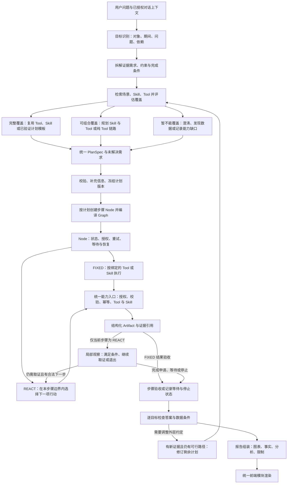

# 投放分析 Agent：场景、Plan、Skill、Tool 与 Graph 架构方案

状态：**P0 组件验证完成，P1 实施中，P2–P5 待实现**。日期：2026-09-19。设计审查基线：`6c93bd9`（PR #61 后）。实施跟踪 [Issue #62](https://github.com/Jupiter363/shortlink/issues/62)，实际完成范围见 [首批 P0 验证](../integration/campaign-plan-p0-2026-09-19.md)与[续接补充验收](../integration/campaign-plan-p0-recovery-2026-09-19.md)；下文是目标架构，不代表全部能力已上线。

P1 分批进度：[独立恢复协议](../integration/campaign-plan-p1-recovery-2026-09-19.md)、[耐久账本与原生计划扫描](../integration/campaign-plan-p1-ledger-2026-09-19.md)已合并；[步骤输出与持久化 Graph 驱动](../integration/campaign-plan-p1-steps-2026-09-19.md)接入冻结输入、具名输出和 FIXED 执行器边界。整体 P1 与生产运行入口尚未完成。

已确认的架构方向：**外层 Plan 管目标和依赖，局部按需探索。** 具体实施顺序见[实施计划](campaign-agent-architecture-2026-09-19/implementation-plan.md)，图运行与恢复边界见[Graph 适配方案](campaign-agent-architecture-2026-09-19/graph-adaptation.md)，两种执行策略的组合见[混合计划示例](campaign-agent-architecture-2026-09-19/example-hybrid-plan.json)。

补充决策：**优先复用 Spring AI Alibaba 1.1.2.3 已封装能力。** 原生能力与项目适配的边界见[框架复用清单](campaign-agent-architecture-2026-09-19/framework-reuse.md)；实施前需关闭的风险见[风险审查](campaign-agent-architecture-2026-09-19/risk-review.md)。LocalExplorer 是薄适配器，不另建 ReAct 引擎；Skill 加载沿用原生 Registry／Hook，不建设自定义工作流语言。

风险优化已落实为[处理协议](campaign-agent-architecture-2026-09-19/risk-controls.md)：规范工具消息修复、只找回不创建的提交恢复、任务复用与取消的 CAS、分页完整性、历史／复用读取分离以及逐目标验收。两份计划示例补齐具名 requirements 和拟议检查器；这些是待实现合同，不表示运行风险已经消除。

[第二轮风险审查](campaign-agent-architecture-2026-09-19/risk-review-round2.md)的 7 项问题已落实到合同、示例和实施门槛。方案冻结时全部为 `SPECIFIED / NOT_STARTED / NOT_RUN`；随 PR 按实际测试逐项更新证据，不能因开始实现就宣称风险已经消除。

本轮收敛为以下设计选择，均在现有服务和原生 Graph／ReactAgent 上补业务边界：

| 问题 | 选定方案 | 前置阶段 |
| --- | --- | --- |
| 恢复经过旧代理可能变成新提交 | Admin、Analytics 双端独立 recover-existing，强制只找回；不支持协议就阻断，不回退创建 | P1 |
| 各期间分析对象漂移 | 固定成员与确定性分片；Admin 重授权指定集合，返回专属范围证明 | P1 定合同、P2 落地 |
| 恢复复合 Tool 重查同步结果 | 所有子查询登记身份；同步 READY 也保存耐久 Artifact，恢复仅推进未完成项 | P1 |
| 超时后回调仍继续 | 原生取消＋每次真实请求派发门控；未决时先对账，禁止下一模型替代调用 | P0 验证、P3 集成 |
| 算完但没有交付目标 | 事实初评→组装报告→逐目标检查实际结果／解释可达，再发布完成状态 | P0 定合同、P5 落地 |
| 完成任务占满保留名额 | 活动执行／结果载荷／恢复身份分账；耐久接收后受控释放结果，保留幂等身份 | P1 定合同、P2 落地 |
| 多 Run 叠加内存峰值 | 活跃推进、模型与大结果准入；高上限按后端容量测量配置，排队只存短引用 | P0 验证、P3 集成 |

## 1. 核心决策

采用「意图与目标识别 → 能力覆盖评估 → 复用或组合规划 → 统一 Plan → Node 执行 → 结构化结果 → 图文报告」架构。保留现有统计工具、授权链路与 Graph 基础设施，在 Agent Service 内增量实现，不增加独立编排服务。

修订：复杂单意图不强制匹配 Skill。单／复合意图区分目标数量，不能决定执行路径；是否需要规划、怎样复用，取决于已登记能力能否满足目标、约束与证据要求。

用户提出的方向成立，需要把粒度明确为：

- **一次请求形成一份 Plan；Plan 内每个 PlanStep 对应一个执行 Node。** 固定步骤绑定一个 Tool 或 Skill；探索步骤绑定已批准的局部探索策略，其内部每次行动仍调用已登记的 Tool 或 Skill。
- **整个 Plan 可以作为外层对话处理流程的一个子图。** 因而在外层看是 `execute_plan` 节点，在内部看是一组步骤节点；不能把这两种粒度混为一谈。
- **Session 管理多轮对话及结果关联，Run 管理一次执行，Graph 管理该次计划的运行。** 不把每轮新节点永久追加到同一个共享 `CompiledGraph`。
- **所有请求都评估能力覆盖并生成 PlanSpec。** 可由单个 Tool／Skill 满足时直接构造计划；部分覆盖时组合 Skill 与 Tool；没有合适 Skill 时可规划纯 Tool 链路。复杂单意图与复合意图均可生成多步骤计划，使用同一个执行与恢复机制。
- **PlanSpec 是任务记录，FIXED／REACT 是步骤执行策略，TOOL／SKILL 是能力类型。** 意图识别提供目标；Planner 结合能力覆盖和路径不确定性分配步骤策略，不对整场对话一次性二选一。
- 场景是可复用分析方法的入口，Node 是运行载体；二者不要求与自然语言意图一一对应。前端根据统一报告协议渲染，不按意图写不同页面。

## 2. 六个概念的边界

| 概念 | 负责什么 | 例子 | 不承担什么 |
| --- | --- | --- | --- |
| Goal／意图 | 用户想得到的答案、对象、期间、完成条件 | 找出下滑最大的短链并解释变化 | 不直接决定页面或执行状态 |
| Scenario／场景目录 | 提供可复用方案及其适用条件，辅助 Planner 查找候选能力 | 两期变化分析、维度结构分析 | 不成为封闭路由表，不以未命中场景判定无法分析 |
| Plan／PlanStep | 这次的目标、依赖、步骤策略、执行边界和结果绑定 | 先筛选短链，在局部探索变化，再综合证据 | 不提前虚构尚未知道的全部工具调用，不包含任意代码或 SQL |
| Skill | 可复用的分析方法、工具组合及结果合同 | 两期数据对齐、可比性检查、差异解释 | Markdown 本身不保证步骤执行或权限正确 |
| Tool | 应用层可调用的原子能力 | `compare_statistics`、`rank_short_links`、维度查询 | 不承担跨场景任务规划 |
| Node／Graph | Node 包装一次步骤执行；Graph 管理顺序、依赖与运行进度 | `step_1` 执行某版本 Skill，等待任务后续接 | 不重复实现业务算法，不自动赋予工具正确性 |

Tool 的「原子」以应用接口为边界：当前工具内部已有分页、快照校验、指标计算，仍可作为一个 Tool，不必拆成每个 HTTP 请求一个节点。Node 的价值是统一状态、输入输出、恢复、重试和追踪；没有这些需求时，一层无行为包装没有价值。

## 3. 总体流程

下图是 Agent Service 内部的逻辑流程，不是新增服务部署图。



这张图表达控制流程。外层每个计划版本仍为冻结的有向无环图，局部 ReAct 循环由步骤运行器管理并逐行动持久化。只改变本步骤约定内的工具选择时不创建新 Plan revision；需要改变外层依赖、范围或结果合同时才由外层重新规划。执行中遇到等待或信息不足，持久化进度并返回真实状态，不在节点内无限轮询。没有可执行路径的目标保留在计划与报告中，不生成一个不存在的执行器凑数。

### 3.1 意图识别与规划

意图识别输出的是**目标集合**，不是从几个标签中强行选一个。例如「看两周变化，找下降最多的链接，再解释来源变化」至少包含三个目标，且第二、三个目标存在输入依赖。

1. 保留用户原始问题及目标对应的原文片段，解析对象、指标、期间、过滤条件、时区和交付要求。
2. 把每个目标拆成所需事实、方法与约束，再检索场景、Skill 和 Tool。意图标签只辅助检索，不把请求锁死到某个 Skill；一个目标也可能需要多个 Skill／Tool。
3. 明确请求由确定性规则快速生成计划；存在未覆盖需求、探索分支或跨能力依赖时，由 Planner 提出结构化候选计划，再由后端校验。即使只有一个意图，也适用这种规划；简单请求无需为形式完整而触发复杂模型规划。
4. 歧义只影响相关目标：无法确认分组时请求补充；独立且信息完整的目标仍可推进。不能把未确认的目标默认为已经回答。
5. 没有现成 Skill，但可由已登记 Tool／Skill 合法组合实现时，Planner 可以组合；缺少数据或能力时明确记录未支持原因。没有花费、转化等数据，就不能声称完成 ROI／转化归因。

Goal 的完成条件应写成「指定两期、所有候选短链、按 PV 绝对下降排序，说明无法比较的对象」，而不是「生成一张排名卡片」。规划阶段验证目标覆盖，报告阶段再次逐目标验证；这能暴露遗漏，但不声称意图识别永远无误。

### 3.2 按能力覆盖路由，而不是按意图数量路由

| 覆盖情况 | 规划方式 | 不得省略的检查 |
| --- | --- | --- |
| 一个 Tool 或 Skill 完整满足需求 | 直接生成一步 Plan；必要时复用已验证的计划模板 | 对象、期间、过滤、指标、粒度、输出证据与前置条件均匹配 |
| Skill 只覆盖一部分 | 保留其有效输出，用其他 Skill／Tool 补足剩余需求 | 明确已覆盖与未覆盖条件；不能让名称相似代替能力匹配 |
| 没有合适 Skill，但底层能力可组合实现 | Planner 创建临时的纯 Tool 或混合 Plan | 每一步都有已登记执行器、可绑定的输出与实际数据来源 |
| 能否完成取决于尚未查询的事实 | 先规划必要的数据发现／验证步骤，取得结果后再规划剩余部分 | 发现步骤本身必须是现有能力；保留原始目标与质量要求 |
| 缺少用户输入 | 仅对必要信息澄清，其他可执行目标继续 | 不擅自选择会改变结论的对象、期间或业务定义 |
| 所需数据或算法确实不存在 | 交付有证据的部分，明确缺口及完成它所需的能力 | 未命中 Skill 不等于不支持；确认 Tool 及其合法组合也无法满足后才认定能力缺口 |

“完整覆盖”是候选计划对需求的覆盖判断，不是运行成功或报告完成状态。查询失败、数据缺失等仍由运行后的证据检查判定。能力检索的前几个候选未命中时，应按尚未覆盖的需求扩大检索，不凭一次相似度排序就宣布 UNSUPPORTED。如果只是 Planner 暂未生成合法组合、尚不能证明能力缺失，记录 `PLANNING_UNRESOLVED`；没有可交付答案时目标暂为 UNAVAILABLE，有部分答案时为 PARTIAL，不把规划失败误报为系统确定不支持。

能力目录除了名称与说明，还需登记支持的对象类型、指标、维度组合、过滤条件、期间语义、输入输出合同、数据源、质量前提和适用限制。例如普通排名、变化排名、过滤后的排名是三个不同能力要求；即使都被识别为“排名意图”，也不能互相替代。

一个 Skill 未开放内部中间结果时，Planner 只能使用其公开输出；需要其他粒度的数据时，改用已登记的更小 Skill／Tool 组合。不能临时修改 Skill 内部步骤、跳过完整性校验，或让模型虚构缺少的输出端口。

### 3.3 单个复杂目标也可以探索和重新规划

例如「解释这次投放访问为何下滑」是一个业务目标，但可能需要先确认两期可比、定位下降对象，再判断应当分析来源、地域还是设备。没有一份预制 Skill 覆盖全部情况时：

1. 先查询支撑该目标的必要证据，如整体变化和覆盖状况。已有匹配 Skill 可复用，没有则组合现有 Tool。
2. 根据结果选择下一项最能补足证据的查询。分支选择记录依据，避免把全部统计维度无差别查询一遍。
3. 新 Artifact 先进入本步骤的局部观察，在批准的范围与能力内继续选择行动；只有后续依赖或步骤合同需要改变时才提交外层重新规划，保留已验证结果而不重跑已完成取数。
4. 达到完成条件后交付。证据只能支持“变化集中在哪里”时，明确说明原因仍是假设，不把原来的因果问题静默降为分布问题后标记完整回答。

重新规划必须有新证据、新的可用能力或明确的输入变化；单纯换一种提示词重复同一查询不算进展。冻结条件下相同查询复用已有结果，等待任务只恢复任务；没有可执行的新路径时结束当前推进，返回已得结论与剩余缺口。这样覆盖探索型任务，同时避免无限分解和重试。

纯 Tool 计划也能进入公共分析／报告层，模型基于事实生成完整解释，不要求为此先命中一个专属综合 Skill。涉及新的计算方法时，需要已登记的确定性计算 Tool／算子；规划本身不会创造新的算法或数据源。

### 3.4 Skill 库的角色与演进

Skill 是经过验证的可复用方法，可以减少重复规划、统一质量规则；它不应成为系统能力的上限。临时 Plan 可以组合现有能力完成未预设的任务；某类组合反复出现且验证稳定后，再经过开发审查与测试沉淀为新 Skill，不在一次对话中自动发布新的全局能力。

同一目标存在多条可行路径时，先满足覆盖、正确性和质量要求，再比较复用程度、执行成本与时延；不会仅因为某个 Skill 已存在就优先强行套用。单目标与多目标统一采用这套规则，多目标额外处理共享证据、目标间依赖及分别完成的状态。

### 3.5 外层 Plan 与局部 ReAct 的分工

| 层级 | 持有的决定 | 修改边界 |
| --- | --- | --- |
| 外层 Planner／Plan | 用户目标、步骤依赖、固定输入集、步骤输出合同、哪些步骤允许探索、如何判定完成 | 改变这些约定需校验新计划版本；用户目标与口径不得被模型静默降低 |
| 固定步骤 FIXED | 按明确的能力绑定和参数执行 | 普通重试／任务续查保持原步骤和版本 |
| 探索步骤 REACT | 依据新证据选择下一项已批准行动，补足本步骤的证据需求 | 可调整局部取证顺序；不能自行添加外层目标、扩大范围或改输出合同 |
| 公共评估／报告层 | 依据真实产物检查目标完成情况，组合图表与完整解释 | 模型提出完成申请，后端决定状态；不把局部停止当作问题已经回答 |

ReAct 的使用条件是「下一项行动依赖尚未获得的观察」，不等于所有复杂请求都应自由探索。路径明确的任务使用 FIXED；整体阶段明确、局部有不确定性时混用两种步骤。固定条件分支也可由确定性工作流处理，不必全部交给模型。ReAct 所依据的是判断、行动与观察交替的思想；本项目采用的是带类型合同、授权和持久化的应用实现。[ReAct 原论文](https://arxiv.org/abs/2210.03629)

首期不要求领域 Skill 覆盖所有探索需求。通用 `LocalExplorer` 是项目适配层，优先包装 Spring AI Alibaba `ReactAgent` 的已有循环，可以直接调用受控工具；Skill 提供可复用的方法。它不会因为未命中某个业务 Skill 而失效，也不需要临时把整个探索过程伪装成一个未注册 Skill。局部探索不自动增加外层 Node；外层计划变更才建立新版本节点。

## 4. Plan 与 Node 合同

详细合同及完整示例见：[合同说明](campaign-agent-architecture-2026-09-19/contracts.md)、[固定三步骤示例](campaign-agent-architecture-2026-09-19/example-plan.json)、[混合计划示例](campaign-agent-architecture-2026-09-19/example-hybrid-plan.json)。这些是拟议应用协议，不是 Spring AI Alibaba 的原生格式。

| 对象 | 必需信息 |
| --- | --- |
| `PlanSpec` | `planId`、`revision`、`runId`、`inputSetRef`、`goals`、`steps`；输入集固定该版本的范围与期间 |
| `GoalSpec` | `goalId`、`question`、`required`、`acceptance`；问题保留用户原意，范围通过本轮输入或步骤绑定引用；不把执行状态写回不可变定义 |
| `PlanStep` | `stepId`、`goalIds`、`executionMode`、`dependsOn`、`inputBindings`、`parameters`、`outputContractRef`；FIXED 必须含 executor，REACT 必须含 explorationPolicy |
| `StepExecution` | 执行状态、尝试次数、冻结输入摘要、任务引用、输出 Artifact 引用、错误与时间戳 |
| `GoalAssessment` | `goalId`、回答状态、已满足／未满足条件、证据与报告章节引用 |

`executionMode` 为 `FIXED` 或 `REACT`，旧草案省略时按 FIXED 解释。FIXED 的 `executor.kind` 和局部行动中的能力类型仍只有 `TOOL`、`SKILL`；REACT 步骤使用 `explorationPolicy` 固定允许的能力集合与边界，不同时声明一个会被运行时偷偷替换的固定 executor。两者是「怎样执行」和「调用什么」两个维度，不再创建趋势／排名等重复的业务 Node 类型。

输入绑定仅允许三个来源：

- `INPUT`：从当前 PlanSpec 的不可变 `inputSetRef` 读取具名输入，例如范围和两个期间；不读取可被后来对话覆盖的「Run 最新输入」。
- `STEP_OUTPUT`：当前计划上游步骤的命名输出，例如 `step_1.selectedEntities`。
- `ARTIFACT`：经重新授权、兼容性及有效期检查的已有结果。

上游输出是有类型的 Artifact 引用；绑定器解析已登记的字段，不执行任意表达式或 JSONPath。服务端身份来自当前认证上下文，不能由模型在参数里指定用户／租户来覆盖。

编译前至少检查：目标需求由步骤覆盖或以明确缺口保留、执行器与版本存在、输入输出类型匹配、必填参数、引用存在、依赖无环、上游引用有显式依赖、范围权限、期间口径、完成条件与能力匹配。未通过不执行有问题的步骤，也不静默删掉目标。计划附属 `PlanningAssessment` 记录覆盖绑定、剩余缺口和重新规划依据；部分计划可执行独立且输入已满足的步骤，但不宣称拥有完整解决路径。

### 4.1 创建与运行 Graph

保留外层控制流程 `resolve → plan → validate → execute_plan → assess → report`；`execute_plan` 内部根据冻结的 Plan 创建实际 `step_<id>` 节点，随后编译。

- V1 采用稳定拓扑顺序串行推进。Plan 保留真实业务依赖；编译时使用串行控制边，不直接把无依赖节点编成并行分支。后续性能数据证明需要时再引入并行调度。
- 每个步骤节点共用 `PlanStepNodeAdapter`。FIXED 按 `executor.kind` 分派给 Tool／Skill 执行器；REACT 进入 `LocalExplorer`，每个获准行动再经过同一个 Tool／Skill 执行入口。两条路径共用授权、Artifact、等待及幂等实现。
- 步骤处于 `WAITING`／`NEEDS_INPUT` 时保存状态，继续推进输入已齐备的独立步骤；依赖未满足的步骤不调用执行器。没有可运行步骤时结束本次调度并释放线程和锁。领域 Run 仍未完成；框架本次调用结束不能被当成任务全部完成。
- 恢复先对账 Run／Step／Action，再进入同一冻结计划。版本一致的原生 checkpoint 可辅助未完成调用恢复；已经 END 的本次调用由账本重建推进，从 reconcile 入口跳过已提交步骤、续查等待任务。不能把 END 当原生中断点直接 resume，也不能重复提交任务。
- 计划变更后创建新的 revision，重新编译剩余工作。旧图不可原地修改；兼容的已完成结果以 Artifact 显式绑定进新版本。

### 4.2 局部探索协议与升级条件

外层在计划校验时固定探索策略版本、允许的 Tool／Skill 及版本、范围、期间、输入证据、完成条件、输出合同和停止策略。模型只能提出行动；服务端从冻结策略重新检查实际权限及范围，不能相信模型传回的策略字段。

每轮读取必要的 Artifact 与尚未满足条件。ReactAgent 的标准工具调用和最终候选输出，经适配层归一化为 `CALL / COMPLETE / NEEDS_INPUT / REQUEST_REPLAN / NO_PROGRESS`；这些是业务账本协议，不要求框架改用自创的工具调用格式。CALL 带已登记能力引用、类型化输入绑定、简短决策摘要与证据引用；模型不直接修改 Graph、业务状态或完成标记。日志保留可审计的决定与结果，不要求存储完整模型思维过程。

行动先持久化 actionId、冻结参数和幂等键，再执行。结果校验通过后形成不可变 Artifact 并记录观察。局部后续行动以 INPUT／ARTIFACT 绑定读取，不把尚未完成的本步骤当成外层 STEP_OUTPUT；只有步骤输出合同通过验收，才向外层发布具名输出。

| 发生的情况 | 处理方式 |
| --- | --- |
| 在批准范围内从省份查询转向设备验证 | 在同一个 REACT 步骤内继续，保持 Plan revision |
| 工具返回异步任务或临时失败 | 原 action/job 续查或重试，不重新规划以绕过失败 |
| 本步骤已满足合同 | COMPLETE 只是申请；后端验收后发布输出，外层推进依赖步骤 |
| 需要新增后续步骤、改变依赖、能力范围或输出合同 | REQUEST_REPLAN 附证据与缺口，由外层重新评估并校验新 revision |
| 缺少用户必须确认的信息 | NEEDS_INPUT，保留已有证据和进度 |
| 无新增证据、无合法下一步或达到运行策略边界 | 保存停止原因与部分证据；可恢复则保留恢复点，不伪造 SUCCEEDED |

首期局部行动仅串行调用 Tool 或非探索 Skill，不开放嵌套 ReAct／自调用。所有恢复沿用累计行动及消耗记录，不能每次恢复清零；停止策略按任务配置，不在方案中随意设置很低的统一步数，复杂工作优先通过分批推进和异步查询完成。

跨 revision 时原子停用旧版本的推进权。已经提交且与新步骤完全兼容的任务，可以由服务端显式接管并保留原请求、producer 和消费关联；不兼容时重新查询。只更换 revision 不得导致相同在途查询被重复提交，旧回调也不能覆盖新版本状态。

项目固定版本 `1.1.2.3` 的本地 API 已核验支持 `StateGraph.addNode`、边、编译及子图节点；这支持「先构建再编译」，不等于允许运行时修改共享 `CompiledGraph`。不同输入输出合同的子图可通过包装节点适配。[Spring AI Alibaba 子图文档](https://java2ai.com/docs/frameworks/graph-core/examples/subgraph/)

实际适配分为现有控制流程、按计划编译的 PlanGraph，以及 ReactAgent 内部循环（逻辑上称 ExploreGraph）。ControlGraph 是控制职责名称：可沿用当前五节点图逐步改造，不要求新增第三套运行器或独立持久化层。PlanGraph 和 ReactAgent 复用原生执行、节点和 saver；先验证 asNode／原生子图能否满足状态与身份合同，只在必要边界增加薄投影适配。原生语义、等待恢复与专项验收详见[Graph 适配方案](campaign-agent-architecture-2026-09-19/graph-adaptation.md)。

## 5. Skill 怎样封装

Skill 分成「分析方法」与「执行合同」两部分：方法包直接采用框架 SkillRegistry／SkillsAgentHook 和标准 `SKILL.md`，用于发现、按需读取与分析指引；输入输出、工具授权和确定性计算由项目业务能力合同落实。原生 Skill 不等于确定性工作流；仅有说明文档时不能作为 FIXED executor 承诺完成一组调用。[官方 Skills 文档](https://java2ai.com/docs/frameworks/agent-framework/tutorials/skills/)

首期包结构使用框架已有约定：

```text
src/main/resources/skills/dimension-change/
  SKILL.md             分析方法、限制、解释原则
  references/          指标口径与解释示例（按需）
```

首期用 ClasspathSkillRegistry 加载随代码发布、审查过的包，并固定内容摘要／版本；运行恢复不启用自动重载。业务合同通过类型化 Java 定义和现有注册入口附加，不要求另造 manifest 解析器、workflow.json 解释器或第二套技能加载器。只有稳定且确需复用的业务组合才登记为可执行 Skill；确定性组合用普通业务代码或原生 StateGraph 表达。

SkillsAgentHook 的渐进式工具展示只帮助模型发现能力；每次调用仍取当前探索策略与授权范围的交集。read_skill 为只读辅助能力，也需受审核目录和当前版本约束。不能因读取某 Skill 自动获得未批准的 Tool，或在恢复时载入另一版本方法包。细节见[框架复用清单](campaign-agent-architecture-2026-09-19/framework-reuse.md)。

复杂 Skill 可以封装内部工作流或子图；内部工具仍经过同一授权和运行记录入口，内部等待进度也必须持久化。外层看到一个稳定的 Skill 步骤，诊断时可查看其内部调用。模型负责解释、选择允许的分析方向；数据计算、强制前置步骤和任务恢复由代码负责。

建议从少量稳定场景开始：

| 场景 | 可复用方法 | 主要结果 |
| --- | --- | --- |
| 趋势与高峰 | 获取所需粒度，验证覆盖，定位变化点／高峰并解释 | 趋势数据、峰值事实、分析与限制 |
| 两期对象变化 | 对齐对象与期间，验证可比性，计算差值 | 对比事实、不可比原因 |
| 下滑筛选 | 获取两期完整候选，按稳定实体对齐，按明确的下降规则排序 | 被选实体集、筛选证据 |
| 维度变化 | 复用实体集，对指定维度获取两期数据并比较 | 维度差异、未知分类、证据 |
| 证据综合 | 读取已验证事实，整理支持／反证与验证建议 | 解释、假设、后续动作候选 |

不是所有现有 Tool 都要再包一个同名 Skill。仅调用一次排名、没有额外分析步骤的需求，可以直接绑定排名 Tool。Skill 值得存在的条件是它复用了稳定方法、多个操作或重要的解释规则。

框架 Skills 支持按需提供技能说明及工具上下文，但不会替应用完成业务工作流、版本校验或授权。当前投放链路尚未接入该机制；采用框架加载器时，也保留项目自己的执行合同和校验器。[Spring AI Alibaba Skills 文档](https://java2ai.com/docs/frameworks/agent-framework/tutorials/skills/)

## 6. 完整例子：筛选、下钻、综合

用户要求：「比较指定的本期与上期，找出 PV 下降的短链，按下降量排序，再分析这些短链的省份与设备联合变化。」对应两个目标：找出下降对象、解释这些对象的维度变化。

| PlanStep | 绑定 | 依赖／输入 | 输出 |
| --- | --- | --- | --- |
| `select-declines` | `SKILL: decline_selection` | 已授权范围、两个明确期间、PV；返回全部下降对象 | `selectedEntities`、`selectionEvidence` |
| `analyze-dimension-change` | `SKILL: dimension_change` | 上一步对象集合、筛选证据与相同期间；省份 × 设备 | `dimensionChanges` |
| `synthesize-evidence` | `SKILL: evidence_synthesis` | 前两步证据、原始目标与限制 | `analysis`，包含事实引用、假设与验证建议 |

这些是**拟新增 Skill**，不是当前已经注册的能力，也不是唯一允许的执行路径。如果相应查询与计算 Tool 已经具备完整合同，可以先用 Tool 组合完成同一目标，以后再沉淀为 Skill。现有 `rank_short_links` 按单个完整期间的指标值排名，不支持「按下降幅度排名」；即使用户只要下降 Top 3，也不能只取当前期 Top 3 后比较。筛选需要两期候选数据充分覆盖、稳定实体对齐和后端计算；适用数据接口是否完整暴露，需要在实现前补齐。

对象只出现在某一期时先核实创建时间、查询范围和数据缺失，不能直接把另一时期当作零；相对变化遇到基期零值必须有明确的不可计算状态。UV／UIP 不跨重叠对象、日期或维度求和。

如果没有下降对象，第一步可成功输出空集合及证据；第二步不查询统计，发布 `NOT_APPLICABLE` 产物，第三步解释「在本次范围内没有符合条件的对象」。这样必需的输出端口仍可追溯，不会因简单跳过而阻断综合步骤。证据不足造成的空集合必须明确标记，不能冒充没有下降对象。

联合变化需要真实的省份 × 设备统计，不能把两张独立分布表拼成联合结果。Skill 的 `analysis` 仅是有依据的分析内容；逐目标状态判定及最终报告发布由后端公共评估／组装层负责，模型不能直接发布完整报告。

最终报告按问题组织为「两期变化与筛选依据 → 被选短链的维度变化 → 综合解释与验证」，不是三张机械的执行日志卡。多个章节可以引用相同证据；一个章节也可以结合多个步骤。

## 7. 结果复用与上下文续接

新增逻辑上的 `ArtifactStore`：存储类型化结果及其来源，Graph 内仅保存引用和少量进度信息。首期复用已有 MySQL 保存元数据，运行期间可引用现有统计快照／任务；发布报告前耐久保存实际展示的指标、图表／表格载荷和最小证据清单，不能只依赖短期源快照或只保存派生结论。已有耐久 Artifact 直接引用，无需建设新存储服务。期间定义与各查询的快照分开记录，同日期不代表不同查询来自共同冻结数据版本。

Artifact 至少包含类型、Schema 版本、生产步骤和执行器版本、授权范围、期间、过滤条件、指标口径、快照／来源证明、覆盖质量、结果完整性、有效期、数据位置与内容摘要。对象集合、指标表、维度数据、计算事实、分析说明使用不同类型；**模型分析文本不能作为可计算事实输入**。

复用前验证：

1. 当前身份仍能访问这些对象；历史已授权不代表现在仍授权。
2. 目标对象、期间、时区、过滤条件、指标定义、粒度与所需结果一致，或存在显式受支持的转换。
3. 快照、读取范围和完整性足以支撑当前结论。前 50 行样本不能承接全量排名；UV 不能由子集简单拼接。
4. Artifact 未过期且数据仍可读取；不满足时重新查询并产生新引用，不能把新数据偷偷替换进旧报告。

「继续看看设备」优先绑定上一轮已经确认的对象与期间。补充正在等待的必要信息，在同 Run 保存新的输入记录并创建新计划 revision；明确修改尚未完成的原任务也创建新 revision，旧版本停止推进。已经完成后的新请求创建新 Run。「改成上个月」必须重算受影响步骤，不能继续使用旧期间的指标；单纯「继续」恢复等待中的同一 Run。歧义由具体任务状态与目标解析解决。

已有引用、用户选定范围和简短对话信息可进入规划上下文；完整历史报告与所有原始数据不反复塞进提示词。范围解析、证据读取、报告生成分别按需读取数据，保持每轮可追溯。

## 8. 执行状态、恢复与一致性

### 8.1 状态不能混用

步骤状态采用 `PENDING / RUNNING / WAITING / NEEDS_INPUT / SUCCEEDED / FAILED / BLOCKED / SKIPPED / CANCELLED`。

- `PENDING`：尚未运行；正常等待上游调度仍可保持此状态。
- `WAITING`：已经有外部任务引用，等待结果，不能重新提交同一个任务。
- `NEEDS_INPUT`：缺少范围等必要信息。
- `BLOCKED`：依赖无法满足，或局部探索因无进展、策略边界、待外层重新规划而停止推进；区分依赖原因与局部 stopReason，保留证据和恢复点。它不代替已有异步任务的 WAITING。
- `SUCCEEDED`：满足该步骤输出合同；不自动表示数据全覆盖或原因得到证实。
- `SKIPPED`：有已验证的条件使该步骤不适用，保留理由及对目标的影响。

`GoalAssessment.status` 独立采用 `PENDING / ANSWERED / PARTIAL / NEEDS_INPUT / UNSUPPORTED / UNAVAILABLE / CANCELLED`。一份报告可能已回答两个目标、另一个等待查询。报告分别展示执行状态、数据覆盖、解释状态；`ToolResult.success=true` 只证明调用层面成功，不能据此标记完整分析。

如果某 Tool 返回部分数据，仅在步骤输出合同明确允许时输出带限制的可用 Artifact；要求全量排名的步骤不能将其视作已满足。失败只阻断依赖分支，独立目标继续；没有证据的原因不能补写成事实。

### 8.2 持久化与幂等

建议新增以下逻辑记录，物理表名和 DDL 留到实现 PR：

| 记录 | 保存什么 |
| --- | --- |
| Run／Plan 定义与版本 | Session、请求、目标、冻结参数、执行器版本、拓扑摘要、Run 状态 |
| StepExecution | 运行状态、任务引用、尝试记录、输出引用、版本号、恢复位置 |
| Artifact 元数据与必要载荷 | 可复用结果、口径、范围、证据、生命周期 |
| ReportRevision | 目标完成情况、章节块、Artifact 清单、完整性及报告版本 |

以业务步骤账本为完成依据，原生 Graph checkpoint 用于运行恢复；不能只看 checkpoint 的 `FINISHED` 判断业务完成。先持久化可读取的 Artifact，再以事务／CAS 提交步骤结果；checkpoint 落后时依据账本跳过已完成步骤。崩溃留下未绑定 Artifact 可回收，不能留下「成功但结果不可读」的正常状态。

同一逻辑工具调用在首次提交前生成并保存稳定幂等键，内部多次工具调用分别带稳定的调用标识；超时重试／恢复沿用该键，新的分析或明确刷新生成新键。已拿到 `jobId` 则继续查该任务；提交成功但响应丢失时，应通过幂等协议定位原任务。不能宣称跨 HTTP 和数据库天然 exactly-once。

无 jobId 的未知提交只能经过 Agent→Admin→Analytics 独立恢复入口；同步结果同样保存 childCallId 与耐久 Artifact，不因其他子项等待而重取。未决超时、尚未受理的容量拒绝使用 BLOCKED 与具体原因，不能伪装成已有 job 的 WAITING。每次真实子请求都重新取得运行资格，晚到回调仅记原事实。

当前本地锁仅保证单 JVM 协调。首个可用版本必须明确单实例写入约束；要支持多实例或后台恢复任务竞争，需增加 Session／Run 执行租约、fencing token 与步骤状态 CAS，防止旧持有者在租约失效后提交结果。

### 8.3 标识、版本和资源使用

区分 `sessionId / runId / planId / revision / stepId / nativeThreadId`。保留用户、租户及授权版本隔离；逻辑 threadId 使用包含这些隔离因子、图层级和执行版本的规范化输入生成确定性 UUID，沿用现有稳定命名。核验显示 MysqlSaver 将该逻辑值写入 thread_name（255 字符），物理 thread_id（36 字符）另由 saver 生成，二者不能混淆。

恢复必须匹配图拓扑、执行器、合同版本和序列化版本。无法加载旧版本时明确迁移或重建新计划并重新检查 Artifact；不能用新执行器悄悄解释旧 checkpoint。

此前内存问题与重复保留大体积来源元数据有关。新设计的数据只存一份，节点和 checkpoint 保存引用；不把每步表格、整份报告、历史响应拷贝进共享 Graph 状态。编译图缓存需要容量控制，数据读取支持分页／流式处理，大查询复用现有异步任务机制。

单次请求有界之外，还需进程级活跃推进／模型／大结果准入和多 Run 组合峰值验收。许可按实际工作结束归还，不能在包装 Future 超时而 callback 尚存活时提前释放。远端任务完成不自动腾出保留名额；将执行、结果和恢复身份分账，耐久接收后受控释放结果页。两类容量均按实际测量配置较高上限，保留完整分析，耗尽时给出可恢复条件。

执行步数与总时长保护用于发现异常循环、引导分批续接，不用任意低阈值裁掉用户目标或分析内容。当前共享递归上限 16 不能直接套用于动态计划，应根据经校验的拓扑为投放图配置执行边界，保持风险 Agent 的原有配置。模型单次输出容量不足时按章节续生成并标记未完成；静默截断不属于成功。

## 9. 输出协议与前端呈现

采用 **Schema 驱动的图文分析报告**，沿用轻量木星卡通品牌。前端有有限的通用模块，报告内容与模块顺序按本次目标组合；不建立「每种意图一张专属页面」的绑定。

### 9.1 模型输出和最终报告分层

1. 后端生成事实／数据／限制／可用动作目录，带稳定引用。
2. 模型输出有类型的章节建议、分段分析、观察解释、假设和引用关系；不负责重新抄写数值序列或认定查询已经完成。
3. 后端执行 JSON Schema 校验、引用与范围检查、已知事实一致性检查，再合并数值、图表数据、状态和强制限制，生成最终 `CampaignReport`。
4. 引用正确不等于自由文本的因果解释正确。观察与假设分开，假设标注待验证并附验证路径；模型输出失败时保留可用数据与确定性事实，明确解释未完成。

外层 `GoalAssessor` 是目标状态的唯一权威，在成功、等待、失败，以及只有 Tool、没有综合 Skill 的计划中都要运行。`evidence_synthesis` 被阻断不妨碍后端发布已完成部分与未完成原因；所有路径均经过同一个报告组装器。

Goal 与步骤、报告章节是多对多关系。`ReportSection` 包含 `sectionId / goalIds / title / blocks / evidenceArtifactIds / limitations`；后端检查每个目标是否得到回答、部分回答或明确缺失原因，不能以章节数量当作完成标准。执行器收到的可信 `ExecutionContext.goalSpecs` 由服务端从冻结计划按 `goalIds` 提供，模型参数不能修改这些完成条件。

最终完成状态在报告草稿组装后确定：每个 ANSWERED 目标都须有可读的结果块或同版本的授权完整结果入口，需要解释时同时有数据关联的分析。只列 goalIds 或存在后台 Artifact 不算交付；删除某个目标的结果入口必须使该目标无法通过。完整长表可以分页，不为通过校验强加重复文字。公共发布规则与两份示例中的 DELIVERY 条件共同保证这一点。

### 9.2 通用块与阅读顺序

| Block 类型 | 展示 | 内容职责 |
| --- | --- | --- |
| `narrative` | 分段文本、观察／假设标记 | 完整论证与解释；可以在多个位置重复出现 |
| `metrics` | 紧凑指标带 | 后端事实引用，数值、单位与比较有效性 |
| `chart` | 趋势、分组柱形、排名条形、热力图等白名单图表 | 数据集引用；前端控制实际绘制与尺寸 |
| `table` | 对比／明细表、分页 | 结构化列与结果引用；说明是否完整 |
| `callout` | 关键限制、反证、需补充信息 | 必须注意的结论条件，不能只藏在悬停中 |
| `actions` | 继续下钻、验证假设、调整范围 | 已登记的分析动作；点击形成新的请求／续接 |

一个章节可以是「发现 → 图表 → 两段解释 → 对比表 → 原因假设 → 验证建议」，另一个章节可以只有文字与证据。**保留分析深度，不固定只允许一句结论、两张卡或五个发现。** 大数据表分页属于展示优化，不代表分析只能使用第一页。

桌面宽度允许时将直接相关的图表和解释并排，窄屏按论证顺序纵向排列；正文随内容增长，不通过固定高度裁切。卡通元素集中在报告引导和状态，不侵入图表。数据与执行入口留在报告模块内；执行日志是诊断视图，不作为报告正文。

涉及缺失、样本、过期、未完成期间等影响结论的限制常显；纯口径解释放标题问号。等待目标可显示进度，其余已完成章节正常可读。旧响应可以继续走旧渲染器，新协议按 `schemaVersion` 分派；未知模块应显示兼容提示和可用文本，不导致整份报告空白。

页面、历史、复制与导出绑定同一 `reportId + revision + artifactManifest`。新进展创建新 revision；加载历史或导出时不重新生成解释、替换范围或取最新数据。若数据已过期而无法重现，要明确标记，不伪装成原始完整报告。

早期[输出视觉草案](campaign-report-schema-2026-09-19.md)和[效果图](../design/campaign-report-2026-09-19.png)继续作为品牌参考；其中固定数量短卡、短文本 Schema 已被本方案的可重复章节协议取代，不能作为生产验收合同。完整报告 JSON Schema 在合同评审后另行版本化落实。

## 10. 对当前实现的迁移

| 当前实现 | 缺口 | 迁移方式 |
| --- | --- | --- |
| `CampaignAnalysisPlanner.Plan` 是 `Invocation` 列表 | 无步骤身份、依赖、类型绑定、计划版本 | 先适配为 PlanSpec；保留范围和日期解析，逐步替换规划 |
| Graph 构造期固定五节点，工具在单节点循环 | 无每一步的 Node 恢复边界 | 引入冻结计划子图与通用步骤适配器 |
| ToolRegistry 已有统计、对比、排名和下钻能力 | 无 Skill 执行合同与加载 | Tool 适配器先落地，再增加少量有组合价值的 Skill |
| PENDING 返回说明但最终保存 FINISHED | 框架结束与业务等待混淆 | 新增 Run／Step 状态与等待恢复、稳定任务引用 |
| 会话保存选择与 job/page 引用 | 无通用结构化结果复用 | 先引入 Artifact 引用和生命周期，再跨轮绑定 |
| JVM 内锁、checkpoint 更新无版本 CAS | 多实例竞争无持久化防护 | 单写者约束起步；多实例前补租约与 CAS |
| `answer` 为主，其他输出是宽泛对象列表 | 无统一章节与完成情况合同 | 为投放响应新增版本化 report 字段，保留旧 answer 兼容 |

主要代码入口：

- [当前 Planner](../../services/agent-service/src/main/java/com/jupiter/shortlink/agent/campaignanalysisagent/graph/CampaignAnalysisPlanner.java)
- [当前投放 Graph 执行器](../../services/agent-service/src/main/java/com/jupiter/shortlink/agent/campaignanalysisagent/graph/DefaultCampaignAnalysisGraphExecutor.java)
- [统计 Tools](../../services/agent-service/src/main/java/com/jupiter/shortlink/agent/tool/shortlink/CampaignStatisticsTools.java)
- [原生线程标识](../../services/agent-service/src/main/java/com/jupiter/shortlink/agent/harness/checkpoint/AgentGraphThreadKeyFactory.java)、[执行协调](../../services/agent-service/src/main/java/com/jupiter/shortlink/agent/harness/checkpoint/GraphSessionExecutionCoordinator.java)、[checkpoint 存储](../../services/agent-service/src/main/java/com/jupiter/shortlink/agent/infrastructure/persistence/JdbcGraphCheckpointStore.java)
- [当前报告组件](../../frontend/console-vue/src/relay/components/AgentReport.vue)、[结果详情](../../frontend/console-vue/src/relay/components/AgentResultDetails.vue)、[报告模型](../../frontend/console-vue/src/relay/domain/agentModel.js)、[历史和导出](../../frontend/console-vue/src/relay/domain/agentWorkspace.js)

在 `campaignanalysisagent` 内按职责增加 `planning / runtime / skills / artifact / report` 包即可，暂不抽一个通用平台或拆新微服务。风险 Agent 保持现有执行方式，只有已证明通用的基础合同以后再共享。

兼容开关在开始执行前选择旧／新路径；一旦新路径已提交查询，失败恢复应继续该 Run，不能静默切回旧路径重复执行。历史旧结果继续可读，不强制迁移成伪造的新协议报告。

## 11. 分阶段落地与验收

| 阶段 | 交付与验收边界 |
| --- | --- |
| P0：框架验证与合同 | 验证原生等待／未决超时门控、配对、首次 checkpoint、节点隔离和多 Run 准入；冻结范围与逐目标交付合同 |
| P1：外层运行底座 | PlanGraph、所有同步／异步 child 账本、Artifact、Admin→Analytics 独立恢复与结构化错误，不重做原生 checkpoint |
| P2：成熟能力与 Skill | 先落地冻结范围／分片、容量分账和结果释放，再以原生 Skill 方法包及类型化业务组合承载确定性分析，无通用 Runner／DSL |
| P3：局部 ReAct | 集成已验证 ReactAgent 扩展点、每次派发门控和进程准入；覆盖忽略取消回调、重复恢复与多 Run 峰值 |
| P4：混合规划与续接 | 能力与不确定性评估、FIXED／REACT 混合计划、外层重新规划、跨轮复用和在途任务接管 |
| P5：完整报告 | 后端事实初评与最终交付验收、Schema 图文报告、历史／导出同版本；前端实现与视觉验收另列后续阶段 |

后端验收至少覆盖：

1. 单 Tool、单 Skill、多目标均进入统一 Plan；同一 Skill 多次使用有独立步骤与输入。
2. 上游筛选的实体集被下游精确使用，无重新猜测对象；未覆盖目标明确暴露。
3. 环、缺失依赖、未知版本、跨范围 Artifact、错误类型绑定均在执行前被拒绝。
4. 两期下降筛选覆盖完整候选，零基期／新对象／未知值有明确语义，UV 不被错误累加。
5. 异步查询等待后释放资源，进程重启可续接；同一步重试不重复提交，已完成步骤不重跑。
6. 模拟提交响应丢失、Artifact 落库后宕机、checkpoint 滞后、租约过期，验证幂等与状态一致性。
7. 一个目标失败时独立目标仍可完成，空结果、未知、失败、等待和取消不混用。
8. 修改期间或撤销权限后不能复用不兼容结果；同范围续问可复用有效冻结证据。
9. 报告支持多个图文章节、重复块与完整论证；模型无效 JSON／错误引用只能降级解释，不能污染数据事实。
10. Graph 状态大小主要随步骤与引用数量增长，不随每份原始表格的复制倍增；分页结果与模型样本的完整性标识保持一致。
11. 相同复杂单目标分别验证 Skill 完整覆盖、仅部分覆盖、完全未命中三种情况；底层能力足够时都能形成可执行计划。
12. 相似名称但不支持所需过滤／联合维度／期间语义的 Skill 不得被误判为完整匹配；查询失败不得触发偷偷降低原始要求的替代方案。
13. 证据不足时能为剩余需求创建新 revision，复用已有 Artifact；没有新信息的等价计划不得无限循环，已有异步任务不重复提交。
14. 必需能力确实缺失时仍呈现已完成分析与具体 gap；没有综合 Skill 的纯 Tool 计划也能进入公共解释和图文报告层。
15. 同一意图在输入及路径不确定性不同的情况下可选择 FIXED 或 REACT；模式不会按意图标签或目标数量硬编码。
16. 局部连续行动、工具重试和异步恢复不增加 Plan revision；超出步骤约定的请求必须先通过外层校验，不能直接修改运行图。
17. 模型越权行动、错误输入、伪造 COMPLETE、重复无进展调用被拦截；停止仍保留证据，续接不清空累计记录。
18. 新 revision 显式接管兼容的在途任务，不因逻辑步骤标识变化再次提交；旧回调不能发布到新状态。

实现期遵循当前授权：只运行适当的后端单元／组件测试，使用工具与存储替身；不启动 Docker，不用内置浏览器验收。不能因此声称完成真实数据库、异步统计链路或视觉验证，需在各 PR 明确未验证边界。

按 P0–P5 顺序交付，PR 边界、对应文件与后端验收详见[实施计划](campaign-agent-architecture-2026-09-19/implementation-plan.md)。当前确认的是架构方向与实施计划；示例和验收清单不代表业务功能已经实现。
