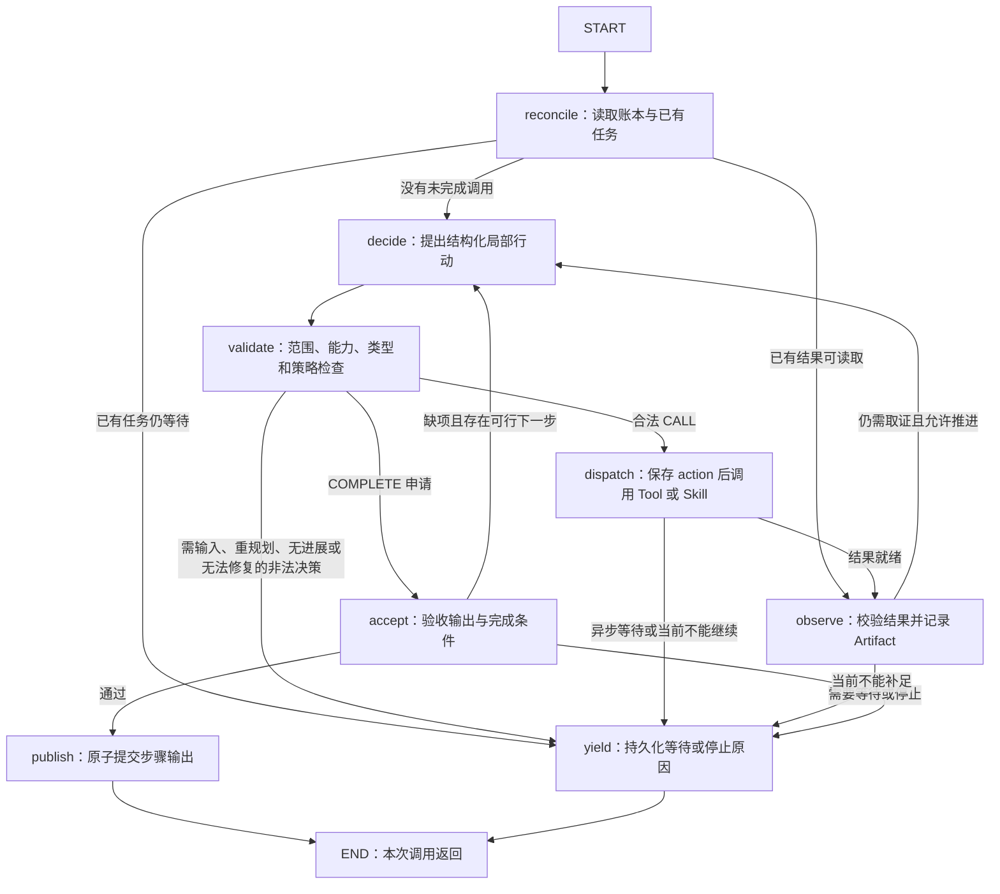

# Plan 与局部 ReAct 的 Graph 适配方案

状态：**P0 局部组件已实现，业务运行与恢复待接入**，2026-09-19。本附件对照项目源码与本地 `spring-ai-alibaba-graph-core:1.1.2.3` API／字节码制定；实际原生组件测试与未覆盖边界见 [P0 后端验证](../../integration/campaign-plan-p0-2026-09-19.md)，没有启动服务或 Docker。

关联：[主架构](../campaign-agent-architecture-2026-09-19.md)、[实施顺序](implementation-plan.md)、[合同](contracts.md)、[混合计划](example-hybrid-plan.json)、[框架复用清单](framework-reuse.md)、[风险审查](risk-review.md)。

风险细化后的接纳、消息修复、提交恢复与取消协议见[风险处理协议](risk-controls.md)；原生 Hook 的组合行为按 P0 测试逐项验收，不能等同于生产恢复链路已完成。

实现选择：**局部探索优先复用当前框架的 ReactAgent，由 LocalExplorer 提供项目适配。** 本文 ExploreGraph 指这部分内部循环的逻辑职责，不要求重新手写一套模型／工具循环。只有外层任务需要新增或调整步骤时，才生成新 Plan revision 并编译对应节点。

## 1. 适配结论

采用**现有控制流程 + 原生 PlanGraph + ReactAgent**。三层表示职责，不要求新增三个 CompiledGraph 或三个持久化系统；控制层可沿用既有五节点图改造，也可由现有服务顺序调用。首个纵向切片优先直接复用原生节点与扩展点，项目只补领域状态和必要的输入输出适配。

| 层级 | Graph 的形态 | 节点职责 | 生命周期 |
| --- | --- | --- | --- |
| 控制流程／ControlGraph | 复用现有流程，不强制增加一层编译图 | 解析目标、规划、校验、推进计划、评估目标、组装响应 | 若保留原生控制图，其运行身份按 Run／本次推进隔离 |
| PlanGraph | 从冻结 PlanSpec 生成并编译 | 每个 PlanStep 对应真实步骤 Node；执行 FIXED 或 REACT | 每个 planId + revision 对应不可变拓扑 |
| ExploreGraph／ReactAgent 内部图 | 复用 ReactAgent 的模型／工具循环，由 LocalExplorer 包装 | 框架驱动模型与工具交替；项目扩展负责对账、校验、验收和业务等待 | 每个探索步骤有独立运行身份；循环不改变外层拓扑 |

Session 是这些 Run／Plan 的业务关联容器，不是无限增长的原生 StateGraph。Graph 负责执行控制与检查点，业务账本负责任务是否完成；不能把这两者合成一个 `FINISHED` 标记。

## 2. 实际框架边界

当前执行器在构造时编译五个节点，多次工具调用在一个节点内循环。它尚未实现 PlanStep 节点化或局部探索图。[当前执行器](../../../services/agent-service/src/main/java/com/jupiter/shortlink/agent/campaignanalysisagent/graph/DefaultCampaignAnalysisGraphExecutor.java)

本地版本已确认 `StateGraph` 支持节点、条件边及编译，也支持传入 StateGraph／CompiledGraph 的子图重载；`CompiledGraph` 没有供应用追加节点和边的公开构建 API。两种子图重载语义不同：StateGraph 子图在编译期内联父图并合并状态策略，CompiledGraph 子图则由独立调用适配器执行，不能统称为自动隔离的子图。因此：

- 动态的是**编译前根据 PlanSpec 选择节点与连接关系**，不是修改正在运行的 CompiledGraph。
- 局部探索动态选择 Tool／Skill，但 ExploreGraph 的判断、执行、观察等基础节点保持固定。
- 计划变更生成新的 revision 和图实例，旧图失去推进资格；通过 Artifact 和任务引用复用结果，不接着使用旧拓扑 checkpoint。

### 2.1 不能直接依赖 native 子图的默认隔离

本地字节码核验发现：`SubCompiledGraphNodeAction.apply` 在父子图共用同一 checkpointSaver 对象时，会把父 threadId 与子图节点标识拼接成子 threadId，例如包含 `_subgraph_` 的派生字符串；并把父 `OverAllState` 传入子图。不能据此宣称父子图天然具有符合项目要求的状态隔离。

需要区分逻辑标识与物理主键：本地 `MysqlSaver` 字节码显示，RunnableConfig.threadId 写入 `thread_name VARCHAR(255)`；物理 `thread_id VARCHAR(36)` 由 saver 自行生成随机 UUID。因此，父标识加后缀超过 36 字符不是已证实故障。项目当前 threadId 工厂的注释混淆了两者，应在 P0／P1 实现时修正文档含义，同时保留既有 UUID 命名的兼容性。[当前 threadId 工厂](../../../services/agent-service/src/main/java/com/jupiter/shortlink/agent/harness/checkpoint/AgentGraphThreadKeyFactory.java)

**首期按最小适配选择挂载方式**：P0 先验证原生 `ReactAgent.asNode(...)`／子图重载、outputKey 和 saver。若父 state 已只含获准引用，原生命名和恢复满足合同，直接复用；否则只在该边界增加投影节点，显式构造 RunnableConfig 后调用原生图，不复制框架调度逻辑。挂载选择须在 P0 冻结，不能同时维护两套行为不一致的生产路径。

本地字节码显示 `asNode` 的 includeContents=false 只移除父 messages，其余 state key 仍可能进入子图；returnReasoningContents=false 主要控制返回父层的内容，不自动裁剪子 checkpoint。它们不是字段白名单或内存隔离保证。待测边界包括输入输出投影、逻辑名称、不同 saver 对象指向同一存储时的冲突与恢复配置，而非假定存在 36 字符逻辑名称限制。

## 3. 外层计划怎样编成节点

PlanSpec 的真实数据依赖保留在 `dependsOn` 与 `inputBindings`。首期执行策略为稳定拓扑顺序的串行扫描，不把独立节点直接编成框架并行分支：

```text
START → step_A → step_B → step_C → plan_exit → END
```

上述控制顺序不表示 B 一定依赖 A。每个步骤 Node 都先读取业务账本，检查实际依赖：

1. 已成功提交且输出可用：返回已记录的引用，不再执行。
2. 存在等待中的 action：续接原任务，不能重新生成同义调用。
3. 依赖未满足：记录 PENDING／BLOCKED 的真实原因，继续扫描后面的独立步骤。
4. 满足输入与权限条件：按 executionMode 进入固定执行或局部探索。
5. 本次没有其他可运行步骤：保存阶段结果，让 ControlGraph 评估并返回，而不是占住线程轮询。

例如 A 等待、B 依赖 A、C 与 A 无关：A 保存 WAITING，B 不调用工具，C 仍能运行。后续推进同一 revision 时从账本恢复，A 完成后 B 才可读取其公开输出，C 已成功则跳过。

每个节点的图标识可以稳定编码 stepId，运行身份则由 runId／planId／revision／stepId 决定。共享缓存里的节点不能捕获上一用户的 mutable scope、principal 或结果表；只保留不可变模板／计划引用，动态数据从本次可信上下文和账本解析。

## 4. 局部 ReAct 怎样编成 Graph

首期优先使用 `ReactAgent.builder()` 构建本步骤的探索实例／模板，允许的能力和边界来自已批准的 explorationPolicy。模型选择调用的工具和参数，框架在既有模型／工具节点间循环，不自动为每次调用扩展外层 PlanGraph，也不接受模型返回任意外层节点名。

本地 `1.1.2.3` 已核验存在：`asNode()`／相关重载、`getStateGraph()`／`getCompiledGraph()`、`call`／`invoke`，以及 builder 的 `tools(ToolCallback...)`、`hooks`、`interceptors`、`saver`、`compileConfig`、`outputType`／`outputSchema` 等入口。节点组合优先验证原生挂载，需要投影时才添加薄包装；API 存在不等于本项目的等待恢复已经验证。

复用边界如下：

| 复用框架 | 项目负责 |
| --- | --- |
| 模型调用、标准 tool_calls、ToolResponse 回传及循环路由 | 限定本步骤的能力与范围，验证参数，分配并持久化 actionId |
| ModelHook／ToolInterceptor 等扩展点 | 接入可信能力入口、Artifact、幂等、审计、无进展与等待门控 |
| 状态、输出配置与 saver 接口 | 业务账本、独立逻辑标识、结果验收、原任务续接及报告状态 |
| 模型给出最终候选回复 | 后端验证输出合同；不把“模型停止调用工具”当作已回答目标 |

以下图表达必须满足的逻辑阶段，实际由 ReactAgent 原生节点、Hooks／Interceptors 和包装层共同承担；不要求与图中名称一一对应地创建手写节点。[官方 Hooks／Interceptors 文档](https://java2ai.com/docs/frameworks/agent-framework/tutorials/hooks/)



重试同一工具调用使用原 action 的新 attempt；是否重试由已批准策略控制，不要求模型重新决定一次同样的 CALL。可修复的格式错误也需有限、可观测的修复规则，不能借 JSON 修复循环反复派发工具。

首期不让探索步骤调用另一个探索步骤或内部会启动探索的 Skill。固定 Skill 可以包含自己的确定性工作流，但每个实际调用仍经过同一 ActionLedger 与授权入口。

### 4.1 ReactAgent 接入的专项门槛

- 为探索使用直接 ChatModel 或独立配置的客户端，不把现有已安装 `BoundedToolCallAdvisor` 的工具循环客户端再套入 ReactAgent，避免两套循环同时执行工具。最终解释节点继续不挂工具。
- Tool 以受控 ToolCallback 暴露，Skill 通过项目适配器暴露为可调用能力；框架可见的 callback 名称映射回已登记的 TOOL／SKILL 版本，不把任意 SKILL.md 当成已可执行工具。
- 本地核验 ReactAgent 的 messages 采用追加策略。ToolInterceptor／业务工具适配器在结果进入框架 messages **之前**保存大载荷并返回有界摘要与 Artifact 引用；不能等下一轮 beforeModel 才首次裁剪，因为中途 saver 可能已持久化。消息 Hook 使用 REPLACE 维护合法配对；逐个 saver 写入点检查体积，不返回完整内部推理内容。
- 框架工具调用归一化为账本中的 CALL；最终结构化候选输出归一化为 COMPLETE／NEEDS_INPUT／REQUEST_REPLAN 等业务决定。LocalAction 是应用协议，不强制 ReactAgent 改用另一种非标准 tool-call 协议。
- `parallelToolExecution(false)` 只关闭并行，顺序模式仍遍历整批 toolCalls。首期通过 afterModel 在任何派发前拒绝多调用批次，记录可观测的协议问题并按批准策略要求重新生成单个调用；整批不得部分执行或静默删掉 B。工具 ID 为空或同批重复也在副作用前拒绝。
- 合法 ID 的拒绝批次为每个 callId 返回唯一标准 `BATCH_REJECTED/executed=false` 响应后，才进入原生消息 Hook 的修复跳转；不能留下未配对的 assistant tool_calls。修复次数跨恢复累计；ID 无法配对时直接协议失败，不猜 ID。
- 普通结果里的 PENDING 不会自动成为 WAITING。每次 ToolInterceptor 进入 handler 前核验运行令牌及 WAITING；结果先持久化 jobId，再将让出标记写入状态。下一模型前通过消息 Hook 与 AgentCommand 的结束跳转退出。采用 invoke 读取状态，不能依赖 call 必然返回最终 AssistantMessage。扩展点名称和先后顺序必须在 P0 用当前版本实测，尚未证明其组合可用。
- AsyncToolCallback 的 Future 不等于业务统计任务：原生工具节点会等待 Future，不能依靠它跨进程持久化暂停。业务 WAITING 走账本对账，不占住 Future 等到统计结束。
- 原生超时也不证明 callback 退出；当前版本可取消 token、清空工具 state updates 后返回普通 error。因此下一模型门控必须读取领域账本与实际 callback 活动状态，未决时禁止模型继续。每个内部 HTTP 派发均重新检查 advanceId／writerEpoch／取消意图；只在 handler 入口检查不足。复用原生可取消接口，旧 callback 晚到仅记事实，不自动发布成功。
- P0 用脚本化模型、内存 saver 和工具替身验证这些边界，P3 再接入持久化实现。当前版本扩展点无法满足某项时，先记录具体缺口，评估框架已有接口／受支持版本；仅替换必要控制点，不默认另建完整 ReAct 引擎，也不带着失败门槛启用。

工具结果的压缩还需前移到 HTTP 读取／JSON 解析边界，覆盖无 Content-Length、大参数、深层 JSON 与错误体；ToolInterceptor 不能消除它收到结果之前的分配峰值。复用现有 HTTP／Jackson 配置与分页，逐页持久化，禁止先收集全量再压缩。账本持久化失败或等待 Hook 异常停止本次推进，不作为普通工具错误交给模型继续派发。

### 4.2 工具消息与异步恢复配对

工具派发前持久化 `agentInvocationId + assistantMessageId + toolCallId ↔ actionId ↔ requestId/请求摘要`；取得或通过幂等重放找回 jobId 后，以条件更新补齐映射，再发布 PENDING 响应。toolCallId 在该 assistant 消息内唯一，不能充当跨轮业务幂等键；actionId、请求身份和真实输入摘要由后端生成。

首期采用一种规范恢复方式：保留原 assistant 调用与唯一 PENDING ToolResponse 配对；原任务 READY 后先发布 Artifact，通过新的受信观察输入提供结果引用，不为原 toolCallId 追加第二条最终 ToolResponse。在下一轮模型开始前，用原生消息 Hook 的 REPLACE 从账本构造合法上下文；必要时可省略已经完整配对的历史组，但不能留下孤立响应。新观察需明确 actionId、jobId、Artifact 及当前状态，模型无需再提交同义调用。

若在提交、账本更新、checkpoint 写入任一点中断，恢复先对账，再补齐唯一配对或构造明确的已完成观察。损坏、重复或无法匹配的消息应停止该次推进并报告错误，不能猜测配对。具体重建实现是业务适配，消息结构与循环继续复用原生框架。

## 5. 状态映射与检查点

### 5.1 每层只携带必要引用

| 状态 | 允许保存的主要内容 | 完整数据的位置 |
| --- | --- | --- |
| ControlState | sessionId、runId、当前 PlanRef、推进标识、目标评估／报告引用 | RunStore、ReportStore |
| PlanState | PlanRef、步骤进度版本、Artifact 输出引用、当前推进结果 | StepExecution、ArtifactStore |
| ExploreState | 所属步骤、策略及局部输入集引用、当前 actionId、决策／观察引用、停止原因 | ActionLedger、ArtifactStore |

身份从可信运行上下文解析并重新授权，不从模型内容恢复。每层输出经独立映射器白名单化；父图不直接 merge 全部子图 state，子图也不继承父图所有表格和历史正文。

ActionLedger 保存决策摘要、实际调用、版本、状态和证据引用，不保存完整模型内部思维。Graph 中的进度采用明确的替换语义；不在循环中无界 append 完整响应或重复来源元数据。未知 state key、序列化不兼容和已失效引用必须可识别，不能静默回退成空数据。

ChildLedger 覆盖 Tool／Skill 内所有同步和异步子查询，记录耐久 resultArtifactRef、可空 jobId、冻结请求和派发资格。它不是更多 Graph Node，也不把子查询表复制进 state。同步 READY 不因另一个 child WAITING 重查；父节点单独归并待办、已提交任务与可用证据。

### 5.2 原生 threadId 与 checkpoint 分开命名

以下为生成确定性 UUID 逻辑名称的规范化输入。UUID 是项目采用的稳定命名策略，不是框架对 RunnableConfig.threadId 的 36 字符硬要求：

| 图 | 原生身份材料 |
| --- | --- |
| ControlGraph（若保留） | trusted scope、sessionId、runId、advanceId、控制图版本 |
| PlanGraph | trusted scope、runId、planId、revision、拓扑／运行器版本 |
| ExploreGraph | trusted scope、runId、planId、revision、stepId、探索图／策略版本 |

trusted scope 延续用户、租户与授权版本隔离。项目显式创建的逻辑名称用规范编码生成确定性 UUID；原生子图派生名称可沿用框架规则，须验证唯一性、长度及恢复映射。只有采用显式投影调用时才单独生成子图逻辑 UUID。原始业务键保存在应用记录中便于追踪；恢复同一执行身份保持映射稳定，新计划版本建立新的检查点链。

控制图的每次推进有独立 advanceId；HTTP 重试通过幂等请求记录找回原推进。Plan／Explore 的逻辑身份不因每次轮询改变。本地 Runner 已核验：仅复用 threadId、未设置恢复标记或 checkpointId 时从 START 初始化；原生 resume/checkpoint 恢复是另外的路径。因此正常 END 后，以账本为准重新初始化本次必要状态，从 reconcile 入口进入，不能误称为自动续跑。不要把前次合并状态里的旧行动决定当作本次新决定。

## 6. 等待与恢复不等于一直占着 Graph

首期选择**显式让出执行 + 领域账本恢复**作为异步统计等待协议，不把长时间等待交给节点内睡眠，也不依赖人工中断 API 自动识别业务 WAITING。

- Graph 本次调用正常 END 只表示本次推进结束；Run／Step 仍可为 WAITING、NEEDS_INPUT 或 BLOCKED。
- 下一次“继续”或获准的恢复调度先检查账本，校验版本和权限，再读取原 jobId；没有完成时继续返回等待。
- 进程崩溃后，native checkpoint 可辅助定位，但账本中的已提交 action／输出必须先对账。checkpoint 领先或落后都不能导致重复提交或覆盖已完成结果。
- 当前 API 存在 interruptBefore／interruptAfter、InterruptableAction、RunnableConfig.Builder.resume()、checkPointId(...) 和 updateState(...)。这些可在后续通过独立测试用于特定交互；不把它们作为首期异步任务正确性的唯一来源，也不把 native END 误当成可以直接 resume 的中断点。

同一个推进周期只由 Run 协调层持有写入资格。包装节点把可信的运行令牌传入子图，不再按子图 threadId 重复获取另一把会话锁，避免异步线程切换或条带锁碰撞造成嵌套等待。对外部统计任务 WAITING 时让出执行，释放这次推进占用的资源。

未决超时记 BLOCKED/EXECUTION_UNRESOLVED；未受理容量不足记 BLOCKED/LOCAL_CAPACITY 或 REMOTE_CAPACITY，两者都不伪造 WAITING job。让出 Graph 不等于旧 callback 停止，其实际在途许可直到真实退出才归还。正常 END 后继续先核对未决调用与原身份；无 jobId 的提交只走 Admin→Analytics 独立 recover-existing，旧协议不可用时阻断。冻结范围／结果释放以[处理协议](risk-controls.md)为准，不由 Graph 自行重新枚举或删除远端任务。

原生 saver、应用 checkpoint 摘要、Run／Step／Action 账本不是自动处于同一事务。发布步骤结果以领域状态事务／CAS 为准，native checkpoint 通过恢复时对账容忍滞后；不声称框架自动提供跨工具调用的 exactly-once。

## 7. 重新规划与图版本

局部行动选择、同一任务等待、普通重试都只更新 ExploreState／ActionLedger。只有本步骤的约定不足以完成目标，才向外层返回 REQUEST_REPLAN。

外层重新规划流程：

1. 读取触发证据、剩余目标和当前版本，构造候选新 Plan。
2. 校验类型、依赖、范围、目标覆盖及策略边界，先持久化不可变定义。
3. 编译新的 PlanGraph，建立 Artifact 复用与兼容在途任务接管关系。
4. 以当前 revision 为条件原子发布新版本及推进权；旧图不再拥有状态提交权限。
5. 后续调用进入新图；旧回调只可记录原任务事实，不能直接更新新步骤或报告状态。

图编译失败时旧版本不会被半途覆盖；范围不兼容的旧任务不能接管。兼容接管保留原任务的请求和幂等身份，不能因为新 revision 生成了新 actionId 就重新发起相同查询。

## 8. 递归边界、缓存和内存

当前两个 Agent 共用图编译工厂，固定上限为 16；这不是新架构下“允许 16 次工具调用”的业务含义。[当前编译配置](../../../services/agent-service/src/main/java/com/jupiter/shortlink/agent/harness/checkpoint/MysqlGraphCompileConfigFactory.java)

为投放 Agent 按实际使用的图角色配置，不全局改大共享常量；控制流程若不是原生图，不另造编译配置：

- ControlGraph：按固定流程配置框架执行保护。
- PlanGraph：按冻结拓扑和一次扫描的节点数量配置，不因业务计划超过旧五节点规模意外失败。
- ExploreGraph：根据一次推进允许的局部迭代及每轮节点转换配置框架保护；业务停止策略与框架保护分别计数，不能等框架异常才落盘进度。

具体数值由实现测试验证，保持对长任务分批推进和异步恢复的支持。业务消耗在 Run 级累计，换推进、换 revision 不清零；探索也不能靠每次重建图绕过停止策略。

缓存仅保存不可变图模板／有限数量的编译图，不能以每个无限增长的 session 永久缓存。完整数据只存 Artifact 一份，各层 checkpoint 保存引用；编译缓存和原生 saver 缓存分别评估，不把已有 provenance 压缩当成全部内存问题的保证。

进程级准入覆盖活跃推进、模型在途和大结果处理；许可在加载大对象前取得，等待只保存短引用。复用有界执行器并防止 CallerRunsPolicy 绕过许可；多 Run 峰值包含解析和序列化副本，按实测配置较高上限。实际执行体未退出时，包装 Future 超时不能提前归还许可；不同 Run 公平恢复，共享风险 Agent 的影响独立验收。

## 9. Graph 专项验收

这些验证纳入实施 PR 的后端测试，不需要启动 Docker：

1. 同一冻结 Plan 得到稳定节点身份；新 revision 有独立图和状态链，CompiledGraph 没有运行中增删节点。
2. FIXED Node 不进入探索回路；REACT 的局部多轮循环不增加外层 PlanStep。
3. A 等待、B 依赖 A、C 独立时，C 可以完成；恢复后 B 得到 A 的正式输出，C 不重跑。
4. 父子图只映射允许字段；在父 state 放入大体积哨兵数据，验证子 checkpoint 没有复制它。
5. 所有 native threadId 长度和映射合法；相同执行可恢复，跨用户、跨步骤、跨图版本不串链。
6. 同 saver 与不同 saver 实例的 native 子图命名／配置继承建立回归用例；包装路径按项目约定隔离名称，核验实际 thread_name 长度及物理主键生成。真实 MySQL 字段行为仍单列待集成验证。
7. 原生 checkpoint 与账本不同步、循环中崩溃、END 后再推进：原 action／job 幂等，已提交输出不重做。
8. native 图结束但业务 WAITING 时响应保持等待；回调和“继续”竞争只产生一个合法状态转移。
9. 超过旧 16 上限所对应规模的合法计划、具有多轮观察的局部循环，在各自编译配置下正确推进；风险图原配置不变。
10. 同一 Run 包装调用两层子图不会重复持锁导致死锁；取消或版本切换后旧运行令牌不能提交。
11. 框架中断恢复机制另做版本化测试，在未证明行为前不作为本计划的关键依赖。
12. ReactAgent 的原生 ToolCallback 循环没有叠加另一套 ToolCallAdvisor；一轮多个 toolCalls、PENDING、工具异常与最终输出分别正确映射到业务账本，不绕过停止门控或重复调用。
13. 多调用批次在派发前拒绝；另注入已有 WAITING 验证防御门控：后续工具与模型真实调用次数均为零。invoke 能返回 WAITING，无最终文本也不误判框架异常。
14. 空／重复 tool_call_id 在派发前失败；分别在提交、账本、checkpoint 边界中断，恢复后模型请求的调用／响应配对唯一且完整、统计提交一次。
15. 每个 saver 写入点都验证有界状态体积；不能只检查最终 state。重复 END→START 不重复追加消息，大结果在首次 checkpoint 前已转为引用。
16. callback 忽略取消、state updates 被超时清空、新旧 writer 重叠：账本门控使额外模型调用与尚未获资格的子请求均为零，晚到事实不能发布取消结果。
17. 多 Run 同时持有慢模型／大结果：在途数量和驻留峰值符合配置，真实 worker 未退出时许可不提前归还，排队无完整载荷。
18. 同步 READY 与异步 WAITING 混合恢复：同步 Artifact 校验和不变且 GET 不重复；父状态不丢等待子项，容量拒绝不伪造 job。
19. 观察中的恶意 label／维度文本仍作为数据，不成为 SystemMessage 指令；受信信封不提升自由文本的权限。

可使用原生 Graph 配合内存 saver／项目存储替身做后端组件测试，脚本化模型控制分支。接口及字节码核验只证明设计依据，不能代替上述运行验证；本次尚未执行这些测试。
