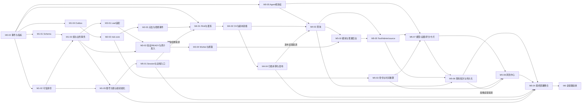

# 生产级重构：开发阶段与任务拆分 v0.7

> 状态：v0.7 实施规范；代码、实际测试与保留边界见 [实施验收记录](04-实施验收记录.md)。压力测试和完整 E2E 按用户要求另行执行。
> 场景：项目仍在开发，目标是开发完成后的首次正式上线；阶段编号表达依赖关系，不代表优先级、工期或人员数量。

导航：[架构总计划](shortlink-production-refactor-v2-apisix-kafka-flink-clickhouse.md) · [验收矩阵与首次上线准备](02-验收矩阵与首次上线准备.md) · [Agent 与异步统计链路重构](03-Agent与异步统计链路重构.md)

## 1. 范围与执行约束

- 网关加固、Kafka 消息队列解耦、号段发号器替代大量 Hash 短码计算，均为已确定的首版必做优化；不以性能测试结果决定是否实施。
- 首次上线保留完整 APISIX、Kafka、Flink、ClickHouse 链路，按高 QPS 生产系统设计。
- 公开跳转从首次上线即由 APISIX 直达 Redirect；Java Gateway 只承接管理 API 的 Redis Session 鉴权。
- 不安排生产切流、在线双轨、旧生产数据迁移，也不建立 G0～G3 过渡路线。
- 首次上线使用新 schema 和空业务库；任何开发库都不得自动删除、清空或覆盖。
- 有价值的开发数据可另建离线导入任务，需指定来源和目标；该任务不阻塞主开发链路。
- 首版业务 MySQL 使用单一 `ds_0`；`t_link` 保留按 `gid` 分表，`t_link_route` 是同库单物理表中的稳定身份与路由事实。
- 现有 `t_group` 保持同一 `ds_0`，Command 按正确分片键访问并仲裁分组写入；首版拒删非空或有在途任务的分组，Admin 的远程预检查不能替代本地事务约束。
- `t_link_route` 以 `link_id` 标识同一条业务短链，以 `domain_norm + short_uri` 的二进制唯一约束注册外部地址；分组变更不得改变 `linkId`。
- 新短码使用固定密钥的 52 位可逆置换与固定 9 位 Base62；M3 内先完成固定步长正确性，再实现有上下界、配置开关与迟滞的动态 step，默认允许关闭；密钥轮换、自定义短码和跨数据库事务后置。
- 发号器采用基于固定 Leaf Segment 源码的内嵌适配，保留号段领取、Current/Next 与预取协调，在其段生命周期内扩展区间分配；不部署独立 Leaf Server，不默认维护两套发号实现。具体上游完整 commit SHA 尚待 M0-04 冻结，本文不表示已选定版本或完成兼容验证。
- 所有租户、域名与发号实例共用 `ds_0.t_id_alloc` 的固定 `biz_tag='shortlink_global'`；命名空间使用固定白名单，不按租户动态建 tag。号段领取使用独立短事务与连接预算，已领取区间不随创建业务事务回滚而重新发放。
- Outbox 中的路由变更只用于失效通知或触发刷新；消费者不得拿迟到事件中的旧路由值覆盖缓存。
- 用户已同意以集群每秒 10 万次跳转作为容量规划假设；该数字不等于首版必须达到的上线承诺。
- 正确性、资源有界和故障可恢复是不可放松的门槛。性能逐档测量并如实报告，实际上线承诺依据测量结果、资源配置和预算在上线前冻结。
- M0 主要冻结正确性、接口契约与测试方法；硬件预算未定、尚未测出当前 QPS 均不阻塞 M1～M5。系统性性能测试集中在 M6。
- Agent 复用上游 `Redirect → Kafka raw → Flink → 派生 Kafka/ClickHouse → Analytics API` 统计结果；普通 Tool 与现有定时风险画像均经过 Admin 授权后有界读取，不建设另一条统计链路、不直连 ClickHouse，也不逐点击调用 Agent。
- 本轮不新增 Agent Kafka consumer、Inbox 或事件驱动画像调度。`risk.signal` 保留为分析信号接口，消费信号不代表 ClickHouse 已可查询；以后使用信号驱动调度须另立契约与任务，不以 Kafka 消费承诺 HTTP 到策略执行的端到端 exactly-once。
- 新增的 `analytics-worker/` 是统计侧生产归档、补算和覆盖发布运行模块，复用现有统计链路；其独立统计控制库保存任务/覆盖/manifest，不属于 Agent 数据库，也不新增 Agent 统计系统。
- 本版共 34 项任务：M0/M1 各 5 项，M2～M4 各 4 项，M5 为 8 项，M6 为 4 项；新增 M1-05，其他任务编号保持稳定。
- 文中 `planned` 表示拟新增路径。路径均相对仓库根目录；任务认领时必须展开为绝对路径。

## 2. 公共文件与路径所有权

| 公共冲突点 | 单一集成人 | 并行任务的规则 |
| --- | --- | --- |
| 根 `pom.xml`、各模块 `pom.xml`、共享版本和依赖 | 主集成人 | 提交依赖变更清单，由集成人合并；禁止自行升级公共依赖 |
| `event-contract/` 的公共字段、序列化和 schema | M0-02 负责人 | 冻结后通过契约变更单调整，生产者和消费者必须同时验收 |
| `admin/src/main/java/com/jupiter/shortlink/admin/dto/req/analytics/`、`admin/src/main/java/com/jupiter/shortlink/admin/dto/resp/analytics/`（planned）及 Agent 统计线协议样例 | M0-05 负责人 | 所有 API 字段与状态语义统一评审；M4/M5 提交契约变更，不复制另一套口径，不让下游直接依赖 Admin 内部实体 |
| `deploy/mysql/001-business-schema.sql`（planned） | M1-01 负责人 | 后续任务提交 DDL 片段；禁止覆盖其他任务的表和索引 |
| `analytics-worker/`、`deploy/mysql/002-analytics-control-schema.sql`（planned） | M4-04 负责人 | 唯一拥有归档/补算/覆盖/发布运行代码、对应测试与独立统计控制库 DDL；模块 POM、application 和 deploy/runtime 交集成人，M4-01～M4-03 不抢写 |
| Leaf 源码与适配来源记录 | M0-04 冻结决策，M3-01 维护模块内记录 | M0-04 在 `decisions/modules-and-build.md` 固定来源与依赖；M3-01 在 `id-generator/UPSTREAM.md`、`id-generator/patches/`（planned）记录引入文件、许可和实际差异，不能擅自换版本；模块 POM 交主集成人 |
| `deploy/mysql/003-agent-analytics-adaptation.sql`（planned） | M5-06 负责人 | 仅 Agent DB 的画像/已有批次、风险中心证据与 long 字段适配；M5-03/M5-07/M5-08 提交字段片段，不增加 Inbox，不改已有开发库 |
| `project/src/main/java/com/jupiter/shortlink/project/service/impl/ShortLinkServiceImpl.java` | 主集成人 | M1-03、M2-04、M3-02 按依赖串行接入；独立逻辑优先提取到新包 |
| `project/src/main/java/com/jupiter/shortlink/project/service/command/` | M1-03 完成后将发号适配文件交 M3-02 | 按文件交接，不并行修改；分组仲裁实现仍归 M1-03，M3-02 只调用既定接口 |
| `scripts/perf/` | M0-03 完成后将公共编排交 M6-02 | 始终排除 M3-04 的 `batch/`；M6 只引用其脚本，变更交 M3-04，不由父目录所有权覆盖子目录 |
| 共享 DTO、错误码、身份协议、域名标准化 | 相应契约负责人 | 禁止通过本地复制另一套定义规避公共修改 |
| `admin/src/main/java/com/jupiter/shortlink/admin/remote/ShortLinkActualRemoteService.java` | 主集成人 | M4-03/M5-02/M5-05 提交精确接口片段；Agent 专用适配优先放 M5-05 的 `remote/analytics/`，不并行改同一接口 |
| `agent-service/src/main/java/com/jupiter/shortlink/agent/riskprofile/service/` | M5-06 负责人 | 统一接入多窗口快照、质量结果和现有批次；M5-05 的 source、M5-07 的 model/detector 先按契约交付，不能直接抢改公共 service |
| `admin/src/main/java/com/jupiter/shortlink/admin/controller/AgentToolInternalController.java` 与 Agent 统计适配包 | M5-05 负责人 | M5-02 仅搬移普通后台模块；所有 Agent 专项文件、契约 DTO 与对应测试均显式排除 |
| Admin GroupService/GroupServiceImpl/GroupController 与 Command `group/` 包 | M1-03 负责人 | 按该任务列出的完整路径修改，M3 调用既定事务接口，M5-02 不接管这些文件；t_group DDL/实体由 M1-01 维护 |
| Admin UserService/Impl/UserController、User DTO/UserDO、`account/` 与注册 Bloom 配置 | M1-05 负责人 | 具体路径见 M1-05；M5-02 排除，001 DDL 交 M1-01；`common/biz/user/` 身份 DTO 仍归 M1-02，Gateway Session 消费归 M5-01 |
| Admin `/tittle` Controller 与 Project UrlTitleController/Service/ServiceImpl | M3-04 负责人 | 与 metadata 共用受限抓取器，具体路径见 M3-04；M5-02 排除，公共远程接口仍由集成人改动 |
| Agent `riskcenter/`、Admin RiskCenter Facade/Controller/AgentRiskRemoteService/CommandRiskRemoteService 及风险专用 DTO、契约测试 | M5-08 负责人 | 与 M5-05 Tool/source、M5-06 画像存储、M5-07 评分模型、M5-03 policy 分离；M5-02 排除这些文件，具体路径见 M5-08 |
| ProfileCandidateLoadNode 与画像 repository 的授权接入 | 节点 M5-07、repository M5-06 | 各改自身精确路径；`securityriskagent/graph/DefaultSecurityRiskGraphExecutor.java`、`SecurityRiskGraphDefinition.java` 的必要接线补丁由主集成人合入，不改通用 harness |
| `deploy/kafka/topics.yaml` 与 `gateway.request` 链路 | M2-03 维护 Topic 配置，主集成人合入公共运行参数 | M0-02 定义事件；M2-02 提供 Redirect 决策，M2-03 生产，M5-01 只改 APISIX 边缘采集配置，M4 各自处理/落库/查询 |
| 各模块 `application*.yaml`、分片配置、部署启动清单 | 主集成人 | 任务只交付所需配置片段，集成人检查端口、凭据与 profile 冲突 |

除任务明确拥有的路径外，其余路径均为只读。下列任务给出代码包和配置文件路径；实际认领时必须列出需要修改的具体文件，已注明公共文件的修改交指定集成人处理。

## 3. M0：范围、指标、契约与基线冻结

阶段目标：冻结业务正确性、接口契约和测试方法，让既定优化可以直接开发；容量假设用于资源规划，不作为开发开工门槛。

### M0-01 首版边界与容量模型

- 依赖：无；以用户确认的首次上线范围为准。
- 拥有：`doc/plan/生产级重构增强/decisions/capacity-and-scope.md`（planned）。
- 任务：以 10 万集群跳转 QPS 规划容量，列清节点规格、热点比例、访问峰谷、事件大小、保留周期、故障余量和预算；单列单条创建 QPS、批量请求 QPS/行数分布及每秒所需 ID 数，跳转 QPS 不等于发号 QPS；计算 Kafka 带宽、ClickHouse 存储、主库回源及号段领取预算。
- 交付与验收：冻结正确性、资源上界、恢复和测量方法；容量表区分规划假设、实测能力及上线承诺，跳转延迟、错误率、统计延迟和禁用传播时限分别记录，承诺值可在 M6 依据实测冻结。
- 禁止：改业务代码、缩减完整技术栈、把 10 万 QPS 假设写成已验证能力。

### M0-02 身份、事件和统计口径契约

- 依赖：M0-01 的业务范围；容量数字尚待确认不阻碍字段设计。
- 拥有：`event-contract/`（planned），`doc/plan/生产级重构增强/decisions/contracts.md`（planned）。
- 任务：冻结 `linkId`、`tenantId`、域名规范、routeVersion、ClickEvent、失效事件、幂等键和 schema 版本；确定事件时间、时区、UV Cookie、IP 标识、迟到与重复处理规则。
- 策略时间契约：允许时间窗交集为空时明确表示拒绝，不能当作无策略；定义 `nextTransitionAt`、未来生效/到期后的有效状态与 revision 规则，边界未获权威确认时为 UNKNOWN。
- 自动命令契约：与 M0-05 冻结可信 tenant/link 身份、`expectedPolicyRevision`、证据 recoveryEpoch/`executeBefore` 及 commandId 内容摘要；M5-03 在提交锁内复核。首次成功的策略集合变更/显式撤销即使有效输出相同也推进资源修订，新命令冲突/过期不得写策略或 Outbox；已提交同 commandId 返回原结果且不再递增。
- 稳定时间基准：作为原始重算输入的 click.raw/gateway.request Topic 均使用受控 Broker 接收时间，锁定 Kafka 版本并验证 `LogAppendTime` 的真实语义；冻结接收时间、timestampType、集群/Topic/partition/offset 身份、时间校验版本与结论的谱系，重算沿用原基准，不能按重算 now 或重投追加时间改判合法集合。客户端/生产者自填时间不能冒充可信接收时间。
- 拒绝事件契约：复用独立 `shortlink.gateway.request.v1` 结果事件 Topic，冻结 source/stage/decisionId、decision/reason、可信资源或 UNRESOLVED、独立去重/采集质量及输入覆盖水位；区分 Redirect 业务拒绝与 APISIX 边缘拒绝，PV 仅取成功 click，未解析事件不得猜测 tenant/link 归属。click raw sourceCut 不能充当 denied 完整证明。
- 统计覆盖契约：冻结原始 Topic 分区半开 offset 向量 sourceCut、归档 manifest、处理版本、隔离结果、recoveryEpoch 及查询副本资格；先限定 cut 内输入再按 eventId 去重，区分原始输入覆盖、处理完成与特定副本查询可见，恢复换代须使旧快照失效。
- 交付与验收：提供有效、重复、缺字段、未知版本及跨日事件样例；定义路由事件和点击事件各自的分区键，禁止将点击分桶规则照搬到路由变更。
- 禁止：依赖其他模块内部实体、重复定义字段、把 `traceId` 当点击事件幂等身份。

### M0-03 基线与负载模型

- 依赖：M0-01 的测量维度、M0-02 的接口和事件样例。
- 拥有：`scripts/perf/`（planned，排除 M3-04 的 `batch/`），`doc/performance/`（planned）；基础脚本完成后按公共冲突表交接 M6-02。
- 任务：准备同步统计、批量创建、favicon 和 Redis 往返的采集方法，可做小规模开发采样；建立暖缓存、冷启动、80% 热点、长尾及批量混合负载脚本，并分别设计单条创建、nextId 与 reserveRanges 的采集维度；系统性 QPS 测试放在 M6，跳转吞吐不充当发号吞吐。
- 交付与验收：脚本和报告模板可重复执行，列出硬件、数据规模、并发、命中率与误差字段；请求端吞吐、服务端吞吐及事件产出量可对照，不要求测出旧链路 QPS 才进入 M1～M5。
- 禁止：以未执行脚本冒充压测证据、借测试清空开发数据库、向未知生产地址发送负载。

### M0-04 模块和构建约束冻结

- 依赖：M0-02 的模块间契约。
- 拥有：`doc/plan/生产级重构增强/decisions/modules-and-build.md`（planned）；公共构建文件仅由主集成人修改。
- 任务：规划 `shortlink-command/`、`shortlink-redirect/`、`shortlink-analytics-api/`、`risk-core/`、`id-generator/`、`analytics-flink/`、`analytics-worker/` 等新模块；核对现有 Java、Spring、ShardingSphere 与目标客户端/连接器的兼容矩阵，区分业务 ds_0、统计控制库和 Agent 库。
- Leaf 来源冻结：记录官方仓库位置、完整 commit SHA、引入文件清单及逐文件摘要、原始 LICENSE 与 NOTICE（若上游存在）、需保留的版权信息和预期适配差异。当前计划尚未选定 SHA；不得以浮动分支、片段拷贝或未核验的版本名代替冻结记录。
- 构建与依赖：列出所选 Segment 核心的真实运行时依赖、移除/替换项及原因，验证 Java 17 的编译、运行与依赖兼容；不因只取 Core 就假设零依赖，也不把 Leaf Server 及无关组件带入业务部署。固定来源决策由 M3-01 转写为模块内 UPSTREAM 与实际差异记录，公共 POM 仍由主集成人改动。
- Kafka 时间兼容：在锁定版本矩阵中验证 click.raw/gateway.request 的 LogAppendTime、Broker/Producer/Consumer timestampType 行为，结果供 M2-03 配置与 M4-01 校验使用；不把产品文档中的默认值当本项目已生效配置。
- 停止复用条件：若实现 Range 必须整体重写上游游标、段生命周期或预取协调，先提交具体设计差异、维护成本与同等验收覆盖，由主集成人在用户已授权边界内决定是否改为小型专用实现；不默认保留双实现，不取消 Range/动态 Step，也不以该判断启动额外发号服务。
- 交付与验收：模块图无循环依赖；确定各组件锁定版本、打包方式和本地启动依赖；每条任务有唯一负责人和明确路径。
- 禁止：同时展开无关框架升级、把 `aggregation` 当成最终公网跳转进程。

### M0-05 Agent 统计与风险证据契约

- 依赖：M0-02 的身份、指标与时间口径；与 M0-04 核对现有模块边界，不新增共享契约模块。
- 拥有：`admin/src/main/java/com/jupiter/shortlink/admin/dto/req/analytics/`、`admin/src/main/java/com/jupiter/shortlink/admin/dto/resp/analytics/`、`admin/src/test/java/com/jupiter/shortlink/admin/analyticscontract/`、`doc/plan/生产级重构增强/decisions/agent-analytics-contract.md`（planned）。Kafka 事件/schema 仍归 M0-02；其他模块只遵循线协议与样例测试，不依赖这些 Admin 内部实体。
- 任务：冻结置于 `Result.data` 的 `StatsEnvelope`，区分 `metrics/items` 与 `meta`；meta 包括请求范围、`effectiveEnd`、`snapshotId`、`freshness`、`completeness`、`provisional`、逐指标 `approximation`（精确/近似、算法和版本）、`collectionQuality` 及可用性/错误状态。`snapshotId` 绑定 recoveryEpoch/manifest/sourceCut/detailDatasetVersion/metricVersion，固定跨页及同批多窗口数据边界，但不替代逐页授权；通用 ToolResult 复用既有包装。
- 证据与查询契约：后台 2h/24h/7d 批量查询使用 `COMMON_AVAILABLE_END`、同一 `effectiveEnd` 和同一快照；普通日期查询保留用户指定范围，请求与实际覆盖范围分别返回，不能静默缩短后当完整窗口。计数使用 `long/Long`，风险集中度、峰值、重复访问率等所需字段复用 Analytics 计算结果，定义单位、分母、缺失和近似语义。活跃候选使用有上限的稳定游标。
- 风险中心契约：联合 M5-03/M5-08 冻结历史画像证据、独立人工审阅、Command 当前策略事实及命令提交/执行端传播状态的组合样例，覆盖 `policyRevision/asOf/nextTransitionAt/UNKNOWN` 与人工撤销旧统计例外；本任务维护线协议样例，实际字段代码由各自 owner 实现，不形成后置任务完成依赖。
- 授权与自动命令样例：冻结文本 gid、恢复上下文、系统 batch 的可信 scope 及画像读取授权失败结果；联合 M0-02/M5-03 定义 expectedPolicyRevision、证据 recoveryEpoch/executeBefore、稳定资源身份和提交未知/过期/冲突样例。拒绝统计须保留 gateway.request 的来源与独立质量/覆盖水位，成功 click 缺失不能推导 denied。
- 交付与验收：提供业务零、查询不可用、数据落后、不完整、近似结果、游标过期、分组权限变化、大于 Integer 上限及跨日样例；同步 Tool 有截止时间，未知/缺失不转成零，风险输入保留原始范围与质量证据。
- 禁止：重写 Kafka 事件契约、增加 Agent 独立统计或 consumer、用 Tool 成功响应表示采集完整、让下游模块引用 Admin 内部实体作为共享依赖。

阶段出口：范围、事件与 Agent 统计契约、稳固性门槛和测量方法已评审；Leaf 固定来源、文件/许可清单和 Java 17 兼容证据为 M3-01 的输入，未冻结不得开始正式源码适配。硬件或上线性能承诺尚待确认不阻碍其他开发，不允许据此降低正确性门槛。

## 4. M1：业务身份、授权、事务与可靠变更底座

阶段目标：先保证一条短链属于谁、路由是什么、修改是否原子，再建立缓存与事件链路。

### M1-01 新业务 schema 与稳定身份

- 依赖：M0-02、M0-04。
- 拥有：`deploy/mysql/001-business-schema.sql`（planned），`project/src/main/java/com/jupiter/shortlink/project/dao/entity/ShortLinkDO.java`，`project/src/main/java/com/jupiter/shortlink/project/dao/entity/route/`、`project/src/main/java/com/jupiter/shortlink/project/dao/mapper/route/`（planned）；分片配置由主集成人接入。
- 分组 schema 拥有：`admin/src/main/java/com/jupiter/shortlink/admin/dao/entity/GroupDO.java`；在同一业务 schema 中定义稳定账号/tenant 映射、分组有效状态、tenant/gid 唯一边界及任务引用/额度字段，保留按 username 的正确路由所需信息。M1-03/M1-05/M3 提交字段需求，不能各建一套分组/额度事实；UserDO Java 字段归 M1-05。
- 新增字段契约：001 统一接收账号密码 hash/会话撤销版本、默认组初始化意图与幂等键、导入 VALIDATING/READY 状态和校验预算、目标 targetRevision 与 metadata 状态；DDL 与实体由对应 owner 对照验收，不各自新增迁移文件。
- 任务：定义 `t_link_route` 的稳定 `link_id`、租户、当前 gid、路由状态、目标、有效期和单调版本；在该单表上落实 `domain_norm + short_uri` 二进制唯一约束，明确业务明细分表边界。
- 发号表：在同一 `001-business-schema.sql` 定义唯一的 `t_id_alloc`，固定行 `biz_tag='shortlink_global'` 供所有租户/域名/实例共用；`max_id` 表示所有已保留区间的排他上界，初值为 1，有效 ID 满足 `1 <= id < 2^52`，0 保留。末段按剩余空间收缩实际领取长度，结束上界可等于 `2^52`，即使末段短于候选 minStep 也不能越界；达到上界后不再领取。不存在/重复 namespace 属于配置错误，禁止另建 `leaf_alloc` 或并行发号命名空间。
- 事务边界：M3-01 对 `ds_0` 使用独立短事务执行受上界保护的 UPDATE 与 SELECT，commit 确认后返回号段；使用明确连接预算，不参与外层创建事务回滚。该领取协议不要求额外数据库 CAS/version 字段，不能因 Leaf 表映射不同再建第二张发号表。
- 交付与验收：空库建表可执行；跨 gid 重复地址被拒绝，大小写不同的短码按契约区分；更改分组后 linkId 不变，主库约束与实体映射一致。
- 禁止：只给 16 个 `t_link` 表各加唯一键就宣称全局唯一；删除开发数据；引入跨库事务或自动旧数据回填。

### M1-02 可信身份与资源授权

- 依赖：M0-02；M1-01 提供资源归属模型。
- 拥有：`project/src/main/java/com/jupiter/shortlink/project/security/`（planned），`admin/src/main/java/com/jupiter/shortlink/admin/common/biz/user/`、`admin/src/main/java/com/jupiter/shortlink/admin/common/biz/agent/` 的授权接入；调用点修改由主集成人合并。
- 任务：明确可信管理身份与内部服务身份协议，按租户和分组检查创建、修改、删除、批量、统计与 Agent 工具访问；统一越权和鉴权故障结果。
- 账号协作：与 M1-05 冻结最小 Session 身份、当前账号状态/authVersion 及可信服务主体协议；`common/biz/user/UserInfoDTO.java` 等公共身份字段仍由本任务接入，禁止携带 password/hash。管理后端按当前账号版本核验可信 Session authVersion，敏感写入在提交点复核；Redis 尚未清除的旧版本不得继续获得权限。
- 交付与验收：合法访问成功；伪造用户头、跨租户 gid、跨租户 jobId、未授权内部调用均失败；鉴权后端故障不会匿名放行管理写入。
- 禁止：把公网可控请求头当可信身份、把资源授权全部交给 APISIX、扩展到无关账号体系重写。

### M1-03 创建与分组生命周期本地事务

- 依赖：M1-01、M1-02。
- 拥有：`project/src/main/java/com/jupiter/shortlink/project/service/command/`（planned）、`project/src/main/java/com/jupiter/shortlink/project/service/impl/RecycleBinServiceImpl.java`；`ShortLinkServiceImpl.java` 的接入由主集成人串行执行。
- 分组拥有：`admin/src/main/java/com/jupiter/shortlink/admin/service/GroupService.java`、`admin/src/main/java/com/jupiter/shortlink/admin/service/impl/GroupServiceImpl.java`、`admin/src/main/java/com/jupiter/shortlink/admin/controller/GroupController.java`、`shortlink-command/src/main/java/com/jupiter/shortlink/command/group/`（planned）及各自对应测试；Admin 分组写入口委托 Command，实体/DDL 交 M1-01。
- 任务：将身份注册、分片明细、版本递增和 Outbox 写入纳入同 ds_0 的本地事务；实现修改目标、禁用、恢复、删除和分组迁移；定义分配 ID 的接口供 M3 实现。
- 默认组初始化：在 Command group 包接收 M1-05 发来的 `tenantId + DEFAULT_GROUP` 幂等命令，验证可信服务身份及当前账号资格后，在组事务中重读或创建唯一默认组，并仲裁初始化用途与组数量上限。首次成功结果持久保留，组后来重命名/删除也不能让命令重试再创建。按冻结接口先开发，不依赖尚未登录的 UserContext，不假设 Admin 注册事务与 Command 事务跨服务原子提交；与 M1-05 最终联调。
- 元数据变更：创建明确初始 targetRevision，目标 URL 变化同事务推进该版本、清理/标记旧 metadata 状态并写新抓取意图；targetRevision 不随纯 gid/一般路由修订变化。接口契约由本任务与 M3-04 冻结，Worker 实现归 M3-04，不能直接在事务中抓取。
- 分组仲裁：Command 在创建/移入/删除及 Batch 准入、chunk 提交的事务中，按可信账号映射和分片键锁定目标/来源组的有效状态，锁顺序固定；`t_group` 参与同一连接上的本地事务，不能仅 RPC 校验后在另一个事务写短链。
- 删除规则：首版拒删含未彻底删除链接（含回收站）或未终结 Job 引用的组；永久清除后仅为地址保护保留的路由墓碑不算可管理引用，旧 gid 不复用。Job 准入增加持久引用，终结/取消在事务中释放；非空校验与删除同事务，不能仅查一次远程 count。锁定同一 t_group 仲裁行，移动按稳定次序锁两组，chunk/取消/接管遵守统一锁次序；移动仍保持 linkId。
- 交付与验收：每个提交点故障注入后无半条业务记录；分组迁移保持 linkId；并发修改按预期版本检测冲突；业务提交不依赖 Redis 成功。
- 并发验收：创建/移组完成预检查后暂停并删除组、Batch 准入与删除并发、过期 Worker 在组删除后恢复；结果必须满足组引用与状态不变量，记录真实 ShardingSphere 物理 SQL、连接和锁归属。
- 禁止：在事务内抓 favicon 或调用 Kafka/Redis；在测试夹具之外用临时随机 ID 充当生产发号器；并行改共享大类。

### M1-04 Outbox 发布与失效契约

- 依赖：M1-01、M0-02；和 M1-03 共同验收事务边界。
- 拥有：`project/src/main/java/com/jupiter/shortlink/project/outbox/`、`project/src/test/java/com/jupiter/shortlink/project/outbox/`（planned）；Outbox DDL 交 M1-01 合并。
- 任务：实现提交后可靠扫描、租约/重试、发布确认和保留清理；事件携带身份、版本与失效提示，避免包含可被消费者直接当权威写回的旧路由。
- 交付与验收：数据库提交后进程崩溃仍可补发；重复发布可接受且不倒退状态；租约过期后另一实例可继续处理，积压与最老事件年龄可观测。
- 禁止：宣称数据库和 Kafka 原子提交、把 publish 成功之前的记录删除、由消费者直接信任旧 payload 重建路由。

### M1-05 现有账号安全与注册初始化

- 依赖：M1-01、M1-02 的 schema/身份契约及 M1-03 的默认组命令接口；接口可先以夹具交付，注册与默认组最终联调不反向阻塞 M1-03 开发。
- 账号拥有：`admin/src/main/java/com/jupiter/shortlink/admin/service/UserService.java`、`admin/src/main/java/com/jupiter/shortlink/admin/service/impl/UserServiceImpl.java`、`admin/src/main/java/com/jupiter/shortlink/admin/controller/UserController.java`、`admin/src/main/java/com/jupiter/shortlink/admin/dao/entity/UserDO.java`。
- DTO/实现拥有：`admin/src/main/java/com/jupiter/shortlink/admin/dto/req/UserRegisterReqDTO.java`、`admin/src/main/java/com/jupiter/shortlink/admin/dto/req/UserLoginReqDTO.java`、`admin/src/main/java/com/jupiter/shortlink/admin/dto/req/UserUpdateReqDTO.java`，`admin/src/main/java/com/jupiter/shortlink/admin/dto/resp/UserRespDTO.java`、`admin/src/main/java/com/jupiter/shortlink/admin/dto/resp/UserLoginRespDTO.java`，`admin/src/main/java/com/jupiter/shortlink/admin/account/`（planned，含默认组命令客户端/初始化扫描及 Session 签发撤销），以及 `admin/src/main/java/com/jupiter/shortlink/admin/config/RBloomFilterConfiguration.java` 中注册 Bloom 必要配置。
- 测试拥有：`admin/src/test/java/com/jupiter/shortlink/admin/account/`（planned，覆盖账号 API/凭证/注册/初始化契约）；001 DDL 交 M1-01，公共身份 DTO 交 M1-02，Gateway Session 消费交 M5-01，其他 config/POM/application 交主集成人。
- 本人权限与凭证：用户更新以可信主体定位本人，不能按请求 username 修改其他账号；采用标准 PasswordEncoder 的带盐自适应 hash，登录通过 encoder 校验，计算使用有界管理线程预算，不占 Redirect。Session/响应只保留最小身份字段且不含 password/hash；改密要求当前凭证或明确授权，不重建另一套账号体系。
- 会话契约：DB authVersion 是改密/禁用撤销权威，修改凭证同事务递增版本并保存 Session 回收意图，可靠重试 Redis 清理；登录签发携带所校验版本，M5-01 传递给 M1-02 后端复核。旧凭证并发登录即使签出旧版本 Session 也不能获得后端权限，不假设 DB/Redis 同事务，不能仅靠异步删 Session 保障撤销。
- 注册与初始化：user 与持久 default-group 初始化意图在同一 Admin 本地事务提交；以 tenantId+DEFAULT_GROUP 及稳定 commandId 经可信服务身份调用 M1-03。commit 后按 PENDING/READY/FAILED 返回明确初始化状态；失败/ACK 未知扫描恢复并查询原结果，不重复注册、不依赖未登录的 UserContext。用户可登录查看恢复状态，查询限定本人或受控注册凭据；Bloom 只作提示，注册唯一性以数据库约束为准，不新增必需 Kafka 链路。
- 交付与验收：甲登录修改乙被拒；数据库无明文密码，Session/用户响应无凭证；改密与登录交错、Redis 撤销故障恢复后旧会话不可用；注册提交后崩溃、默认组命令超时/重复/Bloom 丢失，均只有一个用户及一个默认组，并能从初始化中恢复。
- 禁止：修改 M1-03 的组事务、M5-01 Filter、M1-02 公共身份文件或直接改 001；把注册成功后的初始化失败伪装成未注册并重试插入用户。

阶段出口：用测试 ID 即可验证业务不变量，账号与默认组初始化可恢复、最小 Session 契约可联调，可靠变更能驱动下游；生产发号能力由 M3 补齐。

## 5. M2：跳转数据面、risk-core 与 Kafka 事件

阶段目标：尽早去掉公开跳转中的同步统计 I/O，建立可独立扩容、可测量的 Redirect。

### M2-01 独立 Redirect 与分层缓存

- 依赖：M1-01、M1-03、M1-04。
- 拥有：`shortlink-redirect/src/main/java/com/jupiter/shortlink/redirect/route/`、`shortlink-redirect/src/main/java/com/jupiter/shortlink/redirect/cache/`、对应测试（planned）。
- 任务：以 Caffeine→Redis→权威主库解析完整 RouteInfo；实现有界回源、同键请求合并、缓存负载上限、负缓存及业务到期检查；通知仅失效或触发权威刷新。
- 交付与验收：Redis 全清、L1 重启、墓碑过期、迟到通知和并发禁用不会用旧事件值复活短链；旧回源写入受原子版本/代际保护；冷启动回源并发有硬上限。
- 禁止：把只读副本用作新建/禁用的权威回源、无界等待锁、异步 Bloom 未命中直接强拒绝。

### M2-02 risk-core 与每实例策略可见性

- 依赖：M0-02、M1-04；与 M2-01 协商缓存协议。
- 拥有：`risk-core/`、`shortlink-redirect/src/main/java/com/jupiter/shortlink/redirect/risk/`（planned），但排除归 M5-01 的 `RedisRiskRateLimiter.java`；现有 `gateway/src/main/java/com/jupiter/shortlink/gateway/risk/` 仅供读取参考。
- 任务：提取不依赖 Gateway 请求类型的规则计算；实现禁用、时间窗、黑名单和配额的明确失效语义；建立每实例失效 fanout、启动快照、漏通知修复及 TTL 陈旧上界。
- 时间边界：执行 M0-02 的空交集拒绝语义；缓存有效期限不越过 `nextTransitionAt`。到期/未来生效边界后，未获取权威确认的新有效状态时进入 UNKNOWN 并有界核验，不能以旧允许状态续期；权威重算运行逻辑归 M5-03。
- 拒绝结果：风险决策输出 source/stage/decisionId、原因及已验证资源身份或 UNRESOLVED，由 M2-03 异步投递 gateway.request；禁止只在成功 click 流猜算 denied，risk-core 不直接持有 Kafka/CH 客户端。
- 交付与验收：多实例、失联恢复、乱序通知和执行实例重启均遵守版本约束；禁用到全部在线实例生效的延迟可测，并达到 M0 冻结标准。
- 边界验收：互不重叠时间窗、未来限制生效、部分策略到期后仍有其他限制、边界期间通知断开；空交集不放行，UNKNOWN 不被当成已确认允许，生效/到期符合统一时钟规则。
- 禁止：每次跳转同步调用 Agent/Flink/ClickHouse、仅给同一 Kafka 组内一个实例失效就宣称全部可见、擅自改变风险规则口径。

### M2-03 点击/请求结果事件生产者与过载行为

- 依赖：M0-02、M2-01 的 RouteInfo；可先用契约夹具独立开发。
- 拥有：`shortlink-redirect/src/main/java/com/jupiter/shortlink/redirect/event/`、对应测试（planned），`deploy/kafka/topics.yaml`（planned）的 click/gateway.request 主题及 raw 接收时间配置；APISIX 边缘采集配置归 M5-01，公共运行参数交主集成人。
- 任务：以有界队列和有界发送线程异步投递 Kafka，保持稳定 eventId；限制事件字节数，记录排队、失败和丢弃；按冻结语义处理不可达和缓冲耗尽。
- 请求结果任务：接入 M2-02 的业务拒绝及 Redirect 路由拒绝，以 gateway.request 独立结果事件输出；成功 click 才参与 PV，decisionId 重投保持稳定，来源、阶段、未解析身份及损失指标独立于 click。M5-01 边缘事件共用契约，不伪造已解析 link/tenant。
- 时间基准交付：对锁定 Kafka 版本实际验证 raw Topic LogAppendTime/消费者 record timestamp，消费侧保留可信接收时间；配置或版本不符即拒绝把该字段当可信基准，不以发送端 occurredAt 替代。
- 交付与验收：Kafka 高延迟、不可达、恢复以及进程退出场景可复现；跳转线程不等待发送确认；事件损失边界与 M0 的可用性/完整性选择一致且可观测。
- 结果验收：已知链接被策略拒绝与未知 Host/短码、边缘限流分别产生声明来源的结果事件；重投不重复计数，拒绝量不进入 PV，丢弃不伪报完整，未解析结果不会进入其他租户报表。
- 禁止：在 Web 线程逐次做 UA/GeoIP 重计算、无界本地缓冲、用 Producer 幂等宣称端到端零丢失。

### M2-04 从旧跳转实现移除同步统计

- 依赖：M2-01、M2-02、M2-03；公共文件接入必须等 M1-03 完成。
- 拥有：`project/src/main/java/com/jupiter/shortlink/project/controller/ShortLinkController.java` 和公共 `ShortLinkServiceImpl.java` 的跳转/统计调用段，由主集成人精确列出修改行；相关调用关系测试。
- 任务：让首次上线跳转入口只走 Redirect，移除其同步 MySQL 统计、Redis UV/UIP 标记、外部地域调用；保留管理创建与查询业务的清晰边界。
- 交付与验收：通过依赖检查、调用追踪和故障注入确认热路径只做路由、基础风控、事件入队及响应；302 和 Cookie 行为符合契约，停掉统计存储不拖住跳转。
- 禁止：为生产兼容保留两个同时计数的跳转入口、重新引入旧 Redis Stream 作为隐式回退、抢改 M3 的创建代码。

阶段出口：合成链接数据下跑通目标跳转架构；暖缓存、80% 热点、冷启动和实例故障都能记录指标，正式容量判定留到 M6。

## 6. M3：号段与批量创建

阶段目标：在 M1 的事务和幂等约束上提高创建吞吐；M1 完成后可与 M2 并行。

### M3-01 Leaf Segment 核心适配、区间分配与动态 Step

- 依赖：M0-02、M0-04 的固定 Leaf 来源/依赖决策、M1-01 的唯一发号表、M1-03 的 ID 接口。
- 拥有：`id-generator/`（planned），包括 `id-generator/UPSTREAM.md`、`id-generator/patches/`、引入源码/许可记录及对应测试；排除模块 POM（主集成人）。发号表 DDL 交 M1-01 唯一合并，不能另建 Leaf 表；来源变化先回到 M0-04 冻结决策。
- 适配范围：基于冻结 commit 的 Segment 核心内嵌运行，优先保留 Current/Next 双 Buffer 和预取协调；在原有段生命周期内扩展统一分配原语，维护实际差异清单。触发 M0-04 的停止复用条件时提交差异，不先整体改写后仍称原版复用，不默认建设第二实现。
- 持久领取：保留 Leaf 的 UPDATE + SELECT 同一短事务、commit 确认后返回的协议，映射到 `ds_0.t_id_alloc` 的 `shortlink_global` 固定行；不强制改成数据库 CAS/version。UPDATE 包含正数申请长度、52 位排他上界与溢出 guard；末段按剩余空间收缩实际 grantSize，允许 endExclusive=2^52，但所有返回 ID 必须小于该上界。grantSize 必须由同一事务内受行锁或条件更新保护的高水位计算，必要时先 SELECT FOR UPDATE 再 UPDATE；DAO 明确返回已提交的 start/end/grantSize。校验影响行数恰为 1，0 行时不能再 SELECT 旧范围并作为新领取返回；校验实际区间长度/上下界，绝不能用 newMax - 配置 step 反推缩短尾段起点。领取提交未知时弃用可能已领取的段，重新在权威库申请，不能把未知提交当未领取后复用旧范围。
- 本地区间分配：`nextId()` 与 `reserveRanges(n)` 共用内部 `take(count)` 原语，允许有界短锁或原子操作；初始化、预取、耗尽补段的数据库 I/O 均在本地分配互斥锁之外，只在短临界区发布已提交段。初始化使用 single-flight、有界等待和失败状态复位，不能让一次失败阻塞后续尝试。跨段返回多个不可变 `[startInclusive,endExclusive)` 区间；只取第一个 ID 后自行外推后续 ID、循环 N 次本地 get 或 N 次原子自增均不算 Range 实现。
- 生命周期与失败：并发切段和槽位复用后，旧段引用不得继续改动新段游标；预取完成/失败/取消、线程池拒绝均必须正确释放或更新预取状态，不能让 prefetch 标记永久占用。跨段部分预留失败时已取区间只允许弃号，不回收或重新发出，也不把不足 n 条的半结果作为完整预留成功返回。
- 资源边界：限制预取线程与队列、分配锁等待、数据库连接/事务超时、失败重试和关闭等待；关闭后不接受新分配。namespace 仅允许稳定白名单 `shortlink_global`，不得按请求、租户或域名创建无限 tag/buffer。
- 参数与动态 Step：step=100000、剩余 20% 预取为本项目候选参数，非 Leaf 官方默认。先完成固定步长正确性，在同一 M3 内实现动态开关、上下界和迟滞；候选 minStep=10000、maxStep=1000000，小于 5 分钟耗尽扩大、超过 30 分钟缩小。已领取段边界不因配置变化，各次数据库领取使用实际申请长度；动态模式默认可关闭，不能省略其实现与验收。
- 编码边界：52 位固定 Feistel 双射与固定 9 位 Base62 放在与 Segment 分配逻辑分离的包/接口，保留边界、逆变换性质与固定测试向量；不能把 URL Hash 或碰撞重试带回短码生成。
- 交付与验收：来源/许可/Java 17 依赖可追溯；多线程、多实例、单条与批量混用、跨段、旧引用/槽复用、上界耗尽、提交未知、部分预留失败、预取拒绝和有界关闭均不重复发号。固定与动态模式均通过正确性检查；按验收矩阵 I10～I16 记录结果，性能数字留待 M6。
- 工作量验收：成功的原子区间预留次数随实际分配区间数变化；号段数据库领取次数、竞争重试和失败弃号另计，不承诺竞争下固定 CAS 次数，不逐 ID 访问数据库。与置换/编码、业务 Batch SQL 的工作量分开测量。
- 恢复与禁止：数据库恢复/主从提升前停止并隔离旧写主和旧发号进程，丢弃全部本地段；证明恢复起点不小于全体曾保留区间的安全 endExclusive 后才重新开放，等于该排他上界即可。不能以业务表 `MAX(linkId)` 代替已预留号段高水位，无法证明则停止创建并进入恢复处置。禁止回退高水位、回收已领取 ID、无限重试、密钥轮换、自定义短码或单独 Leaf Server。

### M3-02 单条创建接入新身份

- 依赖：M1-03、M3-01；与 M2-04 在共享文件上的接入串行。
- 拥有：`project/src/main/java/com/jupiter/shortlink/project/service/command/` 的发号适配；`ShortLinkServiceImpl.java` 创建段及创建 DTO 的修改由主集成人接入。
- 任务：创建前完成权限、输入和额度校验，再分配 linkId 与短码；将结果写入全局路由事实；实现请求幂等、内容摘要冲突和已成功结果重读。
- 交付与验收：同租户同幂等键重放返回同一 linkId；相同键不同内容被拒绝；Redis 不可用不造成已提交创建被重试成第二条链。
- 短码算法验收：逐项验证无 UUID 拼接、无 Murmur/URL 哈希、无 Bloom 判重、无碰撞重试；唯一性来自稳定 ID、固定域双射和全局地址约束，发现约束冲突作为错误处理。
- 禁止：为去重扫描所有分表、返回已占号但业务未提交的成功结果、在创建事务内预热缓存。

### M3-03 持久化 Batch Job 与行级幂等

- 依赖：M1-02、M1-03、M3-01；同步批量契约冻结后可独立编写 Worker。
- 拥有：`project/src/main/java/com/jupiter/shortlink/project/batch/model/`、`project/src/main/java/com/jupiter/shortlink/project/batch/repository/`、`project/src/main/java/com/jupiter/shortlink/project/batch/api/`（planned）；DDL 交 M1-01 合并。
- 任务：持久化租户 requestId、请求摘要、Job 状态和 `(jobId,rowNo)→linkId/shortUri/result`；2～500 行同步请求先完整校验，在一个有界事务中全部提交或全部回滚；501～50000 行异步任务按 chunk 提交并提供明确的逐行结果。
- 导入验证准入：同一导入 Job 先进入 VALIDATING，在 ds_0 同一事务保存 requestId/摘要、Job、分组引用、校验槽位/字节预算及校验调度意图，此时不预留链接行额度、不发号或提交业务 chunk。验证有独立上限、持久进度/结果、取消和恢复语义，不能放在 HTTP 请求或长 DB 事务内扫描全部文件。
- 可执行原子准入：验证生成固定 manifest、实际行数/可执行行数及完整摘要后，在同一事务校验当前组/Job 状态、按真实可执行行数条件预留链接额度、转 READY、释放校验预算并写执行 Outbox；不足或任一步失败无半准入。已完整校验的内存异步请求可直接进入该边界；同键请求重读原 Job，预留/释放身份唯一，不能按用户 count 或先扣 Redis 额度。
- 导入输入：受理仅要求完成上传并固定不可变对象引用、声明 checksum/bytes、解析版本与 rowNo 规则，不要求先同步扫描整个对象；声明值是待验证输入。VALIDATING 流式计算实际 checksum/bytes/行数，持久 manifest 并比对后才允许执行准入。重试只读取原版本，版本不可得/摘要不符明确失败，不把同 URI 后续内容混入已有 Job；上传、校验、解析与结果保留有边界。
- 验证状态交付：M3-03 拥有 VALIDATING→READY/失败/取消的持久状态与额度事务，M3-04 拥有流式验证执行器；末尾校验失败不能已经创建前面的行。非法行按冻结规则产生可查询结果，可执行行数与额度守恒；全部错误行直接终结并提供行报告，输入摘要/结构失败或额度不足明确失败，可靠释放校验预算/组引用。只有已完成执行准入的 READY 可进入 RUNNING，不保留批量 PENDING 别名，验证/执行消息必须带 phase。
- 幂等保留：M0-02/M3-03 冻结最大重试/恢复期限，结果与幂等记录覆盖该期限；清理结果缓存不删除业务身份约束，过期请求返回明确过期状态或查询持久身份，不将未知旧 key 当新任务。输入对象至少保留至任务终结与约定恢复期限。
- 身份恢复边界：仅在内存预留、尚未持久化为行身份的 ID 可在崩溃后弃用；已经持久化的 `(jobId,rowNo)` 身份必须原样复用。业务提交结果未知时，先从主库查询原 requestId/jobId/rowNo 的幂等结果，确认事务状态后再决定后续操作；主库不可确认时保持待恢复，不盲目发新号重建同一行。
- 交付与验收：同步任一行写入失败不得留下部分成功记录；异步部分成功可以定位到行；重复提交不重复扣额度或建任务，写块成功后进度未确认、Worker 崩溃及并发抢占后复用原业务身份。
- 准入验收：余额仅够一个任务时并发申请，分别在额度/Job/Outbox 写入后失败，验证无超卖和无主预留；首块成功后覆盖同名文件、移除旧版本或改变解析规则，后续重试不得生成混合输入结果。
- 验证验收：伪造 count、文件最后一行超限/非法、校验中崩溃或取消、重复提交、验证完成时额度不足及 READY 提交 ACK 丢失；不得提前发号/建链，只有一份 Job/manifest，校验预算和链接额度分别守恒。
- 禁止：仅存 success_count 就宣称断点幂等、把重试变成重新分配短码、一次装入全部导入记录。

### M3-04 有界 Worker、批量写入和元数据补全

- 依赖：M3-03、M1-04；接入 M2 缓存失效契约。
- 拥有：`project/src/main/java/com/jupiter/shortlink/project/batch/worker/`、`project/src/main/java/com/jupiter/shortlink/project/metadata/`（planned），`scripts/perf/batch/`（planned）。
- 抓取入口拥有：`project/src/main/java/com/jupiter/shortlink/project/controller/UrlTitleController.java`、`project/src/main/java/com/jupiter/shortlink/project/service/UrlTitleService.java`、`project/src/main/java/com/jupiter/shortlink/project/service/impl/UrlTitleServiceImpl.java`、`admin/src/main/java/com/jupiter/shortlink/admin/controller/UrlTitleController.java` 及对应测试；公共远程接口片段交主集成人。
- 事务任务：JDBC 按块写入，在同一业务事务内以 Job 当前 fencingToken、可执行状态和租约约束条件更新/锁定仲裁，再提交业务行、行结果、进度、额度结算、组引用和 Outbox；匹配失败整块回滚，接管与取消也受同一数据库仲裁，禁止只在事务外检查租约。
- 校验执行：按 M3-03 状态机有界流式读取固定输入，核验完整摘要、真实行数、结构与逐行可执行性，持久化 manifest 和错误行证据后申请 READY 转移；验证任务只能用校验预算，不能借用已创建结果充当验证进度。
- 资源与抓取：按租户公平调度，限制行数、Job、内存字节、连接与执行并发；异步 favicon/title 与现有 `/api/short-link/admin/v1/tittle`、Project `/api/short-link/v1/title` 共用受限抓取器。每次 DNS/连接及重定向验证地址、协议、端口，限制响应字节、跳数和截止时间，使用独立受限网络出口。
- 元数据回写：metadataJob 固定 tenantId/linkId、targetRevision、规范 URL 摘要及抓取规则版本；回写重新解析当前 gid，仅更新 metadata 字段，并以当前目标版本/摘要及生命周期条件提交。旧任务、重复任务或已删除资源失配即结束，不恢复业务字段；A→B→A 也必须由单调 targetRevision 区分，不只比较 URL，抓取重定向不能修改业务 originUrl。M1-03 负责目标变化时同事务清理旧状态及新调度意图。
- 交付与验收：超大输入不会无界占内存；同租户大量任务不饿死其他租户；取消/失败额度可回收且不重复归还；外部页面超时、重定向和私网目标受控。
- 仲裁验收：旧 Worker 检查后暂停，新 Worker 接管或任务取消，再恢复旧 Worker，整块条件提交被拒且额度不变；直接 title/tittle 入口与异步抓取均覆盖私网地址、DNS 变化和重定向反例。
- 元数据验收：A 抓取暂停、切 B 并完成后恢复 A；A→B→A、抓取中移组/永久删除及重复投递；只有当前 targetRevision 可以写入 metadata，旧任务不得覆盖或复活资源。
- 批量路径验收：通过计数器与实际 SQL 记录验证 `reserveRanges()` 每批少量原子区间预留/号段领取，成功预留次数随实际区间数变化，竞争重试另计；业务数据按 chunk 执行批量 SQL。禁止以循环单条 create 或本地 get 伪装 Range 批处理，完整混合负载测试交 M6。
- 禁止：无界 parallelStream、逐条同步抓图、只按请求 QPS 控制批量资源、任务重试重复扣额度。

阶段出口：固定 Leaf Segment 源码内嵌适配、单一全局 namespace、统一 take(count) 与 Range、独立编码、来源及许可记录均交付；固定与动态 Step 两种模式通过正确性验证，动态模式默认可关闭。单条与批量具有持久身份和恢复语义，不预先保证吞吐倍数；若停止复用，必须有 M0-04 设计差异决策及同等验收证据。
“无 UUID/Hash”只约束短码生成路径；事件 ID 仍可使用 UUID，Kafka 分区与热点分桶仍可使用稳定 hash，不能误删这些用途。

## 7. M4：Flink 与 ClickHouse 统计

阶段目标：依赖 M0 事件契约即可开始独立开发，接入 M2 后优先验证端到端语义与恢复能力，再测量容量。

### M4-01 事件处理、时间语义与 UV/UIP

- 依赖：M0-02；端到端接入依赖 M2-03。
- 拥有：`analytics-flink/src/main/java/com/jupiter/shortlink/analytics/flink/source/`、`analytics-flink/src/main/java/com/jupiter/shortlink/analytics/flink/process/`、对应测试（planned）。
- 任务：实现事件校验、时间戳、水位线、UA/GeoIP 本地增强，以及独立的明细输出分支；明细保留源覆盖关系，不能放在窗口聚合或在线准入过滤之后。在线分支再执行有界去重、迟到侧流、热点分桶与窗口计算，按冻结口径计算 UV/UIP，避免将不同分桶的唯一人数直接求和。
- 时间合法性：读取 M2-03 验证的受控 Broker 接收时间，按冻结时间校验版本判定 occurredAt；输出接收时间、校验版本/结论及隔离原因。M4-04 归档/补算复用同一基准和规则，不能用重算 now 使原先超前/非法事件变合法；跨日重放、积压及生产者伪造接收时间均有确定样例。
- 请求结果处理：从独立 gateway.request 分支处理 Redirect 业务拒绝与 APISIX 边缘拒绝，按 source/stage/decisionId 去重并输出原因/质量；与成功 click 指标分离，不计入 PV，不用点击流缺口推导 denied，UNRESOLVED 不归属到猜测租户/link。
- 输入谱系：按 M0-02 传递原始 topic/partition/offset 和处理版本，明确正常、重复、隔离输入的覆盖完成证据；不能用 CH 同 eventId 的一个可被替换 offset 充当历史 sourceCut 的完整依据。向 M4-04 交付可复现解析接口/测试向量，归档与补算运行逻辑不写入 Flink 模块。
- 信号接口：按 M0-02 冻结的 schema 输出 `risk.signal`，携带稳定资源身份、分析时间范围、算法版本及所引用输入的覆盖依据；它只是分析提示，不承诺 Analytics/ClickHouse 查询已就绪，不增加逐点击 Agent 调用或首版 Agent 消费者。
- 交付与验收：重复、乱序、跨日、空闲分区和超过迟到边界的数据均有确定结果；在线未计入的合法事件仍有明细与覆盖证明；词典版本可追踪；受限状态规模、checkpoint 与反压可观测；信号早于明细可查询时不会被解释为完整统计。
- 禁止：处理每条事件时访问外部 GeoIP API、以 State TTL 宣称全历史去重、用未经验证的概率算法改变口径。

### M4-02 ClickHouse schema 与可重试写入

- 依赖：M0-02、M4-01 输出契约。
- 拥有：`deploy/clickhouse/`、`analytics-flink/src/main/java/com/jupiter/shortlink/analytics/flink/sink/`（planned）。
- 任务：实现原始明细与聚合结果表、TTL、分区和排序键；明确窗口修正版本及重试幂等键，选择能处理重复输出和迟到修正的表与查询组合。
- 请求结果落库：在本任务 CH schema/sink 中保存 gateway.request 独立明细/聚合、source/stage/decisionId、可信资源/UNRESOLVED、去重和采集质量；拒绝数据不能混入 click/PV 表的累加口径，按可信归属提供下游查询。
- 可见性契约：明确每个逻辑分片可服务查询的副本、对应已查询可见覆盖及路由选择；某一写入副本 ACK 不能证明其他副本具备相同 sourceCut。为 M4-04 提供输出覆盖/副本资格核验接口，不能把最大已见 offset 当无缺口覆盖。
- 交付与验收：checkpoint 恢复、写入成功但确认丢失及同窗口重发不重复累加；合并前后查询符合声明的一致性；容量估算覆盖目标写入速率和保留周期。
- 副本验收：写入副本成功但读取副本落后、分片只部分就绪、查询故障切换；未合格副本不能被标记 ready 或提供声明完整的快照。生产归档/重算调度、控制库 DDL 与测试归 M4-04。
- 禁止：直接用追加 SUM 表接收可重复窗口增量、把 ReplacingMergeTree 后台合并当同步唯一约束。

### M4-03 统计查询与授权接口

- 依赖：M1-02、M4-02、M0-05；与 M4-04 按 M0-02 的覆盖/发布接口契约并行开发，最终读写联调依赖 M4-04 发布能力，不反向要求其依赖本查询实现。
- 拥有：`project/src/main/java/com/jupiter/shortlink/project/service/impl/ShortLinkStatsServiceImpl.java`、`project/src/main/java/com/jupiter/shortlink/project/service/ShortLinkStatsService.java`、`project/src/main/java/com/jupiter/shortlink/project/analytics/query/`、`project/src/test/java/com/jupiter/shortlink/project/analytics/query/`（新包 planned）；共享响应 DTO 由 M0-05 等相应契约负责人合并，远程公共接口交主集成人。
- 查询任务：把统计查询接到 ClickHouse，复用同一统计源为普通后台、Tool 与定时画像服务；提供稳定快照的 2h/24h/7d 多窗口批量查询、有界活跃候选游标及覆盖/质量 readiness 查询，不为 Agent 再建第二份统计或逐点击维护 MySQL total 字段。
- 拒绝查询：通过同一 Analytics API 返回 gateway.request 的有权资源拒绝量、来源/阶段/原因与独立质量/输入覆盖水位，UNRESOLVED 仅进入获授权的运维范围；缺失采集标记不可用/不完整，不把成功 click 总数当请求总数或反推 denied，不以 click raw sourceCut 声称拒绝数据完整。
- 快照与质量：实现将 `StatsEnvelope` 放入 `Result.data` 的线协议，指标和质量放在约定的 metrics/items 与 meta 中；snapshotId 绑定 manifest/sourceCut/detailDatasetVersion/metricVersion。后台一批窗口可用 `COMMON_AVAILABLE_END` 共用 effectiveEnd，普通日期查询保持用户范围。跨页固定快照和排序位置，每页校验当前租户/分组权限；快照过期或归属变化使原范围无效时，明确拒绝并要求重取，不能静默切换快照。
- 活跃构建约束：同一 buildId 的 provisional 窗口仍会从 r10 修订到 r11，snapshotId 必须固定并保留各窗口 revision，或固定有界物化结果；需要历史 sourceCut 时读取 M4-04 从该 cut 原始归档生成的结果，不能依赖 CH 明细单个已替换 offset 反推出旧输入。有效期内不取不受约束的 latest/argMax；无法维持原视图时返回 `SNAPSHOT_EXPIRED`。
- 查询资格：按 M4-02 约定把查询送到每分片覆盖当前快照要求的合格副本；分页/重试/故障切换重新验证替代副本资格，不在落后副本返回空集后伪装零访问。sourceCut 输入必须先限定范围，再去重/聚合，禁止先全局去重再按幸存行 offset 筛选。
- 恢复资格：snapshotId/缓存身份包含 M4-04 发布的 recoveryEpoch，控制库恢复换代后拒绝旧查询快照；新世代未证明输入与副本覆盖前，不能复用旧 READY/COMPLETE 标记。
- 交付与验收：分页/批量查询有扫描、条数、并发及超时上限；计数全链路支持 long；业务零与不可用/滞后/不完整可区分。发布补算、迟到写入、游标过期和分组移动不导致混合快照或越权；质量元数据不会被当成统计值。
- 禁止：在查询失败时静默回到旧 MySQL 统计、用缺失数据伪造零访问、改动 Agent 工具输出协议而不通知 M5。

### M4-04 生产归档、规范补算、覆盖发布与恢复

- 依赖：M0-02/M0-04、M2-03、M4-01/M4-02 的输入谱系、处理版本及副本资格接口；可用契约夹具提前开发，不依赖 M4-03 完成；最终与 M4-03 联调发布结果及资格读取。
- 运行拥有：`analytics-worker/`（planned）的生产代码与全部对应测试，明确排除模块 `pom.xml`、`application*.yaml` 和部署配置（交主集成人/M5-04）；M4-01～M4-03 不在各自模块另建归档或补算 Worker。
- 控制库与证据拥有：`deploy/mysql/002-analytics-control-schema.sql`、`scripts/analytics/`、`doc/analytics/`（planned）。002 在独立统计控制库定义归档范围、处理覆盖、任务/租约/fencing、recoveryEpoch、构建版本、发布 manifest/revision；不与 Agent DB 或业务 ds_0 共用本地事务，不归 M5-06。
- 原始归档：独立消费增强前 raw Topic，按固定 partition/offset 范围写对象与 checksum/manifest，持久完成后再推进归档进度；故障重试验证同范围内容身份，无缺口覆盖包含明确隔离结果。保留期、对象字节、并发和积压恢复有预算。
- 拒绝归档/重建：复用本 worker 归档 gateway.request 所需固定范围，并以其独立 Topic/partition/offset、去重身份和覆盖水位重建拒绝结果；预算和质量与 click 分开记录，不能用 click raw 已完整掩盖 denied 输入缺失，不新增另一套运行模块。
- 规范补算：首版固定 raw 归档 sourceCut 后重新解析，冻结 schema、UA/GeoIP/hash/metric 及时间校验版本；保留可信 Broker 接收时间与校验结论证据，沿用原时间基准而非重算 now。先选 cut 内原始记录，再按 eventId 去重并计算，不从会被替换的 CH 单 offset 明细重建历史 cut；输入不齐或版本文件缺失时保持待补齐/失败，不发布假完整结果。
- 发布运行：任务以租约与 fencing 认领，在独立 resultBuildId 写完整窗口/日报/区间结果；持久记录输入范围和各分片输出覆盖，确认目标查询副本资格后，以 expectedManifestRevision 和 fencing 条件原子发布。manifest 更新与受影响日报/区间重算、查询缓存失效意图在同一统计控制库事务提交，后续可靠重试；旧/不可比较 sourceCut 不能覆盖新发布，失败重试不能混合半成品。
- 修订与恢复：未来迟到只标记待修订窗口并合并调度；生产任务负责恢复扫描、输入补齐、构建清理及发布后的查询缓存失效。手工重放复用同一运行接口，不另写绕过账本的脚本；与 M4-03 固定快照保留期限协调清理。
- 控制库灾备：先关闭发布并隔离旧 Worker/发布者，再建立不复用恢复前 generation 的新 recoveryEpoch namespace，保存在不随旧控制库备份回退的恢复记录/受控部署配置；任务、fencing、构建/发布及查询资格均带世代。恢复不能单靠备份内回退计数；按控制库可证明连续覆盖显式 seek，并核对 Kafka 已提交位置和对象清单，不能从较新的 consumer offset 跳过丢失账本输入。证据缺口保持不完整/停止发布，旧查询快照失效。
- 自动动作恢复门：恢复前暂停并确认统计驱动的新自动动作入口，取得新世代覆盖证据并经 M5-03 接口使 Command 接受新 epoch 后，才恢复该入口；接口按 M0 契约先开发，由 M5-04/M6 联调。旧快照失效不删除已提交 commandId 的结果，也不自动撤销已有策略。
- 交付与验收：运行制品能启动、认领、归档、补算、发布并恢复；覆盖 raw 同 eventId 在 cut 内外重复、CH 后台 merge、输入隔离、落后副本/切换、发布 ACK 未知及旧任务晚完成；多次重放结果相同，所有损失/近似/迟到差异可归因。
- 恢复验收：恢复旧控制库备份而 Kafka offset/对象/CH 已前进，旧 Worker 随后提交；新旧世代不得混写/发布，必须补齐账本范围再恢复资格，旧 snapshot 被拒。用不同重算日期处理同一接收记录，时间合法集合保持不变。
- 禁止：只交测试脚本冒充生产恢复能力、先去重后切 cut、根据最大 offset 或写入 ACK 宣称所有副本可查、控制库 schema 写入 Agent DB、为对齐手工改总数、M4-01～M4-03 重复拥有本模块。

阶段出口：真实 Kafka→Flink→ClickHouse→Analytics API 及 analytics-worker 归档/补算/覆盖发布均可运行和恢复；输出 M0-05 的快照、窗口及质量契约，供 M5 复用。查询覆盖针对实际合格副本，`risk.signal` 不等于查询已可用。

## 8. M5：APISIX 目标入口、后台/Agent 适配与部署集成

阶段目标：直接组装首次正式上线的目标拓扑，不设计面向既有生产流量的过渡切换。网关加固与原子限流可在契约冻结后独立提前实施，不等待完整分析链路。

### M5-01 网关实现加固、APISIX 与管理 Session 边界

- 依赖：M0-02 与 M1-02/M1-05 的 Session 身份/authVersion 接口，可用固定契约夹具提前开发；公开策略 Filter 的最终移除依赖 M2-02/M2-04 就绪，不依赖 M4 完成；最终会话撤销联调依赖 M1-05。
- 拥有：`deploy/apisix/`（planned），`gateway/src/main/java/com/jupiter/shortlink/gateway/filter/TokenValidateGatewayFilterFactory.java`、`gateway/src/main/java/com/jupiter/shortlink/gateway/filter/RiskPolicyGatewayFilterFactory.java`，以及 `gateway/src/main/java/com/jupiter/shortlink/gateway/risk/RiskClientIpResolver.java`、`gateway/src/main/java/com/jupiter/shortlink/gateway/risk/RiskDomainNormalizer.java`；Gateway 配置由主集成人合并。
- 限流拥有：`shortlink-redirect/src/main/java/com/jupiter/shortlink/redirect/risk/RedisRiskRateLimiter.java`、`shortlink-redirect/src/main/resources/lua/risk-rate-limit.lua`（planned）；M2-02 不得同时改这两个文件。
- 实现任务：将 Session 查询改为非阻塞 Redis 调用，补齐超时、错误映射与身份头清洗；校验真实上游地址后才信任转发头，白名单同时限制路径和方法；共享风险配额使用原子 Lua 完成计数与过期，禁止分离 INCR/EXPIRE。
- Session 消费：读取并可信传递 M1-05 签发的最小身份/authVersion，M1-02 后端核验当前版本；网关不读取或转发 password/hash，不用仅删除 Redis 记录替代后端撤销检查。
- 边缘拒绝：在 deploy/apisix 拥有路径内接入 gateway.request 的有界异步结果采集，明确 APISIX source/stage、稳定 decisionId、拒绝原因及资源 UNRESOLVED 规则；不阻塞请求、不信任公网伪造身份、不把边缘拒绝重复记作 Redirect 业务拒绝。Topic 配置提交 M2-03，运行采集参数交 M5-04 集成。
- 入口任务：公开域名直达 Redirect，管理域名进入 Java Gateway 的 Redis Session 鉴权；设置 TLS、连接/请求预算和管理端口隔离。保留服务于管理鉴权与可信来源的辅助代码，公开 RiskPolicy Filter 在规则提取完成后连同公开路由绑定移除。
- 交付与验收：响应式线程不再执行 StringRedisTemplate 阻塞 I/O；验证 Redis 超时、脚本首次计数/TTL、并发限制与故障降级；伪造身份/XFF、近似白名单、后端直连、未知 Host 均受控，302 不被边缘缓存，鉴权故障不匿名放行。
- 联合验收：改密/禁用与 Session 签发交错或 Redis 回收失败时，旧 authVersion 无法完成管理敏感写；边缘拒绝在 Kafka 不可用/采集队列满时仍有界，结果损失和 source/stage 可追踪。
- 禁止：G0～G3 生产切流、引入第二套 JWT/OIDC 登录体系、继续让公开跳转逐请求经过 Java Gateway 风控。

### M5-02 Command/Analytics 模块搬移与普通后台适配

- 依赖：M3 的批量/创建接口、M4-03、M1-02。
- 拥有：`shortlink-command/`、`shortlink-analytics-api/`（planned）的模块搬移与普通 API 接入，排除 Command `riskpolicy/`（M5-03）、`group/`（M1-03）及其测试；公共 POM/application 配置仍由主集成人处理。另拥有 `admin/src/main/java/com/jupiter/shortlink/admin/remote/`、`admin/src/main/java/com/jupiter/shortlink/admin/controller/` 的普通后台适配文件，但适用下列排除。
- 排除：Admin `remote/analytics/`、`AgentToolInternalController.java` 与统计 DTO（M0-05/M5-05）；GroupService/Impl/Controller 及 Command group（M1-03）；Admin/Project UrlTitleController/Service/Impl 与 metadata（M3-04）；全部 RiskCenter Facade/Controller、AgentRiskRemoteService、`admin/src/main/java/com/jupiter/shortlink/admin/remote/CommandRiskRemoteService.java`（planned）、remote 风险 req/resp DTO 和对应测试（含 planned `admin/src/test/java/com/jupiter/shortlink/admin/remote/CommandRiskRemoteServiceTest.java`，均归 M5-08）；所有 `agent-service/`、`analytics-worker/` 文件。上述路径不得因搬移重新划入本任务，`ShortLinkActualRemoteService.java` 交主集成人。
- 账号排除：M1-05 的 UserService/Impl、UserController、User req/resp DTO、UserDO、account 包、注册 Bloom 配置及其测试全部保留原 owner；M5-02 不因普通后台适配接管账号签发、更新或初始化代码。
- 搬移任务：M1/M3 先在 project 的独立包中完成业务实现，M4 先完成查询适配；随后将对应包与测试分别搬入 Command 和 Analytics API。分组、metadata 等专属包由原 owner 交付搬移补丁，不让 M5-02 与原 owner 并发编辑；源包删除、路由和公共配置由主集成人串行处理。
- 适配任务：普通后台接入稳定 linkId、异步 Job 状态、查询数据新鲜度和新统计源；为 M5-05 提供最终 Analytics 服务地址与已冻结查询协议。
- 交付与验收：每次搬移后模块可构建；Command、Redirect、Analytics API 形成独立部署边界，旧 project 不保留第二个可写/计数入口；普通控制台用例通过，不把排队任务或陈旧统计当成已完成/实时事实。
- 禁止：改 Agent 专项文件、修改其他任务拥有的公共 DTO、恢复同步统计写入。

### M5-03 授权风险命令与策略事实可靠发布

- 依赖：M0-02、M1-04、M2-02 的契约即可先开发；统计消费者接入在 M5 末联调，不反向依赖 M5-05～M5-07 完成。
- 拥有：`agent-service/src/main/java/com/jupiter/shortlink/agent/riskpolicy/`、`shortlink-command/src/main/java/com/jupiter/shortlink/command/riskpolicy/`（planned）及对应测试；策略业务 schema 交 M1-01、公共模块配置交主集成人。
- 事实任务：agent-service 只发送已授权且带稳定 `commandId` 的幂等风险命令；Command 在业务库同一本地事务内提交策略明细、当前有效状态、单调 `policyRevision` 与 Outbox，再驱动 Redirect 权威刷新。
- 提交门槛：对可信资源身份及结果读取权限校验后按 commandId/摘要查询既有结果，已提交同命令返回原结果；对新自动命令，在原资源锁/同一本地事务内复核当前授权/资源身份、expectedPolicyRevision 与证据 executeBefore。截止取 min(effectiveEnd+maxDataLag, evidenceCreatedAt+maxEvidenceAge)，不能由公网请求/LLM 延长。冲突或过期明确拒绝且不写策略/Outbox，不以 Agent 发出前一次检查替代提交检查；重试不能顺手更新旧命令的证据或预期版本。
- 修订/恢复契约：首次成功的策略集合变更或显式撤销即使聚合有效输出相同也递增 policyRevision，已提交同 commandId 不重复递增；新自动命令还校验受控接受的证据 recoveryEpoch。本任务提供受控的恢复暂停/接受新 epoch 接口，M4-04/M5-04 依协议编排；旧 epoch 不能生成新动作，已有命令原结果仍可查询。
- 状态查询：本任务拥有 Command riskpolicy 包内的有界批量当前策略及 commandId 结果查询接口，供 Admin/RiskCenter 受控读取；输出有效状态、`policyRevision`、`asOf`、`nextTransitionAt` 和 UNKNOWN 原因，命令 `commitState` 与执行端传播状态分别报告，不能把已提交说成全实例生效。
- 时间运行：在 Command riskpolicy 包实现持久化 `nextTransitionAt`、有界到期/未来生效调度及查询补算；两入口同资源锁仲裁，到达边界后按当前所有有效策略重算，空允许交集保持拒绝，变化以同事务新 policyRevision+Outbox 发布。故障补扫及条件更新防止重复调度倒退状态，执行端过边界未确认即 UNKNOWN，不依赖 Redis TTL 自行撤销。
- 恢复任务：Agent 的审核和审计仍记录在自身数据库；跨服务失败或 ACK 不确定时按原 `commandId` 重试并查询命令状态恢复，不重新创建命令身份，也不假设 Agent 库和业务库可以一个事务提交。
- 输入审计：接收 M5-07 已通过确定性门槛的动作请求，保留 `evidenceSnapshotId`、`metricVersion`、`ruleVersion` 与触发依据；证据元数据适配不能改变原 commandId 幂等语义，也不能让 Agent 直接修改策略事实。Agent 审核/动作审计需要新增证据字段时交 M5-06 合入 `003-agent-analytics-adaptation.sql`，业务策略表仍由 M1-01 唯一维护。
- 交付与验收：重复调用、业务提交后响应丢失及审核记录更新失败不会重复生效或产生冲突修订；人工禁用/恢复和授权 Agent 动作最终到达全部在线 Redirect，短 TTL 到期不会放行仍被禁用的链接。
- 时间验收：不重叠允许区间、多个策略部分到期、未来策略生效及边界时停机恢复；权威修订和 nextTransitionAt 可追溯，通知未确认的新边界由 M2-02 按 UNKNOWN 处理，不凭旧快照放行。
- 提交验收：Agent 检查后命令在网络/队列中延迟至 executeBefore 之后，或人工操作先推进 policyRevision；新命令不得生效或产生 Outbox。已提交命令 ACK 丢失后同键跨过证据期限重试仍返回原结果，不能重新执行或误报未提交。
- 禁止：Agent 直接写业务策略事实或缓存、普通 Worker 管理 APISIX 配置、以单次 Redis 发布作为唯一事实、引入跨库分布式事务掩盖状态恢复缺口。

### M5-04 多节点部署和可观测性

- 依赖：M0-01、M0-04；部署模板可与其他模块并行，最终整合依赖 M1-05、M2～M4、M5-01～M5-03、M5-05～M5-08 的交付。
- 拥有：`deploy/runtime/`、`deploy/observability/`、`doc/operations/`（planned）；模块启动配置由主集成人接入。
- 任务：规划 APISIX/etcd、Redirect、Kafka、Flink、ClickHouse、MySQL、Redis 和管理服务的故障域与容量；锁定镜像、健康检查、密钥注入、监控及告警。
- 统计运行集成：合入 M4-04 的 analytics-worker 制品、归档/补算启动参数、对象存储权限、控制库 002 初始化与备份、任务和副本资格监控；统计控制库与业务库/Agent 库分别命名、授权和恢复，不误把 002 挂到 Agent 库。
- 新边界集成：合入 M1-05 初始化/Session 回收扫描、M2-03 可信 Broker 接收时间配置、M5-01 边缘拒绝采集及 M4-04 recoveryEpoch 的运行/隔离要求；各模块仅提供片段，公共配置不并行抢改。
- 时间运行：Broker 时钟同步、最大误差及故障告警有运行预算；click.raw/gateway.request 配置和 timestampType 在启动/验收中核对，配置失效不能静默继续当作可信接收时间。
- 交付与验收：新环境可按清单启动完整栈；组件状态、延迟、积压和资源预算可关联；最小权限、备份恢复和 N-1 容量方案可演练。
- 禁止：把单机演示配置作为高 QPS 上线配置、提交真实凭据、在监控标签中放高基数原始 URL/IP。

### M5-05 Tool、Admin 与后台统计源适配

- 依赖：M0-05、M1-02、M4-03；可按线协议夹具提前适配，最终服务绑定依赖 M5-02。
- Agent 拥有：`agent-service/src/main/java/com/jupiter/shortlink/agent/business/shortlink/`、`agent-service/src/main/java/com/jupiter/shortlink/agent/tool/shortlink/`、`agent-service/src/main/java/com/jupiter/shortlink/agent/riskprofile/source/` 及各自对应测试。`riskprofile/source/ShortLinkStatsWindow.java` 与 `ShortLinkActiveCandidate.java` 的 long/质量映射归本任务，不归 M5-07。
- Admin 拥有：`admin/src/main/java/com/jupiter/shortlink/admin/controller/AgentToolInternalController.java`、`admin/src/main/java/com/jupiter/shortlink/admin/remote/analytics/`（planned）、`admin/src/main/java/com/jupiter/shortlink/admin/dto/resp/AgentRiskActiveShortLinkRespDTO.java`、`admin/src/main/java/com/jupiter/shortlink/admin/dto/resp/AgentRiskShortLinkStatsWindowRespDTO.java`、`admin/src/test/java/com/jupiter/shortlink/admin/agentanalytics/`（planned）。M0-05 的 analytics DTO 包不可自行修改，公共远程接口补丁交主集成人。
- 普通 Tool：保留 `Tool → ShortLinkBusinessGateway → Admin 授权 → Analytics API` 有界同步读取；单链/分组统计与访问记录透传 StatsEnvelope、快照及游标，返回业务零或数据不可用等明确状态，不直连 ClickHouse、不读取 Kafka、不重复计算 Analytics 指标。
- 后台 source：现有 `ShortLinkBusinessRiskStatsGateway` 同样通过 Admin 调用多窗口批量查询和活跃候选游标；传递固定 effectiveEnd/snapshotId、质量字段及 long 计数，保留高频IP/访客/区域/设备/浏览器占比、峰值与重复访问率的单位和覆盖信息。
- 交付与验收：普通 Tool、访问记录分页、后台 source 与同一 Analytics 真值一致；质量字段完整往返，超时/缺失不转成空集合或零访问；超过 Integer 上限不截断，翻页间分组变化仍逐页授权。以固定响应夹具验证，不要求启动 LLM 才能验证协议。
- 禁止：修改通用 `harness/`、Tool 基类体系或其他 Tool；把同步查询改成等 Kafka 回包；增加 Agent consumer/Inbox；改 M5-06 service/repository 或 M5-07 模型/评分逻辑。

### M5-06 现有风险画像批次与多窗口查询适配

- 依赖：M0-05、M4-03、M5-05，以及 M5-07 的画像模型/质量判定接口；M5-07 可先用契约夹具交付，不能反向依赖本任务完成。
- 拥有：`agent-service/src/main/java/com/jupiter/shortlink/agent/riskprofile/scheduler/`、`agent-service/src/main/java/com/jupiter/shortlink/agent/riskprofile/batch/`、`agent-service/src/main/java/com/jupiter/shortlink/agent/riskprofile/service/`、`agent-service/src/main/java/com/jupiter/shortlink/agent/riskprofile/repository/`、`agent-service/src/main/java/com/jupiter/shortlink/agent/riskprofile/api/` 及对应测试；仅修改本轮统计适配涉及文件，不重写这些子系统。明确排除 `source/`（M5-05）、`model/` 与 `detector/`（M5-07）。
- DDL 拥有：`deploy/mysql/003-agent-analytics-adaptation.sql`（planned）为本轮 Agent DB 唯一适配入口，覆盖画像 BIGINT、已有批次快照/游标/覆盖状态、风险中心读模型、证据及动作审计版本；M5-03/M5-07/M5-08 交字段片段。沿用现有初始化/迁移机制，由主集成人挂载；002 是 M4-04 的独立统计控制库 DDL，不属于本任务。
- 批次任务：复用现有 scheduler、batch coordinator、租约与 fencing；以分页/游标拉取活跃候选并按有界批次调用 Analytics，不再一次加载全部候选，也不对每条链接独立发起三次统计查询。后台 2h/24h/7d 使用 COMMON_AVAILABLE_END 共享同一 effectiveEnd/snapshotId，断点恢复携带游标和快照；快照过期须明确失效并重规划，不能沿用旧证据混入新数据。
- 质量与进度：复用现有周期扫描，设置每批候选数、查询并发、截止时间、有限重试及跳过/失败原因；数据滞后或不完整保持待重试/不完整状态，不按零值打分。组画像标明候选总范围、成功/失败/未覆盖数量及覆盖状态，未完整采样不得输出全组已安全的结论。
- 持久化任务：DTO/model、聚合中间值、数据库 BIGINT 与 JDBC `getLong/setLong` 端到端一致；保留 snapshotId、metricVersion、ruleVersion 与质量依据。写入校验批次版本和当前画像版本，旧批次晚完成不得覆盖新画像，不以最后完成时间判断证据新旧。公共 `ShortLinkRiskProfileService`、`RiskProfileBatchService` 和组汇总接入只由本任务修改。
- 读取授权配合：本任务独占 `riskprofile/repository/JdbcShortLinkRiskProfileRepository.java`、`JdbcGroupRiskProfileRepository.java` 及 repository 测试，接收 M5-07 传入的可信 tenant/link/group scope 并在查询中限制；不保留公网文本 gid 可触发的无租户查询。系统批次只用受控服务身份授权范围，恢复后重验当前范围；先按 M0-05 契约交付，最终接入不反向阻塞 M5-07 节点开发。
- 交付与验收：大量候选下内存/并发有界；调度重叠、租约丢失、分页中断与恢复不重复发布画像；一次批量多窗口查询共用快照，数据库与JSON大数不截断，部分组覆盖和旧画像过期可识别。
- 禁止：新增 Kafka 风险信号 consumer、Inbox、signal/worker 新调度体系；逐消息调用 LLM；重写已有调度框架；修改 M5-03 riskpolicy 或通用 harness。

### M5-07 画像数据质量、评分、卡片与自动动作门槛

- 依赖：M0-05、M5-05 的统计/证据适配和 M5-03 的幂等命令接口；模型与判定规则可基于契约夹具提前开发，不依赖 M5-06 的最终 service 接入。
- 画像拥有：`agent-service/src/main/java/com/jupiter/shortlink/agent/riskprofile/model/`、`agent-service/src/main/java/com/jupiter/shortlink/agent/riskprofile/detector/` 及对应测试；service/repository/api 改动提交 M5-06 接入，不直接修改。
- Agent 输出拥有：`agent-service/src/main/java/com/jupiter/shortlink/agent/securityriskagent/node/`、`agent-service/src/main/java/com/jupiter/shortlink/agent/securityriskagent/evidence/`、`agent-service/src/main/java/com/jupiter/shortlink/agent/securityriskagent/model/`、`agent-service/src/main/java/com/jupiter/shortlink/agent/securityriskagent/rule/`、`agent-service/src/main/java/com/jupiter/shortlink/agent/securityriskagent/prompt/` 中受影响文件及对应测试；`agent-service/src/main/java/com/jupiter/shortlink/agent/campaignanalysisagent/graph/CampaignInsightCardFactory.java`、`agent-service/src/main/java/com/jupiter/shortlink/agent/campaignanalysisagent/prompt/`（后者 planned）及对应测试。只适配统计证据、卡片与提示，不重写 Agent 图或通用执行框架。
- 画像入口拥有：`agent-service/src/main/java/com/jupiter/shortlink/agent/securityriskagent/node/ProfileCandidateLoadNode.java`、`agent-service/src/test/java/com/jupiter/shortlink/agent/securityriskagent/node/ProfileCandidateLoadNodeTest.java` 明确归本任务；必要注入/接线仅提交 `agent-service/src/main/java/com/jupiter/shortlink/agent/securityriskagent/graph/DefaultSecurityRiskGraphExecutor.java`、`agent-service/src/main/java/com/jupiter/shortlink/agent/securityriskagent/graph/SecurityRiskGraphDefinition.java` 的最小补丁，由主集成人合入。
- 画像读取授权：在任何画像进入 state、卡片、审计证据或 LLM 提示前校验当前可信 scope；文本提取 gid 只是查询参数，已有 ProfileRiskAnalysisContext/Graph 恢复不能绕过复核，系统 batch 使用其独立受控服务范围。将已验证 tenant/link/group 范围传 M5-06 repository 并校验返回归属，授权缺失/故障明确拒绝，不先暴露数据再在动作阶段拦截。
- 证据任务：`RiskEvidenceClassifier` 必须解析 StatsEnvelope 的数据和质量状态，不能以非空 Map 或仅存在 quality 字段判定 AVAILABLE；消除卡片/规则对旧扁平 `stats.get("pv")` 的隐式依赖。计数模型改 long，先检查范围、快照一致性、新鲜度、完整性、近似与采集质量，再按版本化规则计算评分。
- 展示任务：风险卡片与 Campaign 卡片标明实际统计时间、freshness/completeness、provisional/approximation、组覆盖及不可用原因；缺失数据不展示“零风险”，LLM 解释不得把旧或不完整结果补成确定事实。
- 动作任务：自动动作须通过确定性数据质量门槛、规则门槛及既有授权流程；记录 evidenceSnapshotId/metricVersion/ruleVersion，带可信 tenant/link、expectedPolicyRevision 和证据 recoveryEpoch/executeBefore，通过 M5-03 的稳定 commandId 调用 Command。重试仍用同一 commandId/摘要，不因重新解释或卡片刷新重复下发、续期或改预期版本；不能让 LLM 自行覆盖质量门槛或直接写策略。
- 动作时效：新动作以 `now - effectiveEnd` 校验 maxDataLag，以首次生成该证据的时间校验 maxEvidenceAge；再次 RPC、重新包装 generatedAt 或刷新卡片不能续期。Graph 恢复/命令状态未知时先在结果读取权限下查询原 commandId，已提交返回原事实；只有尚未提交的新动作才重新检查时效及提交条件，不能以证据后来过期拒绝读取已提交结果。历史报表 FRESH 不表示足以执行当前自动动作。
- 交付与验收：只有质量元数据、实际零访问、落后/不完整、近似统计、超过 Integer 上限及两份不同快照均有确定评分/拒绝动作结果；卡片不读错字段，失败与重试保留原证据版本。Graph 恢复携带原快照/规则/commandId，已提交命令按权限重读原结果，未提交动作的过期证据必须拒绝或明确重取形成新决策，不能静默替换后继续旧自动动作。M5-06 负责把这些模型和判定接入现有批次。
- 授权验收：在文本指定他人 gid、恢复带有他人/已失权画像的上下文、伪造系统 batch scope；repository 不返回越权数据，卡片/提示及 LLM 调用入参不含目标画像。合法系统批次仍可读取其授权范围；与 M5-03 联调检查后延迟/人工改策略的提交拒绝。
- 禁止：修改 `agent-service/.../riskpolicy/` 或 Command 策略事实（M5-03），用增加提示词替代确定性检查，修改通用 harness/模型供应商或新建 Agent 统计数据库。

### M5-08 风险中心读模型、接口与审核适配

- 依赖：M0-05 的质量/long 契约、M5-07 的画像模型及 M5-03 的命令接口；可用夹具先开发，不要求 M5-06 全部完成，最终联调读取 M5-06 持久画像。所需 DDL 片段提前交 M5-06，双方不形成代码完成依赖循环。
- Agent 拥有：`agent-service/src/main/java/com/jupiter/shortlink/agent/riskcenter/` 及 `agent-service/src/test/java/com/jupiter/shortlink/agent/riskcenter/`；限于已有模型/API/repository/service 的统计证据、long、授权与命令适配，不改 riskprofile、riskpolicy 或通用 Graph。
- Admin 拥有：`admin/src/main/java/com/jupiter/shortlink/admin/service/RiskCenterFacadeService.java`、`admin/src/main/java/com/jupiter/shortlink/admin/service/impl/RiskCenterFacadeServiceImpl.java`、`admin/src/main/java/com/jupiter/shortlink/admin/controller/RiskCenterController.java`、`admin/src/main/java/com/jupiter/shortlink/admin/remote/AgentRiskRemoteService.java`、`admin/src/main/java/com/jupiter/shortlink/admin/remote/CommandRiskRemoteService.java`（planned，专供 Admin→Command 有界批量当前策略/命令状态查询）；以及 `admin/src/main/java/com/jupiter/shortlink/admin/remote/dto/req/RiskPolicyDisableReqDTO.java`、`admin/src/main/java/com/jupiter/shortlink/admin/remote/dto/req/RiskReviewReqDTO.java` 和 `admin/src/main/java/com/jupiter/shortlink/admin/remote/dto/resp/Risk*RespDTO.java` 文件集合。
- 测试拥有：`admin/src/test/java/com/jupiter/shortlink/admin/controller/RiskCenterControllerTest.java`、`admin/src/test/java/com/jupiter/shortlink/admin/remote/AgentRiskRemoteServiceTest.java`、`admin/src/test/java/com/jupiter/shortlink/admin/remote/CommandRiskRemoteServiceTest.java`（planned 契约测试），以及 `admin/src/test/java/com/jupiter/shortlink/admin/riskcenter/`（planned）；其他新增风险中心用例统一放后者，避免扩大到其他 Controller/remote 测试。
- 适配任务：风险列表/详情/组汇总及审核记录贯通 snapshotId、实际窗口、画像覆盖、质量、指标/规则版本和 long 数值；当前权限复核使用稳定 tenant/link 身份。部分覆盖不冒充全组安全，查询失败不补零，旧证据不能因重新展示而续期。
- 当前状态：Admin 经 M5-03 接口向 Command 批量查询当前策略/命令状态，由 Admin Facade 组合 Agent 画像和 Command 权威结果；展示 `policyRevision/asOf/nextTransitionAt`，不可确认时为 UNKNOWN。`commitState` 与执行端传播分别呈现，不以旧画像状态或命令已接收冒充封禁已全量生效，不逐卡片无界远程查询。
- 人工审阅：关注、误报等人工标注只在 Agent 库本地事务保存，使用独立审阅版本和操作者审计；新画像发布不能覆盖这些标注，标注变化不隐含创建/撤销策略。所需版本字段交 M5-06 合入 003。
- 显式策略动作：禁用、恢复及撤销走 M5-03 的授权 commandId 命令，响应未知查询原命令；依据统计新触发的动作按 M5-07 复核证据与当前权限。人工显式撤销依当前授权和策略状态执行，不因旧统计证据过期而一律阻塞；不能直接写 Redis/Command 事实或绕过审核权限。
- 交付与验收：大数往返不截断，未知/部分/过期证据正确展示；画像更新保留人工标注，新统计动作遇权限/证据变化被拒，已授权人工撤销不被陈旧统计无故阻塞；ACK 丢失不重复生效，Command 查询失败为 UNKNOWN，提交成功与传播未完成不混淆。
- 禁止：改 M5-05 的 Tool/source/analytics DTO、M5-06 service/repository、M5-07 评分模型或 M5-03 policy 实现；重写 Agent 框架、另建风险统计表或直接修改 003 DDL。

阶段出口：目标拓扑与 analytics-worker 生产运行就绪；Tool、定时画像及风险中心复用统一数据和证据，质量、long、快照、当前授权与命令审计贯通，无新增 Agent Kafka 消费链路。策略未来生效/到期及未知边界通过联调。

## 9. M6：全链路验收与首次正式上线准备

阶段目标：开发和集成完成后，先证明正确性、资源有界和故障可恢复，再逐档测量性能，并形成可复现的上线交付包。

### M6-01 业务和安全全链路验收

- 依赖：M1～M5 功能交付。
- 拥有：`scripts/e2e/production-readiness/`、`doc/acceptance/functional-security.md`（planned）。
- 任务：验证登录、授权、创建、批量、跳转、禁用恢复、查询和 Agent；补入分组删除仲裁、准入额度/导入身份、旧 Worker fencing、直接 title 抓取与策略时间边界；覆盖 AG01～AG20 的 Tool/source/风险中心、窗口快照、质量、读取授权和动作恢复/提交竞态。
- 本轮风险验收：按 M1-05/M1-02/M5-01 验证账号本人权限、hash/最小 Session、authVersion 撤销与默认组恢复；按 M5-07/M5-06 验证画像进入卡片/LLM 前授权，按 M5-03 验证自动命令提交时效/版本；按 M3-03/M3-04 验证导入两阶段和元数据回写；按 M2/M4/M5-01 验证拒绝事件与 PV 分离及质量。
- 交付与验收：每条冻结验收项都有环境、输入、期望和实测证据；阻断问题修复后仅重跑受影响的用例及必要关联回归。
- 禁止：以“单元测试已通过”替代跨进程链路验收、隐去失败用例、直接触达正式域名。

### M6-02 逐档性能测量与资源隔离

- 依赖：M0 测量方法和稳固性门槛、M3、M4、M5-04；报告必须注明实际硬件配置，不以 10 万规划假设替代验收证据。
- 拥有：M0-03 已交接的 `scripts/perf/` 最终场景编排、`doc/acceptance/performance.md`（planned），排除 M3-04 的 `scripts/perf/batch/`；只调用其脚本，修改需求交原 owner。
- 任务：逐档提高负载，测试暖缓存、冷启动、80% 热点、长尾、批量混合和 N-1；记录 p99/p999、错误率、回源 QPS、CPU/GC、队列字节、Kafka/Flink/ClickHouse 延迟及出现瓶颈的档位。
- 发号与创建测量：单独报告 nextId、reserveRanges、单条完整创建和不同批量规模的吞吐/延迟；记录每批原子区间预留数、跨段数、数据库领取次数、竞争重试、弃号、分配量、编码 CPU 与 SQL 批次。再做创建+跳转混合负载，不能把跳转 QPS 等同发号 QPS，也不能只测本地取号代替持久化创建吞吐。
- 交付与验收：所有测试保持正确性及资源上界，过载按契约拒绝或降级；报告稳态容量、故障余量和资源成本，在上线前据此冻结实际承诺并验证对应负载；未达 10 万需如实报告差距与瓶颈。
- 禁止：为了达到规划数字放松正确性、把容量假设当实测结果、把短时入口峰值当稳态吞吐、把 Leaf 宣传或其他环境 QPS 当本项目结果、未说明资源条件就宣称达到上线容量。

### M6-03 故障、数据正确性和灾备演练

- 依赖：M6-01、M5-04；可与 M6-02 使用隔离环境并行。
- 拥有：`scripts/resilience/`、`doc/acceptance/resilience.md`（planned）。
- 任务：覆盖 Kafka 故障、Flink 恢复、ClickHouse 重发/落后副本切换、Redis 全清、节点退出、主库不可达和发号库恢复；实际运行 analytics-worker 的归档/补算/发布恢复，核对独立控制库账本、资格覆盖、cut 内去重及失效意图重试；验证组、Job、配额与策略边界。
- 统计恢复验收：恢复旧控制库备份同时保留较新的 Kafka consumer offset/对象/CH，先暂停并确认新自动动作入口，再隔离旧 Worker 并建立新 recoveryEpoch；按可证明连续覆盖 seek/核对并重建 click/denied 各自资格，旧 generation/查询快照失效，Command 接受新 epoch 后才恢复新动作。输入缺口不得跳过或伪报完整，已提交命令结果仍可查询；跨重算日期复放同一 raw 输入，接收时间、时间校验版本及合法/隔离结论不漂移。
- 发号恢复：按 I10～I16 复核来源/运行依赖、单一 namespace、上界与末段、段引用/槽复用、预取拒绝、未知提交和批量身份恢复。灾备演练必须隔离旧写主与旧进程、丢弃本地段，并证明恢复起点 >= 所有曾保留区间的安全 endExclusive；禁止通过 `MAX(业务linkId)` 猜测未使用号段。证据不足时创建保持关闭，不能凭剩余内存段继续发号。
- 交付与验收：无路由复活、ID 重复和重复计费；降级行为、禁用传播及恢复时间符合冻结标准，备份恢复后发号水位不倒退。
- 禁止：用人工改库掩盖恢复缺陷、删日志让对账通过、以 L1 仍能响应证明整体数据正确。

### M6-04 首次上线交付包与上线前复核

- 依赖：M6-01～M6-03 无未关闭阻断项。
- 拥有：`doc/release/first-production-release.md`、`deploy/release/`（planned）。
- 任务：汇总锁定版本、空库初始化、密钥、域名证书、容量、监控、备份和责任人；001 业务库、002 独立统计控制库、003 Agent 适配分别核对挂载目标，纳入 analytics-worker 制品与归档版本文件、Leaf 来源许可/差异及 Java 17 依赖证据；准备启动顺序、上线后冒烟及失败停止/恢复步骤。
- 交付与验收：在独立空环境按交付包完成演练；所有性能、安全和一致性证据可追溯；正式部署在后续发布任务中执行，本轮文档修改不触发部署。
- 禁止：在本文任务中直接正式上线、创建生产切流/旧库双写任务、自动删除开发数据。

阶段出口：得到可评审的首次正式上线候选版本及证据包；“准备完成”和“已经上线”必须分别记录。

## 10. 并行波次与交接

本版 34 项任务的关键交付依赖如下；M1-05 按 M1-03 的默认组接口开发，最终联调初始化与 M5-01 会话消费。M4-04 不依赖 M4-03，双方基于 M0 契约开发、最终联调；恢复控制接口按 M0 契约与 M5-03 并行实现。M5-07 先交付模型/判定和读取授权接口，M5-06 接入批次/repository；M5-08 独立改风险中心，读取画像时再与 M5-06 联调。

本轮 9 项风险的实现与验收归属如下；验收矩阵当前共 135 项场景，不以增加文档替代实际实现和证据。

| 风险 | 主实现 owner / 协作依赖 | 验收入口 |
| --- | --- | --- |
| 账号本人权限、密码及 Session | M1-05；M1-02 身份/提交复核，M5-01 消费 authVersion | A11、M6-01 |
| 默认组迁移后的注册半完成 | M1-05 初始化发送/恢复；M1-03 幂等组事务，M1-01 DDL | A12、M6-01 |
| 画像读取绕过当前授权 | M5-07 ProfileCandidateLoadNode；M5-06 repository，M1-02/M0-05 scope 契约 | AG19、M6-01 |
| 自动决策检查与提交竞态 | M5-03 原资源锁内仲裁；M0-02/05 契约，M5-07 证据输入 | AG20、M6-01 |
| 独立控制库回退 | M4-04 恢复世代/账本；M4-03 快照，M5-03 动作恢复门，M5-04 集成 | S22、M6-03 |
| 时间合法集合重算漂移 | M0-02/04 时间/版本；M2-03 Topic 配置，M4-01/04 处理与重放，M5-04 时钟 | S23、M6-03 |
| 文件验证与额度准入脱节 | M3-03 状态/预算/准入；M3-04 流式验证，M1-01 DDL | B10、更新 B08、M6-01 |
| 元数据晚结果覆盖新目标 | M1-03 targetRevision/事务调度；M3-04 条件回写 | B11、M6-01 |
| 拒绝统计缺少独立输入 | M2-02/03 业务结果，M5-01 边缘结果；M4-01～M4-04 处理/落库/查询/归档 | K05、M6-01/M6-03 |



| 波次 | 可并行任务 | 进入下一波的条件 |
| --- | --- | --- |
| A | M0-01～M0-04，M0-02 后接 M0-05 | 公共事件、Agent 线协议、模块边界和测量方法冻结；未确认容量数值显式保留 |
| B | M1-01/M1-02，M4 谱系/覆盖契约夹具，M5-01 网关及 APISIX，M5-04 部署模板，M5-05/M5-07/M5-08 的夹具准备 | M1-01 后接 M1-03 组事务/M1-04；M1-05 按身份与默认组接口实现账号安全/初始化；统计控制库 002 与 Agent 003 分 owner |
| C | M2 独立包，M3 Leaf/验证/Job/Worker，M4 分析/查询与 analytics-worker，M1-05 与网关会话联调，满足契约依赖后的 M5-03 | 共享大类按 M1-03→M2-04→M3-02 接入；M4-04 按契约对接 M4-01/02/M5-03，不反向依赖查询或 Agent 完成；click/denied 覆盖、验证预算/链接额度分别守恒 |
| D | M3/M4 故障验证；M5-02 后接 M5-05，M5-07 模型/授权接口后接 M5-06，M5-08 独立适配再联调画像；M5-04 最终部署整合 | 归档/补算、合格副本查询及恢复 epoch 接通；账号初始化/authVersion、AG01～AG20、命令提交条件、metadata 版本与拒绝统计通过 |
| E | M6 功能、安全、性能及恢复测试的隔离环境 | 所有阻断项关闭后制作首次上线交付包，仍不自动执行上线 |

阶段可以重叠，任务依赖不能跳过。M4 与 Agent 可用固定夹具提前开发，但不能代替真实运行联调。M1-05 不改组事务/网关，M5-05/M5-07 不写画像 service/repository，M5-06 不改 source/model/detector/riskcenter/node，M5-08 不改 policy；M4-04 运行代码/002 独占，M5-04 接部署参数，公共文件及 Graph 最小接线串行合入。
对公共文件需要修改时，交接最小补丁和目的，由指定集成人合入；不得因“暂时没有冲突”擅自扩大拥有路径。
当任务影响冻结契约，应先提交变更影响清单，列出生产者、消费者、存储和回归样例，再恢复依赖任务。

每个委派任务必须使用以下交接模板：

```text
任务 ID / 标题：
负责人 / 当前状态：未开始 | 进行中 | 待集成 | 已验收 | 阻塞
依赖任务与契约版本：
拥有的绝对路径：逐项列出文件或明确包目录
禁止修改的绝对路径 / 公共冲突点：
本次交付范围及未交付内容：
变更文件与关键设计：
公共文件待集成补丁 / 依赖变更清单：
验证命令、环境、数据集和实际结果：
验收标准逐项证据：通过 | 失败 | 未执行
已知限制、失败场景及剩余风险：
后续任务需要的信息 / 需要主集成人决策的事项：
```

主集成人负责校验路径所有权、整合公共文件、执行关联验证并更新状态；任何任务都不能用未运行的测试或容量估算替代验收证据。
