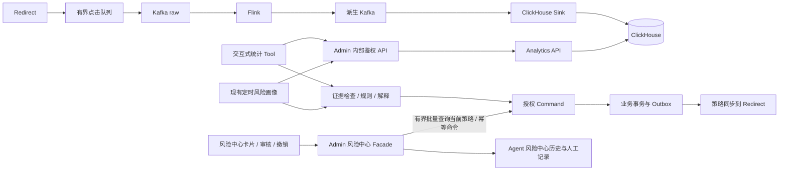

# Agent 与异步统计链路重构

> 状态：v0.7 实施规范；代码、实际测试与保留边界见 [实施验收记录](04-实施验收记录.md)。压力测试和完整 E2E 按用户要求另行执行。
> 用户确认：Tool 复用重构后的统计链路，补齐受影响的 Agent 内容；不为 Agent 重建统计系统。

导航：[架构总计划](shortlink-production-refactor-v2-apisix-kafka-flink-clickhouse.md) · [任务拆分](01-开发阶段与任务拆分.md) · [验收矩阵](02-验收矩阵与首次上线准备.md)

## 1. 范围与架构决定

Kafka 负责将跳转与统计采集、计算解耦；Analytics API 统一提供统计结果。Agent 的交互式 Tool 和现有定时风险画像都是这些结果的消费者，不承担原始点击计数。

- 停止 Agent 不影响点击采集、计算和跳转；统计侧故障也不让跳转同步等待 Agent。
- 普通 Tool 用有超时和资源预算的同步 RPC 查询已计算结果；异步统计不意味着每次 Tool 调用都要经过 Kafka 请求/响应。
- 长查询、导出、重算复用 Analytics 的 Job 能力。Tool 只返回并查询 Job 状态，不在 Graph 内另建长任务引擎。
- 首版不增加 Agent 原始点击消费者、独立 PV/UV 表、另一套聚合或逐点击 LLM 调用。Agent 库继续保存画像、证据摘要、批次及审核审计。
- 风控拒绝等请求结果复用上游独立结果流及 Analytics 查询，不能混入成功点击 PV；Agent 不消费该流或自行补记计数，缺失时保留质量/不支持状态。
- 风险中心保留卡片、详情、人工审核与策略撤销入口；历史建议和人工记录从 Agent 读取，当前有效策略通过 Admin 授权后有界批量查询 Command，二者分别展示。
- SecurityRisk Graph 的本地画像读取同样属于授权入口；身份检查早于画像进入卡片、LLM、证据审计和策略动作，不能只依赖 Tool 或 Command 的后置拒绝。
- 原计划的 `shortlink.risk.signal.v1` 保留分析信号输出契约；接入 Agent 触发调度后置。以后接入时，信号仅提示查询/重评，不表示 CH 已可查询或策略已获授权，不能替代本文件的数据质量检查。
- 保留现有 Graph、模型客户端、SSE、批次租约和策略命令框架，只改受影响的数据契约、适配器及业务节点。QPS 在 M6 实测，不作为本专项的开工条件。

## 2. 当前实现与受影响范围

路径相对仓库根目录；本节用于定位，写入所有权以任务文档为准。

| 现有位置 | 现状 | 必须适配的内容 |
| --- | --- | --- |
| `agent-service/.../tool/shortlink/` | 统计、访问记录、列表 Tool 经内部 API 取数据 | 复用 Analytics 查询；保留质量和版本；日期、分页、Job 状态契约 |
| `agent-service/.../business/shortlink/ShortLinkBusinessHttpGateway.java` | 成功后返回响应的 `data` | 完整传递 StatsEnvelope，错误分类、超时/重试预算，可信调用身份 |
| `admin/.../controller/AgentToolInternalController.java` | 调用旧 Project 统计；候选遍历链接后逐条查统计 | 转 Analytics；批量查询、分页候选、稳定快照及当前归属授权 |
| `agent-service/.../riskprofile/source/ShortLinkBusinessRiskStatsGateway.java` | 后台画像另有 HTTP 适配与数字转换 | 与 Tool 同口径；显式后台服务授权范围；保留质量、版本和 long 计数 |
| `agent-service/.../riskprofile/service/ShortLinkRiskProfileService.java` | 2h/24h/7d 分三次查，部分 null 转零 | 同一快照批量查；缺失状态、实际窗口及证据版本传递 |
| `agent-service/.../riskprofile/service/RiskProfileBatchService.java` | 候选完整 List 后逐条分析 | 游标分页、分批查询、有限并发/重试、进度与覆盖范围；复用已有租约 |
| `agent-service/.../riskprofile/model/`、`repository/` | 多处 int/Integer 和 JDBC getInt；本地画像查询仍按 gid/旧地址取数 | long/Long、BIGINT、受检序列化；画像记录质量与恢复世代；M5-06 将可信授权范围过滤接入 repository |
| `agent-service/.../securityriskagent/node/ProfileCandidateLoadNode.java` | 自由文本提取 gid 后直接读 Agent 画像，未使用 Graph username；结构化 batch 另读指定批次 | M5-07 校验可信主体、受控 batch 范围及 tenant/link 当前归属；旧 checkpoint 使用前重新授权，禁止未授权画像进入下游 |
| `agent-service/.../securityriskagent/evidence/` | Map 非空/已有卡片即可视为有证据 | 按指标可用性与质量分类，不能把元数据本身当证据 |
| `agent-service/.../riskprofile/detector/`、`securityriskagent/rule/` | 使用既有 PV/UV、增长和集中度规则 | 新统计口径下的规则回归、缺失指标处理、最小样本与版本 |
| `agent-service/.../campaignanalysisagent/graph/CampaignInsightCardFactory.java` 及风险卡片/提示 | 直接读取平铺指标并生成结论 | 从 Envelope 读取指标，展示实际范围、截止时间、近似与缺失说明 |
| `agent-service/.../securityriskagent/node/RiskAutoActionNode.java` | 主要根据风险级别、分数和原因决定动作；检查与写策略分离 | 确定性质量门槛、可信资源身份、expectedPolicyRevision、executeBefore 与稳定 commandId |
| `agent-service/.../riskpolicy/` | 既有审核、策略调用与审计 | M5-03 将新动作前置条件在 Command 事实事务内校验；已提交同 commandId 进入原结果分支，审计保留证据及规则版本 |
| `agent-service/.../riskcenter/` | 按 gid/域名/短码查询画像；由建议动作推导 ACTIVE，撤销入口直接返回 disabled=true | M5-08 接入稳定身份、当前归属和质量，区分历史证据、人工标注、Command 事实与命令传播状态 |
| `admin/.../controller/RiskCenterController.java`、`service/RiskCenterFacadeService.java`、`service/impl/RiskCenterFacadeServiceImpl.java` | 提供风险卡片、详情、审核与撤销的用户 Facade | M5-08 统一当前资源授权，组合历史证据与 Command 当前状态，保留 long/质量和不确定状态 |
| `admin/.../remote/AgentRiskRemoteService.java` 及风险中心专用 DTO | 调用 Agent 风险中心并透传现有 Map/DTO | M5-08 改为明确的历史、审核、命令结果契约，补计数/证据字段；不让响应成功冒充策略已传播 |

## 3. 统一 StatsEnvelope 契约

### 3.1 传递方式

现有业务响应继续使用 `Result.data`。统计类结果的 `data` 统一为 `StatsEnvelope<T>`，其中 `metrics` 或 `items` 是具体查询结果，`meta` 是质量与版本信息；Job 响应使用单独的 `AnalyticsJobResult`，不能伪装成已有统计指标。

通用 `ToolResult(success, data, message)` 可以继续复用：`data` 携带完整 Envelope，不要求为所有 Agent Tool 改写运行内核。下游卡片/规则适配新结构，不保留没有版本标识的双格式猜测。Transport 成功不等于数据完整，也不等于可自动执行动作。

### 3.2 最小字段

| 字段 | 契约 |
| --- | --- |
| `schemaVersion`、`metricVersion` | 响应结构和统计口径分别版本化；UV 定义、去重身份、时区等口径变动可识别 |
| `tenantId`、`linkId`、`ownershipVersion` | 由服务端可信上下文与当前资源事实产生；模型输入不能指定授权身份 |
| `requestedRange`、`effectiveRange`、`effectiveEnd` | 原始请求与实际查询范围分别保留；使用 UTC 时间，显示转换到业务时区，区间为 `[start,end)` |
| `snapshotId`、`snapshotExpiresAt` | Analytics 签发的不透明快照引用；绑定条件、租户、明细数据集、manifest、sourceCut、recoveryEpoch 和口径，不能作为免授权令牌 |
| `recoveryEpoch` | 上游统计恢复世代，贯穿快照、结果和画像证据；旧世代失效不得靠重新包装响应或重用相同 build/revision 恢复有效 |
| `generatedAt`、`dataAsOf`、`lagMs` | 响应生成时间与源数据可查询时间分开；新响应不代表新数据；无法确定延迟时保留 unknown |
| `freshness` | `FRESH / STALE / UNKNOWN`；相对该查询要求的截止时间判断，完整历史查询不会仅因日期久远被判陈旧 |
| `completeness`、`missingMetrics` | `COMPLETE / PARTIAL / UNKNOWN / UNAVAILABLE` 与不可用指标名；COMPLETE 仅针对快照的已持久化输入覆盖，不承诺未采集点击或未来迟到事件 |
| `provisional` | 当前结果是否仍处于开放/可修订阶段；与 freshness、completeness 分开，不能用一个状态互相替代 |
| `approximation` | 按指标记录精确/近似、算法及版本；需要误差说明时引用已验证范围，不编造单请求误差 |
| `collectionQuality` | 已知正常、降级或未知及适用范围/原因；区分采集损失、计算积压、近似误差；无法精确统计的崩溃损失不填为零 |
| `reasonCodes` | 如数据积压、缺少窗口、快照过期、指标不支持等机器可读原因，供确定性节点处理 |

Analytics 根据实际源覆盖与发布元数据产生这些字段。不能用当前服务器时间、一次成功 SELECT、Kafka lag 为零或 Flink watermark 单独伪造“全量已齐”。`dataAsOf` 表示声明范围的可查询进度，不保证该事件时间之前永远不再有迟到修订。

M0-05 冻结字段、枚举、错误语义和样例，并与 M1-02/M5-03/M5-07 明确本地画像授权范围及新动作前置条件；M4-03 在已有查询实现中产出统计元数据。首版不新增公共运行模块；Admin 的 `dto/req/analytics/`、`dto/resp/analytics/` 承载 Facade DTO，服务之间遵守线协议及样例测试，不反向依赖 Admin 内部实体。

### 3.3 零值、失败和 Job

- 指定快照与范围内可用的零计数为 `0`；未到达、未支持、缺失或查询不可用的指标为缺失状态，禁止统一补零。部分指标可用时可展示这些指标，但依赖缺失项的规则不参与评分。
- 不可用结果不生成“流量归零”“风险正常”等事实结论；保留查询失败与业务零值的区别。
- 现有 `topVisitorShare`、`repeatVisitRatio` 等空字段必须明确由 Analytics 提供可验证定义，或标为 `missingMetrics` 并禁用依赖规则；不能自动替换成猜测公式。
- Job 的 `PENDING/RUNNING/SUCCEEDED/FAILED/CANCELLED` 与统计结果是否 provisional 相互独立；`SUCCEEDED` 仅表示查询任务完成。授权用户再次查询状态/结果时仍检查归属。

## 4. 查询复用与资源有界

### 4.1 普通 Tool

保留已有短链统计、分组统计、访问记录和列表 Tool 的业务入口及用户可理解的参数；通过 Admin 内部 API 统一转到 Analytics。日期参数在服务端转换为业务时区的明确半开区间，校验范围。长列表或原始记录只传递有界页和允许字段，避免把全部明细塞入模型上下文。

用户请求的日期范围不偷偷改变。数据尚未覆盖时返回实际覆盖情况及 provisional/partial 状态；请求预算超限时转明确 Job 或返回可操作的范围限制。图执行器只做有总截止时间、次数和退避的重试，取消或断连停止不必要的轮询；禁止无限等统计追平。

交互式查询、定时画像和管理报表分别设置连接/并发预算；租户内分页、链接数、时间跨度、扫描量、返回字节及 RPC 超时沿用 Analytics 的统一限制。Agent 多开实例不能绕过服务端限额。

### 4.2 活跃候选与多窗口画像

1. 现有 Scheduler 建立批次后，从 Analytics 获取授权范围内的活跃候选游标，替代 Admin 以 MySQL `totalPv/todayPv` 为前置过滤再逐条查 CH。扫描的时间范围、覆盖进度和分页上限一并记录。
2. 同一画像批次固定 Analytics 返回的 `snapshotId` 与共同 `effectiveEnd`；按有界链接块一次请求 2h/24h/7d 等所需窗口，避免每条链接三次完整远程查询。
3. 画像请求显式采用 `COMMON_AVAILABLE_END` 语义，所有窗口从同一 `effectiveEnd` 回推。该截止时间落后于批次要求时标记延迟；不分别截短窗口后仍按 2h/24h/7d 作为增长率分母。
4. 各窗口/指标不能满足完整性时保留缺失状态；本次可以保存受限画像，但不会据此产生不满足门槛的动作。组画像记录候选覆盖范围、成功/失败数，不能把部分候选称作全组结论。
5. 按页/块处理并保存必要进度，复用现有租约、失败记录及重试入口；内存随固定页/块预算变化，不随全部租户链接总数增长。批次超时返回部分完成及原因，不用旧画像悄悄填补。

`group UV` 继续从 Analytics 的联合去重结果读取。Agent 汇总的是画像风险，不将短链 UV 标量相加冒充分组 UV。

### 4.3 快照与分页

首次查询固定 manifest、sourceCut、数据集版本、recoveryEpoch、查询条件、授权资源集合及稳定排序位置；后续页/窗口使用同一快照。迟到插入、补算发布不会改变已签发快照可见的输入集合，具体保留和过滤方式由 M4-03 实现并验收。

同一 manifest/build 内的 provisional 窗口也会从 r10 更新到 r11，不能仅绑定 buildId 后继续用不受约束的最新 `argMax(..., revision)`。M4-03 必须固定并保留所读窗口 revision，或在签发时生成并保留有界查询结果；候选顺序和三个窗口受同一快照约束。物化复用 Analytics 查询缓存/结果 Job 的预算与生命周期，不新增 Agent 统计库。只有结果及输入边界已固定才签发快照；有效期内无法保持可见结果时明确失效。

副本选择、可查询覆盖与固定 sourceCut 重建由 Analytics 上游负责。首版规范补算从完整原始归档的 receipt 范围重建，先限定 sourceCut 再按 eventId 去重；不能依赖已被 Replacing 合并覆盖的单行 lineage 还原历史 cut。Tool、画像与风险中心只使用已签发快照及质量信息，不自行从 Kafka、CH 副本或 Agent 本地数据补算。

每页重新检查当前权限；分组移动等使原授权资源集合失效时返回 `QUERY_SCOPE_CHANGED`，由调用方重新开启批次/查询。快照过期或已清理返回 `SNAPSHOT_EXPIRED`；不切换新快照继续使用旧游标。旧快照保留期限有上限，批次应在有效期内完成；超时后明确失效，不能用延长所有数据保留期掩盖无界任务。

快照值是不透明身份，禁止按字符串比较新旧。发布与画像更新采用 Analytics 的有效版本关系、现有批次代次和数据库条件提交；旧运行即使晚完成，也不得覆盖已发布的新一代画像。

上游恢复导致 recoveryEpoch 改变时，旧快照/游标按既定失效协议返回 `SNAPSHOT_EXPIRED` 及恢复原因，画像批次须重开；保留的旧画像只能作为明确标注的历史证据，不可用于新自动动作。M4 负责恢复切换、快照失效和结果资格，Agent 适配器保留世代，使用证据前核验其仍有效，不自行重建上游数据或给旧证据续期。

### 4.4 Graph 本地画像读取授权

`ProfileCandidateLoadNode` 是 Tool、统计 source 和风险中心之外的既有读取入口。自由文本中的 gid 仅是查询条件；在按 gid 查 Agent 库前，必须使用可信主体经 M1-02 的受控授权能力确认范围，可复用 Admin 有界授权接口。不能把用户文本、模型生成参数、已有 sessionId 或仅有 username 当成资源授权证明。

短链画像依稳定 tenantId/linkId 和当前归属检查，组画像依当前受控 tenant/gid 范围读取；M5-06 的 repository 接收服务端生成的授权范围并过滤，不能先全量取出他人画像再仅在响应末尾隐藏。移组或撤权后，旧 gid、历史画像地址及原批次可读不代表当前仍有权读取；无法确认时不加载或使用证据。

结构化 batch 必须来自已验证的系统 Job/服务主体，明确其持久化租户、资源范围与允许动作；普通聊天不能通过提交 batchId 或修改 Graph state 获得系统范围。受控任务同样检查当前资源归属，不能把“系统调用”解释为任意租户通行。

旧 checkpoint 中的 profileRiskContext、卡片和画像证据在再次使用前重新授权并检查快照/恢复世代。门槛位于生成卡片、送入 LLM、写入证据/风险事件审计及发起动作之前；后续 Tool/Command 拒绝不能补救已经泄露的画像。授权失败只记录不含越权画像内容的拒绝审计，返回受控错误，不把失败证据混入其他成功结果。

M5-07 拥有上述节点检查和接口接入，M5-06 配合 repository/service 过滤。必要的 `DefaultSecurityRiskGraphExecutor` 构造/上下文接线以精确补丁交主集成人合入；不借此重写 harness、Graph 框架或引入新的 Agent consumer。

## 5. 画像、规则与自动动作

### 5.1 模型与持久化

计数字段从 API DTO、Map 数值解析、窗口/画像/分组模型、规则参数到 JDBC 与数据库列一起改为 long/Long、BIGINT。测试超过 `Integer.MAX_VALUE` 的计数；禁止 Number.intValue 截断。超过消费端精确数值范围时使用已冻结的十进制字符串表示或明确拒绝，不能静默损失精度。

画像至少记录 `batchId`、`tenantId/linkId`、当前归属版本、`snapshotId/recoveryEpoch`、实际窗口、`dataAsOf`、质量摘要、`metricVersion`、`ruleVersion` 和首次证据生成时间。Agent 数据库迁移仍由 M5-06 单一拥有，入口为 `deploy/mysql/003-agent-analytics-adaptation.sql`；M5-03/M5-07/M5-08 提交命令证据、风险中心身份和人工标注字段片段，不新增第二份点击事实存储。

新口径上线前用明确样例验证 PV/UV 比、增长率和集中度规则。指标暂不支持或样本不足时，记录不适用原因；不把缺失项当零后仍按满项评分。新旧口径的画像不可混合做趋势比较，不能沿用旧分数作为新规则真值。

### 5.2 确定性证据检查

现有证据分类扩展为能表达完整可用、受限可用、无数据、数据陈旧及来源故障；具体枚举由 M0-05 冻结。Map 非空、HTTP success、已有卡片或仅含 meta 的 Envelope 均不足以判为 AVAILABLE。

解释/卡片可以展示部分数据，但必须携带截止时间、实际窗口和适用限制。近似指标说明近似，不向最终用户展示 Kafka offset 或内部 manifest 细节；这些留在审计记录。提示词要求模型依据可用指标说明结论，不能自行补齐缺失数字。

### 5.3 自动动作门槛

基于统计生成的新策略动作（含人工审核后执行）的顺序固定为：当前授权 → 证据版本和时效检查 → 规则所需指标与覆盖/样本检查 → 确定性评分 → 既有审核/动作权限 → Command 提交时前置条件校验。代码执行门槛，LLM 仅解释；人工审核通过也不能绕过这些新动作的当前权限和失效证据检查。明确撤销既有策略按第 6.3 节处理，已提交命令恢复按第 5.4 节先识别原结果。

M0-05 冻结 `maxEvidenceAge`、`maxDataLag`、规则所需指标、`minSamples`、允许的 provisional 状态、采集质量要求及动作上限。没有有效配置时默认不执行新增自动策略。交互式展示允许的质量级别与自动动作门槛分别配置。

动作执行时，`maxDataLag` 按当前时间减 `effectiveEnd` 检查，证据年龄按首次形成该证据的时间检查；重新查询/序列化产生的新 `generatedAt` 不给旧证据续期。完整历史报表可标记查询层面的 FRESH，但不能因此作为当前实时自动动作的合格依据。

- 实时数据可为 provisional，只要覆盖、延迟、采集质量及规则条件满足已冻结门槛；不强制等 24 小时修订窗口结束。
- STALE、UNKNOWN、PARTIAL 或缺少必需指标时，本首版不据此自动限流/封禁；保存受限解释或交给既有人工流程。采集质量未知或降级时也不能当作已验证完整证据。
- 统计故障不是撤销现有策略的命令。已生效封禁按 Command 权威状态、合法撤销或既定业务到期处理。
- 批次重试、恢复旧 checkpoint、审核等待后，先识别原命令是否已提交；仅尚未提交的新动作重新检查证据和授权，过期则重新评估，不能直接重放旧动作或改写原请求。
- 同一逻辑动作持久化稳定 `commandId`，附带证据快照与规则版本；响应丢失时查询或重试原命令。更新证据不自动重置 commandId 或触发第二个动作，新的动作必须重新经过规则、冷却/去重及授权。
- 迟到修订使结论改变时生成可追溯的新评估；是否调整已生效策略走既有明确规则/审核，不以统计行被覆盖作为撤销指令。

### 5.4 新动作提交条件与幂等恢复

M0-05 联合 M0-02/M5-03 冻结命令前置条件：可信主体及稳定 tenantId/linkId/归属版本、资源/动作级 `expectedPolicyRevision`、`evidenceSnapshotId/recoveryEpoch`、原始证据生成时间、`executeBefore` 和请求摘要。无策略状态也须有权威基准修订；不得用 policyId 代替资源修订，或从用户/模型参数接受授权身份与版本证明。

可信服务根据冻结规则计算 `executeBefore = min(effectiveEnd + maxDataLag, evidenceCreatedAt + maxEvidenceAge)`，其中 evidenceCreatedAt 是首次形成该证据的时间。Command 验证可信来源和不可变证据绑定；重新 RPC、刷新 generatedAt、延迟重试或人工改请求均不能延长截止。新命令在权威时钟 `now >= executeBefore` 时失效，网络超时和调用方取消不替代服务端期限检查。

Command 先验证调用身份与请求摘要并查原 commandId。已提交者进入原结果分支：即使证据后来过期或操作权限被撤销，也不重新执行、不伪报从未提交；按当前结果读取权限返回允许的原状态，无读取权限则受控拒绝并隐藏结果内容。相同 commandId 不同摘要拒绝，原结果未知保持待确认，不因未知或拒绝读取而生成第二个命令。

仅对确认尚未提交的新命令，M5-03 在已有资源仲裁锁和策略事实事务内校验当前主体/归属权限、expectedPolicyRevision 与 executeBefore；授权范围与归属变化遵守同一仲裁契约，不能只信调用前检查。验证通过才一起提交幂等结果、策略明细、有效结果、新修订及 Outbox；CONFLICT/EXPIRED/无权限不写策略或 Outbox，可保存明确的拒绝结果供同键查询。

人工撤销使资源修订推进后，基于旧修订的在途自动动作必须冲突，不能再次激活刚撤销的限制；若仍需新动作，必须重新评估并形成独立、可审计的决定，不能给旧 commandId 替换证据或执行期限。人工撤销本身继续只验证当前权限、目标和幂等契约，不受旧统计证据门槛阻塞。

## 6. 风险中心现有用户链路

### 6.1 身份、授权与证据展示

现有 `RiskCenterController`→`RiskCenterFacadeServiceImpl`→`AgentRiskRemoteService`→Agent `riskcenter/` 链路继续承担卡片、详情、事件历史和人工记录查询。短链记录以 `tenantId + linkId` 关联，`domain/shortUri` 仅用于地址解析或展示，历史 `gidAtEvent/gidAtReview` 留作审计。组级记录明确为 `tenantId + gid`，不能把组 ID 与短链 ID 混用。

Admin 对列表每页、详情、人工审核、撤销和命令结果查询复核当前主体、当前归属及动作权限；Command 再次检查命令和当前策略查询的资源授权。同租户移组保留 linkId 和历史证据，新组可在权限允许时查看，旧 gid 参数、历史 policyId 或旧卡片不能延续已失效的访问权。内部调用必须携带已验证服务身份与授权范围，不能由请求体指定 tenantId 获得权限。

卡片/详情/事件中的 PV、UV、UIP、访问次数及分组计数沿用 long/Long/BIGINT 与受检序列化，完整保留统计范围、snapshotId/recoveryEpoch、metricVersion、freshness/completeness、provisional、approximation 和 collectionQuality。历史证据缺失或过期明确展示，不能因卡片可读就判定当前风险或当前策略有效。

### 6.2 当前策略事实与有界查询

删除“latestPolicyActions 非空即 ACTIVE”及“历史 policyStatus 就是当前状态”的推断。Agent 返回的建议、历史命令、审核与画像是证据；Command 返回的当前有效策略及修订号是事实。Admin 在完成授权后调用 Command 的有界批量状态查询，再与 Agent 历史结果组合，避免列表每张卡片单独一次 RPC。

| 数据部分 | 最小字段或状态 | 解释与失败行为 |
| --- | --- | --- |
| 历史证据 | tenantId/linkId、证据/规则版本、建议、原始窗口及质量、记录时间 | 只说明当时的分析；当前状态查询失败仍可展示已授权的历史，但须分区标明 |
| 人工记录 | reviewId、targetType、稳定资源身份、reviewVersion、操作者、动作/注释和时间 | 说明人工关注/误报等标注；不是策略事实副本 |
| 当前策略 | tenantId/linkId 或受控 resourceKey、action、effectiveState、policyRevision、nextTransitionAt、asOf | Command 权威查询的时点事实；明确无有效策略和 UNKNOWN，不用空列表表达查询失败 |
| 命令回执 | commandId、targetPolicyId/资源、requestDigest、commitState、resultRevision、传播状态 | 持久化提交、当前聚合结果和执行端传播分别表达，不能合成一个 disabled 布尔值 |

状态接口由 M5-03 提供，M5-08 负责 Admin 调用、响应组合及风险中心展示；冻结批量资源上限、RPC 截止和错误映射。查询超时、来源不可用或不能确认当前修订时返回 `UNKNOWN` 及原因、可用的 lastKnown/asOf，禁止把旧快照续成“现在正常”。`asOf` 表示本次权威观察时间，超过 `nextTransitionAt` 的历史响应不能继续声称当前有效。

多策略的空允许时间集合、自然生效/到期、撤销后的剩余策略聚合由 Command/risk-core 的权威契约负责。Agent 不根据某条策略 TTL 失效自行放行，不重算有效策略交集；自然转换后读取新的 policyRevision/nextTransitionAt。状态查询成功也不证明全部 Redirect 已应用该修订，传播证据缺失时明确 UNKNOWN/PENDING。

### 6.3 人工审核、撤销与恢复

人工关注、取消关注、误报标记在 Agent 本地审核事务中完成；这些操作只更新人工记录及其审计，不暗中等同于撤销策略。若产品动作确实需要撤销，必须调用独立、明确授权的策略撤销命令，返回独立的命令状态，不能以“审核已保存”代替“策略已撤销”。

人工明确撤销既有策略时验证当前权限、目标策略、请求摘要与 commandId，不因旧统计证据过期或 Analytics 不可用而阻止有权用户解除误封；该行为不复用基于统计生成新动作的证据门槛。无法确认权限或 Command 事实时仍返回待确认/失败，不能通过本地删缓存解除。

撤销继续复用 M5-03 的稳定 commandId：同一逻辑动作在 Agent 审计/恢复状态中保存请求摘要与命令身份；响应丢失时经 Admin 授权查询或重试原命令，相同 commandId 不同内容拒绝。用户重复提交或页面刷新不自动生成第二个命令；重新评估的新动作按既有权限、冷却及去重规则处理。

| 观察结果 | 返回语义 | 后续行为 |
| --- | --- | --- |
| Command 未能确认是否提交 | PENDING_CONFIRMATION/UNKNOWN | 保存 commandId；有界查询其状态，不返回 disabled=true，不另起撤销命令 |
| Command 明确拒绝或失败 | REJECTED/FAILED 与原因 | 展示真实失败；不改写历史为撤销成功，不解除现有有效状态 |
| Command 已提交 | COMMITTED、resultRevision | 表示权威事务已完成；继续分别展示当前聚合结果与传播 PENDING/APPLIED/UNKNOWN |
| 某条策略已撤销但其他策略仍有效 | 已撤销该 policyId，同时返回资源仍受限 | 不将单策略撤销显示为整条短链已恢复；从 Command 的聚合结果解释 |

只有真实执行端可见证据达到约定条件时才标记传播 APPLIED；ACK 或 Outbox 已提交不能替代该证据。Command/Agent 之间不假设存在跨库事务，审计保存失败可按原命令身份补记，不能重复执行业务动作。

### 6.4 人工标注与画像更新相互独立

人工标注使用独立 reviewVersion/条件更新，与画像证据版本分别推进。画像刷新只更新算法证据字段，不用 profile.watchStatus 或旧风险快照覆盖人工关注、误报及注释；旧批次晚完成同样不得覆盖较新的画像。卡片可以同时表达“人工标记误报”“新画像仍有风险信号”“Command 仍有限流”，不得把三个事实压成一个状态。

当人工记录写入与新画像发布并发时，M5-08 与 M5-06 通过明确字段所有权和数据库条件更新集成；必要 DDL 统一提交 M5-06。新增枚举、请求和响应样例归 M0-05 协调，不能通过改提示词解决字段覆盖或状态误报。

## 7. 任务与所有权映射

具体 owned/forbidden 路径和共享文件归属以 [任务拆分](01-开发阶段与任务拆分.md) 为准。

| 任务 | 本专项交付 | 依赖 |
| --- | --- | --- |
| M0-05 | StatsEnvelope/recoveryEpoch、查询/Job/质量、本地画像授权范围、新动作版本/期限及风险中心状态样例 | M0-02；与 M1-02/M5-03/M5-07/M5-08 冻结线协议，API DTO 和 Kafka schema 分别拥有 |
| M4-03（扩展原任务） | 复用现有 Analytics：质量、含恢复世代的固定快照、候选游标、多窗口及独立请求结果指标查询 | M0-05、既有 M4 存储/查询及恢复能力；Agent 不另建结果流 |
| M5-05 | Tool、Admin Facade 与两个 HTTP 统计适配器 | 契约可先开发，联调依赖 M4-03/M1-02 |
| M5-06 | 画像批次、证据/恢复世代、long 与恢复；本地 repository/service 授权范围过滤；003 DDL 唯一入口 | M5-05 契约，模型/授权接入与 M5-07 协作，合入 M5-03/M5-07/M5-08 字段片段 |
| M5-07 | ProfileCandidateLoadNode 及旧上下文使用前授权；画像模型/规则/卡片；生成新动作可信前置条件 | M0-05/M1-02 契约夹具可先开发，联调依赖 M5-05/M5-06/M5-03；Graph 精确接线交集成人 |
| M5-03（沿用） | Command 事务内校验新动作权限/版本/截止；已提交 commandId 原结果；事实/状态及传播证据接口 | 保持原控制面依赖，为 M5-07/M5-08 提供命令状态契约，不依赖风险中心完成 |
| M5-08 | 风险中心卡片/详情、人工审核/撤销、当前策略读取、稳定身份与 long/质量透传 | M0-05、M1-02、M5-03；画像字段契约由 M5-06/M5-07 提供，夹具可先开发 |
| M6 | AG01～AG20、故障隔离、混合负载与实际资源报告；复用 K05/S22/S23 上游证据 | M5 全链路完成 |

M5-02 收窄为模块搬移及普通后台，不重复拥有 Agent 专项文件。共享统计 DTO 由 M0-05 负责人统一修改；Agent 配置、根 POM 仍由主集成人接入。无需新增 Agent Kafka Consumer、Inbox 表或新的调度框架。

M5-07 在 `securityriskagent/node/`、既有证据/模型/规则路径实现画像授权与动作前置条件；repository/service 由 M5-06 独占，Command/Agent `riskpolicy/` 由 M5-03 独占。`securityriskagent/graph/DefaultSecurityRiskGraphExecutor.java` 必要接线只交主集成人明确合入，不能以功能依赖扩大到通用 harness 写入权。

M5-08 唯一拥有 `agent-service/src/main/java/com/jupiter/shortlink/agent/riskcenter/` 及对应测试；Admin 的 `RiskCenterController.java`、`RiskCenterFacadeService.java`、`RiskCenterFacadeServiceImpl.java`、`AgentRiskRemoteService.java` 及对应风险中心测试也归该任务。新增 `admin/src/main/java/com/jupiter/shortlink/admin/remote/CommandRiskRemoteService.java` 和对应 `CommandRiskRemoteServiceTest.java`（planned）用于有界状态查询，同属 M5-08，明确从 M5-02 的普通 remote 路径排除。

Admin 专用 DTO 范围为 `remote/dto/req/RiskReviewReqDTO.java`、`RiskPolicyDisableReqDTO.java` 和 `remote/dto/resp/RiskEventRespDTO.java`、`RiskShortLinkDetailRespDTO.java`、`RiskShortLinkCardRespDTO.java`、`RiskReviewRespDTO.java`、`RiskPageRespDTO.java`、`RiskGroupOverviewRespDTO.java`；不占用 M5-05 的 Agent 统计 DTO 或 M0-05 的 analytics DTO。

M5-08 不修改 M5-03 的 `riskpolicy/`、Command 事实或状态接口实现，不抢改 M5-06 的画像 service/repository 和 003 SQL，也不修改 M5-07 的评分/卡片规则。跨任务接口与字段变更先由契约负责人确认，调用接入由各自 owner 完成。

实施顺序为：M0-05 冻结授权/状态/新动作前置条件样例→M5-03 提供事务命令与查询接口，M5-06/M5-07 提供过滤、证据及人工字段边界→M5-07/M5-08 用夹具完成适配→M5 联调本地画像读取、当前权限、延迟命令恢复和多策略状态→M6 验收。相关任务可提前开发接口和映射，最终联调不能用历史模拟状态代替 Command 或跳过读取前授权。

## 8. 验收与完成条件

本专项案例为 [验收矩阵中的 AG01～AG20](02-验收矩阵与首次上线准备.md)；AG03/AG06/AG07/AG14 覆盖风险中心复用链路，AG17～AG18 对应人工操作与事实分离，新增 AG19 读取前授权及 AG20 新动作提交条件；独立结果流与恢复世代复用 K05/S22/S23 上游验收，不另造 Agent 编号。覆盖：

- Agent 停止时跳转与统计继续工作；Tool 调用不额外写计数，后台画像和 Tool 对同一快照结果一致。
- Kafka 积压、CH 暂不可用、迟到修订、采集降级分别反映在质量/错误中，不变成零访问。
- 两个 HTTP 适配器、证据分类、卡片和画像存储全程保留质量与版本；仅含元数据不构成有效证据。
- 多窗口、分页及批次重试不混版；当前权限复核、快照到期及分组移动行为明确。
- 大计数、UV 新口径、缺失字段、有限扫描/超时及旧画像恢复通过回归。
- 数据门槛不满足时拒绝新增自动动作；满足实时门槛的 provisional 数据能按规则评估；命令重试不重复生效，统计故障不解除现有策略。
- 移组或撤权后，风险中心卡片、详情、审核、撤销及状态查询都使用当前授权；long 计数和统计质量在风险 DTO 中完整往返。
- 人工关注/误报不隐含策略撤销；命令 ACK 未知、COMMITTED 与传播状态区分，恢复复用原 commandId，不返回虚假 disabled=true。
- 历史建议不冒充当前策略，Command 不可查询时为 UNKNOWN；单策略自然到期/撤销后剩余策略仍生效，画像刷新不覆盖人工标注。
- AG19：正常登录用户在自由文本指定他人 gid；再测试受控 batch 范围及移组/撤权后恢复旧 checkpoint。画像进入卡片、LLM、证据审计前拒绝，内容不泄露；真实 Tool 拒绝不会被本地画像成功结果抵消。
- AG20：新自动动作检查后暂停，插入人工撤销、归属/权限变化或推进至 executeBefore，再恢复请求；Command 在事实事务内拒绝且 policy/Outbox 零新增。另测原命令已提交但 ACK 丢失、随后证据过期/撤权：按结果读取权限返回原状态或拒绝披露，绝不重新执行或改写原提交事实。
- 上游 recoveryEpoch 切换后，旧快照/游标失效，画像保留历史标记且不产生新动作；独立拒绝结果与成功点击口径分开，Agent 只读上游质量和指标，不补造计数。

证据包括契约样例、真实集成结果、查询/批次/命令 trace 和故障注入记录。监控复用现有体系，增加统计 RPC 超时、快照失效、画像覆盖/过龄、质量拒绝及命令重试的有限标签指标；不将 linkId、snapshotId 或用户身份作为 Prometheus 高基数标签。

仅在上述受影响链路和验收通过后，将 Agent 适配标记完成。当前文档是执行依据，不是已经完成重构或达到目标 QPS 的声明。
