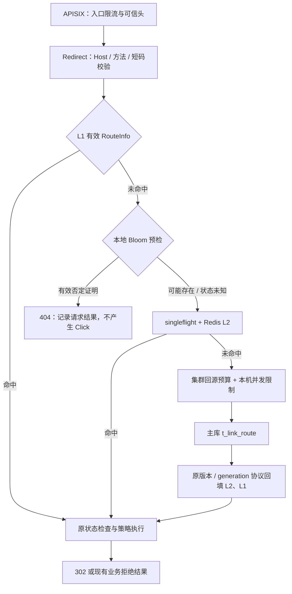

# 跳转布隆过滤器与缓存穿透防护计划

状态：已实施，单元与隔离集成验收通过；运行环境仍需显式初始化和启用。日期：2026-09-14。实施基准：main `c15e10d`；Issue [#15](https://github.com/Jupiter363/shortlink/issues/15)，分支 `jupiter/feat-route-bloom`。验收范围和未执行项见[实施记录](../../integration/route-bloom-2026-09-14/README.md)。

## 1. 结论与范围

推荐在 **Redirect 的 L1 查询未命中之后、Redis L2 查询之前**加入进程内布隆过滤器。命中 L1 的正常跳转不增加过滤器计算；可靠的否定结果直接结束为 404，减少随机短码扫描对 Redis 和 MySQL 的访问。它是地址存在性预检，不是第三层路由值缓存。

过滤器只回答“这个规范化地址是否可能存在”，不决定有效期、停用状态、归属、目标 URL 或风险策略。Leaf 继续负责发号；本方案不恢复旧 URL + UUID + Hash 的短码生成与碰撞重试。

**接入点简单，一致性是主要工作量。** 本计划推荐“本地 Bloom + 持久地址登记 + 有期限的否定权限”；Kafka 加速登记分发，不能单独授予返回 404 的权限。新增写入必须先登记，再越过旧否定权限的有效期，才允许发布业务路由。若不实现这个边界，只能以 SHADOW 模式观察 Bloom 结果。

本轮已按以下设计实现服务和共享协议，按 Issue → 分支 → 测试验收 → PR 交付。未启动压测，也没有自动在既有环境开启 ENFORCE。

## 2. 实施前基准核对

| 环节 | 当前实现与发现 |
| --- | --- |
| 公网入口 | APISIX → Redirect；Host、方法、短码格式和可信代理校验在 `RedirectController.redirect` 中执行 |
| 路由缓存 | `RouteResolver.resolve` 先检查 Caffeine L1，再合并同一地址的并发 miss，查询 Redis L2，最后受预算限制查询主库 |
| 负缓存 | `JdbcRouteAuthority.find` 对不存在的地址返回 `RouteInfo(status=NOT_FOUND)`；它也进入现有 L1/L2，因此当前并非没有负缓存 |
| 剩余穿透风险 | 大量不同的合法格式随机短码没有重复命中机会，仍反复消耗 L2、集群回源预算和数据库查询额度 |
| 回源保护 | `ClusterOriginBudget` 集群限额、`JdbcRouteAuthority` 本机信号量，以及请求截止时间均已存在；加 Bloom 后继续保留 |
| 变更通知 | `ChangeFanout` 是路由/策略失效提示；`InvalidationBootstrap` 的新消费者允许跳到 Kafka 当前末尾，不能直接用作完整 Bloom 增量流 |
| 单条/同步批量 | `LinkCommandService.createMany` 先 `reserveRanges`，随后才提交创建事务 |
| 异步批量 | `BatchJobService.executeChunk` 分配 ID、持久化 RESERVED 行，再提交业务路由；重试会复用已保留 ID |
| 历史删除 | `2fcc214` 前的 `ShortLinkServiceImpl` 同时使用 Redisson Bloom 做生成碰撞检查及跳转预检；两种用途在新架构中应分别处理 |

代码定位：`RouteResolver.java:60/78/84`、`JdbcRouteAuthority.java:77`、`LinkCommandService.java:121/131`、`BatchJobService.java:516/532`、`InvalidationBootstrap.java:58`，均位于对应服务的 `src/main/java/com/jupiter/shortlink/` 下。以上行号仅对应本次基准。

原总体方案的“不使用异步维护 Bloom 的否定结果强制拒绝有效新链”继续有效；本计划补齐允许安全拦截的条件。

## 3. 读链路与职责

建议新增 `RouteMembershipGuard`，输出三种结果：

| 结果 | 含义与处理 |
| --- | --- |
| MAY_EXIST | Bloom 阳性，继续原查询；不能据此直接跳转 |
| DEFINITELY_ABSENT | Bloom 阴性，且对应过滤器实例、登记版本、否定租约均有效；提交 404 前再次验证该证明 |
| UNKNOWN | 未初始化、版本缺口、超时、租约过期、损坏或重建不完整；继续现有受控回源路径 |

将检查放在 `RouteResolver.resolve` 的 L1 miss 分支、`flights` 名额申请之前，避免随机无效请求先耗尽并发查找名额。新增带证明的查询结果类型，区分数据库 RouteInfo 与 Bloom 否定结果；不能伪造带数据库权威时间戳的 NOT_FOUND。

Bloom 否定不写入 L1/L2，不因缓存 TTL 延长其有效期。Controller 在提交响应前重新检查证明；失效则在原请求预算内走原查询，预算耗尽沿用受控 503。正常 302 的状态、策略和事件规则保持原语义。

APISIX 不持有业务 Bloom；Admin、Agent Tools 和统计服务也不维护副本。若未来改选远程 Redis Bloom，合理位置应移到 **L2 miss 之后、回源预算之前**，避免每个 L2 命中请求再增加一次远程查询；本期不同时建设两套 Bloom。

## 4. 写入登记与否定租约

### 4.1 为什么不能直接异步 add

“MySQL 创建成功 → Outbox → Kafka → Bloom.add”存在传播间隙。期间缓存为空，Bloom 阴性，却已有真实路由。`lag=0`、固定等待几秒、消费端 READY 标记均不能消除该并发窗口。

Leaf `t_id_alloc.max_id` 是预留上界，不是已提交且以后不会补写的路由边界；内存 Current/Next 段和持久 RESERVED 批量行都可能在扫描后提交。不能用 `MAX(link_id)` 或号段高水位证明 Bloom 完整。

### 4.2 推荐协议

新增业务库地址登记及协调记录，暂定 `t_route_membership`、`t_route_membership_control`。登记键统一为版本化的 `(domainNorm, shortUri)`，编码长度明确，域名大小写/端口与现有 `HostNormalizer` 完全一致；短码保持大小写敏感。登记不包含用户信息或原始 URL。

1. Command 校验身份、输入、幂等结果并领取 ID 后，提前确定本批规范化地址。独立短事务登记地址及增量通知意图，和控制记录一起提交连续的登记版本。先登记只表示“可能存在”，不发布业务路由。
2. 登记事务与否定租约发放使用同一控制记录串行化。Redirect 只有在已完整应用该 generation 的**当前登记版本**后才能领取或续租；落后节点不能续租旧版本。
3. Redirect 先完成全部位写入，再原子发布 filter 引用、appliedRevision 和租约。一次否定检查必须捕获并使用同一份状态，禁止将旧 filter 算出的阴性配上新租约。租约使用本机单调时钟，从发起领取请求之前开始计时；网络延迟不能延长租约。
4. Command 确认登记事务已提交后，在事务外用本机单调时钟等待**系统统一的最大否定租约期限 + 漂移余量**，随后才开始/继续路由发布事务。实现冻结最大租约 1,000 ms、余量 250 ms，共等待 1,250 ms；不得按节点自由放大期限。
5. 注册前发出的旧租约此时均已失效；能持有新租约的节点必已应用该地址。因此迟到的 Kafka 通知最多使节点回到 UNKNOWN，不会造成 Bloom 误拒新路由。
6. 同步批量按整批登记、等待一次；异步批量在身份持久化之后、业务写入之前按 chunk 登记和等待，保留原 job fence、授权、配额与幂等检查。等待采用有界异步调度，不占数据库事务、行锁或 Netty 事件线程，也不能直接在 MVC 请求线程、批量 worker 上 sleep；排队及截止时间必须有界。
7. 登记后回滚或进程退出不删除 Bloom 位。恢复时若无法证明已完成安全等待，则重新等待完整期限，再核验业务幂等结果。禁止重试换掉已持久批量 ID。
8. 最终 `insertReservedMany` 业务事务内，批量验证这些规范化地址仍有有效登记，且 namespace/generation 与当前权威控制记录匹配。不能只相信登记前缓存的内存凭据；跨数据库恢复或 namespace 换代后必须重新登记与等待。

不用数据库墙钟的 `maxValidUntil` 单独决定提前发布：时钟向前跳可能提前放行，而其他节点单调时钟上的旧租约仍有效。墙钟只能用于审计；租约变更、generation 切换和恢复同样必须排空旧期限。假设主库采用单主写入且已确认提交不在业务运行期间静默回滚；数据库恢复必须进入停发租约、停写切换与重新建基线流程，不能靠内存标志掩盖数据库事实回滚。

**代价必须明确：**该基础协议为每个新建批次增加约一个最大租约期限加余量的等待，并增加按批登记和按实例续租的数据库工作。它换取跳转预检无远程访问。初期不引入全节点同步 ACK 或按地址分片协调；只有测出写入或协调热点后再优化。验收同时记录创建延迟和批量吞吐，不把跳转收益建立在未披露的写入退化上。

已有数据库 NOT_FOUND 负缓存仍受原权威 TTL/失效通知约束。本方案承诺 Bloom 不新增因漏登记导致的误拒，不把现有“有界陈旧”升级宣称为所有请求创建后立即可达；两类 404 必须分别测试和观测。

### 4.3 Kafka 的角色

复用 Outbox 发布设施和 Kafka 集群，新增有版本的 membership 通知协议；登记和其 Outbox 意图同事务提交。Kafka 负责唤醒、加速增量应用，主库登记日志负责缺口补齐及租约版本裁决。

不要把 route-change 历史 payload 当路由事实，也不要沿用失效消费者的 seek-to-end 冷启动策略证明成员完整。成员同步与原路由/策略失效拥有独立消费进度。重复消息幂等，乱序只能暂存于有界区间或触发补读；未连续追齐的节点不能拿到否定租约。每批分页大小、最大滞后内存和恢复时间有上限。

## 5. 初始全量、恢复与容量

- 首次保持 OFF/SHADOW。先保证所有新增地址入口均走登记协议，再建立全量基线，最后才允许 ENFORCE；开发环境可在初始化时短暂停止创建并排空在途任务，完成后恢复。不能在旧写入进程仍可绕过登记时开启拦截。
- 基线覆盖所有路由状态及仍可能发布的登记地址，包括停用、回收站、过期、等待提交和待重试地址。删除/停用不清位，恢复原地址无需重新证明不存在；新增域名别名或地址导入属于新增地址，必须先登记。
- 全量扫描与登记切点必须协调，使用可验证的快照及连续日志，或受控停止写入建立基线。不能跨多个普通分页读再取一个最大版本假装一致快照。
- 快照包含 generation、格式/哈希版本、规范化版本、登记 cut、容量、校验和；加载完成、补齐 cut 后增量且领取新租约前，一律 UNKNOWN。旧进程租约不能随快照持久化恢复。
- 重建使用独立新 filter，后台补齐后原子切换整份状态；旧 filter 的租约不得套到新 filter 上。登记日志只在有持久快照和补读覆盖证明后清理；尚可发布的登记不能因超时自行删除。
- 对新建地址只做 add，使用成熟 Guava Bloom 实现，固定依赖及 Funnel/序列化版本。Guava 的并发安全不等于外围“位更新 + appliedRevision + 租约”的发布天然原子，该组合仍须专门验证。[Guava API](https://guava.dev/releases/30.0-jre/api/docs/com/google/common/hash/BloomFilter.html)
- 暂定目标误判率 `p=0.0001`，容量按地址数而非跳转 QPS 估计。公式 `m=-n*ln(p)/(ln(2)^2)`；1,000 万个地址的理想位数组约 22.9 MiB，约 13 次位探测，另计对象、快照、增量和重建并存开销。这里只是容量示例，不扩大当前容器预算。
- 建立最大内存、预期地址数、实际填充率和误判率阈值。饱和会降低挡穿透效果；容量不足时保持旧有效视图或停止否定权限，不能丢元素后继续 ENFORCE。
- 不恢复每条 URL 的 UUID/Hash 碰撞循环。Bloom 仍有有限散列和位探测成本；优先复用成熟实现，避免自写概率数据结构与逐请求远程调用。

共享 Redis Bloom 不是本期首选：当前 Redis 7.2.5 标准镜像配置未引入 RedisBloom；只恢复旧 Redisson 配置也解决不了登记完整性。即使先写 Redis 再提交路由，Redis 故障切换也可能丢失已确认写入；同 Redis 的 READY marker 和 `WAIT` 不能独立证明不会漏登记。[Redis WAIT 一致性说明](https://redis.io/docs/latest/commands/wait/)

## 6. 失败处理与观测

| 场景 | 要求 |
| --- | --- |
| 冷启动、补读缺口、Kafka 断连 | 无有效否定租约时 UNKNOWN，走原限额回源；不可把 connected 当作成员完整 |
| Redis 丢失/恢复 | Bloom 不依赖 Redis 位图；原 CacheGeneration、L2 和回源保护继续有效，不能承诺 Redis 故障时全部请求仍成功 |
| 快照缺失/损坏、重建中、旧实例恢复 | 不授予否定权限；从基线与日志恢复，不永久拒绝地址 |
| Bloom 阳性但数据库不存在 | 正常 false positive，沿用数据库负缓存；保留回源限额，不宣称杜绝所有穿透 |
| 请求检查后线程停顿 | 404 提交前重验租约与实例状态；过期回退，不使用保存下来的布尔值直接拒绝 |
| 关闭开关或回滚旧 Command | 先停止发放否定租约并等待全局最大旧期限排空，才允许绕过登记的写入；不能只改单节点 enabled |
| 随机攻击绕过 Bloom 或猜中阳性 | APISIX 限流、singleflight、负缓存、回源预算仍兜底 |
| 否定请求统计 | 复用 REDIRECT/BUSINESS 请求结果，不产生 CLICK 或增加成功 PV；事件队列仍有界，拒绝流量也要受入口预算保护 |

新增指标限定低基数：check/absent/maybe/unknown、unknown reason、lease remaining/renew failure、applied lag、快照校验失败、过滤器 bytes/expectedFpp、登记等待、创建耗时、原始回源次数。不得以短码、URL 或用户作为 metrics label。若新增 reasonCode，同步核对 event-contract、Flink 和查询展示兼容性。

## 7. 实施拆分与验收

| 阶段 | 交付及主要路径 | 验收重点 |
| --- | --- | --- |
| B1 协议与证据 | 新增数据库 migration；Command `membership/`；快照/登记/租约契约 | 注册与发租竞态、版本连续性、时钟前跳/后跳、等待中崩溃及提交未知 |
| B2 所有写入口 | `LinkCommandService`、`BatchJobService`、恢复/导入入口审计 | 单条、1..500 同步批次、异步 chunk、旧 RESERVED 重试均不可漏登记；批量只等一次、无事务内等待 |
| B3 过滤器生命周期 | Redirect `membership/`、增量同步、配置、健康及指标 | 全量切点、日志补缺、重复乱序、实例重启、扩容、快照损坏、双视图切换及内存上限 |
| B4 读链路接入 | `RouteResolver`、`RedirectController`、运行配置及查询结果类型 | L1 命中零 Bloom 检查；可靠阴性零 L2/回源调用；UNKNOWN 正常回退；临响应过期不能误拒 |
| B5 集成与交付 | 隔离 MySQL/Redis/Kafka 集成用例、部署指南、架构图、PR | 从 APISIX 进入验证 302/404/503、批量创建及复用、事件口径、关闭与恢复；保留既有证明与策略测试 |

必须先通过以下反例测试，再启用 ENFORCE：

1. 注册前后并发发租；Kafka 完全停止时仍不能用旧 Bloom 拦截已经发布的新路由；登记成功后 namespace/generation 换代必须阻止旧凭据直接写入。
2. 一个 Command 持有较小旧号段，另一个已提交较大 ID；全量后前者新建成功不能误拒。
3. 批量 RESERVED 行在快照前保留、快照后重试提交，地址仍可达。
4. 登记提交后崩溃、路由提交 ACK 丢失、重复执行、取消批次，保留业务幂等及配额正确性。
5. 过滤器位写入未完成、版本先发布、filter 切换中旧租约被复用的故障注入必须被测试捕获。
6. 数据库墙钟跳变、进程暂停超过租约、领取租约响应迟到、系统最大期限变更均不能提前发布或延长否定权限。
7. 现有地址改 URL、停用/恢复、迁组、过期、风险策略变更仍按原权威规则执行；历史和非 9 位地址按实际路由契约覆盖，不强行缩窄格式。
8. 区分原数据库负缓存陈旧与 Bloom 拒绝来源；新链可达时间不超过冻结的现有承诺，Bloom 不延长负缓存寿命。
9. 随机无效地址、重复无效地址、Bloom false positive、合法冷链混合测试，验证资源预算及成功点击统计不会污染。

本次跨服务改动先建 Issue，再在 `jupiter/` 分支实施并提交 PR。单元和隔离集成测试已完成；B5 中独立组件验证已完成，完整 APISIX E2E、负载混合比例、吞吐和长期容量验证留待资源允许后单独执行。不得将本次组件测试或理论误判率换算成已验证的 QPS 提升。

实际实现增加两项边界修正：读侧在真实 MySQL 使用 `FOR SHARE`，允许 SELECT-only 账号并发领取租约；已耗尽配额在领取 Leaf ID 前拒绝，最终业务事务仍执行原配额扣减。具体迁移、默认开关、指标、1.25 秒批次等待和恢复步骤见[部署与恢复](../../development/route-membership.md)。

## 8. 相关计划

- [总体方案：路由缓存与跳转](shortlink-production-refactor-v2-apisix-kafka-flink-clickhouse.md#路由缓存与跳转)
- [开发阶段与任务拆分](01-开发阶段与任务拆分.md)
- [验收矩阵与首次上线准备](02-验收矩阵与首次上线准备.md)
- [真实跳转瓶颈与硬件上限验证方案](26-真实跳转瓶颈深析与硬件上限验证方案.md)
