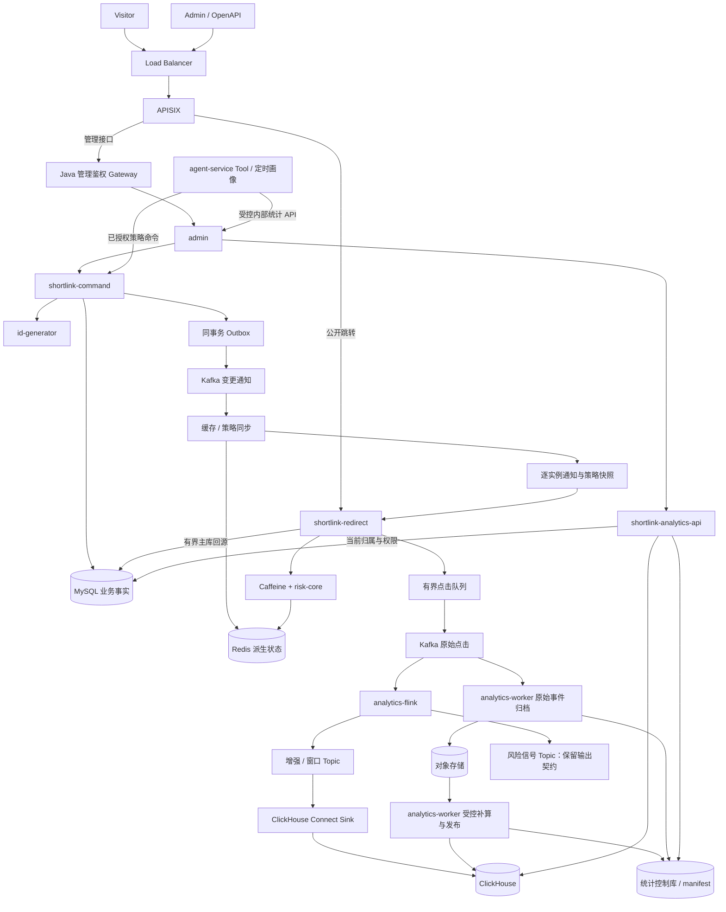
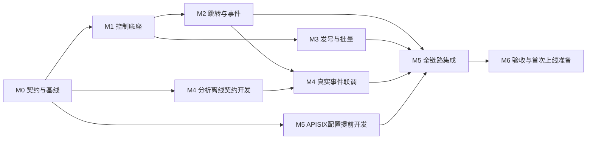

# ShortLink 生产级重构总计划 v0.7

> 开发阶段完成重构与验证，随后以目标架构首次部署正式环境。
> APISIX + Kafka + Flink + ClickHouse；跳转、控制、分析独立承载。
> 先保证实现稳固，再通过压测证明实际可靠容量。

- 文档状态：v0.7 实施设计基线；实际代码与验收范围见 [实施验收记录](04-实施验收记录.md)，本文不代表全部场景已验收。
- 更新日期：2026-09-06。
- 代码评审基线：当前仓库 HEAD 71133e5；实施任务记录实际起始 commit。
- 适用范围：身份授权、短链生命周期、批量创建、跳转、风险策略、统计、后台与 Agent、基础设施。
- 用户确认：集群峰值 100,000 跳转 QPS 作为容量规划假设；优先保证实现稳固，QPS 以最终测试结果为准。
- 实施要求：按原计划落实优化点，尤其网关加固、消息队列和节省短码生成 CPU 的号段发号器；QPS 测试放在实现完成之后，不作为是否实施这些优化的前提。
- Agent 边界：Tool 与现有定时风险画像复用重构后的统计 API；Kafka 在上游解耦采集与计算，不为 Agent 新建一套计数链路或必需的 Kafka 消费入口。
- 发号器选型：用户已确认基于固定版本 Leaf Segment 源码做嵌入式适配，归入 `id-generator`；保留批量区间预留、52 位空间及动态 Step，不默认从零重写或另建 Leaf RPC 服务。
- 环境前提：目前处于开发状态，没有需要保持运行的旧生产链路。
- 当前工作边界：优化与拆分计划，不执行业务改造、数据库变更或正式部署。
- 原文件名中的 v2 为路径兼容保留，本文版本以标题和本段为准。

配套文档：

1. [开发阶段与任务拆分](01-开发阶段与任务拆分.md)：任务 ID、依赖、路径所有权、并行波次和交接。
2. [验收矩阵与首次上线准备](02-验收矩阵与首次上线准备.md)：正确性、故障、容量与发布证据。
3. [Agent 与异步统计链路重构](03-Agent与异步统计链路重构.md)：统计复用、Tool 结果契约、画像与评分、自动动作及具体改造范围。
4. [接口与网关跳转压测计划](06-接口与网关跳转压测计划.md)：先测业务接口与 Redirect，再测 APISIX 跳转；包含负载、资源、限流口径、观测和停止条件，尚未执行。

本总计划是设计事实源；专项文档细化 Agent 契约，任务文档负责执行拆分，验收文档负责证据。v0.7 在 v0.6 基础上补齐账号及默认组初始化、Agent 直接画像读取授权、自动动作提交前置条件、统计恢复世代与时间判定、文件验证阶段、元数据版本回写和拒绝统计生产链路。实现中改变契约时，应同步相关文档，不能仅修改一处。

## 目录

1. [范围与实施原则](#范围与实施原则)
2. [现状与问题基线](#现状与问题基线)
3. [目标与容量规划](#目标与容量规划)
4. [目标架构与模块](#目标架构与模块)
5. [身份、指标与事件契约](#身份指标与事件契约)
6. [控制面事实与事务](#控制面事实与事务)
7. [路由缓存与跳转](#路由缓存与跳转)
8. [风险策略与入口治理](#风险策略与入口治理)
9. [Kafka 事件与背压](#kafka-事件与背压)
10. [Flink 计算与修订](#flink-计算与修订)
11. [ClickHouse 查询与重算](#clickhouse-查询与重算)
12. [Agent 复用统计链路](#agent-复用统计链路)
13. [号段与批量创建](#号段与批量创建)
14. [开发阶段与依赖](#开发阶段与依赖)
15. [验证、观测与首次上线](#验证观测与首次上线)
16. [决策记录与参考资料](#决策记录与参考资料)

## 范围与实施原则

### 首版必须完成

- APISIX 承接入口，Redirect 独立部署，管理与分析不挤占跳转资源。
- Kafka 保存业务点击事件；Flink 承接实时计算；ClickHouse 承接明细和分析查询。
- MySQL 保存业务事实，使用事务、Outbox、稳定 linkId 和明确的唯一约束。
- 基于 Leaf Segment 的独立 `id-generator` 代码模块、批量任务、有界 Worker、行级幂等、favicon 异步抓取；号段表沿用业务 ds_0，领取使用独立短事务和连接预算。
- 可信身份、资源归属验证、风险策略可靠发布、缓存失效、故障恢复。
- 明确统计口径、迟到与重放边界、查询幂等、重算发布协议。
- Agent 的交互式 Tool 和后台画像统一复用 Analytics API，保留数据质量与快照证据；评分及自动策略动作必须检查数据有效性。
- 经过集成、故障及容量验证的部署制品和首次上线说明。

### 三条明确的工程主线

| 主线 | 必须落地的优化 | 实现完成的判断 |
|---|---|---|
| 网关加固 | APISIX、管理非阻塞 Redis、原子限流、可信 IP/Host、身份头清洗、业务归属、risk-core 与可靠快照 | 正确规则、授权及故障场景通过，不再把阻塞调用留在响应式线程上 |
| 消息队列 | Kafka 有界异步投递、稳定事件身份、可靠消费者、背压、迟到/重复处理、Flink 与 CH 分析 | 统计 I/O 离开 302 关键路径，故障后能恢复且结果不会因重试重复累计 |
| 批量发号与创建 | 固定版本 Leaf Segment 源码适配、双 Buffer、Range Reservation、可配置动态 Step、固定置换/Base62、JDBC Batch、异步元数据与缓存批操作 | 保留可复用的领取与段生命周期，新增批量路径独立验证；短码路径移除 URL+UUID+MurmurHash、Bloom 判重和碰撞重试 |

先按这些设计实现和验证不变量，再在 M6 测量 QPS、CPU 与分配量。测量用于证明收益与定位下一轮改进，不重新决定这些主线是否需要做。

### 开发状态带来的简化

- 使用开发分支和隔离测试环境完成模块替换，不设计旧生产流量切换。
- 删除原 P0～P7、G0～G3 的线上双轨、影子运行七天和旧统计回滚要求。
- 对账使用确定性测试数据和独立计算真值，不把旧 UV 错误口径作为标准答案。
- 正式环境从新 schema 和初始化流程开始；开发数据不默认导入。
- 有保留价值的开发数据可以另做离线导入任务，保留外部短码并分配稳定身份；不是主线前置条件。
- 新 schema 不等于授权删除现有开发数据库；本计划不执行清空、覆盖或导入。
- 保留备份恢复、配置恢复和制品恢复演练。这些属于首次上线可靠性，不是旧系统切流。

### 优先级原则

1. 正确性和授权先于性能优化。
2. 关键路径独立、有界、可观测；异常不依赖无界排队消化。
3. 先建立可工作的完整链路，再用分析器定位热点；每项优化记录收益与代价。
4. 热点缓存、批处理、分桶和背压是架构能力；不预先承诺某个参数一定支撑 10 万 QPS。
5. 一个业务事实只有一个写入权威，派生数据都能从权威事实或原始事件重建。
6. 不以“最终一致”掩盖无限延迟；定义传播上限、未知状态和过期后的处理。
7. 每个阶段必须能独立构建和验证；共享 schema、契约、父 POM 由指定集成人串行修改。

### 首版后置

多地域双活、跨库业务事务、自定义短码、置换密钥轮换、复杂自适应分桶、边缘 302 缓存、强计费归因 WAL、独立发号 RPC 服务和额外统一身份平台不进入首版关键路径。

保留完整分析栈；后置的是额外能力，不降低数据正确性、授权、恢复与部署要求。

## 现状与问题基线

| 现有位置 | 已观察到的问题 | 目标改造 |
|---|---|---|
| project/ShortLinkServiceImpl.restoreUrl | Redis 命中后仍先执行同步统计再返回 302 | 只保留路由、规则判断、轻量事件入队和响应 |
| shortLinkStats / StatsSaveConsumer | 外部地域 HTTP、多表增量统计、读写锁耦合 | 从跳转移除，事件驱动计算 |
| createShortLink / batchCreateShortLink | 单条两表写未形成明确事务；批量循环复用；同步 favicon | 事务底座、真正批处理、持久化 Job |
| HashUtil / generateSuffix | UUID 拼接、32 位 Hash、Bloom 判重重试 | 唯一 linkId、固定域置换和固定长度编码 |
| t_link / t_link_goto | gid 与 full_short_url 分别路由到 16 张物理表 | 稳定路由注册事实负责全局地址唯一性 |
| Admin ShortLinkController 与 Project 对应入口 | gid 透传，未见完整资源归属校验 | 所有读写入口校验认证主体与资源归属 |
| Gateway 过滤器 | 同步 Redis、前缀白名单、代理头信任、INCR/EXPIRE 分离 | 非阻塞适配、精确路由、可信上下文、原子计数 |
| RiskPolicyRedisPublisher | 不同 policyId 可覆盖同一资源 key，撤销时直接删除 | 资源级有效策略聚合与单调 revision |
| UV/UIP 与分组统计 | 历史首次标记写入日统计；分组移动搬迁统计表 | 重新冻结正确口径和稳定身份聚合 |
| UserServiceImpl | 按请求 username 更新、密码直接比较、完整 UserDO 写 Session；注册后同步创建默认组 | 本人授权、密码安全存储、最小会话、版本撤销、持久初始化与恢复 |
| ProfileCandidateLoadNode | 从文本 gid 直接查本地画像，未使用可信主体授权 | 在画像进入卡片/LLM 前校验当前资源归属，恢复上下文同样受控 |

上述为静态代码事实，不代表已复现线上事故或测得性能瓶颈占比。

现有 Maven 模块为 admin、project、gateway、aggregation、agent-service。当前 Java/Spring 版本与 Agent 依赖需要实际兼容验证，不能直接把新 Flink 依赖加入全局 BOM 后假定兼容。

## 目标与容量规划

### 两类验收目标

| 类别 | 判定 |
|---|---|
| 正确性与稳固性 | ID 不重复；地址不误解析；权限不能绕过；版本不倒退；重复任务不重复创建；统计重放不污染已发布结果；资源与重试有上限；故障可恢复 |
| 性能与容量 | 按环境实测可靠吞吐、p95/p99、错误率、积压、恢复速度及 N-1 余量；最终可承诺流量取决于报告，不把假设写成成绩 |

规划峰值为集群每秒 100,000 次跳转请求。它不表示单机目标、全天平均负载或首次上线必须宣称达到的数字。

M0 先确定正确性契约、测试方法和工作负载假设；硬件预算与 QPS 基线未定不阻塞 M1～M5 实现。完整负载与测试环境在 M6 执行前冻结，再根据结果确定正式入口配额。未达到规划峰值时记录瓶颈、资源需求和下一轮优化；正式入口上限必须低于当前配置下经验证的可靠容量。

### 必须记录的输入

- 平均与峰值 QPS、峰值持续时间、同时活跃短链数、新建短链速率。
- 热点分布、有效/不存在/禁用/HEAD 请求比例、L1/L2 命中率。
- 单事件序列化后的均值与 p99 大小，Cookie/UA/Referer 长度。
- 单条与批量创建的行数分布、租户数、在途任务数。
- 报表查询 QPS、典型时间范围、单次可查询 linkId 数、并发导出量。
- CPU/内存/磁盘/网卡、实例数、故障域、JDK/GC、组件与连接器版本。
- 客户端发压能力、连接复用、TLS、负载均衡、完整入口路径。

### 估算公式

```
每日事件数 = 持续平均事件速率 × 86400
Kafka 数据预算 = 每日原始字节 × 保留天数 × 副本数 / 实测压缩比
另加派生 Topic、索引、积压恢复及磁盘安全余量

实时去重键数 ≈ 持续事件速率 × 去重时间
Redis 读 QPS ≈ 跳转 QPS × (1 - L1 命中率)
数据库回源 QPS ≈ 跳转 QPS × L1 miss率 × L2 miss率
数据库实际放行回源 ≤ 独立的回源并发与速率预算

Redirect 实例数以端到端实测单实例安全容量、N-1 和余量计算
不能把核心数、线程数、Kafka partition 数直接换算为业务 QPS
```

仅作算术示例：若持续 100,000 事件/秒、每事件 500 字节，则原始流量约 50 MB/s、4.32 TB/日，未计算副本和压缩。10 分钟去重约 6000 万个键；24 小时约 86.4 亿个键。因此峰值、平均值、保留期和状态期限必须分别规划。

### 参数分类

| 参数 | 初始开发值或规则 | 上线依据 |
|---|---|---|
| 虚拟 bucket | 16，契约携带 bucketVersion | 热点分布和单 partition / subtask 压测 |
| Kafka partition | 开发先配置明确数量，M6 调整 | 吞吐、恢复并行度、consumer 数；16 bucket 不等于 16 partition |
| L1 正向缓存 | expireAfterWrite 候选 1 秒，并受有效期限制 | 路由变更传播目标与命中率共同验证 |
| 空值缓存 | 候选 1 秒，容量有界 | 新建可见性及恶意探测流量 |
| 业务 DB 回源 | 严格 timeout、信号量、singleflight | 主库剩余连接和业务写入预算 |
| 批量 chunk | 初值 500～1000 行，同时限制字节数 | 事务耗时、binlog、内存和连接占用 |
| 分析实时去重 | 初值 10 分钟 | 正常重发上限、时钟容差、实际状态开销 |
| Kafka 原始保留 | 规划 7 天 | 平均流量、恢复时间、归档追平与磁盘预算 |
| 原始归档 / 分析明细 | 规划最多 180 天 | 数据用途、权限、存储预算；变更须同步重放承诺 |

以上为可调的开发起点，不是性能保证。M0 定义传播、查询、错误率与统计损失的测量口径，功能阶段验证上限机制；M6 测量后、正式上线前冻结运行预算。

## 目标架构与模块



首个正式版本即使用 APISIX 直达 Redirect。Java Gateway 只保留现有管理 Redis Session 协议的鉴权职责，这是首版明确的部署边界，不设计公开跳转的多层过渡链路。

首版 Agent 按需查询或沿用现有定时画像任务，经 Admin 授权访问 Analytics API。风险 Topic 保留分析信号输出；将其接入 Agent 以触发调度属于后续可选增强，当前不要求 Agent 新建 Kafka Consumer。信号存在不代表 ClickHouse 已可查询，也不直接授予策略执行权限。

### 模块职责

| 模块 | 目标职责与依赖边界 |
|---|---|
| event-contract | JSON Schema / DTO、版本兼容测试；不依赖 Web、MyBatis、Flink runtime |
| id-generator | Leaf Segment 固定源码适配：嵌入式号段领取、统一单条/区间预留；置换和编码独立封装，不部署 Leaf Server 或新增发号 RPC |
| risk-core | 纯规则与策略状态模型；I/O、限流存储由适配器提供 |
| shortlink-command | 生命周期、稳定身份、批量任务、授权、路由与策略事实、Outbox |
| shortlink-redirect | 请求规范化、L1/L2、主库回源、risk-core、事件入队、302 |
| analytics-flink | 独立合法明细分支、实时增强、分桶窗口与信号；提供处理覆盖证据，独立依赖和运行制品 |
| analytics-worker | 原始归档、固定输入补算、对账、封账与 manifest 发布；独立生产进程及有界执行池，复用现有 Kafka/MySQL/对象存储/CH |
| shortlink-analytics-api | 权限、查询预算、ClickHouse 查询、固定快照、多窗口批量查询、数据质量、导出 |
| admin | 用户/分组及风险中心的后台入口、既有内部 Tool Facade；分组生命周期写入经 Command 统一仲裁，透传统计质量与版本，不绕过资源权限 |
| gateway | 管理 Redis Session 鉴权、可信身份构建；无公开跳转策略热路径 |
| agent-service | Tool 与定时画像复用统计 API，确定性证据检查、Graph、解释与审核；只保存画像/审计，不自建点击计数或直接改缓存、统计事实及 APISIX 配置 |
| aggregation | 开发便利入口；不作为正式环境聚合部署 Command 与 Redirect 的方式 |

开发可先在 project 内建立清楚的接口，再逐模块搬移；每次搬移保持可构建。最终生产模块边界在 M5 结束前完成，旧统计、Hash、Redis Stream 和延迟队列代码在替代能力通过测试后删除。

部署目录规划为 deploy/mysql、deploy/redis、deploy/kafka、deploy/flink、deploy/clickhouse、deploy/apisix、deploy/observability。这些是计划路径，不表示目前已存在配置。

## 身份、指标与事件契约

### 业务身份

- linkId 是永久稳定的业务身份，分组移动不变、更改目标地址不变、回收后不复用。
- 首版租户边界为账号；tenantId 关联持久化账号 ID，不能由 username 的可变文本或用户请求体直接推导。
- 现有 gid 与 username 的关系通过明确账号映射纳入租户；以后扩展组织租户需新决策，不让本轮顺带扩展组织系统。
- admin 与 Command 的低 QPS 读写入口都验证当前主体、tenant、gid 和动作权限；创建验证目标组，移动验证来源组和目标组。
- 第一版不支持跨租户移动短链。
- 统计以 tenantId + linkId 归集。事件 gidAtEvent 仅供审计；同租户内移动分组后，历史报表跟随当前 gid。
- Analytics API 使用权威当前归属解析 linkId 集合；事件 gid、陈旧字典和请求方提供的 tenantId 不能作为授权依据。
- 分组生命周期纳入 Command 的业务事务：首版拒绝删除含未永久清除链接（含回收站链接）或未终结批量任务的分组；gid 删除后不复用。创建、恢复、移入与任务准入必须在提交事务中确认组仍有效，不能只做事务外 RPC 预检查。

### 现有账号安全与注册初始化

新增 M1-05 专门适配已有 UserService/Controller/DTO，不替换 Redis Session 登录体系。用户资料修改按可信主体定位本人，用户名不能由请求体决定修改对象；改密验证当前凭证或已有明确授权流程，查询/更新均限制字段。注册、改密使用标准 PasswordEncoder 的带盐自适应单向哈希，算法/成本及 Java 兼容性在 M0-04 固定；禁止直接保存/比较请求密码、客户端摘要充当服务器密码保护，或回退旧明文登录。密码、哈希和完整 UserDO 不进入 Session、响应或日志。

Session 只保存认证所需的主体、authVersion、签发/过期等最小字段。数据库 authVersion 是改密/禁用撤销的权威；修改凭证在同一账号事务内递增版本并保存会话回收意图。Gateway 读取并传递可信 Session 版本，M1-02 的管理后端按当前账号状态/版本复核，敏感写入在提交边界复核；旧版本不能因 Redis 回收延迟而获得授权。Redis 会话清理有持久重试，不假设它与 MySQL 原子提交。登录验证后到会话签发之间发生改密时，旧版本令牌也不能通过后端验证。Session 写入/过期有原子性与截止，密码验证并发和耗时有独立管理预算，不进入 Redirect 路径。

注册在 Admin 的同一本地事务内提交账号、注册幂等身份和默认组初始化意图；默认组实际写入仍只有 Command 权威。事务提交后以可信服务身份发送 `tenantId + DEFAULT_GROUP` 的幂等初始化命令，不依赖尚未建立的 UserContext。Command 核验当前账号和命令用途，在分组事务中返回原初始化结果或创建唯一默认组；响应丢失重试不能重复建组。

注册响应区分账号已创建与默认组 `PENDING/READY/FAILED`，失败保留可恢复状态和原因，不能让调用方盲目重新注册账号。允许本人登录查询初始化状态；注册结果/状态恢复要求本人凭证或受控注册凭据，不能匿名枚举其他账号。Admin 持久扫描器有界重试初始化及回执核对，不把一次 RPC 成功当唯一进度；重复注册请求按原身份恢复，Bloom 仅作提示，账号唯一约束以数据库为准。默认组的创建上限与初始化用途在 Command 统一仲裁，首次成功后的结果不可因组重命名/删除而被重试重新创建。001 DDL 统一交 M1-01，M1-05 负责账号运行与初始化发送，M1-03 负责 Command 接收。

### 指标字典

| 指标 | 首版定义 |
|---|---|
| redirect_request | 到达公开跳转入口的请求，按方法和结果分类 |
| click PV | 合法 GET 已解析有效路由、通过策略检查并进入业务重定向响应流程的一次事件；不代表目标站页面加载成功 |
| UV | 指定域名及查询时间范围内的独立访客标识，允许明确声明的近似估算 |
| UIP | 指定范围内规范化 IP 的独立值，允许明确声明的近似估算 |
| daily UV / UIP | Asia/Shanghai 当日范围内去重；不能累加五分钟独立数 |
| new visitor | 明确单列的新增访客指标，不能冒充 daily UV |
| group UV | 对当前组内 linkId 的访客集合取并集；禁止对各链接 UV 直接相加 |
| risk / denied | 独立风险与拒绝事件；403、429、HEAD、健康检查不计 click PV |

同一短链域名使用 Path=/、30 天有效期的 UV Cookie。跨域不自动合并访客，拒绝 Cookie 的访问无法承诺真实人数去重。Cookie 默认 Secure、HttpOnly，并验证 SameSite 与跳转场景；不要绑定具体 shortUri 路径。

事件时间统一 UTC 毫秒，报表时区固定 Asia/Shanghai。时间范围采用 startInclusive/endExclusive，API 明确输入时区。分区日期与业务统计日期分开命名。

业务生成 ClickEvent 在响应流程中的精确位置由事件工厂统一控制；客户端断连可能导致事件与网络上完整收到 302 不一致，分别记录响应错误指标，不通过重试请求“补一次点击”。

### ClickEventV1

```
eventId, schemaVersion, occurredAt, producerInstanceId
tenantId, linkId, gidAtEvent, ownershipVersion
domainNorm, shortUri, routeVersion
uvId, clientIp, userAgent, referer
requestId, traceId, bucketVersion
```

- eventId 在一次访问创建时确定；同一事件重发保持 eventId 和全部业务字段不变。
- v0.7 实施冻结：click.eventId 和 gateway.request.decisionId 使用 `v1:<occurredAt毫秒>:<受控发行后缀>`，入口按 `broker-time-v2` 严格核验时间绑定并拒绝旧裸 ID。该不变量保证同一合法身份不会移到其他窗口，按窗口索引补算后仍可识别其余字段冲突；修改时间的副本进入 `INVALID_EVENT_IDENTITY` 隔离，合法原件保持原归属。后缀最多 256 个可见 ASCII 字符，生产者首次生成后复用完整序列化内容；不能直接使用客户端传入的 requestId 作为唯一发行身份。
- UUID/ULID 可用于事件身份；“不使用 UUID”仅约束短码生成算法，不能扩展成整个系统禁止 UUID。
- 事件体设置字段长度与总字节上限，超限有明确截断标记或拒绝策略。
- UA、Referer 和 IP 视为不可信输入；规范化失败有原因码，不能使消费者无限失败。
- 相同 eventId 不同 payload 进入契约错误隔离，不能按“最后写入覆盖”静默掩盖。
- schemaVersion、解析版本、GeoIP 版本、hashVersion、statsVersion、jobRunId、detailDatasetVersion、resultBuildId 各有独立含义；下文窗口结果中的 buildId 是 resultBuildId 的简称。

UV 规范身份为 tenantId + domainNorm + uvId；UIP 为 tenantId + normalizedIp，同租户内相同 IP 跨链接合并。使用固定密钥和确定性编码计算摘要，所有实例、实时与补算共用同一身份版本，禁止按实例、日期或构建随机换盐。身份密钥首版不轮换；以后改变 hashVersion 必须从原始归档统一重算查询覆盖范围，不能直接合并不同摘要版本或 sketch。

## 控制面事实与事务

### 首版物理边界

首版业务写入使用单一 MySQL 主写数据源 ds_0。已有 t_link 的 gid 分表可以保留，新增稳定路由注册表 t_link_route 为单物理表；其读压力由缓存隔离，写压力来自创建和管理操作，不随每次点击增长。

如果容量测试证明单库或路由表不满足创建容量，另立分库设计。不能在本轮同时假设本地事务和跨库原子提交。

| 事实表 | 关键约束 |
|---|---|
| t_link_route | link_id 主键；domain_norm + short_uri 二进制/大小写敏感唯一；tenant_id、current_gid、origin_url、状态、有效期、route_version、ownership_version、target_revision |
| t_link_0 … t_link_15 | 管理详情；引用稳定 link_id；不承担跨分片地址唯一性 |
| t_group（按实际分片规则路由） | 分组生命周期事实仍在 ds_0；租户/账号映射、gid、状态和仲裁行；分组写入统一经 Command，禁止 Admin 另留直写入口 |
| t_user 与账号初始化/会话回收记录 | 当前账号、密码哈希与 auth_version；注册请求和 tenantId + DEFAULT_GROUP 唯一初始化身份；与账号变更同事务保存后续意图 |
| t_id_alloc | biz_tag 唯一且固定为 shortlink_global；max_id 为已保留范围的排他上界，初值 1；step；范围不回收；无需仅为领取协议强加 CAS version 列 |
| t_short_link_batch_job | tenant_id + request_id 唯一；请求摘要、VALIDATING/READY 等状态、租约/代次、验证清单、进度、配额预留身份及不可变输入引用 |
| t_short_link_batch_item | job_id + row_no 唯一；预留 link_id/short_uri、结果和错误；请求行摘要 |
| 创建幂等与配额预留表 | tenant_id + request_id、reservation_id 唯一；额度条件更新，预留/消耗/释放可核对，终态释放幂等 |
| t_outbox_event | event_id 唯一；aggregate_id/version、payload、状态、重试和租约 |
| 风险策略事实与有效状态表 | 策略明细可多条；resource_key + action 下有单调 policyRevision 的有效结果 |

字段、索引与分片配置在 M1 形成实际 DDL（计划路径 deploy/mysql/001-business-schema.sql），并用真实数据库验证，不仅测试 Java Mock。

### 必须原子提交的动作

```
创建/修改：
有效分组仲裁 + 路由事实 + 管理详情 + 版本递增 + Outbox

大文件受理（尚未预留链接额度）：
请求幂等记录 + 有效分组引用 + 验证槽位/字节预算 + VALIDATING Job + 验证调度意图

已验证输入的执行准入：
请求幂等记录 + 有效分组仲裁 + 额度原子预留 + Job + 调度 Outbox

批量 chunk：
Job 代次/可执行状态检查 + 有效分组仲裁 + 行级身份/结果 + 短链事实 + 进度增量 + 配额结算 + Outbox

策略变更：
策略明细 + 当前有效策略聚合 + policyRevision + Outbox
```

已持久化的 VALIDATING Job 在执行准入事务中转 READY，不重新创建 Job。请求幂等记录与验证状态可以先存在，链接额度和创建调度必须与这次状态转移全有或全无；内联且已校验的异步输入可直接在首次事务中完成执行准入。

ID 号段提前领取可以形成空洞，不随业务事务回滚而重新发放。首版 `t_id_alloc` 在 ds_0，使用独立短事务与受限连接预算；不能参加随后创建/批量业务事务而被一并回滚。所有创建实例、租户、域名与离线导入共用 `shortlink_global`，不另建 Leaf 默认 `leaf_alloc` 表并从低水位重新发号。号段数据库故障时，剩余号段只保证“还能发 ID”；若业务 MySQL 同时不可用，不能宣称创建仍能完成。

### 分组生命周期的提交仲裁

M1-03 将 Admin 的分组写入口收敛为调用 Command；现有 `t_group` 通过可信账号映射找到实际分片，和路由、Job 同在 ds_0 的本地事务内读写。M1-01 必须验证真实分片路由及锁 SQL，不能用不同连接上的检查拼装原子性，也不另建一份可独立写入的分组有效状态。

创建、移入、恢复、批量准入和删除分组均锁定同一分组仲裁行；移组按稳定次序锁定来源与目标组。删除在持锁事务中检查有效管理资源（含回收站）与未终结 Job，存在任一引用即拒绝；删除成功后旧 gid 不复用。关联查询使用索引或事务维护的引用计数并可对账，不扫描全部分片。永久清除后的路由墓碑继续保留，不作为组内可管理链接。

chunk、取消、接管和分组操作冻结一致的加锁次序，锁等待、死锁重试与事务时长均有界。创建校验后被暂停、删组并发、移组和在途 Job 的交错必须在真实 DB 中验证；任何合法提交都不能新增指向已删除分组的引用。

### Outbox 发布

- 首版使用数据库轮询 Publisher，有界批次、租约、超时、重试与失败隔离。
- 发布成功后、标记成功前崩溃允许重复发送；消费者依靠业务版本/身份处理。
- 严禁先标记已发送再实际发布。
- 路由事件按 linkId，策略事件按 resourceKey + action 分区；业务仍按版本判断，不依赖绝对消息顺序。
- 记录最老未发送年龄、重试次数、终态失败和清理水位；积压有报警与修复入口。
- Outbox 服务不能把业务 DB 连接池占满；可设独立连接预算。
- 首版不同时引入轮询和 CDC 两个发布源。

## 路由缓存与跳转

### 正常热路径

```
可信 Host / 方法 / shortUri 校验
→ Caffeine 完整 RouteInfo
→ 本地有效策略判断
→ 构建有界 ClickEvent
→ offer 到本地队列
→ 302，Cache-Control: no-store
```

L1 miss 查询 Redis，L2 miss 才受控查询主库 t_link_route。命中路径不写 MySQL、不调用 GeoIP/Agent/ClickHouse/Flink，不维护逐访客 Redis Set。

Redis Cluster 解决容量与多 key 吞吐，不能分散单个热 key；单热点主要由各 Redirect 实例 L1 承担。L1 必须是 expireAfterWrite，并在每次使用时检查业务有效期。

### 回源保护

- 同一实例、同一路由的并发 miss 合并为一次 singleflight。
- 数据库查询使用短事务或 autocommit 主库读，禁止复用长时间快照。
- 设置获取连接、查询、整体请求的截止时间，禁止无限等待分布式锁。
- 每实例回源信号量加集群总预算，预算耗尽快速返回受控 503；不存在才返回 404。
- 未知随机短码采用容量有界的负缓存和入口限制，防止扫描拖垮主库。
- 扩容、冷启动和 Redis 故障时分批预热，不能让所有实例同时全量回源。
- 首版不使用异步维护 Bloom 的否定结果强制拒绝有效新链。

### 缓存协议

RouteInfo 包含 linkId、tenantId、currentGid、originUrl、状态、expireAt、routeVersion、ownershipVersion、authorityCheckedAt、validUntil、cacheGeneration；使用独立的新格式 key，避免把旧 URL 字符串误解成 JSON。

authorityCheckedAt/validUntil 由权威读取建立，Redis→L1 拷贝不重新计龄。L1 使用期限不得超过原 RouteInfo.validUntil；到期必须有界权威核验或受控拒绝，不能反复读取旧 Redis 值来续期。负缓存遵守同一规则。TTL 到期与字段有效期都需检查，不能只相信 Redis 键仍存在。

**路由 Outbox 只发送失效/刷新提示，不把历史事件 payload 当作当前路由值写回缓存。** 消费者收到提示后失效相应缓存；需要刷新时从主库取当前事实。

仍需解决正在执行的旧查询回填：

1. Redis Lua 原子维护该路由的最低已见版本与值，比较通过才写入。
2. 通知处理、负缓存、正常回填共用同一版本检查协议。
3. 版本标记保留时间必须覆盖最大在途读截止时间及失效传播余量，不能随正向值一起立即删除。
4. Redis 全清、重建或故障恢复后使用新的 cacheGeneration；旧 generation 的在途填充必须被拒绝。
5. generation 来自权威协调记录；Redis 缺少 generation 标记时进入受控初始化，不把它当空缓存正常写入。
6. 每个 L1 实例都有 fan-out 失效与最大陈旧时间。一个 Kafka consumer group 不等于广播。

Redis Cluster 的同一次 Lua 操作只访问相同 hash tag 的资源值、版本与代次 guard，不能跨 slot 读取全局 generation key。generation 进入缓存命名空间，客户端绑定当前有效代次；切换后旧代写入即使迟到落到旧命名空间也不能被新代读取。全局协调与各 slot guard 初始化的交错、以及仍持旧代的实例如何退出服务，在 M2 用真实 Cluster 验证。

多条失效、版本更新或权威刷新使用有界 Redis Pipeline 批量发送；Pipeline 中每条涉及版本的操作仍使用原子脚本，不能以批量网络发送替代原子性。队列按 key 合并提示，避免一次大批量创建发出无限刷新任务。

删除/禁用在数据库保留状态和单调版本，不复用短码。缓存墓碑只是加速层，墓碑过期后也只能从主库恢复正确状态。

开发时允许缓存最终一致，但必须量化 create-to-resolvable、update-to-visible 和 disable-to-blocked。默认候选路由陈旧上限 1 秒，实际以 M0/M2 测试冻结；不得写“立即强一致”却只依靠异步通知。

### 通知与故障

共享缓存更新由一个 consumer group 分工处理；逐实例通知使用明确 fan-out 或独立订阅。通知断开时 L1 依赖固定写入 TTL，到期重新核验，不能因热点访问不断续期。

Redis 故障时只允许已有、未超陈旧期限的有效本地路由与策略继续服务；其余请求受主库回源预算限制。主库和缓存均不可用时，不承诺所有跳转仍成功。

## 风险策略与入口治理

### 策略事实

- policyId 标识一条策略，policyRevision 标识某资源/动作的当前有效结果；两者不能混用。
- 同一短链可存在多条有效策略，撤销一条后重新计算剩余策略，不能直接 DEL 共享 key。
- policyRevision 同时作为新自动命令的资源级前置修订；首次成功的策略集合变更、显式撤销/恢复即使没有改变最终聚合数值，也推进该修订并发布可核对状态。已提交同 commandId 重试只返回原结果，不再次递增，不能让“聚合恰好相同”掩盖后来的人工决定。
- 禁用取有效策略并集；时间窗取允许区间的交集；IP 阻断合并；限流首版限制窗口模型一致后取更严格约束。
- 不支持或有歧义的组合在写入端拒绝，不由执行端任意挑选。
- 时间窗明确区分 `UNRESTRICTED`（无时间限制）和 `ALLOW_SET`（允许区间集合）；`ALLOW_SET` 的空集合表示全部拒绝，不能沿用旧过滤器“空列表即允许”的语义。区间统一为冻结时区的左闭右开边界，跨午夜拆分后再求交集；起止相同不得隐式表示全天，全天使用显式状态。不支持的时区组合在写入端拒绝。
- 风险信号触发已有确定性规则、审核与审计流程；Agent 通过业务命令改变事实，不直接写 Redis 或 APISIX Admin API。
- 事件包含 resourceKey、action、policyRevision、effectiveAt、expireAt、删除/撤销状态和 payload 摘要。

首版由 Command 的业务库权威提交策略明细、有效结果、revision 和 Outbox。agent-service 的审核/审计仍属于其自身事务，调用策略命令使用稳定 commandId 幂等；调用超时或 ACK 不确定时查询同一 commandId 的结果，不把两个服务数据库假定为同一个本地事务。

### 自动决策的提交前置条件

基于统计生成的新策略命令携带可信资源身份、evidenceSnapshotId/recoveryEpoch、证据及规则版本、`expectedPolicyRevision` 与 `executeBefore`。执行截止为 `min(effectiveEnd + maxDataLag, evidenceCreatedAt + maxEvidenceAge)`，使用首次证据时间和冻结规则参数；不接受公网请求或 LLM 任意延长截止。Agent 调用前检查用于早拒绝，不能代替 Command 最终仲裁。

Command 先校验调用身份及结果读取权限，并按 commandId 查询已提交结果：已提交的同内容命令返回原结果，不因证据后来过期而重执行或伪报未提交；无权读取时不泄露原结果。只有新命令才在现有资源锁和事实事务内复核当前授权、资源身份、恢复世代、期望 policyRevision 与执行截止。冲突/过期明确返回 CONFLICT/EXPIRED（可保存幂等拒绝结果），不写策略事实或策略 Outbox；不得自动换 commandId 并忽略冲突重试。

人工撤销、其他策略更新与自动命令共享资源级 revision 仲裁。旧自动请求在检查后暂停，再遇人工撤销或证据超龄时不得覆盖后来的状态；需要再次评估时重新取得当前事实和证据，再形成明确的新决策。已有授权人工撤销仍不依赖旧统计是否可用。

### 自然生效与到期

有效结果携带 `evaluatedAt`、`nextTransitionAt` 和 `policyRevision`。`nextTransitionAt` 是该资源下一次策略明细生效/到期的边界；它与缓存 TTL、单条 policy 的 expireAt 分别定义。每天的允许时间窗由 risk-core 按上述区间规则判断，不靠删除整个策略缓存推进。

首版由 Command 的持久化到期索引和有界调度器在边界重算当前策略集；自然生效/到期与显式命令一样，在同一资源锁下原子更新有效结果、revision、下一边界与 Outbox。调度支持多实例租约、失效持有者拒绝、重试和重启补扫；没有 HTTP 命令也必须推进。权威查询发现边界已过时可调用同一仲裁逻辑补算，不能返回旧聚合作为当前事实。

Redirect 到达 `nextTransitionAt` 后，旧聚合不能证明当前允许状态；在预算内刷新，无法确认则 UNKNOWN 并按既定拒绝规则处理，不能因一个 TTL 到期而放行。A=10次/分钟到10点、B=100次/分钟到11点的场景，10点后必须重新得到 B；未来策略生效、调度暂停重启和边界并发撤销纳入 M2/M5-03 验收。调度延迟、时钟误差和边界传播预算在 M0/M2 冻结。

### 本地快照

明确 KNOWN_ALLOWED、KNOWN_RESTRICTED、UNKNOWN 三种状态。完整快照具有覆盖范围、generation 和增量消费水位；只有证明快照覆盖的“没有限制”才是 KNOWN_ALLOWED。

新实例在快照未加载完成前不 ready。出现增量缺口、过期或来源不可用时转 UNKNOWN，受控查询或拒绝。已知封禁不因缓存 TTL 丢失自动允许；一条明细业务到期只触发有效策略重算，不能推断剩余策略全部消失。

快照覆盖与负策略状态必须能支持新建链接；不能要求所有无策略链接无限复制到所有实例内存。以已完成的范围快照及其水位证明默认允许，对未覆盖的新资源做有界权威查询。

默认规则本地执行。确需严格全局短链限流时使用共享原子计数；这是单热 key 的独立容量边界，压测必须覆盖。APISIX 本地额度按实例生效，不能宣称它是严格集群全局配额。

### APISIX 首版职责

| 路由 | 入口行为 |
|---|---|
| 短链域名 /{shortUri} | 仅 GET/HEAD，直达 Redirect，TLS、粗限流、连接预算、请求大小限制 |
| 管理域名 /admin 与 OpenAPI | 到内部 Java 鉴权层，继续 Redis Session，后端再次校验资源权限 |
| 内部 Tool、Command、metrics、管理接口 | 不建立公网兜底路由；使用内部身份与网络隔离 |
| Agent SSE | 独立并发和最长运行时限，验证心跳、断连与缓冲配置 |

- Host、scheme、默认端口由共享规范化代码解释；仅域名小写，shortUri 大小写保留。
- 从 TCP 对端和可信代理 CIDR 推导真实 IP，忽略非可信客户端伪造的代理头。
- 所有外部请求先清洗身份头；认证后的 username/accountId/tenantId 才能形成内部主体。
- TokenValidateGatewayFilterFactory 改用非阻塞 Redis 适配并设置截止时间；返回 Mono 不会自动异步化之前的阻塞调用。必要的阻塞兼容代码仅进入有界独立调度器。
- 登录态 Redis 故障返回受控 503，无效凭证 401，无权限 403。
- 原子限流将计数与 TTL 置于同一 Lua 操作，验证窗口切换、策略修订与多实例行为；不再分别执行 INCR 和 EXPIRE。
- 首版关闭公开跳转和业务写请求的网关自动重试，不把 GET 当无副作用。
- 不启用 APISIX/CDN 302 缓存；HEAD 不生成点击 PV。
- 健康检查区分正常 302、业务 404/429 与实例故障，分析系统故障不直接摘除健康 Redirect。
- APISIX 使用 etcd 保存网关配置，Nacos 负责已有部署模式的服务发现；锁定具体模式，不同时维护无必要的双服务目录。
- 管理 API、etcd、Nacos 和密钥限制在对应信任边界内，配置通过版本化制品发布。

## Kafka 事件与背压

### Topic 与消费者

| Topic | 用途 |
|---|---|
| shortlink.click.raw.v1 | 不可变原始点击；实时处理与归档分别消费 |
| shortlink.click.enriched.v1 | 固定解析版本的增强明细 |
| shortlink.stats.5m.v1 | 全量窗口快照，含 buildId/revision |
| shortlink.risk.signal.v1 | 分析信号输出；首版 Agent 仍按需/定时查询，消息触发画像后置；不等同查询已就绪或已生效策略 |
| shortlink.route.change.v1 | 路由失效提示 |
| shortlink.risk.policy.change.v1 | 已提交有效策略变化 |
| shortlink.batch.create.v1 | 持久化 Job 的调度提示 |
| shortlink.metadata.fetch.v1 | 元数据任务 |
| shortlink.click.late.v1 | 迟到及窗口修订触发 |
| shortlink.click.dlq.v1 | 契约非法、无法解析的隔离记录 |
| shortlink.gateway.request.v1 | 独立请求结果事件：Redirect 业务拒绝与 APISIX 边缘拒绝分别标识；不作为 PV 权威 |

所有 Topic 明确保留、分区、最大消息、ACL 与 DLQ 处理责任。批量 Job 的事实在 MySQL，消息丢失可由扫描器重新提示；Kafka 不承担唯一的任务状态。

### 拒绝结果的生产与统计

`risk/denied` 不从成功 ClickEvent 推断。M0-02 为现有 `gateway.request` Topic 固定结果事件契约：稳定 decisionId、schemaVersion、发生时间、来源/拒绝阶段、方法、结果/原因、trace/request 关联、可验证的 tenantId/linkId/资源版本或 `UNRESOLVED`。Redirect 在业务拒绝时由 M2-02/M2-03 产生一次结果事件，APISIX 边缘拒绝由 M5-01 对应日志/事件适配器产生；两者来源命名空间独立，重投保持 decisionId，客户端重新请求是新的请求身份。

M4-01 独立消费结果事件，M4-02/M4-03 提供去重、拒绝指标和查询，M4-04 复用原始归档/重建能力覆盖该 Topic 所需范围；不要将入口日志与 ClickEvent 相加得到 PV。各指标的输入 Topic、水位/固定 cut、保留期限和质量分别声明，click.raw 已齐备不代表 denied 已完整，多来源查询绑定所需各输入边界。已可信解析资源的 Redirect 拒绝可按资源归集；APISIX 尚未解析短链的拒绝仅做入口/原因统计，Host、路径或客户端 tenantId 不能直接授予归属，无法证明的资源保持 UNRESOLVED。风险信号从哪些访问/拒绝指标派生，在 M0 指标契约中分别记录，不能把所有拒绝都称为风险点击。

拒绝事件使用独立有界队列、速率/字节预算和发送/丢弃质量指标，不能让拒绝洪峰阻塞跳转或成功点击投递；采集不完整须声明，不能用未知补零或声称全部请求精确计数。验收固定 10 次成功和 10 次业务拒绝，再加入边缘拒绝及重传，PV=10、业务 denied=10，未解析事件不归错租户/link。Kafka 仍在上游解耦，Agent 不增加拒绝计数消费者。

### Publisher

- 请求线程只 offer，不等待 Kafka ACK；队列按条数及字节双重有界。
- 队列满记录 drop 原因并继续普通跳转；进程崩溃前尚未持久化事件可能丢失。
- KafkaProducer.send 的元数据或 buffer 阻塞只能发生在后台 Publisher。
- 发送失败的应用级重试次数、总截止时间和重试队列都有上限；ACK 不确定时重用同一 eventId。
- 优雅停机先摘除流量再在截止时间内排空；不能宣称强杀时零丢失。
- 首版使用普通运营统计质量契约，不承诺计费级逐点击零丢失；WAL 不以一句“可增加”冒充可靠交付设计。

```
acks=all
enable.idempotence=true
compression.type=zstd
linger.ms=5
batch.size=65536
max.in.flight.requests.per.connection<=5
delivery.timeout.ms=120000
max.block.ms=100
```

这些是开发起点。正式 Kafka 同时冻结 replication.factor、min.insync.replicas、选主策略与故障行为，不能只用 acks=all 推导可靠性。

分区 key 为 linkId + bucket，bucket 由 eventId 的稳定 hash 计算。规则版本固定，分区扩容后通过测试验证状态重分布与去重，不依赖同一短链全局有序。

### 质量边界与原始归档

分别统计生成、入队、Kafka 成功确认、发送失败/结果未知、队列丢弃、消费、隔离、最终可查询。重试次数不能直接当丢失事件数。

规范统计对成功持久化且契约合法的事件负责；跳转计数与 Kafka 接收数的差异单独作为采集损失。进程突然退出造成的未持久化损失可能只能估算，不能伪造精确丢失率。

独立归档消费者把增强前的事件写对象存储，保存 topic/partition/offset 范围、文件 checksum、schema 和归档 manifest。达到持久化完成后再提交归档进度，重复文件不产生重复事实。

归档保留接收身份 `sourceTopic/partition/offset` 与不可变事件体；eventId 是点击事实身份，两者不能混用。同一事件的重复接收可以位于不同 offset 甚至扩分区后的不同 partition。归档文件不可覆盖，必须保存对象版本或不可覆盖 key、校验和以及范围内记录/隔离证据；重复归档按接收身份消重后再按事实身份处理。

### 固定时间合法性的判断上下文

作为原始重算输入的 click.raw/gateway.request Topic 显式配置 `message.timestamp.type=LogAppendTime`；M0-04 验证所选 Kafka 版本的 Broker/Producer/Consumer 行为。`receivedAt` 使用受控 broker 追加记录时的时间，并保存 timestampType、集群/Topic 身份及原始 partition/offset；它不是 payload 中的 occurredAt。消费者核验收到的 timestampType，配置不符进入未就绪/隔离，不静默改用执行时钟。Broker 时钟误差、故障与同步预算属于 M5-04 运行要求。

M0-02/M4-01 将时间合法性定义为冻结 validationVersion 下对 occurredAt、原始 receivedAt 及固定容差的确定性判断，记录结论和原因；实时窗口准入另外使用处理延迟规则，迟到不等于业务事件非法。归档保存原始接收元数据，处理覆盖账本保存对应校验版本/结论，缺少必要上下文不能发布假完整结果。

M4-04 重算沿用原始接收时基与校验版本，不能用重算 now 或重新投递 Kafka 后的新 append 时间改变同一 cut 的合法/隔离集合。修正时间规则必须显式切换相应语义版本并重新校验发布，不能偷偷改已有数据集含义。分别在首次处理、一天后、长积压恢复时重算未来时间及漂移样本，集合必须可复现；LogAppendTime 不替代对业务 payload 时间的校验。

原始 UA/IP/Referer 只有受控归档保留；加密、访问审计和生命周期与重放期限一致。归档落后接近 Kafka 保留期必须报警并采取扩容/延长保留等明确动作，不能默默丢掉可回放性。

## Flink 计算与修订

### 在线路径

```
Schema 校验与时间校验
├─ 合法事件（含重复接收与迟到）→ 本地增强 → 独立明细输出及来源覆盖证据
├─ 在线准入事件 → 有界 eventId 去重 → 稳定 bucket
│  → 五分钟局部全量快照 → 按 bucket 替换后全局合并 → 窗口结果和风险信号
└─ 非法事件 → 明确原因的隔离结果及来源覆盖证据
```

各派生输出通过下述 Kafka 事务协议提交；明细不等待五分钟窗口关闭，也不因实时去重过滤或超过准入期限而丢失。GeoIP 使用本地版本文件，UA 规则、GeoIP 文件及 hash 算法版本固定。数据文件更新通过可复现发布，不在每个点击中访问外部 HTTP。

### 输入去重与迟到

不能用“eventId State TTL 24 小时”替代容量设计。首版使用以下有界契约：

- 实时 eventId 去重初值 10 分钟。
- 正常在线增量准入为可信 occurredAt 后 8 分钟内；自动重发也不越过该边界。
- 时钟异常、未来时间或不可解释的时间漂移进入隔离；时钟同步和最大误差纳入运行要求。
- 超过在线准入期限的事件仍保存明细，只触发窗口重建，不直接再次累加实时 PV。
- 停机积压超过准入期时，通过规范明细补算恢复，不能为了追实时而放松去重规则。
- 8 分钟、10 分钟是开发默认值；调整时要同时验证时钟容差、处理延迟、重试截止与状态容量。

该方案保证约定正常路径的幂等，并用规范明细形成最终结果。它不声称有限 TTL 能实现任意历史事件的即时精确去重。

### 两阶段聚合与版本

- 局部 key：tenantId、linkId、windowStart、bucket、statsVersion、buildId。
- 每个局部结果为全量快照，携带 partialRevision；下游替换同 bucket 旧结果，不能把修订快照当增量相加。
- 全局 key 不含 gid，历史归属由查询层决定；其 revision 为 keyed state 内的单调 UInt64。
- revision 与 source offset、聚合状态一起 checkpoint；禁止把 producedAt 墙钟时间作为业务新旧依据。
- 稀疏 bucket 通过事件时间和明确超时关闭，不能等待永远没有数据的全部 16 个桶。
- UV/UIP 使用可合并的受控 sketch；算法、精度与序列化版本固定，大小计入每窗口状态预算。
- Flink sketch 不直接写入 ClickHouse AggregateFunction 二进制列，除非有兼容性证明；首版两者独立计算。

### Checkpoint 与 Kafka 输出

- KafkaSource offset、去重和聚合状态由 checkpoint 管理；派生 KafkaSink 使用 EXACTLY_ONCE。
- 下游读取 read_committed，每个作业使用独立 transactionalIdPrefix。
- 候选 checkpoint 间隔 30 秒、timeout 5 分钟；状态使用经过版本验证的磁盘 backend，checkpoint 存对象存储。
- Kafka transaction timeout、checkpoint 最长耗时和最大恢复时间必须协调并实测。
- 正常恢复使用最近已完成 checkpoint；手动回退旧 savepoint、丢失状态或全量重算必须新建 buildId。
- Kafka 事务只覆盖对应输出边界，不等于 HTTP 到最终报表端到端零丢失。

### 窗口修订与发布

实时结果标记 provisional。较晚事件只把受影响的窗口标记为待修订，任务按窗口合并与限速，防止每条迟到点击触发一次全表扫描。

规范修订在该窗口在线准入关闭后执行，固定原始 Topic 各 partition 的起止 offset 向量 sourceCut。首版从对应的完整原始归档中先限定接收范围，再按 tenantId + eventId 去重，并使用冻结的 schema、解析/GeoIP/hash 版本重建完整窗口。较晚重复接收不能改变事件是否属于旧 cut；每个 partition 分别判断成员关系，不比较不同 partition 的裸 offset。

合法事件同时在在线准入/窗口计算之外独立形成增强明细，超过 8 分钟的事件也进入同一 detailDatasetVersion。ClickHouse 的 eventId 规范行可以用于当前明细查询，但其会被替换的单个来源 offset 不承担历史 cut 证明；FINAL 也不能恢复后台合并已删除的旧接收记录。若未来改为直接从规范明细按历史 cut 重建，必须先引入可证明来源成员关系的不可变记录并补同等验收。

源 Topic 与派生 Topic 的 offset 不能直接比较。处理 envelope 保留 sourceTopic/partition/offset，或以 checkpoint 建立源范围到派生输出范围的完成屏障；consumer 在对应写入成功且查询可见、或记录明确的隔离结果后才推进覆盖水位。补算等待所有分区 sourceCut 无缺口完成，禁止用最大已见 offset 推断完整。归档保留独立覆盖证据，便于核对被过滤/去重/隔离的输入。

jobRunId 只标识运行实例/恢复世代；detailDatasetVersion 标识固定增强语义的明细数据集，正常重启或重建实时状态不改变它；resultBuildId 标识一批计算结果。修订生成独立 resultBuildId，不与在线 writer 竞争 revision。

结果写入并校验后，manifest 选择该窗口当前使用的 buildId；一旦选用修订版本，该窗口不再把在线快照相加。后续迟到再生成新修订版本。

发布带 expectedManifestRevision、覆盖范围、statsVersion、detailDatasetVersion 和完整 sourceCut，并做 CAS。相同统计口径的新输入范围必须覆盖已发布范围，较旧或不可比较的任务不能覆盖新结果；CAS 失败后重新规划或废弃旧构建。发布者有 fencing 世代，失效 Worker 无权修改 manifest。manifest 更新与相关日报/区间重算、缓存失效的持久化意图在同一统计控制库事务内提交，后续有界 Worker 重试执行；不能依赖发布后一次内存回调完成传播。

24 小时为候选正常修订期；窗口结束超过该期限、归档与输入水位齐全并完成规范重建后，才可标记 finalized。超过此期的事件进入受控补算，发布新版本并标记 corrected，不能静默丢弃或污染在线流。

日/区间指标准确性不能依赖 provisional 窗口数值相加。重算重复执行、发布中断、并发修订均须在 M4 验证。

## ClickHouse 查询与重算

### 首版存储职责

| 层 | 数据 | 正确性来源 |
|---|---|---|
| 原始归档 | 增强前事件及 offset manifest | 不可变事件身份、归档范围与校验和 |
| 增强明细 | eventId、UTC时间、tenant/link、hash、维度和处理版本 | detailDatasetVersion 内 eventId 规范去重，运行重启不拆分数据集 |
| 五分钟结果 | PV、近似UV/UIP、风险数、window、buildId、revision | 指定构建内最新完整快照 |
| 日报 / 常用区间快照 | 规范明细重建结果、数据边界和版本 | 全量计算后发布；不是 sumState 逐次累加 |
| 发布 manifest | 当前查询应选的数据版本与覆盖范围 | 原子发布与权限受控 |

ClickHouse 正式部署采用分片/副本及协调服务设计；单节点开发启动只用于联调。分片键确保同一租户/link/event 的重试副本进入同一逻辑分片，并在跨分片查询测试中验证去重。

### 发布与实际读取副本的可见性

“查询可见”针对实际读取的每个分片及合格副本集合，不能只查询写入节点后就宣布 COMPLETE。M4-02/M4-03 固定写入确认、复制完成证明、读路由与切换协议：覆盖证明绑定数据集/构建、来源屏障及副本集合代次；API 与补算校验只读取已覆盖所需边界的副本。默认 INSERT ACK、连通或消费 lag 为零均不能单独证明该资格。

查询缺少任一分片的合格副本时，在截止时间内等待或选择合格副本；预算耗尽返回未就绪/不可用，不能跳过分片、回退旧结果仍标完整。拓扑或副本切换后重新核验资格，不能沿用故障节点的证明。具体 quorum、读取设置及证明机制按 M0 锁定版本在 M4 验证；不假设开启一个参数就获得跨节点快照。

验收必须暂停 B 的复制，写入 A 并发布，再强制读 B 或关闭 A；相同 snapshot/sourceCut 不出现“完整但少算”。固定 revision 的结果还需保留/物化直到快照到期，副本追齐不替代跨页版本固定。

### 明细与窗口表约束

- 明细去重身份为 detailDatasetVersion + tenantId + eventId；jobRunId 只审计，不进入业务去重键。路由字段与 occurredAt 在重发时不可改变。
- 物理排序可按 tenant、link、业务日期、时间、eventId 优化，但排序键里的字段必须在同一事件重发时稳定。
- 使用 ReplacingMergeTree 系列只解决后台合并；规范视图通过 FINAL 或等价显式去重保障查询，不直接 count 未合并物理行。
- 原始明细包含 hashVersion、parserVersion、geoVersion，解析重算不能靠新的 ingestTime 偷偷覆盖旧语义。
- 窗口查询先限定 manifest 选中的 buildId 和 statsVersion，再按 revision 取完整 tuple 最新结果；不得把不同版本相加。
- 同一身份/revision 不同 payload 属于契约错误，报警隔离，不使用写入顺序决定胜者。

示意查询，具体表名、列和分布式执行由 M4 DDL/SQL 测试确定：

```sql
SELECT tenant_id, link_id, window_start,
       argMax(tuple(pv, uv_estimate, uip_estimate, quality), revision) AS latest
FROM shortlink_stats_5m
WHERE build_id = {selected_build_id:String}
  AND stats_version = {stats_version:UInt16}
GROUP BY tenant_id, link_id, window_start;
```

### 写入选择

首版采用 Flink → 派生 Kafka → 官方 ClickHouse Kafka Connect Sink，Connect 明确使用 at-least-once 同步批量写。由规范明细去重、全量结果身份和 revision 吸收重复，不把连接器的 exactlyOnce 选项当未验证的默认能力。

设置 tasks、batch、超时、重试、DLQ 与数据库连接预算；ClickHouse 暂停时由 Kafka 承接有限积压，超过保留期前必须报警。吞吐与重复语义一同验证，不能为增大 batch 关闭持久化确认。

### 日报、UV 和查询预算

- 删除原设计的日 sumState 增量累计路径，避免重复写与窗口修订永久放大 PV。
- 日/任意区间 PV 从规范 eventId 明细计算；UV/UIP 默认采用 uniqCombined64，作为近似数并记录算法版本和实测误差。
- 小规模确定性验收用精确去重真值，区分 HLL 误差、采集损失、迟到和重复。
- group UV 与跨日 UV 必须从联合明细或经验证的可合并状态计算，不累加标量 UV。
- 常用日报和历史区间通过有界后台任务预计算完整快照并发布；同一版本重复计算不重复累计。
- 当日开放区间可执行有界查询并缓存。设置 tenant/link 数、时间范围、扫描字节、并发与超时限制，超出范围转异步导出。
- 不在列表页逐行查询 ClickHouse；通过批量查询或每 1～5 分钟回写的只读统计快照服务列表。
- 缓存 key 包含 tenant、查询条件、归属版本和数据构建版本；分组变化及补算发布触发失效，命中后仍校验权限。
- Agent 的交互式 Tool 与后台风险画像均通过受控 API 复用这些查询；StatsEnvelope 保留质量、快照及指标版本。provisional 是否可用于实时风控由确定性门槛判断，stale/partial/unavailable 不能被当成完整实时事实；详细契约见 [Agent 专项](03-Agent与异步统计链路重构.md)。

### 历史重算

重算任务固定输入范围、sourceCut/归档 manifest、schema、解析/GeoIP/hash 版本和统计口径。写入隔离 resultBuildId，校验事件覆盖、去重结果、窗口及日报一致性后，通过 manifestRevision CAS 和发布者 fencing 发布覆盖范围；更新增强语义时新建完整 detailDatasetVersion。

重复任务、失败重试和发布中断不能混入半成品。读请求使用同一个 manifest 快照覆盖整个查询，不能前半段读旧版、后半段读新版。

原始事件保留规划为 180 天，重算能力受实际归档完整性与版本文件保留约束；不承诺恢复从未采集或已超保留期的数据。

### 归档、补算和发布的生产交付

M4-04 唯一负责新增 `analytics-worker/`（planned）模块的生产入口、归档消费者、补算调度/执行、覆盖对账、封账与发布恢复。归档和补算使用独立执行池、消费组及资源预算，可按运行角色独立部署；不能只交付测试脚本。复用现有 Kafka、MySQL、对象存储和 ClickHouse，不新增 Agent 消费入口。

使用独立统计控制库保存归档 manifest/连续覆盖、重算 Job、租约代次、构建校验、发布 manifest 及待执行的失效/派生重算意图。`deploy/mysql/002-analytics-control-schema.sql` 由 M4-04 唯一维护；不混入业务 ds_0 或 Agent 审计事务，部署实例是否共用按资源预算决定。CH/对象存储写入与该库不假设跨库原子提交：先持久化隔离产物并验证，再以当前租约代次和 CAS 发布；进程中断后按持久化身份核对、重试或清理未发布产物。

M4-01 提供来源处理/隔离与版本化增强契约，M4-02 提供落库与副本可见性，M4-03 只按发布 manifest 读取，并对未发布/不可读结果返回明确状态。补算使用同版本解析规则制品，不维护另一套统计口径。根 POM、模块配置由主集成人接入，部署清单与监控由 M5-04 集成；M4-04 必须交付归档落盘前后、补算写完未发布、发布后待执行意图的生产进程终止恢复证据。

### 统计控制库回退后的恢复协议

进程重启与控制库备份回退分别验收。M4-04/M6-03 恢复时先关闭统计发布、暂停并确认统计驱动的新自动动作入口，隔离旧归档/补算/发布进程；业务跳转和已有有效策略按原降级规则服务。记录 Kafka 消费位置、控制库可证明连续覆盖、对象清单与 CH 构建范围，不把各系统都处于同一备份时点当作前提。

创建不可复用的 `recoveryEpoch`，保存在不随旧控制库备份回退的恢复记录/受控部署配置，并绑定本轮 Worker 租约、发布请求、manifest 和快照命名空间。旧 Worker 的 epoch 不匹配即拒绝写控制/发布状态；遗留对象或 CH 输出即使较新，也须在新 epoch 下核验/登记后才能选择，不接受旧实例晚到的发布。该 epoch 不替代正常 lease/fencing，也不靠恢复后从低值重新增长的数字证明跨恢复安全。

归档恢复以控制库可证明的连续水位为起点，显式核对/seek Kafka 原始分区位置或建立受控恢复消费组；Kafka group 已提交位置较新不能跳过账本未知范围。对已存在的不可变归档验证身份/校验和后重建清单，原始记录仍在 Kafka 时可安全重读。来源 Topic 身份变化、offset 越界或保留期造成缺口时停在未完成并标明损失，禁止自动 reset 到 latest 冒充追平。派生构建按核验结果采用或从完整原始归档重建，结果发布重新验证合格读取副本。

恢复后所有旧 epoch 的 query snapshot/cursor 失效，返回 SNAPSHOT_EXPIRED 并说明恢复原因；历史画像/审计可以保留，但不能用作新的自动动作证据。Command 的受控动作入口确认新 epoch 后才重新开放，原 commandId 的已提交结果查询仍保持幂等事实。验收仅回退控制库、保持 Kafka/对象/CH 较新并让旧 Worker 晚返回：不得跳过输入、混用旧快照或接受旧发布；缺口无法恢复时如实保持降级。

## Agent 复用统计链路

### 复用边界

统计写链路保持 `Redirect → Kafka raw → Flink → 派生 Kafka → ClickHouse`；读链路是 `Agent Tool / 现有定时画像 → Admin 内部鉴权接口 → Analytics API → ClickHouse`。正常统计查询是有界同步 RPC，长查询或导出走 Analytics 的异步 Job。Agent 不消费逐点击原始事件，不执行另一套 PV/UV 聚合，不新增逐消息 LLM 调用，也不等待 Kafka 消息往返完成一次 Tool 查询。

### 统一结果与查询契约

- 普通 Tool 和 `riskprofile/source` 两个适配器都读取同一 StatsEnvelope：指标、请求范围、实际统计范围、`effectiveEnd`、`snapshotId`、`metricVersion`、新鲜度、完整性、是否暂定、近似口径及采集质量。质量字段放在现有响应 `data` 内并完整保留，避免 HTTP 适配器只取 `data` 时丢失元数据。
- `snapshotId` 由 Analytics 生成并绑定租户、查询范围、manifest、detailDatasetVersion、sourceCut 与指标版本；它是结果读取凭据，不是授权凭据。多窗口批量查询、候选分页和对应画像使用同一快照；每页和动作执行前仍校验当前资源归属。快照过期或权限范围改变时明确重启查询，不能悄悄切到新版本。
- 同一 build 内的 provisional revision 也必须固定可见性：保留明确的窗口 revision，或生成并保留有界查询物化结果；固定历史 sourceCut 的重建使用前述不可变归档协议。不能仅给响应加 snapshotId 而仍读取无约束的最新 revision，也不能依赖被替换的单行来源 offset 恢复旧 cut；无法保持快照时明确失效。
- 普通按日期查询保留原请求范围，数据不足时返回质量状态；后台 2h/24h/7d 查询允许明确选择共同可用的 `effectiveEnd`，以同一截止时间回推三个窗口。不能分别截短窗口后继续按原窗口长度计算增长率。
- Analytics 提供活跃候选分页及多链接、多窗口的有界批量查询，替代 Admin 全量扫链接后逐条查询统计。候选与列表、趋势及 group 查询均复用现有统计事实和查询预算；PV/UV/UIP 全链路采用有范围检查的长整型。
- 零访问只代表该快照与声明范围内可用数据的零值。缺失、部分覆盖、过期、未知或查询失败保留独立状态，禁止补零；近似 UV 与采集损失也分别标记，不能用成功 HTTP 或 Kafka lag 为零推导完整性。
- snapshot/画像证据携带统计 recoveryEpoch；恢复后旧世代只能作为已授权历史记录展示，不能继续分页或作为新自动动作证据。拒绝指标也只读取上游独立结果事件的已发布结果与质量，Agent 不自行补计数。

### Graph 本地画像读取的授权边界

`ProfileCandidateLoadNode` 从文本 gid 或结构化目标直接读取 Agent repository，同样是受保护的数据入口。M5-07 必须使用可信主体及当前 tenant/link/分组归属，在加载画像、生成卡片、构建 LLM 输入和写入证据之前完成资源授权；不能等待 Tool 或 Command 最终拒绝。repository 查询由 M5-06 配合加入租户/稳定身份范围，客户端 gid、旧画像 gid 和文本内容都不是授权凭据。

自由文本请求复用 Admin 的受控资源授权接口；系统 batch 使用已验证的服务身份与持久任务范围，不因内部调用就给任意 gid 全局读权限。旧 checkpoint 中的画像/卡片上下文在再次使用前重新核验当前权限和恢复世代，不能只在首次查询时检查。失败时不输出他人画像、卡片、LLM 输入或包含该证据的审计内容，只记录不含敏感数据的拒绝信息。

必要 `DefaultSecurityRiskGraphExecutor` 构造/状态接线由主集成人接入，M5-07 只适配相关业务节点，M5-06 只改已有 repository；不重写通用 harness，也不增加统计消费系统。验收覆盖正常登录用户输入他人 gid、撤权/移组后恢复旧上下文以及系统 batch 越出任务范围。

### 画像、评分与自动动作

保留现有定时任务、批次租约、Graph、模型调用、SSE 和策略命令框架。适配源查询、分页批处理、画像/分组覆盖状态、计数字段、卡片与证据分类；画像保存 `batchId`、`snapshotId`、实际窗口、质量摘要、`metricVersion` 和 `ruleVersion`，历史解释可追溯。

`RiskEvidenceClassifier` 不能仅因 Map 非空或已有卡片就将结果标记为有效证据。确定性代码先检查数据覆盖、新鲜度、样本、指标/规则兼容及授权，再评分或执行动作。实时 provisional 数据可在已冻结的门槛内使用，不强制等待全天最终修订；门槛缺失、统计降级或证据超龄时禁止新增自动动作，并说明原因。LLM 不负责绕过门槛；统计中断也不能自动解除已生效策略。

实时动作的数据延迟按执行时刻与 `effectiveEnd` 的差值判断，证据年龄不因重新查询而续期；完整历史报表的 FRESH 状态不代表满足当前自动动作门槛。

Graph 恢复旧 checkpoint 或命令 ACK 未知时，先按当前结果读取权限查询原 commandId；已提交的命令返回原事实，不因证据后来过期而重执行或伪报失败。尚未提交的新动作才重新核验证据有效期、恢复世代与当前权限，并遵循 Command 事务前置条件。重试画像或审核后生成新动作同样执行门槛；证据修订不会自动替换旧命令身份或绕过冲突。审计保留证据/规则版本，Command 的事实事务与 Outbox 仍是策略发布权威。

### 风险中心、人工审核与当前状态

现有风险中心也属于重构范围：`agent-service/.../riskcenter/`、Admin 的 RiskCenterController、RiskCenterFacadeService 及实现、AgentRiskRemoteService 和风险专用 DTO 由 M5-08 统一适配；不能只修改 Tool 和画像后留下旧响应路径。卡片、详情、列表与历史事件中的统计计数使用 long，并保留实际范围、质量及证据版本，当前详情按稳定 tenantId/linkId 解析当前分组权限。

历史风险建议、人工关注/误报标注、命令提交状态和当前有效策略分别保存/展示。不能继续用 `latestPolicyActions` 非空推导 ACTIVE，也不能用审核快照证明当前允许或已撤销。当前策略状态经 Admin 授权向 Command 有界批量查询，携带 `policyRevision`、`asOf`、`nextTransitionAt` 与可用性；失败或过边界未确认时显示 UNKNOWN，不回退为历史 ACTIVE/NONE。此路径不新增 Kafka consumer。

人工撤销仍经 M5-03 的稳定 commandId；UI 区分已提交、待确认、失败与执行端传播状态，提交成功不等于所有 Redirect 已生效，未确认时不能返回无条件 `disabled:true`。人工关注、取消关注及误报标注是本地审核行为，不隐式撤销 Command 策略；画像刷新不得覆盖人工标注的独立版本。人工重试/恢复先查原命令结果、再更新审核状态；历史事件保留事件时归属，当前查询与动作按当前授权校验。

统计质量门槛约束基于统计生成的新动作。人工明确撤销已有策略只按当前授权、目标及幂等命令验证，不能因 Analytics 不可用或旧证据过期阻止有权用户解除误封；Command/权限未知仍受控失败或待确认。

### 交付顺序

M0-05 冻结 Agent 统计、授权读取及新动作前置条件契约；M4-03 在既有 Analytics 查询中交付批量、快照和质量能力；M5-05 适配 Tool、Admin 及后台统计源；M5-06 适配画像持久化与受限查询；M5-07 适配直接画像授权、证据、规则、卡片与动作检查；M5-08 补齐风险中心，与 M5-03 的事务前置校验、命令和当前策略查询联调。Agent DDL 统一交 M5-06 合入 `003-agent-analytics-adaptation.sql`。专项验收覆盖 AG01～AG20，统一在 M6 记录运行容量；Agent 本身不新增分析基础设施。

## 号段与批量创建

### Leaf Segment 选型与复用边界

首版采用 **固定版本 Leaf Segment 源码的项目内适配**，打包到嵌入式 `id-generator`。优先保留数据库领取、Current/Next 段生命周期和异步预取协调；适配单条/批量统一分配、52 位空间、资源预算与运行环境。Leaf 原版单条 `get()` 可作为开发基线，循环调用它不能作为 `reserveRanges()` 的最终交付；不引入 Snowflake、Leaf Server、独立发号 RPC 或第二套发号命名空间。

M0-04 在 `decisions/modules-and-build.md` 冻结官方仓库、完整 commit SHA、采用文件/摘要及许可清单；M3-01 引入源码时维护 `id-generator/UPSTREAM.md` 与实际修改记录，保留上游 LICENSE 及 NOTICE（若有）。本计划确认选型，尚未导入源码或选定实际 SHA；下方 master 链接仅作评审依据，不是可复现构建输入。M3-01 维护每项适配的原因、不变量与验证证据；上游更新通过显式升级与回归，不自动跟随分支。

| 复用或适配点 | 首版处理 |
|---|---|
| 数据库号段领取 | 保留同事务原子 UPDATE、读取及 commit 后返回的协议；映射到本项目 t_id_alloc，补空间上界与影响行数/结果检查 |
| 本地段管理 | 保留 Current/Next、互斥切换及预取协调，在同一分配协议中扩展区间预留 |
| 项目扩展 | 统一 take(count)、52 位检查、有界等待与线程、关闭清理、固定/动态 Step 开关及配置校验 |
| 短码与业务 | Feistel/Base62 独立于 Segment；地址注册、请求幂等与批量事务仍归 Command |
| 运行依赖 | 核查 leaf-core 实际运行依赖和 scope，适配 Java 17；不整套引入上游 server、父 POM 或仅在上游测试中使用的依赖 |

选择复用不代表新增路径自动继承上游的正确性或容量结论。若适配必须整体重写游标、切段/缓冲复用和预取状态管理，M3-01 提交保留/重写清单与验证成本，由主集成人按既有设计变更流程决定是否改用范围明确的专用实现；默认不同时维护两套生产发号器，也不因此删减区间预留和动态 Step。

### 发号契约

- `1 <= linkId < 2^52`，0 保留；`max_id` 是排他高水位、初值 1，允许最终排他上界等于 `2^52`。领取前检查剩余空间、实际领取长度及加法溢出，禁止掩码截断后重复发号。
- 固定 `biz_tag=shortlink_global`，不接受请求传入租户/域名等作为新的 tag；启动校验数据源、表、tag 与高水位一致，不能用新表或新 tag 修复配置错误。
- MySQL 用独立短事务原子推进 `max_id`，在同一事务读取实际 `[startInclusive,endExclusive)` 并提交后才发布到本地缓冲。领取长度由本次请求固定，不受并发 step 配置变更影响；末段按剩余空间收缩实际长度，耗尽后受控失败。更新必须带上界条件并验证影响行数及所读范围；更新未成功不能读取旧范围当成新号段。无需为保持文案里的 CAS 而重写上游领取协议。
- 尾段收缩在同一事务的受锁/条件更新保护的高水位上计算，必要时增加锁定读取；DAO 返回已提交的 start/end 和实际 grantSize，缓冲按实际长度建立边界。不能拿新的 max_id 减配置 step 来推算较短尾段，否则会与已领取范围重叠；具体 SQL 在 M1/M3 冻结并以真实数据库验证。
- 领取结果不确定时废弃可能已领取范围并重新申请，不能把未知提交当失败后重用。
- Current/Next 双 Buffer，候选固定 step=100000、剩余 20% 预取；这些是本项目候选参数，不表示 Leaf 官方默认值。预取失败有界重试。
- `nextId()` 和 `reserveRanges(count)` 共用内部 `take(count)` 分配原语；每个返回区间都在同一游标/切换协议下独占，跨段可以返回多个不可变区间，不承诺整批数值连续。单条/批量交错、旧段引用与双 Buffer 槽位复用均不得重复预留。
- 允许短临界区或原子游标实现，不以无锁或固定几次 CAS 作为正确性前提。首次初始化、预取及耗尽补段的数据库 I/O 与等待一律在分配互斥锁外执行，只在短临界区发布已提交的段；初始化按命名空间合并为单一在途操作。锁等待、预取线程/在途任务、数据库超时、重试及关闭均有上界。任务拒绝、取消或失败必须清理初始化/预取运行标记，不能使缓冲永久无法补充。
- M3 先验证固定步长实现，再完成原计划的动态 Step；提供启停开关、minStep/maxStep、阈值迟滞和变化指标，默认可使用固定步长运行。
- 进程崩溃可浪费 ID。数据库恢复/主从提升前隔离旧写主与旧发号进程，禁止旧进程继续连接恢复库并废弃其本地段；证明新的起点不低于全体曾保留区间的安全排他上界后才恢复创建。业务表最大 linkId 不能证明预取号段的高水位，无法证明则停止发号；本模型不新增所谓发号租约系统。

动态 Step 借鉴 Leaf 的消耗时间反馈，在本项目中冻结具体观测区间和控制规则；候选为小于 5 分钟耗尽时扩大、超过 30 分钟时缩小，并在 10,000～1,000,000 范围内限幅，不宣称这是上游默认行为。已领取段的边界不随配置变化。多实例各自维护本地需求，数据库领取始终使用本次实际申请长度；不能因另一实例改了 step 导致重叠领取。启停、阈值来回波动、扩容时并发预取及尾段收缩均纳入正确性测试。

区间预留的部分失败分三种情况：仅在本地消耗且未持久化的范围允许弃号、不回收；已写入 `batch_item` 的 linkId/shortUri 必须复用；业务提交结果未知时先查询主库幂等结果，确认后再恢复，不能直接分配第二份身份。若一次 `reserveRanges()` 失败而未返回完整结果，其内部已消耗的部分范围整体作废，不需要为每个 ID 额外写一条预留记录。

### 短码与地址唯一性

```
稳定唯一 linkId
→ 固定密钥、固定实现版本的 52 位 Feistel 双射
→ 固定 9 位 Base62
→ 在 t_link_route 原子注册规范化地址
```

轮函数、轮数、位掩码与编码字母表在 M0/M3 冻结，保留测试向量、逆变换性质和边界测试。百万样本无重复不能替代双射性质与并发正确性证明。

首版不轮换置换密钥。不同密钥的双射可能输出相同短码，未来轮换必须提供互斥命名空间。置换仅降低直接枚举性，私密链接仍需要访问授权。

CPU 优化目标明确为消除“每条 URL 拼接 UUID、计算 URL Hash、访问 Bloom 并碰撞重试”的路径。每批预留少量连续区间，不构建 List<Long>；成功原子预留操作随实际区间数量变化，不逐 ID 分配，竞争重试单独计数。固定轮数置换与 Base62 编码直接处理数值，生成 n 条结果仍至少需要 O(n) 编码和结果写入，不能宣称整批 O(1) 或完全没有 CPU 成本。

原子操作次数、分配量和编码 CPU 在实现后通过专用微基准与批量集成压测比较；eventId 生成和 Kafka 分区所需的 hash 不在该移除范围内。

发号负载按单条创建速率、批量请求速率×实际行数、弃号与预取消耗单独建模；已有短链跳转不调用发号器。M6 分开报告发号、创建与跳转能力，不把 10 万跳转 QPS 或 Leaf 历史压测数字当成本项目发号验收结果。

地址列使用大小写敏感二进制语义；规范化仅作用于域名。首版不开放自定义短码，避免用户命名占用自动生成空间。

如果离线导入开发旧短链，保留旧外部地址，单独分配 linkId，验证所有长度/域名规则；不能从旧 32 位短码逆推新的业务 ID。

### API 与幂等

| 请求规模 | 首版处理 |
|---|---|
| 单条 | 同一创建事务，可使用 requestId 重试取得原结果 |
| 2～500 行 | 同步批量，先完整校验；合法请求在一个有界事务中全部提交，失败全部回滚 |
| 501～50000 行 | 持久化异步 Job，返回 jobId；按 chunk 提交，允许明确逐行失败结果 |
| 超过 50000 行 | 对象存储导入，流式解析，按字节和行数限制 |

阈值为开发默认值，按事务预算调整。同步提交成功但响应丢失时，通过幂等记录返回原结果，不能生成新短码。

tenantId + requestId 唯一，存储规范请求摘要；相同 key 不同内容返回冲突。每个异步 jobId + rowNo 唯一，持久化预留的 linkId、shortUri、状态、结果和行摘要。

幂等结果保留期与客户端重试、任务恢复期限一同冻结；清理结果缓存不删除业务身份约束。超过保留期仍不能直接把未知旧 key 当新请求发号，返回明确过期状态或从持久化身份查询原结果；调用方创建新业务意图才使用新 key。

已验证输入的执行准入在 ds_0 同一短事务内提交请求幂等关联、分组仲裁、条件更新预留链接额度、Job 转 READY 和执行调度 Outbox；内联输入可同时新建 Job，大文件沿用已持久的验证 Job。唯一键与余额条件更新处理并发，不采用先查余额再扣减；本次状态转移失败整体回滚到原验证状态，响应未知先查原 requestId。单条/同步批量同样把额度变化、幂等结果与业务结果纳入一个提交边界。每笔预留具有唯一身份，预留量=已消耗+已释放+仍待使用，取消/失败/恢复通过条件更新守恒且可对账。

每个 chunk 的业务行、行结果、进度、配额结算与 Outbox 在同一事务提交。事务内先对 Job 做带 fencingToken、可执行状态及有效租约的锁定/条件更新；不匹配则整块回滚。接管、续租和取消共享该数据库仲裁，不能仅靠事务外租约检查阻止旧 Worker；提交未知时先查原行结果。固定加锁顺序并限制事务/锁等待时间，重启从持久化行结果恢复，不靠本地进度变量猜测。

创建任务状态明确为 VALIDATING、READY、RUNNING、PARTIAL_SUCCESS、SUCCEEDED、FAILED、CANCEL_REQUESTED、CANCELLED。只有已提交执行准入的 READY 才能进入 RUNNING；验证与执行消息带明确 phase，不能把任意 jobId 当创建指令。取消在验证安全边界或业务 chunk 边界生效；已提交结果保留，未提交的配额按定义归还，不回收 ID。账号默认组初始化的 PENDING 属于另一业务状态，不复用于创建任务准入。

### 导入输入不可变

对象存储导入只接收已完成上传且可绑定不可变身份的对象引用；完整内容校验由后述 VALIDATING 阶段完成。受理 Job 固定 bucket/key 与不可变 versionId（或禁止覆盖的独占 key）、声明摘要/字节数及解析版本，验证 manifest 再记录实际摘要/字节数并核对声明；HTTP 请求摘要覆盖这些身份字段，不能仅记录可能被覆盖的 URL。不要把未验证的 ETag 直接当内容摘要。

rowNo 的生成由固定字符编码、格式、表头、空行和错误行规则确定；重试/续跑必须使用同一对象版本和解析规则。没有可信不可变版本时，先由有界校验阶段复制为受控不可变对象并验证完整摘要，再允许提交业务 chunk。原版本删除、摘要不符或解析版本不可用均明确失败，不自动改读最新对象，也不继续创建混合输入结果。输入对象至少保留到约定重试/恢复期限结束。

### 大文件验证与执行准入

大文件提交只做有界的身份/对象引用/声明大小检查，在同一受理事务中保存请求幂等、VALIDATING Job、组引用、验证在途槽位/字节预算和调度意图后快速返回 jobId；尚未核验的行数不用于预留链接额度。验证预算与链接额度分别记录，未知/伪造 count 不影响最终计费。

M3-03/M3-04 的验证 Worker 对固定对象流式完整校验，持久化实际字节、总行数、可执行行数、错误行及摘要/解析版本，最后提交完整验证 manifest。单行非法按既定异步逐行失败规则保留；整个文件超限、损坏或不可解析则验证失败，不创建任何链接。完整验证前不领取 linkId、不执行业务 chunk，也不把未读到的尾部当作有效输入。

验证完成后，以 Job 代次/状态和 manifest 身份条件更新，原子预留真实可执行行数对应的链接额度、转 READY、释放验证槽位并写执行调度 Outbox；组引用保持到任务终结。额度不足明确失败并释放验证预算/组引用，不留孤立链接预留；全为错误行直接终结并提供行报告。验证取消、重启和重复调度使用同一 Job，恢复可从已验证检查点继续或在预算内从头重验固定对象，半完成 manifest 不可用于执行。

### CPU、内存与公平性

- 校验实际可执行行数、URL 长度和字节数后预留租户链接额度，不能相信用户 count；验证阶段的槽位/字节预算独立准入，不占用未核实的链接额度。
- 限制每租户在途 Job、全局队列、Worker 并发、每块字节和总输入大小。
- 租户轮转/公平调度，避免单一大任务长期占满 Worker。
- 批量 Worker 使用独立部署或明确隔离的 CPU/连接预算；禁止占用 Redirect 请求线程。
- 使用 JDBC Batch 或经过验证的 MyBatis Batch；确认实际执行 SQL 及 rewriteBatchedStatements 行为。
- 分块构建和释放对象，不一次保留所有 URL、实体及导出文件；进度查询与结果下载分页。
- 批量期间同时压跳转，检查 GC、连接等待、主库锁、binlog 与尾延迟。

### 元数据抓取

favicon/title 只在事务提交后异步抓取，任务经 Outbox 可靠调度。favicon 可按规范化域名缓存，页面 title 不能跨不同 URL 共用。

限定 HTTP/HTTPS，禁止内网、环回、链路本地及云元数据地址；DNS 解析和实际连接地址验证一致，每次重定向重新验证，限制跳数、响应大小、内容类型、连接与总超时。Worker 使用受限网络出口和独立并发预算。

抓取失败不撤销已创建短链，输出可重试原因并设置退避；同 URL 合并请求，同域设置并发上限。

元数据任务携带 tenantId/linkId、单调 `targetRevision`、规范目标摘要及抓取规则版本；targetRevision 只在目标变化时推进，与 gid 和一般路由修订分开。A→B→A 也产生新目标版本，不能仅比较 URL 文本判断旧结果可用。M1-03 在目标修改事务中标记/清理旧元数据并写新抓取 Outbox；创建同样明确初始目标版本。

M3-04 抓取完成后先解析当前归属，再在业务事务内按 linkId、当前 targetRevision/摘要及允许的生命周期状态条件回写；只更新元数据字段，不覆盖目标/状态/归属。版本失配、永久删除或不允许写入的状态直接终止旧任务，不能恢复已删除资源；移组后不使用任务携带的旧 gid 寻址。重复结果幂等，重定向获取到的网页只作为本次抓取结果，不能修改短链自身 originUrl。验收 A→B 的交错完成、A→B→A、移组、删除及重复投递。

已有独立 `/tittle?url=...` 标题预览接口纳入 M3-04：首版保留有界同步预览，Admin/Project 对应 Controller、UrlTitleService 及实现通过同一受限抓取组件处理；模块搬移后只保留 Command 的实际抓取入口，不能遗留旧直连路径。预览有独立并发、速率、响应大小和总超时预算，不占用批量/Redirect 资源；一次请求只抓取并解析一次内容，移除先 openConnection 再 Jsoup 的重复访问。

提交后异步抓取和创建前预览共用地址、DNS/连接、重定向验证及受限出口；缓存不能绕过当前授权/目标校验。M1 冻结防护契约，M3-04 交付已有入口与 Worker 的实际适配，验收直接请求 `/tittle`，不能只测新建 metadata Worker。
## 开发阶段与依赖

不继续沿用原 P/G 迁移编号，统一使用 M0～M6。编号表示交付阶段，不表示已完成状态或承诺工期。

| 阶段 | 主要交付 | 进入条件 / 完成条件 |
|---|---|---|
| M0 契约与基线方法 | 业务/统计口径、Agent 查询与证据契约、容量假设、测试数据、版本矩阵、共享接口 | 冻结首版语义和可重复的测量方法，不先要求跑出 QPS |
| M1 可靠控制底座 | tenant/link 身份、账号安全/初始化、归属授权、路由事实、事务、Outbox、版本协议 | 真实 DB 验证原子性、唯一性、会话撤销与初始化恢复 |
| M2 跳转与事件 | 独立 Redirect、缓存、risk-core、Kafka Publisher、去掉同步统计 | 正常、热点、冷启动和依赖故障均有明确行为 |
| M3 发号与批量 | 固定 Leaf Segment 源码适配、双 Buffer、统一单条/Range、动态 Step、固定置换、验证/执行准入、幂等 Worker 与目标版本回写 | 来源与改动可追溯，混合并发和恢复不重号，资源有界 |
| M4 实时分析 | Flink、CH、analytics-worker 归档/补算/发布、去重/迟到、批量/快照/质量查询接口 | 固定输入重建、合格副本读取、生产进程恢复及确定性真值通过 |
| M5 目标集成 | APISIX、管理鉴权、后台、Agent Tool/画像/评分/风险中心与动作、模块和部署制品 | 首次上线拓扑及 Agent 复用统计、当前策略状态在隔离环境完整跑通 |
| M6 验收与上线准备 | 故障/恢复/混合负载、容量报告、运行手册 | 稳固性门槛通过，实际可承诺容量和入口预算确定 |



M2 不依赖 M3 全部完成，优先解除跳转同步统计；M4 可以提前使用契约样例和合成事件开发。M5 的网关加固、管理非阻塞鉴权和 APISIX 配置在契约确定后即可独立开发，不等待分析全链路完成；阶段 M5 表示最后集成验收点。

Agent 契约随 M0 冻结，M5-05～M5-08 可先使用契约夹具开发；数据源联调依赖 M4-03，风险中心当前状态和自动命令提交检查依赖 M5-03，不要求额外建设 Agent Kafka 消费链路。M1-05 的默认组发送端与 M1-03 接收端按契约并行开发后联调，不能形成注册和登录的循环前置条件。M5-02 负责模块搬移与普通后台，账号、Agent、分组生命周期和标题预览的专项路径由对应任务独占。M4-04 可与 M4-03 按冻结 manifest 契约并行；查询 API 不反向承担归档和补算运行职责。

每个任务交付：实际修改路径、禁止越界路径、接口影响、依赖任务、测试命令/结果、失败恢复点、剩余问题。计划路径与已有路径需明确区分；共享文件由主集成人统一处理。

## 验证观测与首次上线

### 验证顺序

1. 属性/单元测试验证纯算法与状态转换。
2. 真实 MySQL/Redis/Kafka/CH 集成测试验证事务、脚本、消费与查询语义。
3. 合成确定性数据验证跨窗口、跨天、分组、重复、迟到和重算。
4. 故障注入验证在提交、ACK、checkpoint、发布 manifest 前后中断。
5. 完整入口的阶梯容量与混合负载测试。
6. 与正式拓扑一致的首次部署和备份恢复演练。

不可用一百万 ID 样本替代并发协议测试，也不可用 Mock 成功替代数据库提交点和网络 ACK 不确定性测试。

### 性能测量

从低负载逐档增加，记录拐点并保留原始报告。测试必须启用真实 TLS/代理、路由缓存、风控、事件发送和数据库连接限制，不能只压一个返回 302 的空 Controller。

至少覆盖：均匀访问、80% 单热点、L1/L2/主库路径、随机不存在、限流/禁用策略、批量创建混合、实例 N-1、Redis 恢复及积压追平。

报告包含端到端 p50/p95/p99、有效成功/策略拒绝/服务错误、队列与consumer lag、CPU/GC/RSS、DB连接等待、Redis操作数、Kafka磁盘/网络、Flink状态/checkpoint、CH parts/merge/查询扫描量。

性能优化每轮只改变可解释的一组变量，保留前后相同负载与数据。正确性和恢复测试失败时，不以更高 QPS 判定改造成功。

### 观测

- 跳转：分路径耗时、L1/L2命中、singleflight、回源拒绝、路由/策略陈旧、响应错误。
- 点击/拒绝：分别记录入队字节、丢弃原因、发送确认/未知、重复、迟到、DLQ、可查询延迟和各自来源覆盖；未解析拒绝不伪装有资源归属。
- 控制：事务失败、Outbox最老年龄、Job验证/执行等待、旧代次提交拒绝、目标版本回写拒绝、配额守恒、取消及分组仲裁拒绝；账号初始化积压、版本撤销及会话回收失败。
- 计算：每分区倾斜、状态大小、checkpoint失败、窗口修订、重算积压和封账延迟。
- 存储：Kafka剩余保留容量、归档缺块、CH写入/merge/磁盘、副本延迟、合格读取副本不足、补算产物未发布与持久化意图积压。
- 安全：认证失败、归属拒绝、策略版本缺口、nextTransitionAt 超期、异常代理来源、预览/异步元数据访问拒绝。
- Agent：统计 RPC 延迟/超时、质量状态、画像读取授权拒绝、画像覆盖率与过龄、跨恢复世代快照拒绝、动作版本冲突/过期、命令重试、风险中心策略状态 UNKNOWN 与人工命令待确认；区分上游统计延迟与 Agent 查询失败。

Prometheus 使用有限标签，不把 linkId/shortUri/IP/userId 放入高基数标签。请求与事件抽样 trace，结构化日志脱敏，requestId/eventId/traceId 分工明确。

### 部署与恢复

- 冻结 JDK、Spring、Flink、Kafka、ClickHouse、Connect、APISIX、Redis、MySQL 及相关插件的兼容矩阵和镜像摘要。
- Flink 独立制品与依赖管理，避免污染业务 Spring BOM。
- Kafka、副本存储、协调服务、checkpoint、归档和 MySQL 备份按故障域与恢复目标部署。
- 开发 Compose 可用于联调；正式环境必须证明单实例故障、配置服务中断、新实例冷启动和存储恢复行为。
- 初始 schema、账号/角色、Topic、ClickHouse 表、对象存储策略和密钥通过可重复初始化创建。
- `analytics-worker` 归档/补算角色、独立统计控制库、Command 策略边界调度器均属于正式启动清单；只有在线 Flink 和测试重放脚本不算完整部署。输入对象/归档与处理版本制品按恢复期限保留，副本切换须满足发布读取资格。
- 正式配置不含示例凭证，初始化不依赖手工修改容器。
- 备份验证包含恢复后业务版本、策略状态、发号高水位、Outbox与批量任务一致性。
- 独立统计控制库回退必须执行 recoveryEpoch/消费位置/归档清单/已发布结果的恢复协议，并在恢复期间暂停统计驱动的新动作；进程终止测试不能代替控制库回退演练。
- 恢复旧制品必须验证 schema/事件兼容；尚未开放流量的首次部署失败可以修正后重建，不能把有真实数据的环境当临时测试库处理。
- 本轮只产出计划；M6 的部署说明也不代表本轮已经执行正式上线。

### 首次上线完成定义

稳固性验收无未解决的阻断项；所有失效/恢复边界有可重复证据；镜像、schema与配置能重现；实际可靠容量、正常运行流量上限、N-1余量和报警阈值已记录。

100,000 QPS 保留为容量规划假设。对外声明的能力只使用对应硬件和完整功能下测得的结果，不因目标数字尚未达到而省略授权、统计、持久化或风控。

## 决策记录与参考资料

### v0.7 的第二轮风险补充

本轮只完善计划，没有修改业务代码或执行漏洞验证。新增 M1-05，当前共 34 项任务、135 项验收场景；Leaf、完整分析栈、首次上线与最终测量 QPS 的既定安排保留。

| 风险缺口 | 冻结的处理 | 实施归属 | 验收入口 |
|---|---|---|---|
| Graph 直接读取本地画像越过授权 | 画像进入卡片/LLM 前校验可信主体及当前归属，恢复上下文同样校验 | M1-02、M5-07、M5-06 | AG19 |
| 账号修改与凭证/Session 安全 | 本人授权、标准密码哈希、最小 Session、authVersion 撤销与恢复 | M1-05、M1-02、M5-01 | A11 |
| 默认组迁到 Command 后注册半完成 | 账号与初始化意图同事务，服务身份幂等建组，状态可恢复 | M1-05、M1-03 | A12 |
| 自动决策检查后发生变化 | Command 事务内比较 expectedPolicyRevision/executeBefore；已提交同命令返回原结果 | M0-02/05、M5-03、M5-07 | AG20 |
| 统计控制库备份回退 | 隔离旧进程、新 recoveryEpoch、消费位置/归档对账、旧快照失效 | M4-04、M4-03、M5-03、M6-03 | S22 |
| 重算时间判断随运行时刻变化 | 固定 broker 原始接收时间及校验版本，重放不使用新 now | M0-02/04、M4-01、M4-04、M5-04 | S23 |
| 大文件验证与额度准入脱节 | VALIDATING 独立预算，完整 manifest 后原子转 READY 与链接额度预留 | M3-03、M3-04 | B10、更新 B08 |
| 元数据旧任务覆盖新目标 | targetRevision/摘要/生命周期条件回写，目标变更事务调度 | M1-03、M3-04 | B11 |
| 拒绝指标缺少输入链路 | 业务/边缘拒绝独立结果事件、独立覆盖与质量、去重归档查询 | M2-02/03、M5-01、M4-01～M4-04 | K05 |

验收矩阵的 AG 范围扩为 AG01～AG20。公共 DDL、客户端和 Graph 接线仍按任务文档单一归属执行；这些都是原有功能的安全/恢复适配，不新增 Agent 统计系统。

### v0.6 的风险补充与交付对应

本轮仅更新设计与实施计划，没有执行代码重构、数据库初始化或部署。以下事项均进入首版既有阶段；保留 Leaf 选型、完整分析栈、开发后首次上线及最终测量 QPS 的边界。

| 风险缺口 | 本版确定的处理 | 实施归属 | 验收入口 |
|---|---|---|---|
| 时间窗空交集与自然生效/到期 | 无约束/空允许集区分，nextTransitionAt 与权威重算，边界未知不放行 | M0-02、M2-02、M5-03 | P08、P09 |
| CH 发布与读取副本不一致 | 每分片合格读取副本及切换资格，不返回完整但缺行的结果 | M4-02、M4-03、M4-04 | S19 |
| sourceCut 与 eventId 去重冲突 | 固定完整原始归档范围后去重，保留不可变接收身份 | M4-01、M4-02、M4-04 | S20 |
| 分组删除与在途写入竞态 | 同 ds_0 分组仲裁，拒删非空/在途组，提交时检查 | M1-01、M1-03、M3-03/04 | A10 |
| 准入配额与 Job 半提交 | 幂等/额度/Job/Outbox 同事务，chunk 内验证持有代次与状态 | M1-01、M3-03、M3-04 | B08、B04 |
| 对象导入输入变化 | 固定不可变对象版本、摘要、解析和行号规则，恢复不读新对象 | M3-03、M3-04 | B09 |
| 独立标题预览漏改 | 现有 /tittle 入口与异步 Worker 共用受限抓取及独立预算 | M1-02、M3-04、M5-02 集成 | A07～A09 |
| 风险中心展示与人工操作漏改 | 新增 M5-08，历史证据/人工状态/当前 Command 策略事实分开 | M0-05、M5-03、M5-06、M5-08 | AG17、AG18及既有质量/大数用例 |
| 归档/补算仅有脚本归属 | 扩展 M4-04 为 analytics-worker 生产运行及独立控制库的唯一交付者 | M0-04、M4-04、M5-04 | S21 |

v0.6 时任务拆分为 33 项；当前任务数见 v0.7，验收编号与证据要求以[验收矩阵](02-验收矩阵与首次上线准备.md)为准。新增事项不能只追加验收而没有对应生产代码所有者，也不能由两个任务重复维护同一事实或公共 DDL。

### v0.5 的 Leaf Segment 选型调整

- 用户确认采用固定版本 Leaf Segment 源码的嵌入式适配；保留可复用的领取与段生命周期，新增批量路径承担本项目的验证和维护责任。
- M0-04 冻结上游 SHA、文件/依赖/许可证及修改记录，M1-01 统一 `t_id_alloc` 与全局 tag，M3-01 完成单条/区间统一分配、52 位与有界资源适配；沿用现有任务编号。
- 取消强制数据库 CAS 的实现措辞，保持独立事务原子领取与提交后发布；明确排他高水位、部分失败弃号和恢复时旧进程隔离，删除未定义的“发号租约”。
- 动态 Step 与 Range 仍为 M3 必做，不以性能实测决定是否实施；I10～I16 补充来源、命名空间、混合预留及故障场景，M6 如实测量收益。

### v0.4 的 Agent 专项补充

- 按用户明确要求复用 Kafka/Flink/ClickHouse 统计结果；取消总架构中风险 Topic 直接进入 Agent 的首版必需连线，将消息触发画像列为可选后续增强。
- 补充两条统计读取路径、StatsEnvelope、稳定快照、多窗口批量查询、计数字段及缺失状态。
- 将原 M5-02 中笼统的 Agent 适配拆为 M0-05 与 M5-05～M5-07，沿用 M4-03 查询能力和 M5-03 策略命令，不重写 Agent 内核。
- 新增 [Agent 专项文档](03-Agent与异步统计链路重构.md) 和 AG01～AG16 验收；自动动作必须绑定可用数据证据并保持幂等。

### v0.3 相对 v0.2 的实质变化

| 决策 | 修订结果 |
|---|---|
| 项目阶段 | 明确开发重构后首次上线，删除线上切流和长期双轨要求 |
| 目标强度 | 保留生产级完整栈，按用户确认的 10 万集群峰值假设规划，优先稳固实现 |
| 排序 | M1可靠底座后，M2跳转与M3批量并行，尽早移除同步统计 |
| 唯一性 | 稳定注册表、物理唯一约束、固定置换密钥、自定义空间后置 |
| 缓存 | 失效提示+权威回源、原子版本保护、generation、多实例失效与传播上限 |
| 批量 | 持久化行身份、提交点、租约fencing、配额与取消协议 |
| 统计 | 正确UV/时区/当前分组归属，有界去重，窗口全量修订和独立重算版本 |
| ClickHouse | 显式查询去重、全量日报快照，删除非幂等sumState增量路径 |
| 授权与风控 | 业务归属验收、多策略有效结果、UNKNOWN与明确无策略区分 |
| 容量 | 状态/磁盘/网络/队列预算、完整入口与故障负载报告 |

### 尚需在对应阶段冻结的参数

这些是实现测量任务，不是遗漏授权或等待用户逐项确认：

- M0：优化范围、业务不变量、平均/峰值假设、测量方法、组件兼容版本及 Leaf 完整源码 SHA/复用清单；机器预算未知不阻塞开发。
- M1/M2：事务与查询截止、缓存generation协议、路由与策略传播上限、回源预算。
- M3：事务块大小、Worker并发、每租户配额、发号步长与位运算实现。
- M4：去重时间/准入时间、sketch精度、归档保留预算、补算与报表查询上限。
- M5/M6：实例与故障域布局、恢复目标、正式入口配额与可承诺容量。

### 官方技术依据

- [Leaf Segment：游标分配、预取与动态 Step](https://github.com/Meituan-Dianping/Leaf/blob/master/leaf-core/src/main/java/com/sankuai/inf/leaf/segment/SegmentIDGenImpl.java)
- [Leaf SegmentBuffer：段生命周期与锁边界](https://github.com/Meituan-Dianping/Leaf/blob/master/leaf-core/src/main/java/com/sankuai/inf/leaf/segment/model/SegmentBuffer.java)
- [Leaf DAO：独立事务提交后返回号段](https://github.com/Meituan-Dianping/Leaf/blob/master/leaf-core/src/main/java/com/sankuai/inf/leaf/segment/dao/impl/IDAllocDaoImpl.java)
- [Leaf Core POM：实际依赖与 scope](https://github.com/Meituan-Dianping/Leaf/blob/master/leaf-core/pom.xml)
- [Flink Kafka Connector：交付语义与事务](https://nightlies.apache.org/flink/flink-docs-stable/docs/connectors/datastream/kafka/)
- [Kafka ProducerRecord：LogAppendTime 与业务时间的区别](https://kafka.apache.org/41/javadoc/org/apache/kafka/clients/producer/ProducerRecord.html)
- [Kafka ConsumerRecord：接收时间戳及 timestampType](https://kafka.apache.org/41/javadoc/org/apache/kafka/clients/consumer/ConsumerRecord.html)
- [Kafka Topic 配置：message.timestamp.type](https://kafka.apache.org/40/generated/topic_config.html)
- [Flink Windows：迟到、窗口生命周期与状态](https://nightlies.apache.org/flink/flink-docs-stable/docs/dev/datastream/operators/windows/)
- [ClickHouse ReplacingMergeTree：合并与查询去重边界](https://clickhouse.com/docs/reference/engines/table-engines/mergetree-family/replacingmergetree)
- [ClickHouse 复制：写入确认与副本同步边界](https://clickhouse.com/docs/reference/engines/table-engines/mergetree-family/replication)
- [ClickHouse Kafka Connect Sink：交付与批处理配置](https://clickhouse.com/docs/integrations/connectors/data-ingestion/kafka/kafka-clickhouse-connect-sink)
- [APISIX 发布与版本](https://apisix.apache.org/downloads/)
- [APISIX Nacos Discovery](https://apisix.apache.org/docs/apisix/discovery/nacos/)
- [APISIX Real IP](https://apisix.apache.org/docs/apisix/plugins/real-ip/)
- [APISIX 限流](https://apisix.apache.org/docs/apisix/plugins/limit-count/)
- [APISIX Health Check](https://apisix.apache.org/docs/apisix/tutorials/health-check/)
- [APISIX Deployment Modes](https://apisix.apache.org/docs/apisix/deployment-modes/)
- [Spring WebFlux 并发模型](https://docs.spring.io/spring-framework/reference/web/webflux/new-framework.html)
- [Redis INCR 的原子限流说明](https://redis.io/docs/latest/commands/incr/)

技术文档用于说明机制，不替代锁定版本的集成验证。实现前记录实际采用版本和对应文档，不能依赖浮动 stable/latest 作为构建输入。
