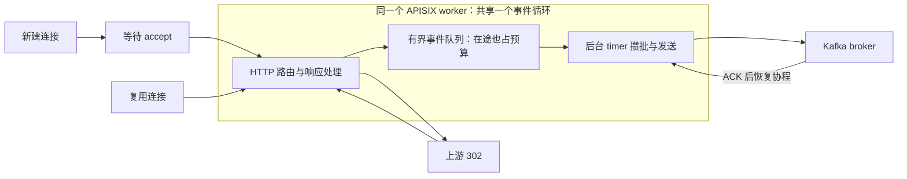

# 网关接入调度与消息攒批深度排查

日期：2026-09-09（北京时间）。分支：`codex/production-refactor-v07`。

> 后续归因复核见[报告22](22-硬件边界与架构实现瓶颈归因复核.md)：单worker高档到第4秒仍有202条首次请求未结束，不能将首秒后的数据自动视为已排除冷连接的稳态上限；历史CPU拓扑还显示4个逻辑CPU不等于4个独立物理核。本报告原始数字及全部FAIL保持不变。

本轮已把瓶颈进一步分成两个问题：**单个 APISIX worker 的持续处理能力，以及新连接进入请求处理之前的排队**。消息发送的小批次开销会加重竞争，但本轮单 worker 高负载时，Kafka broker CPU 没有先打满。增加网关 worker 后吞吐明显改善，仍存在首批连接长尾和负载端丢弃，**没有获得生产容量通过，也没有测出整套短链系统的稳定 QPS 上限**。

已落地的开发配置是 `send_linger_ms: 1`，保留显式 `0` 回退。完整统计、独立 Kafka record、ACK 后计 delivered、重试及队列预算保持原合同。`multi_accept` 仍是隔离实验配置。

## 一、测试范围和计数口径

本轮是 APISIX → 固定 302 Nginx 桩服务，同时 APISIX → 私有 Kafka 的组件诊断；没有启动 Java Redirect、Agent 或统计消费服务，也没有经过生产限流路由。因此以下结果不能替代完整业务链路、限流、统计消费或生产硬件验收。

| 资源 | 配置 |
|---|---|
| APISIX | 固定 3.11.0 镜像；CPU 0–3；1 GiB；1 或 4 个 Nginx worker |
| 固定 302 桩 | CPU 4–5；256 MiB；一个 Nginx worker；4096 connections |
| Kafka | 固定 3.9.0 镜像；CPU 8–11；1 GiB；256 MiB heap；1 broker、2 partitions、RF=1 |
| 发生器 | CPU 12–15；GOMAXPROCS=4；512 个固定 owner；64 个实际绑定源地址 |
| 请求 | HTTP/1.1 keepalive；10 个固定短码；不跟随 302；不自动重试；所有压力窗零预热 |
| 网关事件队列 | 节点共 1000 条 / 8 MiB；4 worker 时每个 250 条 / 2 MiB |
| 发送槽 | 每 worker 4 槽；节点随 worker 数从 4 槽变为 16 槽；batch 32 / 64 KiB |
| 门槛 | HTTP 与 scheduled-to-completion P99 均 ≤80ms；zero-drop；响应断言、ACK/offset、排空和观测完整 |

这里的 **APISIX worker 是 Nginx 工作进程**；`send_concurrency` 是进程内后台发送槽，允许 ACK 等待重叠，并不是 Kafka 下游消费者数量，也不是多个 CPU 执行线程。

异步发送让 ACK 等待可以让出执行机会，但路由、入队编码、发送及 ACK 后的处理仍共享该 worker 的 CPU；四个发送槽不等于四个 CPU 核。

发生器逐请求记录拨号、写入、响应头、响应体阶段及实际本地端口。用源地址、端口和连接内请求序号关联完整服务器日志；全部已发的发生器请求都完成唯一匹配。CPU 直接读取容器 cgroup，每 100ms 一次，取正式窗内首末有效采样；100% 表示一个逻辑 CPU。没有在压力窗口内轮询 Docker CLI。

## 二、实际结果：收益与失败同时保留

表中“正确/ACK”为整批最终结果，均不包括未发出的计划请求。除 noevents 外，有事件各组的正确 HTTP 数、delivered 和私有 Kafka 两分区增量一致；末端 pending、failed、rejected、retry 及观测故障均为 0。

| 实验 | 目标/s × 秒 | 正确 HTTP / ACK | 未发出 drop | HTTP P99 ms | scheduled P99 ms | 结果 |
|---|---:|---:|---:|---:|---:|---|
| 单 worker、0ms | 3000 × 5 | 15000 / 15000 | 0 | 502.450 | 502.594 | 双 P99 失败 |
| 单 worker、1ms | 3000 × 5 | 15000 / 15000 | 0 | 379.138 | 404.225 | 双 P99 失败 |
| noevents 诊断控制 | 3000 × 5 | 15000 / 0 | 0 | 72.115 | 78.872 | 控制有效；不满足事件交付职责 |
| 仅网关 multi_accept | 3000 × 5 | 14990 / 14990 | 10 | 146.844 | 149.122 | drop、双 P99 失败 |
| 网关和桩均 multi_accept | 3000 × 5 | 14688 / 14688 | 312 | 236.372 | 252.901 | drop、双 P99 失败 |
| 仅桩 multi_accept，加连接年龄观测 | 3000 × 5 | 14905 / 14905 | 95 | 617.024 | 617.399 | drop、双 P99 失败 |
| 双端 multi_accept，加连接年龄观测 | 3000 × 5 | 14842 / 14842 | 158 | 184.526 | 197.229 | drop、双 P99 失败 |
| 单 worker 高档、1ms | 6000 × 5 | 23204 / 23204 | 6796 | 3059.015 | 3100.874 | drop、双 P99 失败 |
| 4 worker、1ms | 6000 × 4 | 23709 / 23709 | 291 | 90.011 | 127.337 | drop、双 P99 失败 |
| 4 worker、双端 multi_accept、1ms | 6000 × 3 | 17737 / 17737 | 263 | 91.316 | 138.909 | drop、双 P99 失败 |

另有一次独立 CPU 采样：3000/s ×3秒，9000 次正确请求及 ACK，0 drop，HTTP P99 449.045ms。其 profiler 会改变 JIT 状态，仅用于热点诊断。还有一次组合实验在发压前因探针 worker 覆盖不足失败，0 业务请求，原 FAIL 保留，见第七节。

### 严格窗口内完成 QPS

用发生器单调时钟恢复每请求完成时刻：`exchangeStartedElapsedMillis + roundtripMillis`。只计算 `[0,T)` 内真正完成的请求，不把窗口后的响应提前计入。

| 指标 | 单 worker 高档 | 4 worker | 4 worker + 双端 multi_accept |
|---|---:|---:|---:|
| 压力窗口 | 5s | 4s | 3s |
| 窗口内正确完成 | 22783 | 23705 | 17734 |
| 窗口内完成 QPS | **4556.60** | **5926.25** | **5911.33** |
| 窗口后完成 | 421 | 4 | 3 |
| 最后一条完成距起点 | 5.105884s | 4.002868s | 3.002764s |
| 复用连接 HTTP P99 | 84.076ms | 45.349ms | 19.113ms |

4 worker 的后三个完整完成秒分别为 6000、6002、5998 次，P99 分别为 6.459、3.328、2.619ms。这是短时间内分摊工作有效的证据；首秒的错误门槛仍属于全窗，不能删掉后宣布容量通过。

4 worker 对照同时改变进程数、节点发送槽数和每 worker 队列额度，窗口长度也不同，属于组合配置对照。CPU 范围、容器内存及节点队列总预算没有增加；这些单次短窗不支持精确提升百分比、线性扩容或长期稳定性承诺。

## 三、为什么不应继续把原因笼统归给 Kafka

1ms 攒批让相同 15000 条独立事件的 Produce 请求从 **9781 降到 3746，减少 61.70%**，平均每次 Produce 从 1.534 条变为 4.004 条。两组 metadata 都只有 4 次，不是每次发送都重新拉取 metadata。

对应正式窗内部约 4.93s 的 CPU 观测：Kafka **231.15% →133.81%**，网关 **97.03% →88.16%**。这是局部开销改善；顺序执行、短窗口和多个内部操作共同变化，不把 CPU 差量精确归给一个函数。并且超过 80ms 的请求从 **288 增到 408**，较低 P99 不代表整个尾部都改善。

单 worker 的 6000/s 高档最有判别力：

- 同一个约 4.932s 内部窗口：网关 CPU **96.67%**，Kafka **50.79%**。
- 首秒后同一个约 3.925s 窗口：网关 **99.11%**，Kafka **39.74%**。
- 830 次 Produce 承载 23204 条事件，平均 **27.96 条/次**。后台批量已经明显变大，而前台请求仍持续受限。

这不符合“本档 Kafka broker CPU 先耗尽”的解释，支持网关单工作进程的执行能力及连接接入调度成为当前约束。增加 worker 后，网关可使用多个逻辑 CPU，窗口内完成数接近目标，说明尚不能称整机资源已经到顶。

同时，4 worker 分流后每次 Produce 又缩小到约 **2.64 条**，Kafka CPU 达到 **304.29%**。扩 worker 会把压力重新传给 broker；后续应按节点总发送槽及实际批量评估，不能认为任意增加 worker 都没有代价。这里没有测 Kafka 消费者 lag，不能推导下游统计消费速度。

## 四、新连接长尾已定位到哪里

基线 288 个超过 80ms 的请求全部是新连接的第一次请求。Dial 最多 35.61ms，复用请求最长 72.47ms；最慢请求的绝大部分时间在等响应头。

逐请求绝对时间对齐的例子：arrival507 在约 204.35ms 完成 Write，服务器请求计时区间约从 899.17ms 开始，到 901.17ms 记日志，客户端约 901.92ms 完成。约 **695ms** 发生在 Write 返回后、服务器请求计时开始前；同一期间已有 2175 个复用请求完成，覆盖全部 64 个来源，不能用整个客户端暂停 700ms 解释。

新增 `$connection_time` 后，仅桩开启 multi_accept 的对照中，新连接客户端 P99 **770.65ms**，而连接被 accept 后的年龄 P99 **43ms**、中位数 **2ms**。按请求关联及时间定义，这进一步支持大量等待发生在 accept 前。Nginx 使用缓存毫秒时钟，仍不能把这些间隔当作精确内核排队或 Lua CPU 时间，也没有以两个 P99 相减当作逐请求耗时。

当前固定镜像生成配置是 `accept_mutex off`、9080 `reuseport`，没有设置 `multi_accept`。Nginx 默认 off 时每次监听事件只 accept 一个连接；工作进程还要处理已有请求、上游事件与后台 timer，连接队尾可能要等待多轮事件循环。这是与现象相符的机制；正常路径不是“accept mutex 每 500ms 放行一次”。FD 耗尽异常另有恢复 timer，本轮没有据此认定发生 FD 耗尽。[Nginx 配置定义](https://nginx.org/en/docs/ngx_core_module.html#multi_accept)、[官方 accept 实现](https://github.com/nginx/nginx/blob/release-1.27.1/src/event/ngx_event_accept.c)。

`multi_accept on` 的实验把极慢新连接尾部缩短，但也把更多等待带入请求/上游计时，部分复用请求变慢。4 worker 组合中首连接最大值进一步降到 131.59ms，仍有 drop 和双 P99 失败。因此尚无足够依据把它作为默认修复。

APISIX 3.11 模板只在 events 块渲染 worker_connections；直接往 YAML 写 `event.multi_accept` 不会生效。本轮使用唯一锚点和原模板 SHA 校验的私有副本，并检查实际生成 nginx.conf，没有把未生效的 YAML 当作优化证据。

## 五、CPU 热点证据及其边界

先用 Linux 单调时钟抽样 log、worker 记录 JSON 编码、共享字典写回和 drain：基线已采样 log 最大约 **0.138ms**，编码最大约 **0.384ms**，safe_set 最大约 **0.074ms**。没有看到这些已采样单次调用出现百毫秒阻塞；未采样调用不能视为已排除，累计 CPU 开销也仍然存在。drain 包含协程 yield、多个批次及 ACK 等待，不能把其数百毫秒墙钟时间称为连续占用 CPU。

随后在独占进程启用 LuaJIT `fi10` profiler，限制 1024 个 callback、256 个栈，仅保留源码文件/行号，不采请求内容。真实采样 284 个权重；用 cgroup 的 epoch/monotonic 配对映射到正式 3 秒，剔除结束后的 1 个，正式窗为：

| VM 状态 | 权重 | 解释 |
|---|---:|---|
| C | 194 | 124 个无法定位；剩余也不是纯内核或 ACK 时间 |
| JIT 编译后的执行 N | 55 | 生成机器码执行 |
| 解释执行 I | 18 | Lua 解释执行 |
| GC G | 13 | 垃圾回收 |
| JIT 编译 J | 3 | 均在首秒 |

42 个 C 权重对应批量 Kafka roundtrip 周边栈，其中 35 个在后两秒，不能解释为首连接长尾的唯一来源。`fi10` 为函数精度，源行号也不是精确系统调用位置。未解析的 C 栈占总权重约 43.82%，**还不能宣称找到了唯一底层热点函数**。

采样启动/停止会清理 JIT trace，窗口只用于受采样影响的执行状态观察，不用于宣称性能胜出。没有观察到 JIT 编译或 GC 占主导；也不能据此排除未覆盖的短暂停顿。后续若继续优化，应在已绑定的网关进程上补原生 CPU 栈、accept/首次读和事件循环延迟，区分内核网络、C 编码与应用执行，避免继续猜测。

## 六、已完成的代码和验收

- [部署清单](../../../../deploy/apisix/apisix.yaml)：全局 logger 显式 `send_linger_ms: 1`；插件 schema 缺省仍为 0，兼容未声明参数的其他调用方。
- [性能入口](../../../../scripts/performance/supervisor.py)：CLI 及旧程序调用缺参数时默认 1，与部署一致；显式 0–5 覆盖部署字段。旧清单缺字段且显式选 0 时保持原字节；严格拒绝重复、别名、错误类型及全局 logger 块外字段，保留注释和 CRLF。
- [部署说明](../../../../deploy/apisix/README.md)：最早事件决定固定等待期限，新增事件不延后；满批、字节及配置边界提前发送。timer 向上对齐毫秒且受事件循环调度影响，1ms 是目标，不是硬延迟上界。

实际验收：

| 验证 | 结果 |
|---|---|
| 相关 Python 配置/工作进程/CPU/Redis 契约 | 59 项 PASS，0 skip |
| 当前 canonical logger 的真实 LuaJIT 调度/并发/攒批回归 | 90 项 PASS |
| 私有单调时钟插桩版本的真实 LuaJIT 回归 | 90 项 PASS |
| 诊断发生器 Go 测试 | 22 项顶层、24 项子用例 PASS |
| 1ms + 真实 Kafka 暂停/恢复及双分区完整内容核对 | 3 个场景、72 条事件 PASS |
| LuaJIT CPU 探针无网络功能验证 | PASS，启动/停止、禁止重启、权重与边界检查 |
| 压力容量验收 | **未通过**；所有失败与未发请求保留 |

72 条集成验证包含 individually ACK 的预备请求、短暂暂停本组件 broker 时的在途预算、恢复后的精确 key/body/身份及两分区内容核对。压力实验的 ACK/offset 总数闭合与这项逐条内容验证是不同证据，不扩大为统计消费者或 Agent 验收。

本轮 canonical logger SHA 仍为 `a7c806167d469fa79fae9907070c6b6a46798224ead71fc40c1bce7db14908bd`；没有把私有诊断插桩或模板副本写入该生产插件。前轮定时器修复和其余历史工作区改动继续保留。

## 七、失败诊断、预算与资源收尾

`workers4accept` 在 initial drain 内无法采齐 4 个 worker，发生器尚未调用。原报告保留 `passed=false/recordsKnown=false`，没有伪装成一次吞吐测试。独立核对了发生器文件均不存在、完整服务器日志无业务短码 GET、失败时私有两分区 offset 均为 0，以及全部所属容器停止，以新的 reconciliation 文件闭合 **0 条事件**，未覆盖原 FAIL。

原因是诊断端口 9098 未启用 reuseport，在 multi_accept 下连续探针连接集中到单 worker。只为重试角色的私有探针添加 reuseport，重新验证 4 个 worker 的 id/pid/generation 覆盖后才发压；重试得到表中的 17737 条结果，仍未通过容量门槛。

本轮共 **178147 个实际业务请求、163147 条 Kafka 记录**，差额为 noevents 的 15000 个控制请求。包括 72 条有限集成、CPU 采样和全部失败压力组；零业务 preflight 失败也单独保留。历史 33341387 条加本轮后为 **33504534 条**。200000 条本轮上限尚余 36853；历史 128 GiB / 4096B 模型上限尚余 49898 条，不通过删除旧数据重置预算。

所有测试容器均已核对停止，本轮启动的专用 Docker 引擎 PID 40 已按 PID/startTicks 身份停止。历史 MySQL、Kafka、Redis、MinIO 保持停止，未操作默认 Docker 或其他项目，历史数据保留。停止前工作区剩余约 231.22 GB。

## 八、剩余突破点

1. **接入公平性与启动阶段**：保留首批连接的独立验收，测 accept/首次 read 和事件循环延迟。多 worker 有收益，单纯无限批量 accept 的副作用也已出现，需要在冷连接和复用连接之间同时检验。
2. **节点级发送并行度与批量效率**：4 worker 的 16 槽使平均批量再次变小，broker CPU 上升。下一组应固定 CPU、worker、节点队列和持续时间，只改变每 worker 槽数或 linger，观察 RPC/事件比、ACK、队列年龄及 HTTP 尾延迟；不能只增槽。
3. **C/内核热点**：原生采样需先覆盖当前未知的 C 区域，再决定优化 JSON、socket、路由或系统调用。现有证据不支持为了性能删除完整统计，或降低 ACK 要求。

首秒后的小窗口接近 6000/s 是方向性收益，不是正式环境容量。稳定上限仍需在冷连接问题解决后，用固定硬件、真实 Redirect 和统计链路完成更长压力确认。

## 本地原始证据

原始日志、逐请求数据、源 SHA 和各实验生成配置保留在 `.work/gateway-deep-investigation-20260909/`，不自动纳入版本控制：

- [九组独立统计与严格完成窗口复核](../../../../.work/gateway-deep-investigation-20260909/report-draft.md)
- [1ms 对照独立复核](../../../../.work/gateway-deep-investigation-20260909/comparison-review.md)
- [首连接逐请求时间线](../../../../.work/gateway-deep-investigation-20260909/baseline-client-findings.md)
- [accept 源码及反证](../../../../.work/gateway-deep-investigation-20260909/accept-analysis.md)
- [CPU 正式窗口与栈复核](../../../../.work/gateway-deep-investigation-20260909/cpu-findings.md)
- [59 项 Python 测试交接与文件 SHA](../../../../.work/gateway-deep-investigation-20260909/linger-test-handoff.md)
- [当前 canonical Lua 测试](../../../../.work/gateway-deep-investigation-20260909/canonical-lua-tests.json)
- [72 条真实 Kafka 验收](../../../../.work/gateway-deep-investigation-20260909/linger-component.json)
- [最终组合实验](../../../../.work/gateway-deep-investigation-20260909/experiments/workers4acceptretry/experiment.json)
- [零流量 preflight 独立核账](../../../../.work/gateway-deep-investigation-20260909/preflight-reconciliation.json)
- [最终事件与容器账本](../../../../.work/gateway-deep-investigation-20260909/resources-final.json) · [专用引擎停止证明](../../../../.work/gateway-deep-investigation-20260909/engine-stop.json)
