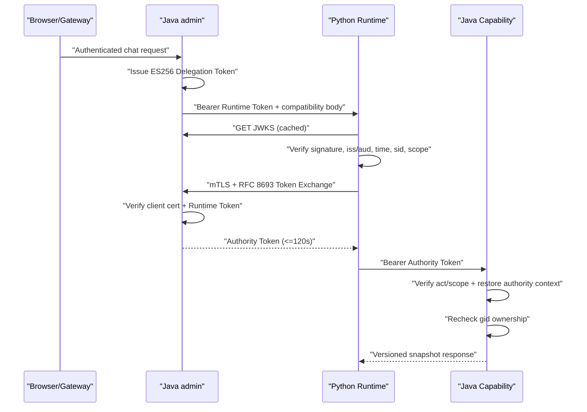

# AgentScope Python Agent 身份安全切片运行手册

> 状态：Implemented Migration Slice  
> 版本：0.5  
> 日期：2026-07-18  
> 适用范围：兼容 Campaign chat 与 v1 `groups/list`、`short-links/query`、
> `group-stats/query` 只读链路

## 1. 结论与边界

本切片建立了真实的非对称身份链路，不再用静态内部令牌伪装 JWT：

1. Java admin 使用 ES256 私钥签发 5 分钟以内的 Delegation Token。
2. Python 从 Java JWKS 获取并缓存公钥，校验用户委托和 Session/scope。
3. Python 使用 mTLS 客户端身份和 Delegation Token 执行 Token Exchange。
4. Java 签发 120 秒以内的 Authority Token，并限制 scope 为原 Token 子集。
5. v1 capability 从 Authority Token 恢复 Actor/Tenant/Session/Scope，再执行资源所有权校验。

当前实现仍不是完整生产身份平台：

- 新 Session 的 `sid` 由 Java Bootstrap 生成，并绑定持久化 `agent_session_grant`；兼容 chat
  路径仍保留但不改变 Java authority 的唯一写者地位。
- Java 已具备 JTI 撤销表、Session 撤销事务 Outbox 和同步 Revocation Check；Python 已具备
  fail-closed 同步核验及本地事件拒绝缓存。Outbox 发布器和多实例事件传输仍未完成。
- Browser 直连 Runtime Session/Run API 尚未实现。
- `groups/list`、`short-links/query` 与 `group-stats/query` 使用 Authority Token；其余旧 Tool
  仍使用 legacy Header。
- 配置切换需要服务重启，尚不是控制面动态 Kill Switch。

因此 G1/G2 仍不得标记为通过。

## 2. 调用链



## 3. 安全不变量

1. 只允许 `alg=ES256`、`crv=P-256`、`typ=JWT`、`use=sig`。
2. Runtime Token audience 必须严格等于 `shortlink-agent-runtime`。
3. Authority Token audience 必须严格等于 `shortlink-authority`。
4. Authority Token 必须有 `act.sub=shortlink-agent-runtime` 和 `parent_jti`。
5. Authority scope 必须是 Delegation scope 子集，不允许 Token Exchange 扩权。
6. Runtime Token 最长 300 秒；Authority Token 最长 120 秒且不得超过父 Token。
7. `sid`、`tid`、`jti`、scope 使用受限字符集和长度上限。
8. Bearer Header 一旦出现但无效，`dual` 模式也不得回退 legacy。
9. Token 不进入 URL、业务 Body、Actor 数据类、日志、Trace attribute 或全局缓存。
10. Python Permission 只缩小 Tool 可见面，Java 仍是资源授权最终裁决者。

## 4. API

### 4.1 JWKS

```http
GET /internal/short-link-admin/v1/agent-identity/jwks.json
```

响应只包含公钥，`Cache-Control` 最大 5 分钟。Python 限制最多 10 个 Key、64 KiB 响应，
未知 `kid` 强制刷新受 10 秒节流保护，避免随机 `kid` 形成对 Java 的放大流量。

### 4.2 Token Exchange

```http
POST /internal/short-link-admin/v1/agent-identity/token/exchange
Content-Type: application/x-www-form-urlencoded
```

必须同时满足：

- 连接经过 TLS。
- Servlet 容器已验证客户端证书链。
- 叶子证书包含 clientAuth EKU `1.3.6.1.5.5.7.3.2`。
- 叶子证书 SHA-256 指纹位于允许列表。
- subject token 的签名、audience、生命周期和 Claims 有效。
- 请求 scope 可交换且属于 subject token scope。

共享 Schema 位于 `schemas/agent-identity/v1/`。

## 5. Java 配置

| 环境变量 | 说明 | 默认值 |
|---|---|---|
| `AGENT_RUNTIME_AUTH_MODE` | `LEGACY`/`DUAL`/`DELEGATION_JWT` | `LEGACY` |
| `AGENT_CAPABILITY_AUTH_MODE` | `LEGACY`/`DUAL`/`AUTHORITY_TOKEN` | `LEGACY` |
| `AGENT_TOKEN_ISSUER` | Token issuer | `shortlink-admin` |
| `AGENT_RUNTIME_AUDIENCE` | Runtime audience | `shortlink-agent-runtime` |
| `AGENT_AUTHORITY_AUDIENCE` | Authority audience | `shortlink-authority` |
| `AGENT_RUNTIME_SERVICE_ID` | `act.sub` 与服务身份 | `shortlink-agent-runtime` |
| `AGENT_DEFAULT_TENANT_ID` | 当前显式逻辑租户 | `tenant-default` |
| `AGENT_SIGNING_JWK_FILE` | 当前私有 EC JWK 挂载路径 | 空 |
| `AGENT_VERIFICATION_JWKS_FILE` | 轮换窗口旧公钥 JWKS 路径 | 空 |
| `AGENT_TOKEN_EXCHANGE_ENABLED` | 是否开放 Exchange 逻辑 | `false` |
| `AGENT_RUNTIME_CLIENT_CERTIFICATE_SHA256` | 允许的客户端证书指纹，逗号分隔 | 空 |
| `AGENT_REQUIRE_CLIENT_AUTH_EKU` | 是否强制 clientAuth EKU | `true` |
| `AGENT_INTERNAL_TOKEN` | legacy 回滚凭据 | 空且 fail closed |

任何非 legacy 模式缺少签名 Key 都会 fail closed。生产私钥文件必须来自 Secret Manager、
CSI Secret Store 或等价只读挂载，不得进入仓库、镜像层、ConfigMap 或日志。

私有 JWK 必须至少包含：

```json
{
  "kty": "EC",
  "use": "sig",
  "alg": "ES256",
  "kid": "agent-signing-2026-07",
  "crv": "P-256",
  "x": "<base64url-public-x>",
  "y": "<base64url-public-y>",
  "d": "<secret-private-scalar>"
}
```

长期目标应将文件签名器替换为 KMS/HSM signer；JWKS、Claims 和验证接口保持不变。

## 6. Python 配置

| 环境变量 | 说明 | 默认值 |
|---|---|---|
| `SHORTLINK_AGENT_RUNTIME_AUTH_MODE` | `legacy`/`dual`/`delegation_jwt` | `legacy` |
| `SHORTLINK_AGENT_DELEGATION_JWKS_URL` | Java JWKS HTTPS 地址 | admin 本地地址 |
| `SHORTLINK_AGENT_DELEGATION_ISSUER` | 期望 issuer | `shortlink-admin` |
| `SHORTLINK_AGENT_DELEGATION_AUDIENCE` | 期望 audience | `shortlink-agent-runtime` |
| `SHORTLINK_AGENT_JWKS_CACHE_TTL_SECONDS` | JWKS TTL 上限 | `300` |
| `SHORTLINK_AGENT_JWKS_UNKNOWN_KID_REFRESH_SECONDS` | 未知 kid 刷新节流 | `10` |
| `SHORTLINK_AGENT_V1_CAPABILITY_AUTH_MODE` | `legacy`/`token_exchange` | `legacy` |
| `SHORTLINK_AGENT_GROUPS_LIST_CONTRACT` | 分组列表独立契约回滚：`v1`/`legacy` | `v1` |
| `SHORTLINK_AGENT_SHORT_LINKS_CONTRACT` | 短链分页独立契约回滚：`v1`/`legacy` | `v1` |
| `SHORTLINK_AGENT_GROUP_STATS_CONTRACT` | 分组统计独立契约回滚：`v1`/`legacy` | `v1` |
| `SHORTLINK_AGENT_AUTHORITY_MTLS_CERT_FILE` | 客户端证书链 | 空 |
| `SHORTLINK_AGENT_AUTHORITY_MTLS_KEY_FILE` | 客户端私钥 | 空 |
| `SHORTLINK_AGENT_AUTHORITY_MTLS_CA_FILE` | Java 服务端信任 CA | 系统 CA |

staging/production 启用 JWT 时 JWKS 必须使用 HTTPS；启用 Token Exchange 时
`AUTHORITY_BASE_URL` 必须是 HTTPS，客户端证书和私钥文件必须存在。

## 7. mTLS 部署前提

Java 代码对客户端证书进行二次指纹和 EKU 校验，但 TLS 握手必须由部署层真实建立：

1. admin TLS listener 使用受控 server certificate。
2. `server.ssl.client-auth=need` 或平台等价配置。
3. trust store 只信任 Runtime workload CA。
4. Python certificate SAN 标识 Runtime workload，且证书用于 clientAuth。
5. Python 验证 Java server certificate 和 hostname。
6. Token Exchange 不得经普通 HTTP 或不可信 TLS 终止代理。

当前实现不信任 `X-Forwarded-Client-Cert`。若未来由 Service Mesh 终止 mTLS，必须新增经过
签名/网络边界保护的 workload identity adapter，不能直接读取可伪造 Header。

## 8. 灰度状态机

| 状态 | Java Runtime | Python Runtime | Java Capability | Python v1 Capability |
|---|---|---|---|---|
| S0 | `LEGACY` | `legacy` | `LEGACY` | `legacy` |
| S1 | `DUAL` | `dual` | `DUAL` | `token_exchange` |
| S2 | `DELEGATION_JWT` | `delegation_jwt` | `AUTHORITY_TOKEN` | `token_exchange` |

### 8.1 升级顺序

1. 部署当前 `0.7.0` 代码（包含既有身份、Session Grant 与三个只读 capability 切片），所有
   模式保持 S0。
2. 挂载签名 Key、轮换 JWKS、TLS trust store、Runtime client certificate。
3. 启用 `AGENT_TOKEN_EXCHANGE_ENABLED=true`，Java capability 切为 `DUAL`。
4. Python 切为 `runtime_auth_mode=dual`、`v1_capability_auth_mode=token_exchange`。
5. Java Runtime 切为 `DUAL`，确认 Python 使用 Claims 身份且 v1 不再发送 trusted Header。
6. 观察 JWKS、Token Exchange、401/403、scope mismatch 和 capability 延迟。
7. Python Runtime 切为 `delegation_jwt`。
8. Java Runtime 切为 `DELEGATION_JWT`，Java capability 切为 `AUTHORITY_TOKEN`。

不得跳过 S1 直接从 S0 到 S2。

### 8.2 回滚顺序

1. Java capability 从 `AUTHORITY_TOKEN` 降为 `DUAL`。
2. Python Runtime 从 `delegation_jwt` 降为 `dual`，将
   `SHORTLINK_AGENT_V1_CAPABILITY_AUTH_MODE` 改为 `legacy` 并重启。仅当具体 capability 契约也
   需要回滚时，才独立切换对应的 `*_CONTRACT=legacy`，不得联动或自动降级。
3. Java Runtime 改为 `LEGACY`，Java capability 改为 `LEGACY`。
4. Python Runtime 最后改为 `legacy`。

回滚只改变认证路径，不删除 Key、Snapshot、业务数据或 Java v1 endpoint。顺序错误可能造成
短时 401，因此必须在 staging 演练并固化自动化 Runbook。

## 9. Key 与证书轮换

正常签名 Key 轮换：

1. 生成新 P-256 Key，分配全新 `kid`。
2. verification JWKS 同时发布旧公钥和新公钥。
3. 所有 Python 实例观察到新 JWKS 后，将新私钥设为 active signing JWK。
4. 等待最大 Token TTL、clock skew 和 JWKS TTL 全部过去。
5. 删除旧公钥并重启/刷新 Key Ring。

客户端证书轮换：

1. Java 指纹允许列表同时加入新旧证书。
2. Python 切换证书并验证 Exchange。
3. 等待旧连接和 Authority Token 过期。
4. 从允许列表删除旧指纹。

若签名私钥疑似泄露，不等待 TTL：立即切换新 Key、从 JWKS 移除受损 `kid`、使现有 Token
失效，并执行安全事件响应。

## 10. 验收与告警

上线前必须验证：

- JWKS 不包含 `d` 或任何私钥字段。
- 错误 issuer/audience/alg/kid/ctx_ver/sid/scope 全部拒绝。
- Authority Token 不能访问 Runtime；Runtime Token 不能直接访问 Authority。
- 无证书、非 TLS、错误指纹、缺少 clientAuth EKU 全部拒绝。
- Bearer 失败时不走 legacy fallback。
- Token Exchange 不超过 120 秒且 scope 不扩张。
- `groups/list` 与 `short-links/query` 只接受 `capability:group:read`；`group-stats/query` 只接受
  `capability:stats:read`。
- capability 仍执行 gid 所有权校验。
- Token、JWK 私钥和证书私钥不出现在日志、Trace、错误或线程转储采集规则中。

建议告警：

- JWKS 获取失败率和未知 `kid` 率。
- Token Exchange 401/403/5xx、延迟和证书指纹不匹配。
- Runtime/Authority audience mismatch 和 scope mismatch。
- legacy 调用比例在 S1 后不下降。
- capability 认证失败与资源越权拒绝的突增。

## 11. 后续门禁

下一身份阶段必须完成：

1. Outbox Publisher、Python 多实例撤销事件消费者和活动 Run 取消/Workspace 回收。
2. Browser 经 Gateway 直连 Runtime 的 Session/Run API，并强制使用 Java Bootstrap 生成的 sid。
3. 动态 Kill Switch 和无发布回滚。
4. KMS/HSM signer、自动 Key/证书轮换与审计。
5. 真实 TLS 环境的端到端握手、故障注入和回滚演练。
