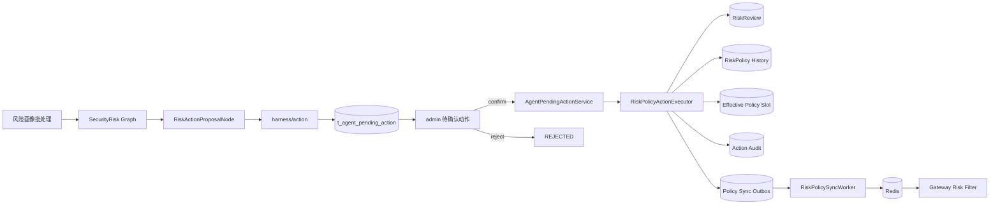
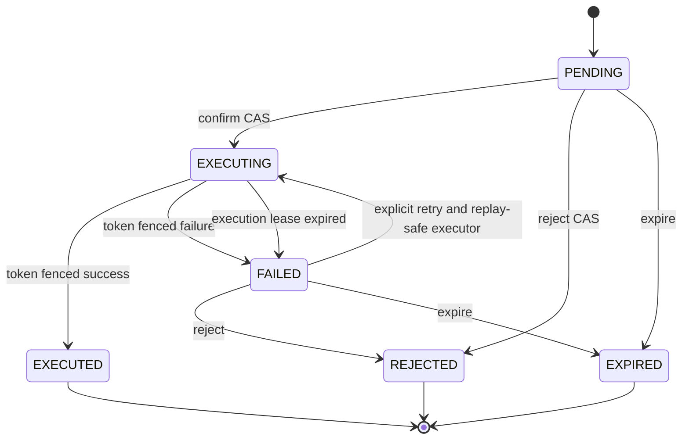

# 待确认动作与策略一致性详细设计

> **文档状态：** 已确认，待实施
>
> **确认日期：** 2026-07-10
>
> **适用模块：** `agent-service`、`admin`、`gateway`
>
> **前置阶段：** 风控生产编排、风险画像批处理、SecurityRisk Graph、risk-center、risk-policy 和 Gateway 热路径已经完成
>
> **后续阶段：** Harness 生产能力、Campaign Planner 和创建短链待确认动作

> **文档优先级：** 本文是阶段 02 的详细设计事实源。若与 `01_Agent生产就绪增强设计.md` 的第 7-8 节或现有阶段 02 任务草案存在差异，以本文为准；最终实施计划必须依据本文重写任务粒度和接口签名。

## 1. 背景

当前系统已经能够完成以下链路：

```text
访问统计
  -> 两小时风险画像批处理
  -> SecurityRisk Graph
  -> 风险事件和快照
  -> 高置信度 LIMIT_RATE 自动策略
  -> Redis
  -> Gateway 热路径拦截
```

但是当前 `pendingActions` 仍然只是 `RiskResponseComposeNode` 在响应阶段临时拼装的展示数据：

```text
没有 actionId
没有结构化 payload
没有持久化状态
没有授权范围
没有确认和拒绝接口
没有并发控制
没有执行器
没有可恢复的执行结果
```

同时，现有 `RiskPolicyService` 使用“先写 MySQL，再同步调用 Redis”的方式激活策略。Redis 失败时会将数据库策略改为 `EXPIRED`。该实现存在以下一致性缺口：

```text
数据库与 Redis 不是同一事务。
同一 policyKey 可以存在多个 ACTIVE 历史记录。
旧策略撤销会直接删除 Redis key，可能误删更新版本。
Redis 短暂故障会让已经确认的策略永久失效。
人工确认、审核、策略、审计和 Redis 发布无法形成一个可恢复闭环。
```

本设计用于补齐通用待确认动作、风控人工处置、有效策略槽位和 Redis Outbox，并为后续 Campaign 创建短链接动作提供可复用基础。

## 2. 设计目标

```text
1. Graph 只提出结构化写动作，不直接执行危险写操作。
2. 待确认动作必须可查询、可拒绝、可确认、可审计、可恢复。
3. 同一次 Graph 重试不能重复创建动作。
4. 同一目标同一动作不能每两小时重复堆积待确认记录。
5. 并发确认、重复点击和请求超时不能重复执行业务写操作。
6. 风控策略历史、有效槽位、审计和 Outbox 必须在同一事务提交。
7. Redis 故障必须通过 Outbox 最终补偿，不回滚已经确认的业务事实。
8. 旧版本 UPSERT 或 DELETE 不能覆盖、删除 Redis 新版本。
9. Admin 必须以真实登录用户和 gid 所有权作为确认授权边界。
10. 原始 IP、访问用户、visitor、密钥和连接信息不得进入动作持久化数据。
11. 保持 Gateway 热路径只读 Redis，不调用 MySQL 或 agent-service。
12. 第一阶段不依赖真实 DeepSeek、MySQL、Redis 或多服务 E2E 才能验收。
```

## 3. 非目标

```text
不引入 Kafka、RabbitMQ 或新的工作流平台。
不使用 LLM 决定动作是否有权限执行。
不让 Graph checkpoint 承担长期业务审批记录职责。
不在本阶段实现 Campaign 创建短链接动作。
不在本阶段实现组级一键封禁全部短链接。
不把 BLOCK_IP 扩大为平台级全局封禁能力。
不重构 admin、project 或 gateway 的主体架构。
不删除现有风险事件、快照、审核和策略历史表。
```

## 4. 方案选择

### 4.1 采用方案

采用：

```text
Harness 通用动作中心
  + 业务域执行器
  + MySQL 有效策略槽位
  + MySQL Outbox
  + Redis 版本保护
```

总体原则：

```text
Graph 负责分析和提出动作。
Harness 负责动作生命周期。
业务域负责确定性执行。
Admin 负责业务所有权校验。
Outbox 负责 Redis 最终一致性。
Gateway 负责热路径执行策略。
```

### 4.2 不采用 Graph 长期中断作为审批主模型

Spring AI Alibaba Graph 提供节点中断、Saver 和恢复能力，适合在同一个交互线程中暂停并等待用户继续输入。

当前业务的动作提案主要由两小时风险批处理生成，用户可能数小时后才从 admin 确认。若把审批绑定到 Graph 中断，会产生以下问题：

```text
审批生命周期与 threadId、checkpoint 和 Graph 版本强耦合。
批处理 Job 无法在 Graph 暂停期间正常完成。
Graph 升级、checkpoint 清理会影响业务动作记录。
admin 查询全部待确认动作需要跨 Graph 扫描 checkpoint。
Campaign 和非 Graph 业务无法直接复用。
```

因此：

```text
Graph 原生中断保留给未来的交互式缺参追问。
业务写动作审批使用独立 AgentPendingAction 持久化模型。
```

### 4.3 不采用风控专属审批表

若只在 `riskpolicy` 中实现审批，短期开发量较小，但 Campaign 创建短链接时需要重复建设状态机、权限、幂等和 admin 接口。

通用状态机属于 Harness；动作 payload、校验和执行器属于业务域。

## 5. 总体架构



### 5.1 模块职责

| 模块 | 职责 | 不负责 |
|---|---|---|
| `securityriskagent` | 从结构化画像、事件和建议中生成动作提案 | 不直接执行人工策略 |
| `harness/action` | 动作状态机、持久化、幂等、并发、授权上下文、执行器注册 | 不理解风控 payload |
| `riskpolicy/action` | 风控动作 payload 校验、策略事务和业务审计 | 不修改通用动作状态 |
| `riskpolicy/outbox` | Redis 同步任务、租约、重试、版本校验 | 不决定策略业务含义 |
| `admin` | 登录身份、gid 所有权、动作查询、确认和拒绝入口 | 不直接写 agent-service 数据库 |
| `gateway` | 从 Redis 读取并执行策略 | 不调用 Agent 或 MySQL |

## 6. 端到端链路

### 6.1 动作提案

```text
RiskAnalysisJobWorker
  -> SecurityRisk Graph
  -> RiskEventPersistNode
  -> RiskActionProposalNode
  -> RiskActionProposalFactory
  -> AgentPendingActionService.propose()
  -> t_agent_pending_action
  -> AgentRunResult.pendingActions
```

动作提案必须发生在风险事件持久化之后，确保 action 能稳定关联 `eventId`，不能从临时卡片或 LLM 文案反推动作目标。

### 6.2 用户确认

```text
Admin UserContext
  -> 校验当前 username 拥有 gid
  -> Feign 传递 internal token 和可信用户头
  -> AgentPendingActionService.confirm()
  -> PENDING/FAILED CAS 到 EXECUTING
  -> RiskPolicyActionExecutor
  -> 风控领域事务
  -> EXECUTED
```

### 6.3 Redis 同步

```text
策略领域事务提交
  -> effective slot 为 PENDING
  -> outbox 为 PENDING
  -> RiskPolicySyncScheduler
  -> claim lease
  -> 校验 effective version
  -> Redis UPSERT/DELETE
  -> outbox SUCCEEDED/SKIPPED/RETRY_WAIT/DEAD
  -> effective syncStatus 更新
```

动作执行成功表示业务策略已经在 MySQL 提交，不表示 Redis 一定已经同步。确认响应必须同时返回：

```text
actionStatus = EXECUTED
policyStatus = ACTIVE 或 DISABLED
syncStatus = PENDING / SYNCED / RETRY_WAIT / DEAD
```

## 7. 通用待确认动作设计

### 7.1 包结构

```text
agent-service/src/main/java/com/nageoffer/shortlink/agent/harness/action/
  api/
  executor/
  model/
  repository/
  service/
```

建议类型：

```text
model/AgentPendingAction.java
model/AgentActionStatus.java
model/AgentActionType.java
model/AgentActionAuthorizationScope.java
model/AgentActionExecutionContext.java
model/AgentActionExecutionResult.java
model/AgentPendingActionView.java
executor/AgentActionExecutor.java
executor/AgentActionExecutorRegistry.java
repository/JdbcAgentPendingActionRepository.java
service/AgentPendingActionService.java
api/AgentPendingActionInternalController.java
```

### 7.2 Action Type 边界

不使用包含全部业务动作的全局 enum。Harness 使用值对象：

```java
public record AgentActionType(String value) {
}
```

业务域定义命名空间常量：

```text
risk.disable-short-link
risk.limit-time-window
risk.block-ip

未来：
campaign.create-short-link
campaign.batch-create-short-link
```

这样 Harness 不会反向依赖 `riskpolicy` 或 `campaignanalysisagent`。

### 7.3 状态机



不增加 `CONFIRMED` 状态。同步确认入口在抢占成功后直接进入 `EXECUTING`，避免出现“已经确认但无人负责执行”的中间状态。

### 7.4 状态语义

| 状态 | 语义 |
|---|---|
| `PENDING` | 可确认或拒绝 |
| `EXECUTING` | 某个 execution token 正在执行 |
| `EXECUTED` | 业务事务已经完成，结果可重复读取 |
| `FAILED` | 执行失败或租约过期，可按执行器能力显式重试 |
| `REJECTED` | 用户拒绝，终态 |
| `EXPIRED` | 超过确认期限，终态 |

### 7.5 数据表

新增 `t_agent_pending_action`：

```text
id                         BIGINT PK
action_id                  VARCHAR(128) UNIQUE
agent_type                 VARCHAR(64)
action_type                VARCHAR(128)
payload_version            INTEGER
authorization_scope        VARCHAR(32)       GID / OWNER
owner_username             VARCHAR(128)
gid                        VARCHAR(64)
target_type                VARCHAR(32)
target_key                 VARCHAR(512)
target_ref_json            LONGTEXT
title                      VARCHAR(256)
summary                    VARCHAR(2048)
payload_json               LONGTEXT
payload_hash               VARCHAR(128)
evidence_json              LONGTEXT
idempotency_key            VARCHAR(512)
active_slot_key            CHAR(64) NULL
status                     VARCHAR(32)
expire_time                TIMESTAMP NULL
version                    BIGINT
execution_token            VARCHAR(128)
execution_lease_until      TIMESTAMP NULL
attempt_count              INTEGER
result_json                LONGTEXT
failure_code               VARCHAR(128)
failure_message            VARCHAR(2048)
proposed_by                VARCHAR(128)
confirmed_by               VARCHAR(128)
confirmed_time             TIMESTAMP NULL
rejected_by                VARCHAR(128)
rejected_time              TIMESTAMP NULL
rejection_reason           VARCHAR(2048)
rejection_review_action    VARCHAR(32) NULL
trace_id                   VARCHAR(128)
event_id                   VARCHAR(128)
batch_id                   VARCHAR(128)
session_id                 VARCHAR(256)
create_time                TIMESTAMP
update_time                TIMESTAMP
```

约束和索引：

```text
UNIQUE(action_id)
UNIQUE(action_type, idempotency_key)
UNIQUE(active_slot_key)
INDEX(gid, status, update_time)
INDEX(status, execution_lease_until)
INDEX(event_id)
INDEX(batch_id, gid)
```

MySQL 唯一索引允许多个 `NULL`。`active_slot_key` 仅在 `PENDING`、`EXECUTING` 和 `FAILED` 状态存在；进入 `EXECUTED`、`REJECTED` 或 `EXPIRED` 时设为 `NULL`。

作用：

```text
同一 Graph 重试：由 actionType + idempotencyKey 去重。
跨两小时批次重复提案：由 activeSlotKey 防止堆积。
动作终结后：activeSlotKey 释放，后续新的风险事实可以再次提案。
```

### 7.6 幂等键

幂等键必须来自稳定业务事实，不能只使用随机 traceId。

批处理提案：

```text
risk:{batchId}:{gid}:{domain}:{shortUri}:{actionType}
```

交互提案：

```text
risk:{eventId}:{actionType}
```

活动槽位原文：

```text
{actionType}:{gid}:{targetKey}
```

数据库中的 `active_slot_key` 保存上述原文的 SHA-256 十六进制值，固定为 64 字符，避免长目标键触发 MySQL `utf8mb4` 索引长度限制。

相同 `actionType + idempotencyKey`：

```text
payloadHash 相同：返回现有动作。
payloadHash 不同：抛出 ACTION_PAYLOAD_CONFLICT，不覆盖原记录。
```

`payloadHash` 使用 canonical JSON 的 SHA-256。Canonical JSON 必须固定属性顺序和 Map key 顺序，避免语义相同但序列化顺序不同产生误冲突。

Harness Service 的提案入口固定为：

```java
AgentPendingActionView propose(AgentActionProposal proposal, Duration ttl);
```

`ttl` 必须是正数。Service 使用注入的 `Clock` 计算 `expireTime`，再调用 Repository；Graph 节点不得自行调用 `LocalDateTime.now()`，避免重试时产生不同的过期时间和 payload hash。

### 7.7 并发确认和 fencing

确认步骤：

```text
1. 读取动作并校验 authorization scope、状态和过期时间。
2. 生成 executionToken。
3. 条件更新：
   status in (PENDING, replay-safe FAILED)
   version = expectedVersion
   expire_time is null or expire_time > now
4. 更新为 EXECUTING，写 token、leaseUntil、attemptCount、version + 1。
5. 在动作状态事务外调用 domain executor。
6. 完成时按 actionId + executionToken + version 条件写终态。
```

禁止持有动作表行锁调用 Redis、HTTP 或领域执行器。

重复确认行为：

```text
EXECUTED：200，返回已经保存的领域结果，并叠加查询时的实时 View enrichment；不再次执行。
EXECUTING：202，返回当前状态，不再次执行。
REJECTED/EXPIRED：409 ACTION_NOT_CONFIRMABLE。
PENDING 抢占失败：重新读取并按最新状态返回。
FAILED：仅 replaySafe executor 允许显式重试。
```

执行租约过期后，恢复任务只把动作标记为 `FAILED/EXECUTION_LEASE_EXPIRED`，不自动再次执行业务动作。人工重试仍依赖领域幂等。

`AgentPendingActionRecoveryScheduler` 按配置周期执行 `expireDue(now)` 和 `recoverExpiredExecutions(now)`。默认执行租约 5 分钟、维护周期 60 秒；调度异常必须脱敏记录并留待下一周期重试，不能终止 Spring 调度线程。

### 7.8 Executor Registry

```java
public interface AgentActionExecutor {

    AgentActionType actionType();

    boolean replaySafe();

    AgentActionExecutionResult execute(
            AgentPendingAction action,
            AgentActionExecutionContext context
    );
}
```

`AgentActionExecutorRegistry` 通过 Spring 注入 `List<AgentActionExecutor>` 自动注册：

```text
未知 actionType：启动或执行时明确失败。
重复 actionType：应用启动失败。
executor 不修改 AgentPendingAction 状态。
executor 不重新进行用户权限判断。
executor 返回结构化、已脱敏结果。
```

## 8. 风控动作提案设计

### 8.1 Graph 节点

新增：

```text
securityriskagent/node/RiskActionProposalNode.java
riskpolicy/action/RiskActionProposalFactory.java
riskpolicy/action/RiskPolicyActionTypes.java
riskpolicy/action/RiskPolicyActionPayloadV1.java
riskpolicy/action/RiskPolicyActionExecutor.java
```

Graph 顺序调整为：

```text
intake
  -> profile_candidate_load
  -> risk_tool_planning
  -> risk_scoring
  -> llm_explanation
  -> risk_event_persist
  -> risk_action_proposal
  -> risk_auto_action
  -> response_compose
```

`RiskResponseComposeNode` 不再从卡片推断 `pendingActions`，只读取已经持久化的 `AgentPendingActionView`。

自动 `LIMIT_RATE` 不再伪装成 pending action，改为：

```text
executedActions
或 dataSources[type=risk_policy].executions
```

### 8.2 提案来源

动作只能来自：

```text
精确 batchId + gid 的 ShortLinkRiskProfile
已经持久化的 RiskEvent
规则引擎或受约束 LLM 输出的结构化 recommendedAction
明确、可校验的目标参数
```

以下内容不能作为动作事实来源：

```text
卡片 title 或 description
自由文本 answer
无法关联 eventId 的临时 Tool 卡片
只有集中度百分比但没有明确 IP 的统计值
```

### 8.3 动作规则

#### DISABLE_SHORT_LINK

必须具备：

```text
gid
domain
shortUri
eventId
明确 DISABLE_SHORT_LINK 推荐
```

#### LIMIT_TIME_WINDOW

必须具备：

```text
gid
domain
shortUri
timezone
至少一个合法 allowedWindow
eventId
```

时间窗必须在提案阶段完成解析和格式校验，确认阶段不再调用 LLM 补参数。

#### BLOCK_IP

第一版只允许在工具调用获得明确 IP 时生成：

```text
原始 IP 只在内存中短暂存在。
提案前立即使用配置盐计算 ipHash。
payload、evidence、response、log 和 checkpoint 只保存 ipHash 或脱敏摘要。
缺少 hash salt 时不生成动作，并返回 warning。
只有 topIpShare、IP 集中度而没有明确 IP 时不生成动作。
```

新生成的 BLOCK_IP 策略限定到具体短链接：

```text
gid + domain + shortUri + ipHash
```

不再让新动作使用现有全局 `risk:policy:ip:block:{ipHash}` 作为默认键，避免一个短链接的异常 IP 被扩散为全平台封禁。

新键：

```text
risk:policy:short-link:block-ip:{domain}:{shortUri}:{ipHash}
```

Gateway 第一版兼容读取旧全局 key，但 Agent 不再生成新的全局 BLOCK_IP。未来如需平台级封禁，必须新增独立动作类型和更高权限审批。

### 8.4 提案数量保护

每次 `batchId + gid` 最多生成与 Graph candidate 上限一致的待确认动作，默认不超过 10 条。

同一目标动作存在以下情况时不新建提案：

```text
存在 PENDING / EXECUTING / FAILED active slot。
存在仍然有效且 action 相同的 effective policy。
相同动作刚被用户拒绝且仍处于抑制期。
目标参数不完整。
```

拒绝抑制规则：

```text
IGNORE：默认 24 小时内不再次提出相同 target + action。
FALSE_POSITIVE：默认 7 天内不再次提出相同 target + action。
```

抑制时间从已持久化 `rejected_time + configurable duration` 计算，不依赖内存缓存。新风险事件仍然正常保存和展示，只抑制重复写动作提案。

## 9. 风控执行器设计

### 9.1 Payload

`RiskPolicyActionPayloadV1` 使用版本化结构：

```text
action
gid
domain
shortUri
ipHash
timezone
allowedWindows
reason
eventId
batchId
expireTime
```

不同 action 的校验：

```text
DISABLE_SHORT_LINK：domain、shortUri 必填，ipHash 和 windows 必须为空。
LIMIT_TIME_WINDOW：domain、shortUri、timezone、allowedWindows 必填。
BLOCK_IP：domain、shortUri、ipHash 必填，不允许 rawIp 字段。
```

### 9.2 确定性策略标识

```text
policyId = "policy-action-" + UUID.nameUUIDFromBytes(actionId)
```

重复执行同一个 action 永远得到同一个 policyId。

策略 idempotency key：

```text
manual:{actionId}
```

### 9.3 执行事务

`RiskPolicyActionExecutor` 调用一个带 `@Transactional` 的领域服务。事务内完成：

```text
1. 按 idempotencyKey 查询历史策略；存在则返回原结果。
2. 校验 action payload version 和字段。
3. 锁定或创建 effective slot。
4. 计算下一个 policyVersion。
5. 将旧 ACTIVE 历史标记为 SUPERSEDED。
6. 写新的 policy history。
7. 更新 effective slot，syncStatus=PENDING。
8. 写 RiskReview(CONFIRM_RISK)。
9. 写 RiskActionAudit。
10. 写 UPSERT Outbox。
```

事务中不调用 Redis。

领域服务返回 `RiskPolicyConfirmedActionResult(policyId, policyKey, policyVersion, policyStatus, syncStatus)`；Executor 必须把五个字段逐项写入 `AgentActionExecutionResult.result`，再由 Harness 持久化到 `result_json`。不得只返回 policyId，Action View 的实时策略投影依赖 policyKey/policyId/policyVersion 三元组。

拒绝动作：

```text
更新 AgentPendingAction 为 REJECTED。
保存 rejectionReason。
将可选 reviewAction 持久化到 rejection_review_action，只允许 IGNORE 或 FALSE_POSITIVE。
不创建 policy、effective slot 或 outbox。
```

拒绝 Repository 合同为：

```java
boolean reject(
        String actionId,
        long expectedVersion,
        String rejectedBy,
        String reason,
        String reviewAction,
        LocalDateTime now
);
```

`RiskActionProposalFactory` 读取已持久化的 `rejection_review_action`：`IGNORE` 抑制 24 小时，`FALSE_POSITIVE` 抑制 7 天。缺失值只兼容历史数据，不得推断为 `FALSE_POSITIVE`。

## 10. 有效策略槽位

### 10.1 历史表增强

保留 `t_agent_risk_policy`，增加：

```text
idempotency_key          VARCHAR(512)
policy_version           BIGINT
```

新增状态：

```text
SUPERSEDED
```

约束：

```text
UNIQUE(idempotency_key)
INDEX(policy_key, policy_version)
```

历史表记录所有激活、替换、禁用和过期事实，不承担“当前有效策略”查询的唯一来源。

### 10.2 Effective 表

新增 `t_agent_risk_policy_effective`：

```text
id                         BIGINT PK
policy_key                 VARCHAR(512) UNIQUE
policy_id                  VARCHAR(128)
policy_version             BIGINT
gid                        VARCHAR(64)
action                     VARCHAR(64)
desired_state              VARCHAR(32) ACTIVE / DISABLED / EXPIRED
policy_payload_json        LONGTEXT
redis_value_json           LONGTEXT
effective_time             TIMESTAMP
expire_time                TIMESTAMP NULL
sync_status                VARCHAR(32) PENDING / SYNCED / RETRY_WAIT / DEAD
last_outbox_id             VARCHAR(128)
trace_id                   VARCHAR(128)
create_time                TIMESTAMP
update_time                TIMESTAMP
```

`policy_key` 唯一，确保同一个 Gateway key 同一时刻只有一个期望版本。

### 10.3 激活新版本

```text
SELECT effective slot FOR UPDATE。
不存在：policyVersion = 1。
存在：policyVersion = oldVersion + 1。
旧 history ACTIVE -> SUPERSEDED。
插入或更新新 history。
effective slot 指向新 policyId/version。
写 UPSERT outbox。
```

### 10.4 禁用策略

禁用不直接删除 Redis：

```text
锁定 effective slot。
确认请求 policyId 仍是当前有效策略，或按明确规则处理历史禁用。
history -> DISABLED。
effective policyVersion + 1。
desiredState -> DISABLED。
syncStatus -> PENDING。
写 DELETE outbox，保存 expectedRedisValue。
```

若用户尝试禁用已经被新版本替代的历史 policyId：

```text
返回 POLICY_NOT_EFFECTIVE。
不创建 DELETE outbox。
不影响当前新版本。
```

## 11. Redis Outbox

### 11.1 数据表

新增 `t_agent_risk_policy_sync_outbox`：

```text
id                         BIGINT PK
outbox_id                  VARCHAR(128) UNIQUE
policy_key                 VARCHAR(512)
policy_id                  VARCHAR(128)
policy_version             BIGINT
operation                  VARCHAR(32) UPSERT / DELETE
redis_value_json           LONGTEXT
expected_redis_value       LONGTEXT
status                     VARCHAR(32)
attempt_count              INTEGER
next_retry_time            TIMESTAMP NULL
owner_token                VARCHAR(128)
lease_until                TIMESTAMP NULL
last_error                 VARCHAR(2048)
create_time                TIMESTAMP
update_time                TIMESTAMP
```

状态：

```text
PENDING
PROCESSING
RETRY_WAIT
SUCCEEDED
SKIPPED
DEAD
```

约束和索引：

```text
UNIQUE(outbox_id)
UNIQUE(policy_key, policy_version, operation)
INDEX(status, next_retry_time, lease_until)
INDEX(policy_key, policy_version)
```

### 11.2 领取和租约

复用现有 risk-analysis Job 的模式：

```text
claimNext 使用条件更新或数据库锁安全领取。
写 ownerToken 和 leaseUntil。
发送前后检查租约所有权。
完成更新必须匹配 outboxId + ownerToken。
过期 PROCESSING 可以恢复为 RETRY_WAIT。
```

### 11.3 重试

```text
初始退避：30 秒。
指数退避上限：10 分钟。
最大尝试次数：可配置，默认 10。
超过上限：DEAD。
DEAD 和明确的 REDIS_VALUE_MISMATCH SKIPPED 支持内部 replay API，并记录操作人和审计。
```

错误信息入库前必须统一脱敏并截断到 2048 字符。

Replay 允许：

```text
DEAD
SKIPPED 且 lastError 以 REDIS_VALUE_MISMATCH 开头
```

成功 replay 在同一事务中把 outbox 重置为 `PENDING`，并清空 attemptCount、ownerToken、leaseUntil、lastError，把 nextRetryTime 设为当前时间，同时把 matching effective.syncStatus 改为 PENDING，再写 `OUTBOX_REPLAY` audit。其他 SKIPPED、SUCCEEDED、PROCESSING 和已被并发重放的任务返回 `POLICY_SYNC_OUTBOX_NOT_REPLAYABLE`。

### 11.4 UPSERT 版本保护

发送前读取 effective slot：

```text
slot.policyId == outbox.policyId
slot.policyVersion == outbox.policyVersion
slot.desiredState == ACTIVE
```

不满足时：

```text
outbox -> SKIPPED
不写 Redis
```

### 11.5 DELETE 版本保护

DELETE 需要两层保护：

```text
第一层：effective slot 仍然对应当前 DELETE 版本和 DISABLED/EXPIRED 期望状态。
第二层：Redis Lua compare-and-delete 当前 value 必须等于 expectedRedisValue。
```

任何一层不满足都不能删除 Redis key。

Lua 脚本固定存放在：

```text
agent-service/src/main/resources/lua/risk_policy_compare_and_delete.lua
```

脚本返回三态，Publisher 映射为 `RiskPolicyDeleteResult`：

```text
DELETED：当前值匹配并已删除，outbox -> SUCCEEDED。
ALREADY_ABSENT：key 已不存在，目标状态已满足，outbox -> SUCCEEDED。
VALUE_MISMATCH：Redis 已有其他版本，禁止删除，outbox -> SKIPPED，matching effective slot -> DEAD；人工核对或修复 Redis 后可通过受审计 replay 重新校准。
```

`VALUE_MISMATCH` 不是可重试的 Redis 故障，不能盲目标记成功，也不能继续删除。

### 11.6 Redis Value

在现有业务 payload 基础上增加元数据：

```json
{
  "policyId": "policy-action-001",
  "policyVersion": 3,
  "action": "LIMIT_RATE",
  "limit": 30,
  "windowSeconds": 60,
  "reason": "High confidence automated limit rate"
}
```

`redis_value_json` 必须作为精确字符串同时保存到 effective slot 和 outbox，供 compare-and-delete 使用。

Gateway DTO 保持现有字段，同时验证新增 `policyId`、`policyVersion` 不影响旧字段解析。

### 11.7 TTL

```text
expireTime 为空：普通 SET。
expireTime 有效：SET with TTL。
发送时已经过期：不写 Redis，将 effective desiredState 改为 EXPIRED，并生成或完成 DELETE 语义。
```

Redis TTL 只负责热路径自动失效，不能替代 MySQL 状态迁移。`RiskPolicyExpiryScheduler` 默认每 60 秒扫描 `desiredState=ACTIVE and expireTime <= now` 的 effective slot，逐条在短事务中：

```text
锁定并再次校验 policyId/policyVersion/ACTIVE/expireTime。
把对应 policy history 标记为 EXPIRED。
把 effective desiredState 改为 EXPIRED、syncStatus=PENDING。
以 effective.redisValueJson 作为 expectedRedisValue，创建同 policyVersion 的 DELETE outbox。
```

Redis key 已因 TTL 消失时，DELETE 返回 `ALREADY_ABSENT` 并把 effective 标记 SYNCED。提案抑制查询只把 `ACTIVE 且 expireTime 为空或晚于当前时间` 视为有效，避免调度短暂延迟造成永久抑制。

## 12. Gateway 兼容和安全边界

Gateway 继续：

```text
只读 Redis。
Redis key 不存在时放行。
不等待 agent-service。
不查询 MySQL。
```

新增兼容项：

```text
解析带 policyId/policyVersion 的 payload。
检查短链接范围 BLOCK_IP key。
在过渡期继续检查旧全局 BLOCK_IP key。
保持 DISABLE_SHORT_LINK、LIMIT_RATE、LIMIT_TIME_WINDOW 现有行为。
```

Redis 同步延迟期间 Gateway 仍按旧策略或无策略执行，这是最终一致性模型的明确取舍。Admin 必须展示 `syncStatus`，不能把 `EXECUTED` 误解释为“所有 Gateway 节点已经生效”。

## 13. 身份与授权

### 13.1 授权范围

```text
GID：当前用户必须拥有 action.gid。
OWNER：当前用户必须等于 action.ownerUsername。
```

第一阶段所有风控动作使用 `GID`。

批处理动作：

```text
proposedBy = risk-analysis-worker
authorizationScope = GID
gid = 风险画像所属分组
```

服务身份只代表提案来源，不代表有权确认。

### 13.2 Admin 信任边界

Admin 使用：

```text
UserContext.getUsername()
GroupService / GroupDO 校验 username + gid + delFlag=0
```

请求体中的以下字段不可信：

```text
username
reviewer
ownerUsername
confirmedBy
rejectedBy
```

这些字段必须由服务端从 `UserContext` 注入。

### 13.3 Agent-service 信任边界

内部 API 必须通过：

```text
X-Agent-Internal-Token
X-Agent-Username
X-Agent-UserId
X-Agent-RealName
```

agent-service 无法独立访问 admin 的 GroupDO，因此采用双层边界：

```text
admin 校验真实 gid 所有权。
agent-service 校验 expectedGid 与 action.gid 完全一致。
```

任何 gid 不一致都在 executor 调用前拒绝。

## 14. API 设计

### 14.1 Agent 内部 API

```text
GET  /internal/short-link-agent/v1/actions
GET  /internal/short-link-agent/v1/actions/{actionId}?expectedGid=gid-001
POST /internal/short-link-agent/v1/actions/{actionId}/confirm
POST /internal/short-link-agent/v1/actions/{actionId}/reject
POST /internal/short-link-agent/v1/policy-sync/outbox/{outboxId}/replay
```

replay request：

```json
{
  "reason": "Retry after Redis recovery"
}
```

replay response：

```json
{
  "outboxId": "outbox-001",
  "status": "PENDING"
}
```

Replay 要求 internal token 和可信 `X-Agent-Username/X-Agent-UserId/X-Agent-RealName`；reason 必填、脱敏并限长。响应不返回 ownerToken、Redis value 或 lastError 原文。

查询参数：

```text
gid
expectedGid（detail 专用）
agentType
actionType
status
pageNo
pageSize
```

confirm request：

```json
{
  "expectedGid": "gid-001",
  "expectedVersion": 3,
  "note": "Confirmed after checking traffic evidence"
}
```

reject request：

```json
{
  "expectedGid": "gid-001",
  "expectedVersion": 3,
  "reason": "Known campaign traffic",
  "reviewAction": "FALSE_POSITIVE"
}
```

### 14.2 Admin API

```text
GET  /api/short-link/admin/v1/agent/actions
GET  /api/short-link/admin/v1/agent/actions/{actionId}
POST /api/short-link/admin/v1/agent/actions/{actionId}/confirm
POST /api/short-link/admin/v1/agent/actions/{actionId}/reject
```

Admin public API 不暴露内部 token、execution token、raw payload 或内部错误堆栈。

Admin OpenFeign 必须配置专用 `ErrorDecoder`：解析 agent-service 的 `Result` 错误体，保留第 15 节业务错误码和原 HTTP status，再由动作 Controller 的局部异常处理器返回。禁止让 403/409/500 退化为无业务码的通用 `FeignException` 或统一 500。

### 14.3 Action View

```json
{
  "actionId": "action-001",
  "agentType": "security-risk",
  "actionType": "risk.disable-short-link",
  "status": "PENDING",
  "gid": "gid-001",
  "targetType": "SHORT_LINK",
  "target": {
    "domain": "s.example.com",
    "shortUri": "abc123"
  },
  "title": "建议暂停高风险短链",
  "summary": "近两小时流量异常且来源高度集中",
  "evidenceSummary": {
    "reasonCodes": ["TRAFFIC_SPIKE", "IP_CONCENTRATION"],
    "maskedIp": "203.0.*.*"
  },
  "attemptCount": 0,
  "version": 1,
  "expireTime": "2026-07-11T20:00:00",
  "rejectionReason": null,
  "rejectionReviewAction": null,
  "result": {},
  "failure": null
}
```

`result.syncStatus` 是查询时投影，不是只读 `result_json` 中执行瞬间的快照。Harness 通过通用 `AgentActionViewEnricher` SPI 组装 View；`RiskPolicyActionViewEnricher` 按 result 内部的 policyKey/policyId/policyVersion 查询 effective slot。三元组完全匹配时覆盖最新 `syncStatus/desiredState/effective=true`；slot 已指向其他版本时只返回 `effective=false` 和该历史策略的 `policyStatus`，不把新版本同步状态冒充为旧动作状态。因此 Outbox Worker 不反向更新 action 行，Admin 轮询当前动作 detail 仍能看到 `PENDING -> SYNCED/RETRY_WAIT/DEAD`。

## 15. 错误码

| HTTP | 错误码 | 语义 |
|---|---|---|
| 400 | `ACTION_PAYLOAD_INVALID` | 动作 payload 不完整或版本不支持 |
| 403 | `ACTION_SCOPE_FORBIDDEN` | 用户不拥有目标 gid 或 owner 不匹配 |
| 404 | `ACTION_NOT_FOUND` | actionId 不存在 |
| 409 | `ACTION_PAYLOAD_CONFLICT` | 相同幂等键对应不同 payload |
| 409 | `ACTION_NOT_CONFIRMABLE` | 已拒绝、过期或不可重试 |
| 409 | `ACTION_VERSION_CONFLICT` | expectedVersion 已过期 |
| 409 | `POLICY_NOT_EFFECTIVE` | 请求禁用的策略不是当前有效版本 |
| 400 | `POLICY_SYNC_REPLAY_INVALID` | replay reason 缺失或格式非法 |
| 403 | `POLICY_SYNC_REPLAY_FORBIDDEN` | 缺少可信 replay 操作人 |
| 404 | `POLICY_SYNC_OUTBOX_NOT_FOUND` | outboxId 不存在 |
| 409 | `POLICY_SYNC_OUTBOX_NOT_REPLAYABLE` | outbox 当前状态不允许 replay |
| 202 | `ACTION_EXECUTING` | 动作已由其他请求执行 |
| 500 | `ACTION_EXECUTION_FAILED` | 领域执行失败，错误已脱敏记录 |

重复确认 `EXECUTED` 动作返回 200、原领域结果标识和最新 View enrichment，不返回冲突，也不再次执行。

## 16. 脱敏要求

以下字段不得进入 `payload_json`、`evidence_json`、`result_json`、`failure_message`、日志、Graph checkpoint 或 API：

```text
raw IP
原始 visitor id
原始用户访问标识
Bearer token
API key
JDBC URL 中的凭据
Redis 密码
内部 token
完整异常堆栈
```

允许保存：

```text
不可逆 ipHash
脱敏 targetRef
风险指标和 reasonCode
eventId、batchId、traceId
限长业务摘要
结构化策略参数
```

BLOCK_IP 的原始 IP 只允许在获得 Tool 结果到计算 hash 的当前内存调用栈中存在。`RiskToolPlanningNode` 必须在把 Tool 结果写入 Graph state 前完成 hash、mask 和删除原字段；proposal node、checkpoint、`AgentRunResult` 和响应层只能看到 `ipHash`、`maskedIp` 与聚合计数。

## 17. Admin 页面

现有 Agent 管理页面增加待确认动作区域：

```text
按 gid 和状态筛选。
展示动作类型、目标、摘要、创建时间、过期时间和同步状态。
PENDING/FAILED 显示确认按钮。
PENDING/FAILED 显示拒绝按钮。
EXECUTING 禁止重复点击并展示处理中。
EXECUTED 展示策略结果和 Redis syncStatus。
REJECTED/EXPIRED 只读。
```

页面不展示：

```text
原始 payloadJson
executionToken
ipHash 全值
内部错误堆栈
Redis value
```

02D 页面实现前必须在 Figma 中补齐待确认列表、动作详情、确认对话框、拒绝原因和 Redis 同步状态五类界面状态，并沿用现有 admin 页面信息密度和控件风格。Figma 只负责交互和视觉合同，权限、状态机和错误码仍以本文后端合同为准。

## 18. 测试设计

### 18.1 Harness Action

```text
相同 key + 相同 hash 只创建一条。
相同 key + 不同 hash 返回冲突。
activeSlotKey 防止跨批次重复堆积。
并发 confirm 只有一个进入 EXECUTING。
confirm/reject 竞争只有一个成功。
过期动作不能抢占。
终态更新必须匹配 executionToken 和 version。
重复确认 EXECUTED 返回保存结果，executor 调用次数不增加。
未知 actionType 安全失败。
重复 executor 注册使应用启动失败。
非 replay-safe FAILED 动作不能重试。
执行租约过期只标记 FAILED，不自动重放。
```

### 18.2 SecurityRisk Graph

```text
Graph 重试只创建一条动作。
动作关联已经持久化的 eventId。
自动 LIMIT_RATE 不进入 pendingActions。
没有完整 target 不生成动作。
只有 IP 集中度不生成 BLOCK_IP。
明确 IP 在 hash 后生成短链接范围 BLOCK_IP。
原始 IP 不进入动作、响应或 checkpoint。
每个 batchId + gid 不超过候选数量上限。
```

### 18.3 风控策略

```text
相同 actionId 只生成一个 policyId。
相同 idempotencyKey 返回现有策略。
同 policyKey 激活新策略后 effective slot 只有一个版本。
旧 ACTIVE history 标记 SUPERSEDED。
确认事务同时写 review、policy、effective、audit 和 outbox。
事务失败时以上记录全部回滚。
```

### 18.4 Outbox

```text
并发 worker 只有一个领取同一 outbox。
Redis 失败进入 RETRY_WAIT。
重试成功进入 SUCCEEDED 并更新 effective syncStatus。
旧 UPSERT 进入 SKIPPED，不覆盖新版本。
旧 DELETE 不删除 Redis 新版本。
compare-and-delete value 不一致时不删除。
超过最大次数进入 DEAD。
replay DEAD 事件保留审计。
错误信息脱敏和限长。
```

### 18.5 Admin

```text
username 只能来自 UserContext。
当前用户不拥有 gid 时所有查询和写请求被拒绝。
Feign 透传可信身份和 expectedGid。
请求体伪造 reviewer 不生效。
重复确认返回原结果。
```

### 18.6 Gateway

```text
带 policyId/policyVersion 的 payload 保持解析兼容。
短链接范围 BLOCK_IP 只影响目标 domain + shortUri。
旧全局 BLOCK_IP key 在兼容期仍然生效。
现有 DISABLE、LIMIT_RATE、LIMIT_TIME_WINDOW 行为不回归。
```

## 19. 数据库迁移

新增两步迁移：

```text
agent-service/src/main/resources/sql/migration/
V20260711__agent_pending_action_and_policy_consistency.sql
V20260712__risk_policy_history_constraints_and_backfill.sql
```

`V20260711` 属于 02A 的兼容性增量迁移：

```text
1. 创建 t_agent_pending_action。
2. 创建 t_agent_risk_policy_effective。
3. 创建 t_agent_risk_policy_sync_outbox。
4. 为 t_agent_risk_policy 增加 nullable idempotency_key 和 policy_version。
5. 保持两个历史列 nullable，不增加 idempotency_key 唯一约束。
6. 写 migration history。
```

这一步执行后，02C 之前仍在运行的 `JdbcRiskPolicyRepository.saveActive()` 必须继续可写；不得让新增列提前破坏旧写路径。

`V20260712` 与 02C 策略 Repository 重构一起发布，顺序为：

```text
1. 暂停 risk-profile scheduler、risk-analysis worker 和全部策略写入口。
2. legacy idempotencyKey = legacy:{policyId}。
3. 按 policyKey 分组，以 effective_time、id 升序为全部历史记录分配连续 policyVersion。
4. 对每个 policyKey 选择 effective_time 最新、id 最大的 ACTIVE 记录。
5. 将其他 ACTIVE 记录标记为 SUPERSEDED。
6. 使用选中记录的最大 policyVersion 创建 effective slot。
7. 为有效槽位创建 UPSERT outbox，使部署后主动校准 Redis。
8. 执行重复检查，确认无空值和冲突。
9. 将新增列改为 NOT NULL，并增加唯一键和版本索引。
10. 写 migration history。
```

迁移脚本必须包含重复检查和运行手册，不能依赖人工猜测执行顺序。

### 19.1 发布顺序

```text
1. 02A 发布前执行 V20260711；它只包含兼容性增量结构。
2. 02C 发布时暂停 risk-profile scheduler、risk-analysis worker 和全部策略写入口。
3. 备份相关表并记录行数。
4. 先把所有 agent-service 实例升级为能同时读取 nullable legacy 行、但所有新写入都提供 idempotencyKey/policyVersion 的 02C 代码；写入口继续暂停。
5. 验证所有实例版本和只读健康检查，确认没有旧 `saveActive()` 实例存活。
6. 执行 V20260712 回填与约束迁移。
7. 启动 outbox worker，确认 legacy UPSERT 被处理。
8. 部署 gateway 短链接范围 BLOCK_IP 兼容逻辑。
9. 部署 admin API 和页面。
10. 恢复风险任务。
```

### 19.2 回滚

```text
新增表和列不在代码回滚时删除。
先暂停 outbox worker 和动作确认入口。
旧 gateway 仍可读取原有策略字段。
已经写入的新策略历史保留，不做破坏性回滚。
必要时通过 effective slot 和 outbox 重新校准 Redis。
V20260712 执行前可以回滚到旧 agent-service，因为历史列仍为 nullable。
V20260712 执行后禁止回滚到仍使用旧 saveActive() 的 agent-service；此时采用前滚修复，或继续运行已升级的策略写模块并单独回滚其他模块。
```

## 20. 实施拆分

### 02A 通用动作核心

```text
AgentPendingAction 模型和 migration
Repository
状态机
幂等和 active slot
执行租约配置和恢复 Scheduler
拒绝 reviewAction 持久化
Executor Registry
内部查询/确认/拒绝 API
H2 并发测试
```

### 02B 风控提案和执行器

```text
RiskActionProposalNode
RiskActionProposalFactory
版本化 payload
RiskPolicyActionExecutor
Graph pendingActions typed view
Tool/state 边界 IP hash 和脱敏
```

### 02C 有效槽位和 Outbox

```text
Policy history 增强
EffectiveRiskPolicy
事务服务
Outbox Repository/Worker/Scheduler
Policy expiry Scheduler
Redis Lua 三态版本保护
Outbox replay API 和审计
Action View 实时 syncStatus 投影
有效策略提案抑制
Gateway payload 和 BLOCK_IP 兼容
```

### 02D Admin 正式入口

```text
Feign Remote Service 和 ErrorDecoder
Facade 和 gid 所有权校验
Controller
Agent 管理页待确认动作区域
MVC/Feign 测试
```

### 02E 验证和文档

```text
agent-service/admin/gateway 全量测试
迁移测试
敏感信息扫描
计划状态同步
分阶段提交和自动推送
```

## 21. 验收标准

```text
1. Graph 产生的危险写动作均有持久化 actionId。
2. 三类人工风控策略在确认前不会写 policy 或 Redis。
3. 同一次或跨批次重复分析不会堆积相同活跃动作。
4. 两个并发确认请求最多执行一次领域事务。
5. 重复确认已完成动作返回相同结果。
6. 非 gid 所有者无法查询、确认或拒绝动作。
7. 同一 policyKey 只有一个 effective slot。
8. Redis 故障不会使已确认策略历史消失。
9. 旧版本 UPSERT/DELETE 不影响 Redis 新版本。
10. BLOCK_IP 不保存原始 IP，并默认只作用于目标短链接。
11. Gateway 不调用 agent-service 或 MySQL。
12. 所有新增错误和持久化内容通过脱敏检查。
13. H2、Mock Redis、MVC、Feign 和模块全量测试通过。
14. 不提交 API key、本地 application 配置或凭据。
15. 每个 02A-02E 阶段验证后自动提交并推送。
```

## 22. 已确认决策

```text
使用 Harness 通用待确认动作，不使用风控专属审批表。
Graph 原生 HITL 不承担长期业务动作审批。
状态机不增加 CONFIRMED，确认后直接抢占 EXECUTING。
风险批处理动作按 gid 授权，不按 risk-analysis-worker 授权。
三类人工动作均进入 pending action。
LIMIT_RATE 保留高置信度自动执行。
BLOCK_IP 只有明确 IP 证据并完成 hash 后才生成。
BLOCK_IP 原始 IP 不落库、不进响应、不进日志和 checkpoint。
策略历史、effective slot、audit、review 和 outbox 使用数据库事务。
Redis 使用 Outbox 最终一致性和版本保护。
第一阶段不启动真实外部 E2E。
```
