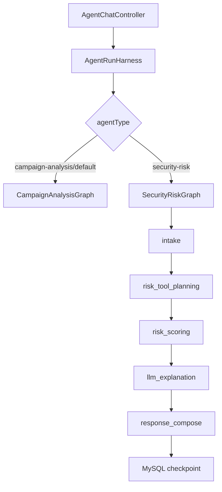

# 安全风控 Agent 架构设计

## 1. 架构定位

安全风控 Agent 是短链接后台的风险诊断助手。它基于现有短链统计和访问明细，识别可疑访问模式、刷量迹象、来源集中、设备画像集中和短时间突增，并输出可解释的风险卡片。

第一阶段不把它做成自动封禁系统。它只负责：

```text
读数据
算风险
解释证据
给建议
生成 pendingActions
```

## 2. 包结构隔离

按用户确认，`agent-service` 内按业务 Agent 隔离：

```text
agent-service/src/main/java/com/nageoffer/shortlink/agent/
  campaignanalysisagent/
    graph/
      CampaignAnalysisGraphExecutor.java
      CampaignAnalysisGraphRequest.java
      DefaultCampaignAnalysisGraphExecutor.java
      CampaignInsightCardFactory.java

  securityriskagent/
    graph/
      SecurityRiskGraphExecutor.java
      SecurityRiskGraphRequest.java
      DefaultSecurityRiskGraphExecutor.java
      SecurityRiskCardFactory.java
```

测试结构同步隔离：

```text
agent-service/src/test/java/com/nageoffer/shortlink/agent/
  campaignanalysisagent/graph/
  securityriskagent/graph/
```

命名原则：

```text
业务名 + agent
campaignanalysisagent：智能投放与分析 Agent
securityriskagent：安全风控 Agent
```

## 3. 入口路由

复用当前 internal chat API：

```text
POST /internal/short-link-agent/v1/chat
```

请求新增可选字段：

```json
{
  "sessionId": "session-1",
  "username": "zhangsan",
  "agentType": "security-risk",
  "message": "分析 gid=g1 2026-07-01 到 2026-07-07 有没有刷量风险"
}
```

兼容策略：

```text
agentType 为空：走 campaign-analysis
agentType=campaign-analysis：走 campaignanalysisagent
agentType=security-risk：走 securityriskagent
未知 agentType：返回带 warning 的安全失败结果
```

## 4. Graph 流程



## 5. 第一阶段工具复用

安全风控 Agent 第一阶段复用现有只读工具：

| 工具 | 风控用途 |
|---|---|
| `list_groups` | 用户未指定 gid 时辅助发现范围 |
| `page_short_links` | 找出高 PV / 高 UV / 高 UIP 短链 |
| `get_group_stats` | 分组级风险扫描 |
| `get_short_link_stats` | 单短链风险扫描 |
| `get_group_access_records` | 访问明细抽样和证据确认 |

Tool 分层边界：

```text
harness/tool：Agent Tool SPI，只放 AgentTool、ToolContext、ToolDescriptor、ToolResult 等通用协议。
tool/registry：Agent Tool 注册与按 name 查找。
tool/shortlink：短链接业务能力的 Agent Tool 适配器。
business/shortlink：短链接业务访问 Gateway，只负责调用 admin internal API。
```

依赖方向：

```text
securityriskagent
  -> harness/tool
  -> tool/registry
  -> tool/shortlink
  -> business/shortlink
  -> admin internal API
```

## 6. 风险规则

| reasonCode | 说明 | 主要证据 |
|---|---|---|
| `top_ip_concentration` | Top IP 占比过高 | topIpStats |
| `low_uip_share` | PV 很高但独立 IP 少 | pv/uip |
| `high_repeat_visits` | PV/UV 比值过高 | pv/uv |
| `hour_burst` | 小时访问集中 | hourStats |
| `profile_concentration` | 浏览器/OS/设备/网络高度集中 | browserStats/osStats/deviceStats/networkStats |
| `daily_spike` | 日访问突增 | daily |
| `suspicious_access_records` | 明细样本出现重复访问模式 | access records |

## 7. 安全边界

```text
不直连 project 数据库。
不直连 Redis。
不绕过 admin internal tool API 的 gid 归属校验。
不把原始 IP/user 送入 LLM。
不把原始 IP/user 写入 checkpoint。
不自动执行封禁、删除、冻结等写动作。
```
