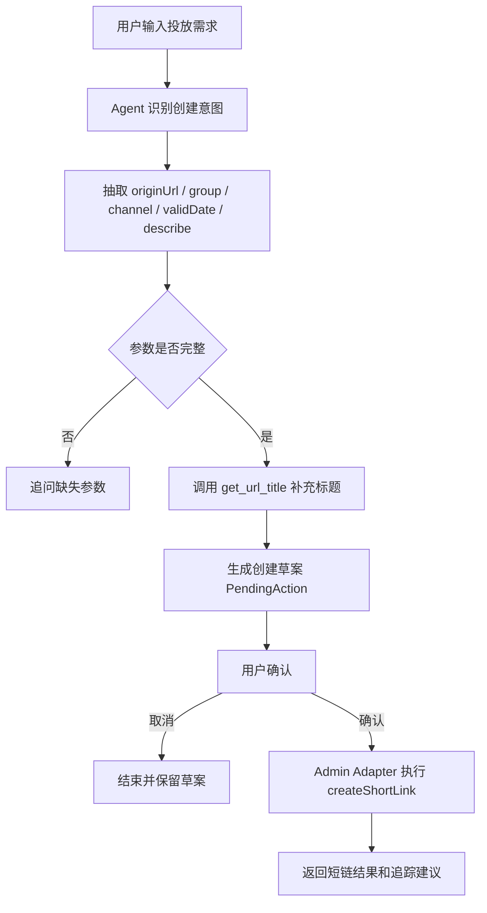
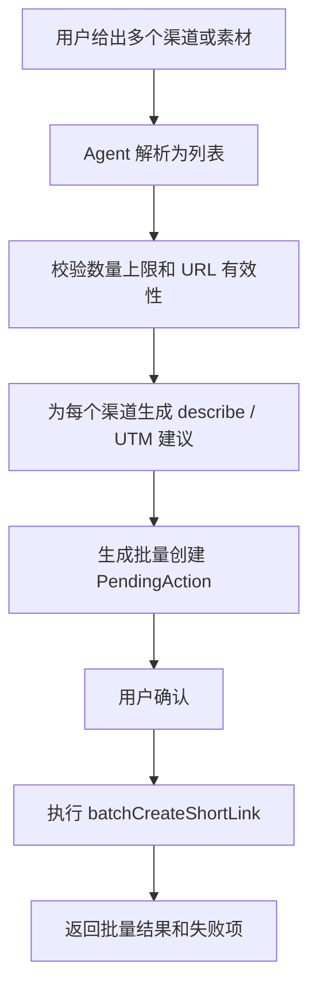
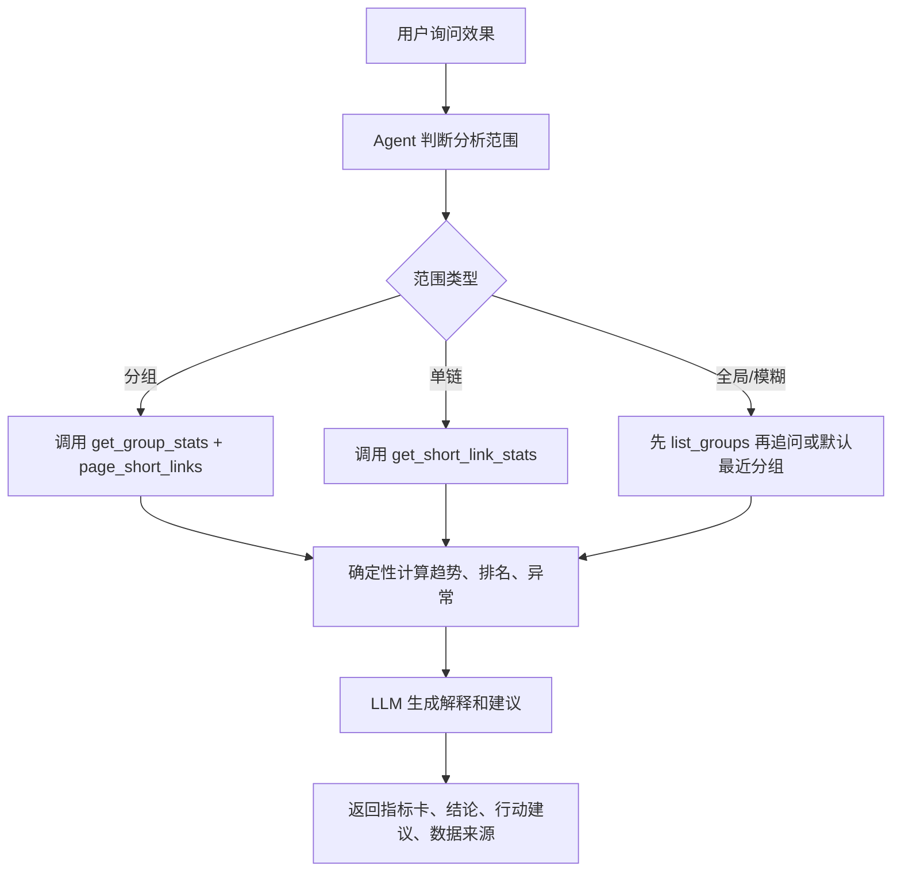
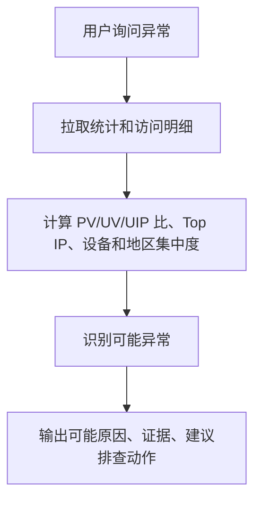

# 短链接项目：智能投放与分析 Agent 架构设计（讨论稿）

> 文档性质：目标态架构设计草案、开发前讨论基线  
> 适用范围：短链接系统智能投放与分析 Agent 第一阶段建设  
> 当前任务边界：先构建 Agent 能力层，再通过现有短链接项目增量接入；不推倒重构原 `admin/project/gateway/aggregation`  
> 核心定位：让 Agent 成为短链后台的智能运营助手，而不是把传统短链项目重写成广告投放平台  

---

## 0. 文档定位

本文档定义短链接项目接入“智能投放与分析 Agent”的第一阶段架构。

本架构遵循增量演进原则：

```text
第一步：独立构建 Agent Service，跑通自然语言理解、工具编排、统计解释、写操作确认。
第二步：在 admin 侧新增受控 Agent Adapter，把现有短链能力暴露为安全工具。
第三步：前端或后台通过 admin 调用 Agent，不直接访问模型和内部工具。
第四步：稳定后再扩展安全风控 Agent、智能路由、转化事件、A/B 实验等能力。
```

---

## 1. 当前项目架构理解

### 1.1 现有模块

| 模块 | 端口 | 职责 | Agent 可复用能力 |
|---|---:|---|---|
| `gateway` | 8000 | 统一入口、Token 校验、透传用户信息 | 复用登录态和鉴权入口 |
| `admin` | 8002 | 用户、分组、后台短链管理、Feign 调 project | 新增 Agent Adapter 最合适 |
| `project` | 8001 | 短链创建、跳转、统计、回收站 | 作为短链事实源和统计事实源 |
| `aggregation` | 8003 | 聚合 admin + project 的单进程启动形态 | 本地演示可用，但不作为长期 Agent 边界 |
| `nginx` | 5174 | 前端静态资源与 `/api` 代理 | 后续接 Agent 页面时需补路由 |

### 1.2 现有核心对象

| 对象 | 当前含义 | Agent 第一阶段映射 |
|---|---|---|
| `t_group.gid` | 用户短链分组 | 投放活动或活动池 |
| `t_link` | 短链主数据 | 渠道/素材/落地页追踪链接 |
| `t_link_goto` | `full_short_url -> gid` 跳转辅助表 | 跳转事实源 |
| `t_link_access_stats` | PV/UV/UIP 聚合 | 投放效果基础指标 |
| `t_link_access_logs` | 访问明细 | 异常分析和 Top IP 来源 |
| `t_link_stats_today` | 今日统计 | 排序和日报基础 |
| `describe` | 短链描述 | 第一阶段承载渠道、素材、人群备注 |

### 1.3 已有统计维度

现有项目已经具备 Agent 分析所需的基本数据：

```text
PV；
UV；
UIP；
日趋势；
小时分布；
星期分布；
地域分布；
Top IP；
浏览器；
操作系统；
设备；
网络类型；
新老访客；
访问明细。
```

第一阶段不需要新增实时数仓，也不需要新增复杂 OLAP。

---

## 2. 产品定位与边界

### 2.1 一句话定位

```text
智能投放与分析 Agent 是短链后台的运营助手：它通过自然语言理解投放需求，复用现有短链和统计接口，帮助用户创建投放短链、批量生成渠道链接、分析活动效果、发现异常访问，并给出可解释建议。
```

### 2.2 第一阶段必须做到

1. 支持自然语言查询活动、分组、短链和统计。
2. 支持基于用户输入生成单条或批量短链创建草案。
3. 支持根据现有统计数据输出趋势、异常、机会点和行动建议。
4. 所有写操作必须先形成 `PendingAction`，用户确认后执行。
5. Agent 输出的指标必须来自工具返回或确定性计算，并能展示数据来源。
6. Agent 不直接查业务数据库，不直接访问 Redis，不绕过 `admin` 权限。

### 2.3 第一阶段明确不做

```text
不改造 project 的跳转热路径；
不做智能路由；
不做自动暂停、删除、回收短链；
不做广告预算、CPA、ROI、GMV；
不接真实广告平台；
不做手机号级追踪；
不把安全风控强制接入创建链路；
不要求重写前端产物；
不要求一次性修复全部历史代码问题。
```

### 2.4 第二阶段预留

```text
安全风控 Agent；
URL 风险扫描；
活动/渠道/素材正式表；
转化事件采集；
A/B 实验；
智能路由；
日报/周报自动生成；
异常告警；
外部渠道集成。
```

---

## 3. 总体架构

### 3.1 推荐服务拓扑

```text
Browser / Admin Frontend
        |
        v
Nginx / Gateway
        |
        v
admin
  - UserContext
  - GroupService
  - ShortLinkActualRemoteService
  - Agent Adapter Controller
        |
        | internal HTTP
        v
agent-service
  - Campaign Analyst Agent
  - Tool Planner
  - Tool Executor Client
  - Analysis Engine
  - Prompt Profiles
  - Trace Recorder
        |
        | calls only admin adapter tools
        v
admin controlled tool endpoints
        |
        v
project
  - ShortLinkService
  - ShortLinkStatsService
  - RecycleBinService
```

### 3.2 为什么不直接让 Agent 调 project

Agent 不应直接调用 `project`，原因：

1. `project` 不知道当前后台用户拥有哪些 `gid`。
2. `project` API 当前偏内部能力，不负责完整用户权限校验。
3. `admin` 已经通过 `UserContext` 和分组服务掌握用户边界。
4. Agent 工具需要脱敏、限流、确认、审计，这些更适合放在 `admin` 侧。

因此第一阶段工具边界为：

```text
Agent Service -> Admin Agent Adapter -> Existing Admin/Project Services
```

### 3.3 Agent Service 职责

Agent Service 负责认知与编排：

```text
识别用户意图；
选择工具；
生成工具调用参数；
组合多个工具结果；
执行确定性分析计算；
生成解释和建议；
生成待确认动作；
记录 Agent Trace；
返回结构化 UI 展示数据。
```

Agent Service 不负责：

```text
用户鉴权；
短链写库；
统计写库；
跳转决策；
删除短链；
直接访问 MySQL/Redis；
保存业务最终事实。
```

### 3.4 Admin Agent Adapter 职责

Admin Adapter 是 Agent 与现有系统之间的安全网关：

```text
校验当前用户；
校验 gid 是否属于当前用户；
封装现有创建、查询、统计接口；
对访问明细做脱敏和分页限制；
为写工具创建 PendingAction；
执行用户确认后的写操作；
记录工具审计日志；
对 Agent 输出做必要限流。
```

### 3.5 Project 模块职责保持不变

`project` 在第一阶段只作为既有业务能力被复用：

```text
创建短链；
批量创建短链；
更新短链；
分页查询短链；
查询单链统计；
查询分组统计；
查询访问明细；
获取 URL title。
```

不在第一阶段把 LLM、Agent 或智能路由放入 `ShortLinkServiceImpl.restoreUrl`。

---

## 4. Agent 角色设计

### 4.1 Campaign Analyst Agent

第一阶段唯一主 Agent：

```text
中文名：智能投放与分析 Agent
英文名：Campaign Analyst Agent
```

职责：

1. 理解用户的投放目标和分析问题。
2. 将自然语言映射到短链工具调用。
3. 根据统计数据生成分析结论。
4. 输出可操作但低风险的建议。
5. 对创建或批量创建短链生成确认草案。

不负责：

1. 自动执行删除、回收、禁用。
2. 自动修改跳转目标。
3. 宣称 ROI/CPA 等当前系统没有的数据。
4. 基于未授权分组生成报告。
5. 使用模型编造访问数据。

### 4.2 Url Risk Agent 预留

第二阶段能力线：

```text
中文名：安全风控 Agent
英文名：Url Risk Agent
```

预留职责：

1. 创建短链前检测原始 URL。
2. 检测多跳转、可疑域名、钓鱼页面、恶意资源。
3. 输出风险等级与原因。
4. 对高风险链接建议人工审核或拒绝创建。
5. 定期复检历史短链目标 URL。

第一阶段只保留接口设计，不强制调用外部扫描服务。

---

## 5. Tool 设计

### 5.1 Tool 权限分级

| 等级 | 类型 | 示例 | 是否需确认 |
|---|---|---|---|
| L0 | 元信息工具 | 获取当前用户、健康检查 | 否 |
| L1 | 只读工具 | 查询分组、短链、统计 | 否 |
| L2 | 低风险写工具 | 创建分组、创建短链 | 是 |
| L3 | 中风险写工具 | 更新短链、批量创建大量短链 | 是，且需要更严格校验 |
| L4 | 高风险工具 | 删除、回收、恢复、禁用 | 第一阶段不开放 |

### 5.2 第一阶段工具清单

| Tool | 类型 | 调用现有能力 | 输出 |
|---|---|---|---|
| `list_groups` | L1 | `GroupService.listGroup` | 当前用户分组及短链数 |
| `create_group_proposal` | L2 | 待确认后 `GroupService.saveGroup` | 待确认动作 |
| `page_short_links` | L1 | `ShortLinkActualRemoteService.pageShortLink` | 短链分页列表 |
| `get_url_title` | L1 | `getTitleByUrl` | 目标页标题 |
| `create_short_link_proposal` | L2 | 待确认后 `createShortLink` | 待确认动作 |
| `batch_create_short_links_proposal` | L3 | 待确认后 `batchCreateShortLink` | 待确认动作 |
| `get_short_link_stats` | L1 | `oneShortLinkStats` | 单链统计 |
| `get_group_stats` | L1 | `groupShortLinkStats` | 分组统计 |
| `get_access_records` | L1 | `shortLinkStatsAccessRecord` | 脱敏访问明细 |
| `analyze_performance` | 内部计算 | 工具结果 | 排名、趋势、异常、建议 |
| `confirm_pending_action` | 写确认 | Adapter 执行 | 执行结果 |

### 5.3 工具调用红线

```text
工具参数必须通过 schema 校验；
所有 gid 必须校验属于当前用户；
访问明细必须限制 page size；
IP、UV cookie、User-Agent 默认脱敏；
批量创建必须限制数量；
写工具必须先创建 PendingAction；
Agent 不能直接构造 Feign 或 SQL；
工具结果必须写入 trace。
```

---

## 6. 核心流程

### 6.1 自然语言创建短链



### 6.2 批量生成渠道短链



### 6.3 投放效果分析



### 6.4 异常分析



---

## 7. 数据模型设计

第一阶段可先采用轻持久化，但必须预留以下对象。

### 7.1 AgentSession

用途：记录一次用户与 Agent 的对话上下文。

建议表名：

```text
t_agent_session
```

关键字段：

| 字段 | 类型 | 说明 |
|---|---|---|
| `id` | bigint | 主键 |
| `session_id` | varchar | 会话 ID |
| `username` | varchar | 用户名 |
| `title` | varchar | 会话标题 |
| `status` | tinyint | 0 active / 1 closed |
| `create_time` | datetime | 创建时间 |
| `update_time` | datetime | 更新时间 |
| `del_flag` | tinyint | 软删除 |

### 7.2 AgentMessage

用途：记录用户消息、Agent 回复、系统事件。

建议表名：

```text
t_agent_message
```

关键字段：

| 字段 | 类型 | 说明 |
|---|---|---|
| `id` | bigint | 主键 |
| `session_id` | varchar | 会话 ID |
| `role` | varchar | user / assistant / tool / system |
| `content` | text | 消息内容 |
| `content_schema` | text | 结构化输出 JSON |
| `create_time` | datetime | 创建时间 |

### 7.3 ToolCallTrace

用途：记录工具调用参数、耗时、状态和脱敏结果。

建议表名：

```text
t_agent_tool_call
```

关键字段：

| 字段 | 类型 | 说明 |
|---|---|---|
| `id` | bigint | 主键 |
| `trace_id` | varchar | Trace ID |
| `session_id` | varchar | 会话 ID |
| `tool_name` | varchar | 工具名 |
| `input_json` | text | 脱敏入参 |
| `output_json` | mediumtext | 脱敏出参 |
| `status` | varchar | success / failed |
| `latency_ms` | int | 耗时 |
| `error_message` | varchar | 错误信息 |

### 7.4 PendingAction

用途：写操作确认。

建议表名：

```text
t_agent_pending_action
```

关键字段：

| 字段 | 类型 | 说明 |
|---|---|---|
| `id` | bigint | 主键 |
| `action_id` | varchar | 动作 ID |
| `username` | varchar | 用户名 |
| `action_type` | varchar | create_link / batch_create_links / create_group |
| `payload_json` | text | 待执行参数 |
| `preview_json` | text | 展示给用户的预览 |
| `status` | varchar | pending / confirmed / cancelled / expired / executed / failed |
| `expire_time` | datetime | 过期时间 |
| `confirmed_time` | datetime | 确认时间 |
| `executed_time` | datetime | 执行时间 |

### 7.5 InsightReport

用途：保存重要分析报告或活动复盘。

建议表名：

```text
t_agent_insight_report
```

字段可在第二阶段再完整设计。第一阶段可只保留会话内报告，不强制持久化。

---

## 8. API 设计

### 8.1 前端调用 Admin 的 Agent API

```text
POST /api/short-link/admin/v1/agent/chat
GET  /api/short-link/admin/v1/agent/sessions
GET  /api/short-link/admin/v1/agent/sessions/{sessionId}
POST /api/short-link/admin/v1/agent/actions/{actionId}/confirm
POST /api/short-link/admin/v1/agent/actions/{actionId}/cancel
```

### 8.2 Admin 调用 Agent Service 的内部 API

```text
POST /internal/short-link-agent/v1/chat
POST /internal/short-link-agent/v1/tool-results
GET  /internal/short-link-agent/v1/health
```

### 8.3 Agent Service 调用 Admin Adapter 的工具 API

工具 API 不建议直接暴露给浏览器：

```text
POST /internal/admin-agent-tools/list-groups
POST /internal/admin-agent-tools/page-short-links
POST /internal/admin-agent-tools/get-short-link-stats
POST /internal/admin-agent-tools/get-group-stats
POST /internal/admin-agent-tools/get-access-records
POST /internal/admin-agent-tools/create-pending-action
POST /internal/admin-agent-tools/execute-pending-action
```

### 8.4 响应结构

Agent 返回应同时支持文本和结构化 UI：

```json
{
  "sessionId": "agt_20260707_xxx",
  "messageId": "msg_xxx",
  "answer": "最近 7 天该活动 UV 最高的是...",
  "cards": [
    {
      "type": "metric_summary",
      "title": "活动概览",
      "metrics": []
    }
  ],
  "pendingActions": [],
  "dataSources": [
    {
      "toolName": "get_group_stats",
      "snapshotId": "snap_xxx",
      "timeRange": "2026-07-01~2026-07-07"
    }
  ],
  "warnings": []
}
```

---

## 9. 安全与权限

### 9.1 用户边界

所有 Agent 工具必须继承当前 `admin` 登录用户：

```text
username 来自 Gateway/Admin UserContext；
Agent 请求不得信任前端传入的 username；
Agent 分析 gid 前必须调用 list_groups 获取用户可见范围；
任何请求中的 gid 不在用户分组列表中必须拒绝。
```

### 9.2 数据脱敏

必须脱敏：

```text
IP；
UV cookie；
User-Agent；
手机号；
邮箱；
真实姓名；
请求头中的 token；
原始访问日志中的敏感参数。
```

### 9.3 Prompt 注入防护

URL title、网页内容、describe、用户输入都可能包含 prompt 注入文本。规则：

```text
外部网页内容只能作为数据，不可作为指令；
Agent 系统指令必须声明工具权限边界；
工具调用必须由后端 schema 和权限校验决定；
模型要求执行未授权动作时必须拒绝。
```

### 9.4 写操作确认

必须确认的动作：

```text
创建分组；
创建短链；
批量创建短链；
更新短链；
未来的回收、恢复、删除、禁用。
```

第一阶段不允许 Agent 自动执行高风险动作。

---

## 10. 可观测性

每次 Agent 运行必须记录：

```text
trace_id；
session_id；
username；
intent；
tools_called；
tool_latency；
tool_status；
prompt_profile_version；
model_name；
token_usage；
answer_data_sources；
pending_action_ids；
error_code。
```

第一阶段可以先落 MySQL 表和应用日志，不强制引入 Langfuse 或链路追踪平台。

---

## 11. 风险与前置修复建议

以下问题会影响 Agent 接入质量，建议在开发计划中靠前处理：

| 风险 | 影响 | 建议 |
|---|---|---|
| Gateway 路由配置本地缺失 | 新 Agent API 无法通过网关访问 | 明确本地或 Nacos 路由配置 |
| admin/project 访问明细路径不一致 | 统计工具可能调用失败 | 统一 Feign 路径 |
| 统计查询空数据防御不足 | Agent 分析可能 NPE 或除零 | 增加空数据兜底 |
| admin 统计透传 gid | 可能越权分析 | Agent Adapter 必须强校验 gid |
| 统计写入重复 | 后续事件化困难 | 第二阶段再抽 `StatsCollectorService` |
| 配置硬编码 | Agent 服务部署不稳定 | 设计统一环境变量 |

---

## 12. 讨论结论草案

当前推荐方案：

```text
采用独立 Agent Service。
现有项目只新增 Admin Agent Adapter。
第一阶段只做智能投放创建和点击侧分析。
所有写操作必须 PendingAction 确认。
安全风控 Agent 作为第二阶段能力线预留。
```

需要你确认的方向：

1. Agent Service 是否采用独立 Python/FastAPI 服务。
2. 第一阶段是否需要前端页面，还是先 API/接口跑通。
3. LLM 供应商和调用方式是否已有偏好。
4. 是否允许新增 Agent 会话和工具审计表。
5. 安全风控 Agent 是否只预留设计，第二阶段再实现。
