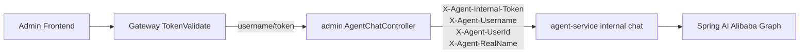

# Admin/Gateway 正式入口接入实施计划

> **For agentic workers:** 本计划承接 `09_Graph Trace运行观测开发计划.md`。本阶段只做生产链路的正式 Chat 入口，不实现短链接业务 internal tool API。internal tool API 将在下一阶段独立设计和开发。

## Goal

把智能投放与分析 Agent 从 `agent-service` 的本地/internal 调试入口，接入到项目正式访问边界：

```text
Admin Frontend / Browser
  -> Gateway TokenValidate
  -> admin /api/short-link/admin/v1/agent/**
  -> agent-service /internal/short-link-agent/v1/**
```

正式入口必须以 gateway/admin 已验证的用户上下文为准，不能信任前端 body 中的 `username`。

## Scope

### In Scope

```text
admin 新增 Agent Chat/Health 正式代理入口；
admin 从 UserContext 读取 username/userId/realName；
admin 调用 agent-service internal API 时注入 X-Agent-* 可信头；
agent-service Chat 支持优先读取 X-Agent-Username；
agent-service internal API 支持可选 X-Agent-Internal-Token 校验；
保留 agent-service 本地 Agent Console 的 dev 调试能力；
补充 TDD 单元测试、模块测试、配置说明和验收清单。
```

### Out of Scope

```text
不实现 /internal/short-link-admin/**；
不改造短链接业务 Tool Facade 到 admin internal tool API；
不让 gateway 直接暴露 agent-service internal 地址；
不提交 application/bootstrap/shardingsphere 等本地配置文件；
不把 DeepSeek Key 或内部 token 写入仓库。
```

## Architecture



关键边界：

```text
Gateway 只负责校验登录 token，并向 admin 注入 userId/realName；
admin 是正式业务入口，负责把可信 UserContext 转换为 Agent 内部请求头；
agent-service 是内部 Agent Runtime，internal token 配置为空时允许本地调试，配置后要求 admin 携带 token；
正式页面后续应调用 admin /api/short-link/admin/v1/agent/chat，而不是直接请求 agent-service /internal/short-link-agent/v1/chat。
```

## API Contract

### Admin Chat

```http
POST /api/short-link/admin/v1/agent/chat
Content-Type: application/json
username: zhangsan
token: login-token
```

请求体：

```json
{
  "sessionId": "session-1",
  "message": "分析最近 7 天短链接表现"
}
```

兼容说明：

```text
即使前端 body 传入 username，admin 也必须忽略；
admin 转发给 agent-service 的 username 只能来自 UserContext.getUsername()。
```

### Admin Health

```http
GET /api/short-link/admin/v1/agent/health
```

用于正式入口探活，底层代理到：

```text
GET /internal/short-link-agent/v1/health
```

## Configuration

生产或联调环境通过 Nacos、本地未提交配置或环境变量设置：

```yaml
short-link:
  agent:
    admin:
      internal-token: ${AGENT_INTERNAL_TOKEN:}
```

admin Feign 可继续复用服务发现，也可在本地配置直连地址：

```yaml
short-link:
  agent:
    admin:
      remote-url: http://127.0.0.1:8005
```

agent-service 内部 token：

```yaml
short-link:
  agent:
    security:
      internal-token: ${AGENT_INTERNAL_TOKEN:}
```

约定：

```text
internal-token 为空：本地 dev 模式，不拦截 internal API，Agent Console 可继续直连；
internal-token 非空：/internal/short-link-agent/v1/** 必须携带 X-Agent-Internal-Token；
admin 与 agent-service 使用同一个 AGENT_INTERNAL_TOKEN；
真实 token 不进入 git。
```

## Implementation Tasks

### Task 1: Stage Plan And Index

**Files:**

```text
plan/智能投放与分析Agent/10_admin-gateway正式入口接入计划.md
plan/智能投放与分析Agent/00_计划文档索引.md
```

**Steps:**

- [x] 新增本计划，明确正式入口优先、internal tool API 延后。
- [x] 更新索引，加入第 10 阶段计划。

### Task 2: Agent-Service Trusted Header And Internal Token

**Files:**

```text
agent-service/src/test/java/com/nageoffer/shortlink/agent/harness/api/AgentChatControllerTest.java
agent-service/src/main/java/com/nageoffer/shortlink/agent/harness/api/AgentChatController.java
agent-service/src/main/java/com/nageoffer/shortlink/agent/infrastructure/config/AgentProperties.java
agent-service/src/test/java/com/nageoffer/shortlink/agent/infrastructure/config/AgentPropertiesTest.java
agent-service/src/main/java/com/nageoffer/shortlink/agent/harness/security/InternalAgentApiFilter.java
agent-service/src/test/java/com/nageoffer/shortlink/agent/harness/security/InternalAgentApiFilterTest.java
```

**TDD acceptance:**

```text
Chat 请求同时包含 body.username=spoofed 和 X-Agent-Username=trusted 时，AgentRunHarness 收到 trusted；
没有 X-Agent-Username 时仍兼容 body.username，保证本地 Agent Console 可用；
internal-token 为空时不拦截 internal API；
internal-token 非空时缺失或错误 X-Agent-Internal-Token 返回 401；
internal-token 正确时放行。
```

### Task 3: Admin Formal Agent Entry

**Files:**

```text
admin/src/test/java/com/nageoffer/shortlink/admin/controller/AgentControllerTest.java
admin/src/main/java/com/nageoffer/shortlink/admin/controller/AgentController.java
admin/src/main/java/com/nageoffer/shortlink/admin/remote/AgentRemoteService.java
admin/src/main/java/com/nageoffer/shortlink/admin/remote/dto/req/AgentChatReqDTO.java
admin/src/main/java/com/nageoffer/shortlink/admin/config/AgentAdminConfiguration.java
```

**TDD acceptance:**

```text
POST /api/short-link/admin/v1/agent/chat 从 UserContext 取 username/userId/realName；
请求体里伪造 username 不会传给 agent-service；
admin 代理调用时带 X-Agent-Internal-Token 和 X-Agent-* 可信头；
GET /api/short-link/admin/v1/agent/health 代理 agent-service health；
Controller 返回 agent-service 的 Result，不额外改写 AgentRunResult 结构。
```

### Task 4: Gateway Formal Route Documentation

**Files:**

```text
plan/智能投放与分析Agent/10_admin-gateway正式入口接入计划.md
plan/智能投放与分析Agent/短链接项目_智能投放与分析Agent_技术清单与配置说明_最终版.md
plan/智能投放与分析Agent/短链接项目_智能投放与分析Agent_正式版验收清单_最终版.md
```

**Route rule:**

```yaml
- id: short-link-admin-agent
  uri: lb://short-link-admin
  predicates:
    - Path=/api/short-link/admin/v1/agent/**
  filters:
    - name: TokenValidate
```

说明：

```text
该路由可并入现有 admin 路由；
不要新增 /internal/short-link-agent/** 的公网 gateway 路由；
如果 whitePathList 包含 /api/short-link/admin/v1/agent，需要移除，Agent 正式入口必须鉴权。
```

## Verification

阶段完成前执行：

```powershell
mvn -pl agent-service -Dtest=AgentChatControllerTest test
mvn -pl agent-service -Dtest=InternalAgentApiFilterTest test
mvn -pl agent-service -Dtest=AgentPropertiesTest test
mvn -pl admin -Dtest=AgentControllerTest test
mvn -pl agent-service test
mvn -pl admin test
mvn -pl agent-service -DskipTests package
mvn -pl admin -DskipTests package
git diff --check
```

提交前安全检查：

```powershell
git ls-files | rg "(^|/)(application|bootstrap).*\\.ya?ml$|shardingsphere-config.*\\.ya?ml$|(^|/)target/|nginx-nageoffer|__MACOSX|(^|/)\\.idea/|(^|/)\\.codebuddy/"
rg -n "sk-[A-Za-z0-9]{16,}|DEEPSEEK_API_KEY\\s*[:=]\\s*sk-|AGENT_INTERNAL_TOKEN\\s*[:=]\\s*[A-Za-z0-9_-]{16,}|X-Agent-Internal-Token\\s*[:=]\\s*[A-Za-z0-9_-]{16,}" admin agent-service plan .gitignore pom.xml
```

## Acceptance Criteria

- [x] gateway/admin 正式链路只暴露 `/api/short-link/admin/v1/agent/**`。
- [x] admin Chat 入口不信任前端 body username。
- [x] admin 调 agent-service 时注入可信用户头和内部 token。
- [x] agent-service 支持可信用户头优先，保留本地 dev fallback。
- [x] 配置 internal-token 后，agent-service internal API 缺 token 会被拒绝。
- [x] 不新增 internal tool API。
- [x] 不提交任何真实密钥、token 或本地 YAML 配置。
- [x] `agent-service` 与 `admin` 模块测试通过。
- [x] 阶段完成后 commit 并 push。

## Next Phase

下一阶段再进入 internal tool API：

```text
admin 提供 /internal/short-link-admin/v1/agent-tools/**；
agent-service ShortLinkBusinessGateway 改为调用 admin internal tool API；
工具 API 复用 UserContext/可信头边界；
统一 tool response 的敏感字段脱敏和错误契约。
```
