# Admin Internal Tool API 接入实施计划

> **For agentic workers:** 本阶段承接 `10_admin-gateway正式入口接入计划.md`。目标是把 Agent 的短链接业务查询从公开 admin API 收口到 admin 内部可信工具接口；不引入 MCP，不让 gateway 暴露 agent-service internal API，也不改变 5 个 Agent Tool 对 LLM 暴露的名称和参数契约。

## Goal

为智能投放与分析 Agent 建立一条正式、可信、可测试的业务工具链路：

```text
Spring AI Alibaba Graph
  -> agent-service Java AgentTool
  -> ShortLinkBusinessHttpGateway
  -> admin /internal/short-link-admin/v1/agent-tools/**
  -> admin existing service/remote/project
```

这样 Agent 仍然通过进程内 Java Tool Facade 调用业务能力，但 HTTP 边界从公开 `/api/short-link/admin/v1/**` 改为 admin 内部工具 API，避免复用面向浏览器的公开接口细节。

## Scope

### In Scope

```text
admin 新增 /internal/short-link-admin/v1/agent-tools/** 只读工具接口；
admin internal 工具接口校验 X-Agent-Internal-Token；
admin internal 工具接口从 X-Agent-Username / X-Agent-UserId / X-Agent-RealName 建立 UserContext；
agent-service ShortLinkBusinessHttpGateway 注入 X-Agent-* 可信头；
agent-service 5 个短链接 Tool 改为调用 admin internal tool API；
补充 admin 与 agent-service 的 TDD 单元测试、配置说明、验收清单。
```

### Out of Scope

```text
不新增 MCP；
不让 LLM 直接调用 HTTP；
不让 gateway 配置 /internal/short-link-admin/** 公网路由；
不实现写操作 Tool；
不改变 list_groups、page_short_links、get_short_link_stats、get_group_stats、get_group_access_records 的 LLM 可见名称；
不提交 application/bootstrap/shardingsphere 等本地配置文件；
不把 DeepSeek Key 或 AGENT_INTERNAL_TOKEN 写入仓库。
```

## API Contract

### Trusted Headers

```http
X-Agent-Internal-Token: ${AGENT_INTERNAL_TOKEN}
X-Agent-Username: zhangsan
X-Agent-UserId: 1001
X-Agent-RealName: 张三
```

约定：

```text
X-Agent-Username 必填，因为 admin 内部工具接口需要明确当前业务用户；
X-Agent-UserId、X-Agent-RealName 可选，存在时写入 UserContext；
short-link.agent.admin.internal-token 为空且 internal-token-dev-mode=false 时拒绝请求；
只有显式配置 short-link.agent.admin.internal-token-dev-mode=true 时，才允许本地开发空 token 放行；
short-link.agent.admin.internal-token 非空时，请求必须携带完全一致的 X-Agent-Internal-Token；
生产和联调环境必须配置非空 AGENT_INTERNAL_TOKEN。
```

### Internal Tool Endpoints

```http
GET /internal/short-link-admin/v1/agent-tools/groups
GET /internal/short-link-admin/v1/agent-tools/short-links/page
GET /internal/short-link-admin/v1/agent-tools/short-link/stats
GET /internal/short-link-admin/v1/agent-tools/group/stats
GET /internal/short-link-admin/v1/agent-tools/group/access-records
```

参数映射：

```text
groups:
  no query params
  -> GroupService.listGroup()

short-links/page:
  gid, orderTag, current, size
  -> ShortLinkActualRemoteService.pageShortLink(gid, orderTag, current, size)

short-link/stats:
  fullShortUrl, gid, startDate, endDate
  -> ShortLinkActualRemoteService.oneShortLinkStats(fullShortUrl, gid, startDate, endDate)

group/stats:
  gid, startDate, endDate
  -> ShortLinkActualRemoteService.groupShortLinkStats(gid, startDate, endDate)

group/access-records:
  gid, startDate, endDate, current, size
  -> ShortLinkActualRemoteService.groupShortLinkStatsAccessRecord(gid, startDate, endDate, current, size)
```

返回契约：

```text
admin internal controller 复用现有 Result<T>；
agent-service HTTP Gateway 继续 unwrap Result.data；
业务失败时转换为 ToolResult.failure(message)；
网络或反序列化异常转换为 ToolResult.failure("Short link business API request failed: ...")。
```

## Architecture

```mermaid
flowchart LR
    LLM["LLM / Graph"] --> TOOL["agent-service AgentTool"]
    TOOL --> GW["ShortLinkBusinessHttpGateway"]
    GW -->|"X-Agent-Internal-Token<br/>X-Agent-Username"| API["admin internal agent-tools API"]
    API --> FILTER["AgentInternalToolApiFilter"]
    FILTER --> CTX["UserContext"]
    CTX --> SVC["GroupService / ShortLinkActualRemoteService"]
    SVC --> PROJECT["short-link-project"]
```



关键边界：

```text
agent-service 负责把 ToolContext.username 转成 X-Agent-Username；
admin internal filter 负责 token 校验和 UserContext 生命周期；
controller 在转发前校验 gid 属于当前 UserContext.username；
GroupService.listGroup() 继续依赖 UserContext.getUsername()，因此 filter 必须在 controller 前建立上下文并在 finally 中清理；
5 个 Tool 的参数校验仍留在 agent-service，admin internal API 第一版只做可信边界校验和薄转发。
```

## Implementation Tasks

### Task 1: Stage Plan And Index

**Files:**

```text
plan/智能投放与分析Agent/11_admin-internal-tool-api接入计划.md
plan/智能投放与分析Agent/00_计划文档索引.md
```

**Steps:**

- [x] 新增本计划，明确 internal tool API 范围、接口、可信头、验收和验证命令。
- [x] 更新索引，加入第 11 阶段计划。

### Task 2: Admin Internal Trusted Filter

**Files:**

```text
admin/src/test/java/com/nageoffer/shortlink/admin/common/biz/agent/AgentInternalToolApiFilterTest.java
admin/src/main/java/com/nageoffer/shortlink/admin/common/biz/agent/AgentInternalToolApiFilter.java
admin/src/main/java/com/nageoffer/shortlink/admin/config/UserConfiguration.java
```

**TDD acceptance:**

```text
internal-token 为空且 internal-token-dev-mode=false 时拒绝请求；
internal-token 为空且 internal-token-dev-mode=true 时，本地开发请求可放行；
internal-token 非空且 header 缺失或不一致时返回 HTTP 401；
X-Agent-Username 缺失时返回 HTTP 400；
X-Agent-Username 存在时写入 UserContext，并在 filter finally 中清理；
只对 /internal/short-link-admin/v1/agent-tools/* 生效。
```

### Task 3: Admin Internal Tool Controller

**Files:**

```text
admin/src/test/java/com/nageoffer/shortlink/admin/controller/AgentToolInternalControllerTest.java
admin/src/main/java/com/nageoffer/shortlink/admin/controller/AgentToolInternalController.java
```

**TDD acceptance:**

```text
GET /groups 返回 GroupService.listGroup()；
GET /short-links/page 校验 gid 归属后透传 gid/orderTag/current/size；
GET /short-link/stats 校验 gid 归属后透传 fullShortUrl/gid/startDate/endDate；
GET /group/stats 校验 gid 归属后透传 gid/startDate/endDate；
GET /group/access-records 校验 gid 归属后透传 gid/startDate/endDate/current/size；
controller 不读取普通 username header，也不自行创建 UserContext。
```

### Task 4: Agent-Service Gateway Trusted Headers

**Files:**

```text
agent-service/src/test/java/com/nageoffer/shortlink/agent/business/shortlink/ShortLinkBusinessHttpGatewayTest.java
agent-service/src/test/java/com/nageoffer/shortlink/agent/infrastructure/config/AgentPropertiesTest.java
agent-service/src/main/java/com/nageoffer/shortlink/agent/infrastructure/config/AgentProperties.java
agent-service/src/main/java/com/nageoffer/shortlink/agent/business/shortlink/ShortLinkBusinessHttpGateway.java
```

**TDD acceptance:**

```text
默认 business.base-url 改为 http://127.0.0.1:8002；
新增 short-link.agent.business.internal-token；
token 非空时请求携带 X-Agent-Internal-Token；
ToolContext.username 非空时请求携带 X-Agent-Username；
不再发送普通 username header；
仍然支持末尾带 / 的 base-url 规范化；
仍然正确 unwrap Result.data 和转换业务错误。
```

### Task 5: Agent-Service Tool Path Switch

**Files:**

```text
agent-service/src/test/java/com/nageoffer/shortlink/agent/tool/shortlink/ShortLinkBusinessToolsTest.java
agent-service/src/main/java/com/nageoffer/shortlink/agent/tool/shortlink/ListGroupsTool.java
agent-service/src/main/java/com/nageoffer/shortlink/agent/tool/shortlink/PageShortLinksTool.java
agent-service/src/main/java/com/nageoffer/shortlink/agent/tool/shortlink/GetShortLinkStatsTool.java
agent-service/src/main/java/com/nageoffer/shortlink/agent/tool/shortlink/GetGroupStatsTool.java
agent-service/src/main/java/com/nageoffer/shortlink/agent/tool/shortlink/GetGroupAccessRecordsTool.java
```

**TDD acceptance:**

```text
list_groups -> /internal/short-link-admin/v1/agent-tools/groups；
page_short_links -> /internal/short-link-admin/v1/agent-tools/short-links/page；
get_short_link_stats -> /internal/short-link-admin/v1/agent-tools/short-link/stats；
get_group_stats -> /internal/short-link-admin/v1/agent-tools/group/stats；
get_group_access_records -> /internal/short-link-admin/v1/agent-tools/group/access-records；
参数校验、默认 current=1、默认 size=10 保持不变。
```

### Task 6: Documentation And Acceptance

**Files:**

```text
plan/智能投放与分析Agent/短链接项目_智能投放与分析Agent_技术清单与配置说明_最终版.md
plan/智能投放与分析Agent/短链接项目_智能投放与分析Agent_正式版验收清单_最终版.md
```

**Steps:**

- [x] 补充 `short-link.agent.business.base-url` 指向 admin 服务。
- [x] 补充 `short-link.agent.business.internal-token` 与 `short-link.agent.admin.internal-token` 共用 `AGENT_INTERNAL_TOKEN`。
- [x] 补充 internal tool API 不经 gateway 暴露的验收项。

## Verification

阶段完成前执行：

```powershell
mvn -pl admin -Dtest=AgentInternalToolApiFilterTest test
mvn -pl admin -Dtest=AgentToolInternalControllerTest test
mvn -pl admin -Dtest=AgentToolInternalMvcTest test
mvn -pl agent-service -Dtest=ShortLinkBusinessToolsTest test
mvn -pl agent-service -Dtest=ShortLinkBusinessHttpGatewayTest test
mvn -pl agent-service -Dtest=AgentPropertiesTest test
mvn -pl admin test
mvn -pl agent-service test
mvn -pl admin -DskipTests package
mvn -pl agent-service -DskipTests package
git diff --check
```

提交前安全检查：

```powershell
git ls-files | rg "(^|/)(application|bootstrap).*\\.ya?ml$|shardingsphere-config.*\\.ya?ml$|(^|/)target/|nginx-nageoffer|__MACOSX|(^|/)\\.idea/|(^|/)\\.codebuddy/"
rg -n "sk-[A-Za-z0-9]{16,}|DEEPSEEK_API_KEY\\s*[:=]\\s*sk-|AGENT_INTERNAL_TOKEN\\s*[:=]\\s*[A-Za-z0-9_-]{16,}|X-Agent-Internal-Token\\s*[:=]\\s*[A-Za-z0-9_-]{16,}" admin agent-service plan .gitignore pom.xml
```

## Acceptance Criteria

- [x] admin 提供 `/internal/short-link-admin/v1/agent-tools/**` 只读工具 API。
- [x] internal tool API 具备 token 校验和可信用户上下文注入。
- [x] internal-token 非空时缺 token 或错 token 返回 401。
- [x] internal-token 为空时默认拒绝，只有显式 devMode 才放行。
- [x] 缺少 `X-Agent-Username` 返回 400。
- [x] filter 在请求结束后清理 `UserContext`。
- [x] page/stats/access-records 在转发前校验 gid 属于当前可信用户。
- [x] agent-service Tool Facade 不再调用公开 `/api/short-link/admin/v1/**` 查询接口。
- [x] agent-service 业务请求携带 `X-Agent-Username` 和可选 `X-Agent-Internal-Token`。
- [x] 5 个 Tool 的 LLM 可见名称、参数、只读语义保持不变。
- [x] 不提交任何真实密钥、token 或本地 YAML 配置。
- [ ] 阶段完成后 commit 并 push。

## Discussion Notes

本阶段先做内部可信 HTTP API，而不是 MCP。原因是当前 Tool 数量少、调用方只有 agent-service、服务边界明确，MCP 会增加远程协议、注册、鉴权和运维复杂度。后续如果工具数量扩展到跨系统、跨语言或需要外部工具市场，再评估 MCP 化。

`tool/` 层继续保留在 agent-service 内，它表示 Agent 可用能力；admin internal API 表示可信业务边界。二者不是重复封装：Tool 负责 LLM 参数契约和语义约束，admin internal API 负责业务系统安全边界和用户上下文。
