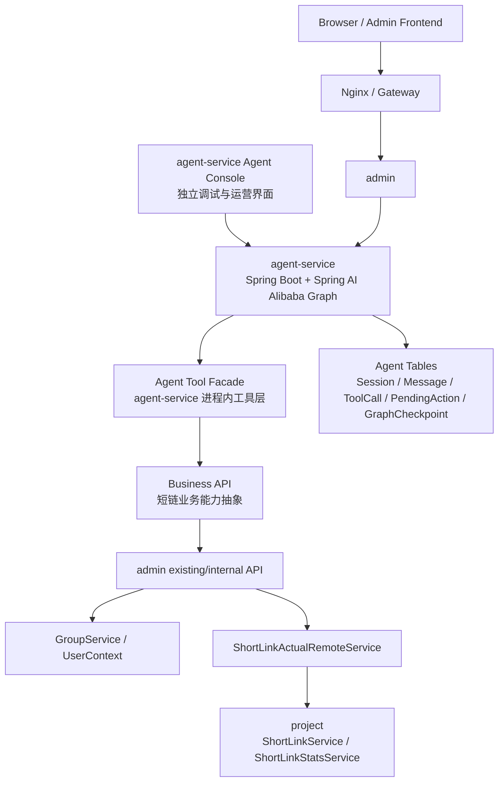
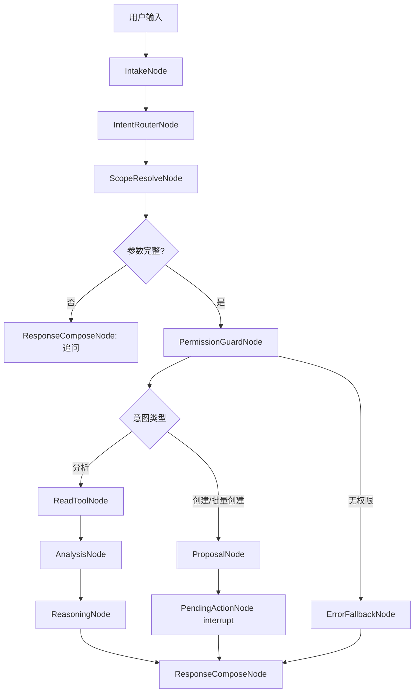
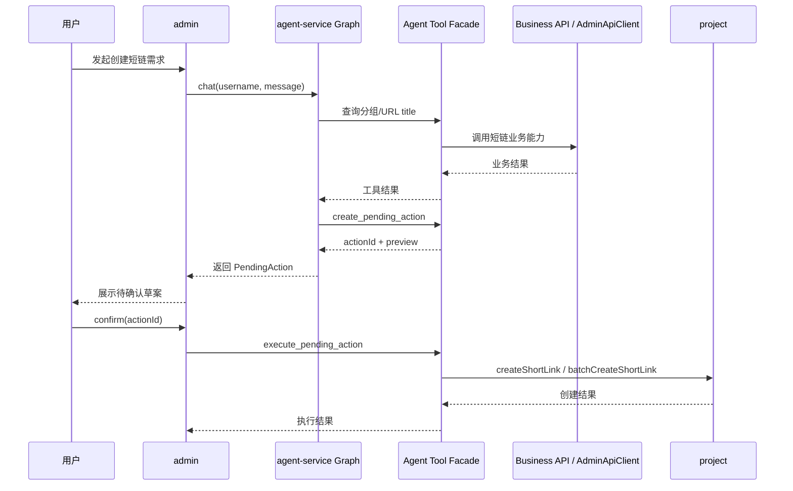

# 短链接项目：智能投放与分析 Agent 架构设计（最终版）

> 文档性质：第一阶段目标态架构基线  
> 适用范围：短链接项目智能投放与分析 Agent 的服务拆分、Graph 编排、工具边界、安全边界和数据模型  
> 当前任务边界：本文档只定义目标架构，不声明当前代码已经完成实现  
> 已确认技术路线：**Spring AI Alibaba Agent Framework + Graph**  
> 核心定位：让 Agent 成为短链接后台的智能运营助手，而不是把传统短链接项目重写成广告投放平台  

---

## 0. 文档定位

本文档定义短链接项目接入“智能投放与分析 Agent”的第一阶段架构。

第一阶段采用增量演进：

```text
第一步：新增 Java Agent Runtime，基于 Spring AI Alibaba Graph 固化 Agent 主流程。
第二步：在 agent-service 内建设 Agent Tool Facade + business API，复用 admin 现有接口和必要 internal API。
第三步：Agent 只通过 Tool Facade 调用短链能力，不直连 project、业务 MySQL 或 Redis。
第四步：所有写操作生成 PendingAction，用户确认后由 admin 执行。
第五步：稳定后再扩展安全风控 Agent、智能路由、转化事件、A/B 实验等能力。
```

---

## 1. 当前项目架构理解

### 1.1 已有模块

| 模块 | 默认端口 | 职责 | Agent 可复用能力 |
|---|---:|---|---|
| `gateway` | 8000 | 统一入口、Token 校验、透传用户信息 | 复用登录态与鉴权入口 |
| `admin` | 8002 | 用户、分组、后台短链管理、Feign 调用 `project` | 复用现有后台能力，按需补充 Agent internal API |
| `project` | 8001 | 短链创建、跳转、统计、回收站 | 短链事实源和统计事实源 |
| `aggregation` | 8003 | 聚合 admin + project 的单进程启动形态 | 本地演示可用，不作为长期 Agent 边界 |
| `nginx` | 5174 | 前端静态资源与 `/api` 代理 | 后续把 admin 前端接入 Agent 时补路由 |
| `agent-service` | 8010 | Spring AI Alibaba Graph、Agent Runtime、独立 Agent Console | 第一阶段新增顶级 Maven module |

### 1.2 现有核心对象映射

| 对象 | 当前含义 | Agent 第一阶段映射 |
|---|---|---|
| `t_group.gid` | 用户短链接分组 | 投放活动或活动池 |
| `t_link` | 短链接主数据 | 渠道、素材、落地页追踪链接 |
| `t_link_goto` | `full_short_url -> gid` 辅助表 | 跳转事实源 |
| `t_link_access_stats` | PV/UV/UIP 聚合 | 投放效果基础指标 |
| `t_link_access_logs` | 访问明细 | 异常分析和 Top IP 证据 |
| `t_link_stats_today` | 今日统计 | 日报和排序基础 |
| `describe` | 短链描述 | 第一阶段承载渠道、素材、人群备注 |

### 1.3 已有统计维度

当前 `project` 已经具备 Agent 分析需要的基础数据：

```text
PV、UV、UIP、日趋势；
小时分布、星期分布；
地区分布、Top IP；
浏览器、操作系统、设备、网络类型；
新老访客；
访问明细。
```

第一阶段不需要新增复杂 OLAP，也不需要把统计链路整体重构。

---

## 2. 产品定位与边界

### 2.1 一句话定位

```text
智能投放与分析 Agent 是短链接后台的运营助手：它通过自然语言理解投放需求，复用现有短链和统计接口，帮助用户创建投放短链、批量生成渠道短链、分析活动效果、发现异常访问，并给出可解释建议。
```

### 2.2 第一阶段必须做到

1. 支持自然语言查询活动、分组、短链和统计。
2. 支持基于用户输入生成单条或批量短链创建草案。
3. 支持根据现有统计数据输出趋势、异常、机会点和行动建议。
4. 所有写操作必须先形成 `PendingAction`，用户确认后执行。
5. Agent 输出的指标必须来自工具返回或确定性计算，并展示数据来源。
6. Agent 不直接查业务数据库，不直接访问 Redis，不绕过 `admin` 权限。
7. Graph 状态只作为运行上下文和恢复依据，不作为短链业务事实源。

### 2.3 第一阶段明确不做

```text
不改造 project 的跳转热路径；
不做智能路由；
不自动暂停、删除、回收或禁用短链；
不做广告预算、CPA、ROI、GMV；
不接真实广告平台；
不做手机号级追踪；
不把安全风控强制接入创建链路；
不要求重写现有 admin 前端产物；
不要求一次性修复全部历史代码问题。
```

### 2.4 第二阶段预留

```text
安全风控 Agent；
URL 风险扫描；
活动、渠道、素材正式表；
转化事件采集；
A/B 实验；
智能路由；
日报/周报自动生成；
异常告警；
外部渠道集成；
跨系统外部工具生态集成。
```

---

## 3. 总体架构

### 3.1 服务拓扑



### 3.1.1 独立 Agent Console 建议

`agent-service` 第一阶段需要具备独立前端界面，定位为 Agent Console：

```text
用于 API 联调后的独立体验验证；
展示对话、指标卡、数据来源、PendingAction 预览和 Graph Trace；
支持本地开发环境选择测试用户或输入调试上下文；
生产环境不绕过 admin/Gateway 鉴权；
不直接调用 admin 内部工具执行接口；
不替代原 admin 后台，只作为 Agent 独立能力界面和后续嵌入后台的基础。
```

推荐页面能力：

| 页面/组件 | 职责 |
|---|---|
| Chat Workspace | 输入自然语言需求，展示 Agent 回答 |
| Insight Cards | 展示 PV/UV/UIP、趋势、画像、异常 |
| PendingAction Preview | 展示待确认创建分组、短链、批量短链动作 |
| Data Sources | 展示工具名、时间范围、snapshotId |
| Graph Trace Panel | 展示节点流转、工具调用、耗时和错误 |
| Health & Config Panel | 展示模型、Graph 版本、工具连通性 |

第一阶段交付顺序为：

```text
先完成 admin -> agent-service -> admin tool adapter 的 API 联调；
再交付 agent-service 独立 Agent Console；
最后按需把 Console 能力嵌入原 admin 前端或通过 nginx/gateway 暴露。
```

### 3.2 为什么不让 Agent 直接调用 project

Agent 不应直接调用 `project`，原因：

1. `project` 不掌握后台用户拥有哪些 `gid`。
2. `project` API 偏内部业务能力，不负责完整用户权限校验。
3. `admin` 已经通过 `UserContext` 和分组服务掌握用户边界。
4. Agent 工具需要脱敏、限流、确认和审计，这些更适合放在 `admin` 侧。

因此第一阶段工具边界固定为：

```text
agent-service Graph -> agent-service Tool Facade -> business API -> admin existing/internal API -> existing admin/project services
```

### 3.3 Agent Service 职责

Agent Service 负责认知与编排：

```text
接收 chat 请求；
构造 Graph 初始状态；
执行意图识别节点；
选择只读工具或写操作草案节点；
调用进程内 Agent Tool Facade；
执行确定性分析计算；
让 ReactAgent / ChatModel 生成解释、建议和结构化输出；
在写操作前进入 PendingAction 节点；
记录 Graph run、工具调用、模型调用和数据来源；
返回结构化 UI 响应。
```

Agent Service 不负责：

```text
用户最终鉴权；
短链写库；
统计写库；
跳转决策；
删除短链；
直接访问 MySQL / Redis；
保存短链业务最终事实。
```

### 3.4 Agent Tool Facade 与 Business API 职责

Agent Tool Facade 是 Agent 与现有系统之间的安全网关，位于 `agent-service` 进程内，不采用 MCP 或独立远程工具协议：

```text
把 Graph/模型工具调用转换为明确的 Java 工具；
只暴露适合 Agent 使用的语义化工具，不直接暴露原始 Controller API；
通过 business API 复用 admin 现有接口和必要 internal API；
校验当前用户上下文和 gid 范围；
对访问明细做脱敏和分页限制；
为写工具创建 PendingAction；
执行用户确认后的写操作；
记录工具审计日志；
限制批量数量和请求频率。
```

Business API 负责把工具意图转换为短链业务能力：

```text
GroupBusinessApi：查询当前用户分组；
ShortLinkBusinessApi：查询短链、生成创建草案；
StatsBusinessApi：查询单链/分组统计和访问记录；
PendingActionBusinessApi：创建、确认、取消待执行动作。
```

admin 侧只补齐 Agent 必须但现有 API 不方便表达的内部接口，不建设独立 Tool Server。

### 3.5 Project 模块职责保持不变

`project` 在第一阶段只作为既有业务能力被复用：

```text
创建短链；
批量创建短链；
更新短链；
分页查询短链；
查询单链统计；
查询分组统计；
查询访问明细；
获取 URL title。
```

不得在第一阶段把 LLM、Agent 或智能路由放入 `ShortLinkServiceImpl.restoreUrl`。

---

## 4. Graph 工作流设计

### 4.1 Graph 设计原则

第一阶段不让一个大 Agent 自由发挥，而是用 Graph 固化业务流程：

```text
Graph 控流程；
Tool 取事实；
Analysis Engine 做确定性计算；
ReactAgent 做解释和建议；
PendingAction 做人审门控；
Audit 做追溯；
Project 做事实源。
```

### 4.2 核心状态

建议 Graph 运行状态：

| 字段 | 含义 |
|---|---|
| `traceId` | 单次运行追踪 ID |
| `sessionId` | Agent 会话 ID |
| `username` | 当前后台用户，来自 admin |
| `intent` | 识别出的用户意图 |
| `timeRange` | 分析时间范围 |
| `gid` | 分组 ID |
| `fullShortUrl` | 完整短链 |
| `toolResults` | 工具结果快照 |
| `analysisResult` | 确定性分析结果 |
| `pendingActions` | 待确认动作 |
| `answer` | 自然语言回答 |
| `cards` | UI 结构化卡片 |
| `warnings` | 风险与边界提示 |

### 4.3 节点设计

| 节点 | 类型 | 职责 |
|---|---|---|
| `IntakeNode` | Graph Node | 读取用户输入，补齐上下文 |
| `IntentRouterNode` | Graph Node / LLM | 识别创建、批量创建、单链分析、分组分析、异常解释、报告生成 |
| `ScopeResolveNode` | Graph Node | 解析 `gid`、短链、时间范围；缺参时追问 |
| `PermissionGuardNode` | Deterministic | 调用 `list_groups` 或本地上下文校验用户范围 |
| `ReadToolNode` | Tool Node | 查询分组、短链、统计和访问记录 |
| `AnalysisNode` | Deterministic | 排名、趋势、占比、异常初筛、画像计算 |
| `ReasoningNode` | ReactAgent | 把分析结果解释为结论、原因和建议 |
| `ProposalNode` | Graph Node | 创建短链或批量短链草案 |
| `PendingActionNode` | HITL Node | 生成待确认动作并中断流程 |
| `ResponseComposeNode` | Graph Node | 组装 answer/cards/dataSources/warnings |
| `ErrorFallbackNode` | Graph Node | 工具失败、无数据、权限失败时降级 |

### 4.4 主流程



### 4.5 人工确认流程

写操作不直接执行：



Graph 层可以使用 `interruptBefore` / 中断恢复能力表达确认点；业务最终执行仍由 admin 侧 PendingAction 服务控制。

---

## 5. Agent 角色设计

### 5.1 Campaign Analyst Agent

第一阶段唯一主 Agent：

```text
中文名：智能投放与分析 Agent
英文名：Campaign Analyst Agent
```

职责：

1. 理解用户的投放目标和分析问题。
2. 将自然语言映射到短链工具调用。
3. 根据统计数据生成分析结论。
4. 输出低风险、可解释、可执行的建议。
5. 对创建或批量创建短链生成确认草案。

不负责：

1. 自动执行删除、回收、禁用。
2. 自动修改跳转目标。
3. 宣称 ROI/CPA 等当前系统没有的数据。
4. 基于未授权分组生成报告。
5. 使用模型编造访问数据。

### 5.2 Url Risk Agent 预留

第二阶段能力线：

```text
中文名：安全风控 Agent
英文名：Url Risk Agent
```

预留职责：

1. 创建短链前检测原始 URL。
2. 检测多跳转、可疑域名、钓鱼页面、恶意资源。
3. 输出风险等级与原因。
4. 对高风险链接建议人工审核或拒绝创建。
5. 定期复检历史短链目标 URL。

第一阶段只保留接口设计，不强制调用外部扫描服务。

---

## 6. Tool 设计

### 6.1 Tool 权限分级

| 等级 | 类型 | 示例 | 是否需要确认 |
|---|---|---|---|
| L0 | 元信息工具 | 当前用户、健康检查 | 否 |
| L1 | 只读工具 | 查询分组、短链、统计 | 否 |
| L2 | 低风险写工具 | 创建分组、创建短链 | 是 |
| L3 | 中风险写工具 | 批量创建、更新短链 | 是，且更严格校验 |
| L4 | 高风险工具 | 删除、回收、恢复、禁用 | 第一阶段不开放 |

### 6.2 第一阶段工具清单

| Tool | 类型 | 调用现有能力 | 输出 |
|---|---|---|---|
| `list_groups` | L1 | `GroupService.listGroup` | 当前用户分组及短链数 |
| `page_short_links` | L1 | `ShortLinkActualRemoteService.pageShortLink` | 短链分页列表 |
| `get_url_title` | L1 | `getTitleByUrl` | 目标页标题 |
| `get_short_link_stats` | L1 | `oneShortLinkStats` | 单链统计 |
| `get_group_stats` | L1 | `groupShortLinkStats` | 分组统计 |
| `get_access_records` | L1 | `shortLinkStatsAccessRecord` / `groupShortLinkStatsAccessRecord` | 脱敏访问明细 |
| `create_group_proposal` | L2 | 确认后 `GroupService.saveGroup` | 待确认动作 |
| `create_short_link_proposal` | L2 | 确认后 `createShortLink` | 待确认动作 |
| `batch_create_short_links_proposal` | L3 | 确认后 `batchCreateShortLink` | 待确认动作 |
| `confirm_pending_action` | 写确认 | PendingActionBusinessApi 执行 | 执行结果 |

### 6.3 工具调用红线

```text
工具参数必须通过 schema 校验；
所有 gid 必须校验属于当前用户；
访问明细必须限制 page size；
IP、UV cookie、User-Agent 默认脱敏；
批量创建必须限制数量；
写工具必须先创建 PendingAction；
Agent 不能直接构造 Feign 或 SQL；
工具结果必须写入 trace；
工具错误必须结构化返回，不把堆栈注入模型上下文。
```

---

## 7. API 设计

### 7.1 前端调用 admin 的 Agent API

```text
POST /api/short-link/admin/v1/agent/chat
GET  /api/short-link/admin/v1/agent/sessions
GET  /api/short-link/admin/v1/agent/sessions/{sessionId}
POST /api/short-link/admin/v1/agent/actions/{actionId}/confirm
POST /api/short-link/admin/v1/agent/actions/{actionId}/cancel
```

### 7.2 admin 调用 agent-service 的内部 API

```text
POST /internal/short-link-agent/v1/chat
GET  /internal/short-link-agent/v1/health
```

### 7.3 agent-service 调用 admin 的必要 internal API

```text
POST /internal/short-link-admin/v1/agent/list-groups
POST /internal/short-link-admin/v1/agent/page-short-links
POST /internal/short-link-admin/v1/agent/get-url-title
POST /internal/short-link-admin/v1/agent/get-short-link-stats
POST /internal/short-link-admin/v1/agent/get-group-stats
POST /internal/short-link-admin/v1/agent/get-access-records
POST /internal/short-link-admin/v1/agent/create-pending-action
POST /internal/short-link-admin/v1/agent/execute-pending-action
```

internal API 不暴露给浏览器，也不作为 MCP/Tool Server 对外开放。

### 7.4 Agent 响应结构

```json
{
  "sessionId": "agt_20260707_xxx",
  "messageId": "msg_xxx",
  "traceId": "trace_xxx",
  "answer": "最近 7 天该活动 UV 主要集中在移动端，峰值出现在周五晚间。",
  "cards": [
    {
      "type": "metric_summary",
      "title": "活动概览",
      "metrics": []
    }
  ],
  "pendingActions": [],
  "dataSources": [
    {
      "toolName": "get_group_stats",
      "snapshotId": "snap_xxx",
      "timeRange": "2026-07-01~2026-07-07"
    }
  ],
  "warnings": []
}
```

---

## 8. 数据模型设计

第一阶段新增表建议放在 `admin` 数据源所在库，避免 Agent 绕过业务边界。

### 8.1 `t_agent_session`

用途：记录用户与 Agent 的会话。

| 字段 | 类型 | 说明 |
|---|---|---|
| `id` | bigint | 主键 |
| `session_id` | varchar | 会话 ID |
| `username` | varchar | 用户名 |
| `title` | varchar | 会话标题 |
| `status` | tinyint | 0 active / 1 closed |
| `create_time` | datetime | 创建时间 |
| `update_time` | datetime | 更新时间 |
| `del_flag` | tinyint | 软删除 |

### 8.2 `t_agent_message`

用途：记录用户消息、Agent 回复、系统事件。

| 字段 | 类型 | 说明 |
|---|---|---|
| `id` | bigint | 主键 |
| `session_id` | varchar | 会话 ID |
| `role` | varchar | user / assistant / tool / system |
| `content` | text | 文本内容 |
| `content_schema` | mediumtext | 结构化输出 JSON |
| `create_time` | datetime | 创建时间 |

### 8.3 `t_agent_graph_run`

用途：记录一次 Graph 执行。

| 字段 | 类型 | 说明 |
|---|---|---|
| `id` | bigint | 主键 |
| `trace_id` | varchar | Trace ID |
| `session_id` | varchar | 会话 ID |
| `username` | varchar | 用户名 |
| `graph_name` | varchar | Graph 名称 |
| `graph_version` | varchar | Graph 版本 |
| `status` | varchar | running / interrupted / success / failed |
| `intent` | varchar | 识别意图 |
| `started_time` | datetime | 开始时间 |
| `finished_time` | datetime | 结束时间 |

### 8.4 `t_agent_tool_call`

用途：记录工具调用参数、耗时、状态和脱敏结果。

| 字段 | 类型 | 说明 |
|---|---|---|
| `id` | bigint | 主键 |
| `trace_id` | varchar | Trace ID |
| `session_id` | varchar | 会话 ID |
| `node_name` | varchar | Graph 节点名 |
| `tool_name` | varchar | 工具名 |
| `input_json` | text | 脱敏入参 |
| `output_json` | mediumtext | 脱敏出参 |
| `status` | varchar | success / failed |
| `latency_ms` | int | 耗时 |
| `error_message` | varchar | 错误信息 |

### 8.5 `t_agent_pending_action`

用途：写操作确认。

| 字段 | 类型 | 说明 |
|---|---|---|
| `id` | bigint | 主键 |
| `action_id` | varchar | 动作 ID |
| `trace_id` | varchar | Trace ID |
| `username` | varchar | 用户名 |
| `action_type` | varchar | create_link / batch_create_links / create_group |
| `payload_json` | mediumtext | 待执行参数 |
| `payload_hash` | varchar | 参数摘要 |
| `preview_json` | mediumtext | 展示给用户的预览 |
| `status` | varchar | pending / confirmed / cancelled / expired / executed / failed |
| `expire_time` | datetime | 过期时间 |
| `confirmed_time` | datetime | 确认时间 |
| `executed_time` | datetime | 执行时间 |

### 8.6 `t_agent_graph_checkpoint`

用途：保存 Graph checkpoint，支持中断恢复。第一阶段正式验收要求直接 MySQL 持久化。

| 字段 | 类型 | 说明 |
|---|---|---|
| `id` | bigint | 主键 |
| `thread_id` | varchar | Graph thread ID |
| `trace_id` | varchar | Trace ID |
| `checkpoint_json` | mediumtext | 状态快照 |
| `checkpoint_version` | varchar | 序列化版本 |
| `status` | varchar | active / archived |
| `create_time` | datetime | 创建时间 |
| `update_time` | datetime | 更新时间 |

---

## 9. 安全与权限

### 9.1 用户边界

```text
username 来自 Gateway/Admin UserContext；
浏览器传入的 username 不可信；
Agent 请求不得自行指定他人 username；
分析 gid 前必须确认该 gid 属于当前用户；
任何 gid 不在当前用户分组列表中必须拒绝。
```

### 9.2 数据脱敏

必须脱敏：

```text
IP；
UV cookie；
User-Agent 原文；
手机号；
邮箱；
真实姓名；
请求头中的 token；
访问明细中的敏感参数。
```

### 9.3 Prompt 注入防护

URL title、网页内容、`describe`、用户输入都可能包含 prompt injection。规则：

```text
外部网页内容只能作为数据，不作为指令；
Agent 系统指令必须声明工具权限边界；
工具调用由后端 schema 和权限校验决定；
模型要求执行未授权动作时必须拒绝；
工具错误和堆栈不得原样注入模型上下文。
```

### 9.4 写操作确认

必须确认的动作：

```text
创建分组；
创建短链；
批量创建短链；
未来的更新短链、回收、恢复、删除、禁用。
```

第一阶段不允许 Agent 自动执行高风险动作。

---

## 10. 可观测性

每次 Agent 运行至少记录：

```text
trace_id；
session_id；
username；
graph_name；
graph_version；
node_name；
intent；
tools_called；
tool_latency；
tool_status；
prompt_profile_version；
model_name；
token_usage；
answer_data_sources；
pending_action_ids；
error_code。
```

第一阶段可以先落 MySQL 表和应用日志，不强制引入 Langfuse 或 OpenTelemetry 平台。后续如接入 Spring AI Alibaba Admin/Studio，可再把 Trace、评估集和 Prompt 管理纳入统一平台。

---

## 11. 风险与前置修复建议

| 风险 | 影响 | 建议 |
|---|---|---|
| Gateway 本地路由配置缺失 | 新 Agent API 无法通过网关访问 | 明确本地或 Nacos 路由配置 |
| admin/project 访问明细路径不一致 | 统计工具可能调用失败 | 统一 Feign 路径：project 当前是 `/api/short-link/v1/access-record` |
| 统计空数据防御不足 | Agent 分析可能 NPE 或除零 | 增加空数据容错 |
| admin 统计透传 gid | 可能越权分析 | Agent Tool Facade 与 admin internal API 必须强校验 gid |
| 配置硬编码 | Agent 服务部署不稳定 | 新增配置全部环境变量化 |
| GroupService `hasGid` 参数顺序疑似问题 | gid 生成校验可能异常 | 后续实现前单独验证并修复 |
| `aggregation` Feign 注入状态需确认 | 本地演示可能不稳定 | 开发阶段验证 aggregation 是否可承载联调 |

---

## 12. 架构结论

```text
采用顶级 Maven module `agent-service` + Spring AI Alibaba Agent Framework + Graph。
默认模型使用 DeepSeek V4 Flash，密钥通过环境变量注入。
agent-service 内部 Agent Tool Facade 作为工具执行与安全边界。
business API 负责把工具意图转换为短链业务能力。
admin 只补充必要 internal API，复用现有用户、分组和短链后台能力。
project 保持现有短链与统计事实源职责。
Graph 负责意图、流程、状态、工具节点、分析节点和 PendingAction 节点编排。
ReactAgent / ChatModel 只负责理解、解释、建议和结构化输出。
写操作必须 PendingAction 确认。
Graph checkpoint 第一版直接落 MySQL。
第一阶段先 API 联调，再交付 agent-service 独立 Agent Console。
安全风控 Agent 作为第二阶段能力线预留。
```
